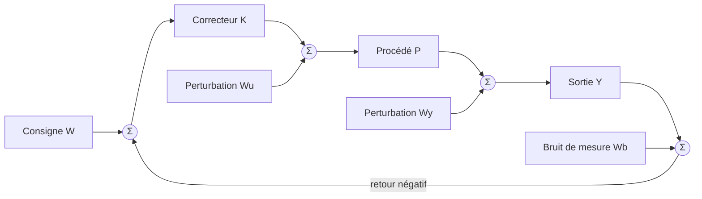
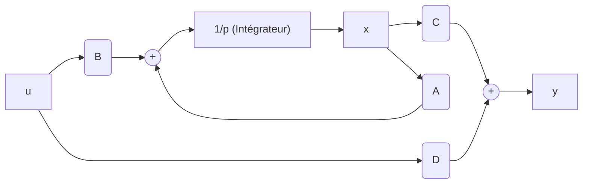
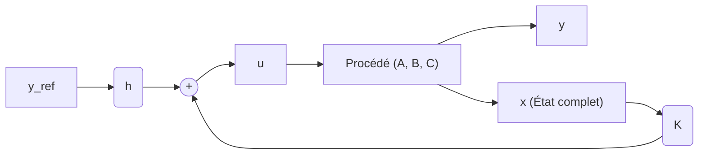
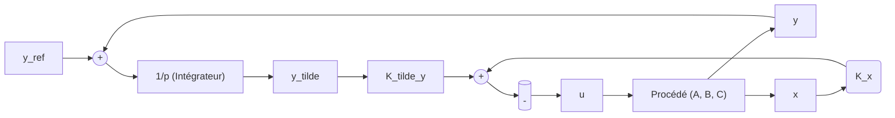

:::section id="au425-intro" eyebrow="AU425" title="Commande avancée" summary="De la représentation d'état à la commande optimale : commandabilité, retour d'état, observation et applications."

:::quicklinks
- [Rappels et robustesse](#au425-rappels)
- [Représentation d'état](#au425-etat)
- [Commandabilité et observabilité](#au425-structure)
- [Retour d'état et intégration](#au425-retour-etat)
- [Observateurs](#au425-observateurs)
- [Commande LQR](#au425-lqr)
- [Observateur LQ et pondérations](#au425-lqg)
- [Études de cas](#au425-cas)
- [Synthèse finale](#au425-revision)
:::

:::grid two-col
:::block type="definition" title="Objectif du cours"
Construire des lois de commande à partir d'un modèle interne, imposer la dynamique en boucle fermée et reconstruire les états qui ne sont pas directement mesurés.
:::

:::block type="remember" title="Fil directeur"
Avant toute synthèse, vérifier la stabilité, la commandabilité et l'observabilité du modèle. Ces propriétés déterminent ce qu'il est réellement possible de commander et d'estimer.
:::
:::

:::block type="neutral" title="Source principale"
Ce cours reprend et développe le support **Commande avancée — AC439 : placement de pôles et commande LQ**, Damien Koenig, 103 diapositives, septembre 2024 (`pdf/AU425-CM-temp.pdf`). La matière est intégrée au site sous le code AU425.
:::
:::

:::section id="au425-rappels" eyebrow="Rappels" title="Systèmes asservis et stabilité" summary="Représentation externe, limites de l'approche fréquentielle et marges de robustesse."

La commande classique des systèmes asservis repose principalement sur la **représentation externe** (fonctions de transfert dans le domaine de Laplace). Bien que très intuitive pour les systèmes mono-entrée mono-sortie (SISO), cette approche présente des limites majeures pour les systèmes complexes, instables ou multi-variables (MIMO), d'où la nécessité d'introduire les techniques de la **commande avancée** basées sur la **représentation interne (représentation d'état)**.

### 1. Représentation Externe
Un système linéaire invariant dans le temps (LTI) est décrit par sa fonction de transfert :
\[
G(p) = \frac{Y(p)}{U(p)} = \frac{B(p)}{A(p)}
\]
Où \(A(p)\) est le polynôme caractéristique du système. Les pôles du système sont les racines de \(A(p)\).

:::block type="theorem" title="Stabilité Fortement liée aux Pôles"
Un système LTI continu est **stable au sens Entrée Bornée / Sortie Bornée (BIBO)** si et seulement si tous les pôles de sa fonction de transfert \(G(p)\) sont à **partie réelle strictement négative** :
\[
\text{Re}(p_i) < 0, \quad \forall i
\]
Si au moins un pôle possède une partie réelle strictement positive, le système est instable. Si certains pôles simples sont sur l'axe imaginaire (partie réelle nulle) et les autres à partie réelle négative, le système est en **limite de stabilité**.
:::

### 2. Les Marges de Robustesse Fréquentielles
Pour caractériser la robustesse d'un asservissement en boucle fermée à partir de sa boucle ouverte \(L(p) = G(p)K(p)\), trois marges géométriques fondamentales sont définies dans le plan complexe :

:::grid two-col
:::block type="definition" title="Marge de Phase (\(M_\phi\))"
La marge de phase est la quantité de déphasage supplémentaire requise à la pulsation de coupure à 0 dB (\(\omega_{0dB}\)) pour rendre le système instable :
\[
M_\phi = 180^\circ + \arg(L(j\omega_{0dB}))
\]
Elle garantit que le système tolère des retards purs ou des déphasages imprévus. Généralement, on vise \(M_\phi \ge 45^\circ\).
:::

:::block type="definition" title="Marge de Gain (\(M_G\))"
La marge de gain représente le facteur par lequel le gain de la boucle ouverte peut être multiplié avant que le système ne devienne instable. Elle est mesurée à la pulsation de phase critique (\(\omega_{-180^\circ}\)) :
\[
M_G = -|L(j\omega_{-180^\circ})|_{dB} = \frac{1}{|L(j\omega_{-180^\circ})|}
\]
Une valeur classique recommandée est \(M_G \ge 6\text{ dB}\) (facteur de 2).
:::
:::

:::block type="remember" title="La Marge de Module (\(M_M\))"
La marge de module est définie comme la distance minimale entre le lieu de Nyquist de la boucle ouverte \(L(j\omega)\) et le point critique \(-1\) :
\[
M_M = \min_{\omega} |1 + L(j\omega)| = \frac{1}{\max_{\omega} |S(j\omega)|}
\]
Où \(S(p) = \frac{1}{1+L(p)}\) est la **fonction de sensibilité**. Une marge de module \(M_M \ge 0.5\) (soit \(|S(j\omega)| \le 6\text{ dB}\)) garantit une robustesse globale excellente vis-à-vis des incertitudes de modélisation.
:::

### 3. Exemple complet des diapositives 11 et 12

Le schéma considère une consigne \(W\), une perturbation de commande \(W_u\), une perturbation de sortie \(W_y\) et un bruit de mesure \(W_b\). Le correcteur et le procédé sont

\[
K(p)=\frac{p^2+0{,}1p+1}{0{,}5p^2+p},
\qquad
P(p)=\frac{1}{p^2+0{,}1p+1}.
\]



#### Calcul du transfert de boucle

Le numérateur de \(K\) est identique au dénominateur de \(P\). Leur produit se simplifie :

\[
L(p)=K(p)P(p)
=\frac{p^2+0{,}1p+1}{0{,}5p^2+p}
\frac{1}{p^2+0{,}1p+1}
=\frac{1}{0{,}5p^2+p}.
\]

La boucle contient donc un intégrateur et un pôle en \(-2\), puisque

\[
L(p)=\frac{2}{p(p+2)}.
\]

:::block type="warning" title="À propos de l'annulation pôle-zéro"
L'annulation est exacte dans le modèle nominal. En pratique, les coefficients du procédé sont incertains : on ne doit pas utiliser une annulation pour masquer un mode instable ou très peu amorti sans analyser la robustesse.
:::

#### Transfert consigne-sortie

En l'absence de perturbations, \(Y=P K(W-Y)\). Ainsi

\[
T(p)=\frac{Y(p)}{W(p)}=\frac{L(p)}{1+L(p)}
=\frac{1}{0{,}5p^2+p+1}
=\frac{2}{p^2+2p+2}.
\]

Le dénominateur normalisé s'identifie à \(p^2+2\zeta\omega_np+\omega_n^2\), d'où

\[
\omega_n=\sqrt2\ \text{rad}\,\text{s}^{-1},
\qquad \zeta=\frac{1}{\sqrt2}\approx0{,}707.
\]

Le gain statique vaut \(T(0)=1\) : une consigne constante est suivie sans erreur permanente. Pour un échelon unitaire,

\[
y_W(t)=1-e^{-t}\bigl(\cos t+\sin t\bigr).
\]

#### Sensibilité aux perturbations et au bruit

Les équations du schéma sont

\[
e=W-(Y+W_b),\qquad U=Ke+W_u,\qquad Y=PU+W_y.
\]

En les regroupant :

\[
(1+L)Y=LW+PW_u+W_y-LW_b.
\]

On obtient donc la décomposition complète

\[
Y=TW+PSW_u+SW_y-TW_b,
\]

avec

\[
S(p)=\frac{1}{1+L(p)}
=\frac{0{,}5p^2+p}{0{,}5p^2+p+1},
\qquad T(p)=1-S(p).
\]

:::grid two-col
:::block type="definition" title="Basse fréquence"
Comme \(S(0)=0\), les perturbations de sortie constantes ou lentes sont rejetées. Inversement, \(T(0)=1\) assure le suivi des consignes lentes.
:::

:::block type="definition" title="Haute fréquence"
Lorsque \(\omega\to\infty\), \(|S|\to1\) et \(|T|\to0\). Le bruit de mesure haute fréquence, transmis par \(-T\), est donc atténué dans ce modèle.
:::
:::

#### Lecture exacte du diagramme de Bode

Pour \(p=j\omega\),

\[
|L(j\omega)|=\frac{1}{\omega\sqrt{1+\omega^2/4}},
\qquad
\arg L(j\omega)=-90^\circ-\arctan\!\left(\frac{\omega}{2}\right).
\]

La coupure à \(0\,\text{dB}\) vérifie \(|L(j\omega_c)|=1\), soit

\[
\omega_c=\sqrt{-2+2\sqrt2}\approx0{,}910\ \text{rad}\,\text{s}^{-1}.
\]

À cette pulsation, la phase vaut environ \(-114{,}5^\circ\), donc

\[
M_\phi\approx180^\circ-114{,}5^\circ=65{,}5^\circ.
\]

La phase n'atteint \(-180^\circ\) qu'asymptotiquement, tandis que le module tend vers \(-\infty\,\text{dB}\) : la marge de gain du modèle nominal est infinie.

:::plotly id="au425-slide11-bode" label="Exemple du support" title="Boucle L, phase et sensibilité S" height="780" caption="Les deux premiers tracés permettent de lire la marge de phase ; le troisième montre le rejet des perturbations lentes par S."
{
  "series": [
    {
      "generator": "function",
      "range": [0.01, 100],
      "points": 360,
      "scale": "log",
      "y": "-20*log10(x)-10*log10(1+pow(x/2,2))",
      "name": "Module de L",
      "line": { "color": "#0077b6", "width": 3 },
      "hovertemplate": "ω = %{x:.3g} rad/s<br>|L| = %{y:.2f} dB<extra></extra>"
    },
    {
      "generator": "function",
      "range": [0.01, 100],
      "points": 360,
      "scale": "log",
      "y": "-90-atan(x/2)*180/PI",
      "name": "Phase de L",
      "xaxis": "x2",
      "yaxis": "y2",
      "line": { "color": "#e76f51", "width": 3 },
      "hovertemplate": "ω = %{x:.3g} rad/s<br>Phase = %{y:.1f}°<extra></extra>"
    },
    {
      "generator": "function",
      "range": [0.01, 100],
      "points": 360,
      "scale": "log",
      "y": "10*log10((0.25*pow(x,4)+pow(x,2))/(pow(1-0.5*pow(x,2),2)+pow(x,2)))",
      "name": "Module de S",
      "xaxis": "x3",
      "yaxis": "y3",
      "line": { "color": "#2a9d8f", "width": 3 },
      "hovertemplate": "ω = %{x:.3g} rad/s<br>|S| = %{y:.2f} dB<extra></extra>"
    }
  ],
  "layout": {
    "margin": { "t": 62, "r": 30, "b": 62, "l": 82 },
    "showlegend": false,
    "xaxis": { "type": "log", "domain": [0, 1], "anchor": "y", "showticklabels": false },
    "yaxis": { "title": "|L| (dB)", "domain": [0.70, 1], "range": [-100, 50] },
    "xaxis2": { "type": "log", "domain": [0, 1], "anchor": "y2", "showticklabels": false },
    "yaxis2": { "title": "Phase (°)", "domain": [0.35, 0.65], "range": [-190, -80] },
    "xaxis3": { "type": "log", "title": "Pulsation ω (rad/s)", "domain": [0, 1], "anchor": "y3" },
    "yaxis3": { "title": "|S| (dB)", "domain": [0, 0.30], "range": [-45, 10] },
    "shapes": [
      { "type": "line", "xref": "x", "yref": "y", "x0": 0.01, "x1": 100, "y0": 0, "y1": 0, "line": { "color": "#8d99ae", "dash": "dot" } },
      { "type": "line", "xref": "x", "yref": "paper", "x0": 0.91018, "x1": 0.91018, "y0": 0.35, "y1": 1, "line": { "color": "#6c757d", "dash": "dash" } },
      { "type": "line", "xref": "x2", "yref": "y2", "x0": 0.01, "x1": 100, "y0": -180, "y1": -180, "line": { "color": "#8d99ae", "dash": "dot" } }
    ],
    "annotations": [
      { "xref": "x", "yref": "y", "x": 0.91018, "y": 0, "text": "ωc = 0,910 rad/s", "showarrow": true, "arrowhead": 2, "ax": 75, "ay": -24 },
      { "xref": "x2", "yref": "y2", "x": 0.91018, "y": -114.47, "text": "Mφ = 65,5°", "showarrow": true, "arrowhead": 2, "ax": 65, "ay": 25 }
    ]
  }
}
:::

#### Réponse à la perturbation de sortie de la diapositive 12

Pour une perturbation \(W_y\) en échelon d'amplitude \(A\), appliquée à \(t=t_0\), la contribution à la sortie est

\[
y_{W_y}(t)=A e^{-(t-t_0)}
\left[\cos(t-t_0)+\sin(t-t_0)\right],\mathbf 1_{t\ge t_0}.
\]

Elle provoque un saut initial de \(A\), car \(S(\infty)=1\), puis disparaît puisque \(S(0)=0\). Le tracé suivant reprend \(A=0{,}2\) et \(t_0=15\,\text{s}\), comme sur la diapositive.

:::plotly id="au425-slide12-temporel" label="Réponse interactive" title="Consigne unitaire et perturbation de sortie à t = 15 s" height="460" caption="La sortie suit d'abord la consigne 1. La perturbation de 0,2 crée un saut à 1,2, puis la boucle la rejette sans erreur permanente."
{
  "series": [
    {
      "generator": "function",
      "range": [0, 40],
      "points": 600,
      "y": "1-exp(-x)*(cos(x)+sin(x))",
      "name": "Réponse nominale",
      "line": { "color": "#8d99ae", "width": 2, "dash": "dash" },
      "hovertemplate": "t = %{x:.2f} s<br>y nominal = %{y:.4f}<extra></extra>"
    },
    {
      "generator": "function",
      "range": [0, 40],
      "points": 600,
      "y": "1-exp(-x)*(cos(x)+sin(x))+(x>=15 ? 0.2*exp(-(x-15))*(cos(x-15)+sin(x-15)) : 0)",
      "name": "Sortie perturbée",
      "line": { "color": "#0077b6", "width": 4 },
      "hovertemplate": "t = %{x:.2f} s<br>y = %{y:.4f}<extra></extra>"
    }
  ],
  "layout": {
    "margin": { "t": 70, "r": 30, "b": 62, "l": 70 },
    "xaxis": { "title": "Temps (s)", "range": [0, 40] },
    "yaxis": { "title": "Sortie y(t)", "range": [0, 1.35] },
    "legend": { "orientation": "h", "x": 0, "y": 1.12, "xanchor": "left", "yanchor": "bottom" },
    "shapes": [
      { "type": "line", "xref": "x", "yref": "paper", "x0": 15, "x1": 15, "y0": 0, "y1": 1, "line": { "color": "#e76f51", "dash": "dash" } }
    ],
    "annotations": [
      { "xref": "x", "yref": "y", "x": 15, "y": 1.2, "text": "Perturbation +0,2", "showarrow": true, "arrowhead": 2, "ax": 70, "ay": -35 }
    ]
  }
}
:::

:::block type="remember" title="Ce que démontre l'exemple"
Le même réglage réalise trois objectifs complémentaires : \(T(0)=1\) assure le suivi statique, \(S(0)=0\) rejette une perturbation constante en sortie, et la marge de phase d'environ \(65{,}5^\circ\) donne une boucle nominale bien amortie. L'identité \(S+T=1\) rappelle toutefois qu'on ne peut pas rendre simultanément les deux fonctions petites à toute fréquence.
:::

### 4. Exemple concret : boucle de position d'un moteur

Un moteur à courant continu peut être approché par un premier ordre entre la tension et la vitesse. La position ajoute un intégrateur. Avec le correcteur proportionnel inclus, on prend ici :

\[
L(p)=\frac{10}{p\left(1+\frac{p}{10}\right)}.
\]

Cette boucle coupe \(0\,\text{dB}\) vers \(\omega_c\approx 7{,}86\,\text{rad}\,\text{s}^{-1}\). Sa phase y vaut environ \(-128{,}2^\circ\), donc sa marge de phase est \(M_\phi\approx 51{,}8^\circ\). La phase n'atteignant \(-180^\circ\) qu'asymptotiquement, la marge de gain est infinie dans ce modèle idéal.

:::plotly id="au425-bode-moteur" label="Bode interactif" title="Boucle ouverte d'un asservissement de position" height="650" caption="Le croisement à 0 dB fixe la pulsation de coupure. L'écart entre la phase correspondante et -180° donne la marge de phase."
{
  "series": [
    {
      "generator": "function",
      "range": [0.05, 1000],
      "points": 320,
      "scale": "log",
      "y": "20*log10(10/(x*sqrt(1+pow(x/10,2))))",
      "name": "Module |L(jω)|",
      "line": { "color": "#0077b6", "width": 3 },
      "hovertemplate": "ω = %{x:.3g} rad/s<br>Module = %{y:.2f} dB<extra></extra>"
    },
    {
      "generator": "function",
      "range": [0.05, 1000],
      "points": 320,
      "scale": "log",
      "y": "-90-atan(x/10)*180/PI",
      "name": "Phase de L",
      "xaxis": "x2",
      "yaxis": "y2",
      "line": { "color": "#e76f51", "width": 3 },
      "hovertemplate": "ω = %{x:.3g} rad/s<br>Phase = %{y:.1f}°<extra></extra>"
    }
  ],
  "layout": {
    "margin": { "t": 72, "r": 30, "b": 62, "l": 82 },
    "showlegend": false,
    "xaxis": { "type": "log", "title": "", "domain": [0, 1], "anchor": "y", "showticklabels": false },
    "yaxis": { "title": "Module (dB)", "domain": [0.56, 1], "zeroline": false },
    "xaxis2": { "type": "log", "title": "Pulsation ω (rad/s)", "domain": [0, 1], "anchor": "y2" },
    "yaxis2": { "title": "Phase (°)", "domain": [0, 0.44], "range": [-190, -80] },
    "shapes": [
      { "type": "line", "xref": "x", "yref": "y", "x0": 0.05, "x1": 1000, "y0": 0, "y1": 0, "line": { "color": "#8d99ae", "dash": "dot" } },
      { "type": "line", "xref": "x", "yref": "paper", "x0": 7.862, "x1": 7.862, "y0": 0, "y1": 1, "line": { "color": "#6c757d", "dash": "dash" } },
      { "type": "line", "xref": "x2", "yref": "y2", "x0": 0.05, "x1": 1000, "y0": -180, "y1": -180, "line": { "color": "#8d99ae", "dash": "dot" } }
    ],
    "annotations": [
      { "xref": "x", "yref": "y", "x": 7.862, "y": 0, "text": "ωc = 7,86 rad/s", "showarrow": true, "arrowhead": 2, "ax": 70, "ay": -30 },
      { "xref": "x2", "yref": "y2", "x": 7.862, "y": -128.2, "text": "Mφ ≈ 51,8°", "showarrow": true, "arrowhead": 2, "ax": 65, "ay": 28 }
    ]
  }
}
:::

:::block type="method" title="Lire une marge de phase sur un Bode"
1. Repérer la pulsation où le module de la boucle ouverte traverse \(0\,\text{dB}\).
2. Lire la phase à cette même pulsation.
3. Calculer la distance à \(-180^\circ\) : \(M_\phi=180^\circ+\arg L(j\omega_c)\).
4. Sous les hypothèses usuelles du critère de Nyquist, une marge positive indique que la boucle fermée nominale est stable ; une marge confortable améliore la tolérance aux retards et aux incertitudes.
:::

:::block type="warning" title="Limite de la lecture directe sur Bode"
Pour une boucle ouverte comportant des pôles instables, les seules marges lues sur Bode ne suffisent pas : il faut appliquer le critère complet de Nyquist en tenant compte du nombre de pôles dans le demi-plan droit.
:::

:::

:::section id="au425-etat" eyebrow="Chapitre 1" title="Représentation interne (représentation d'état)" summary="Définition du formalisme interne continu et discret, changement de base et passage entre les représentations internes et externes."

La **représentation interne (représentation d'état)** caractérise le comportement du système par un ensemble de variables internes appelées **variables d'état**, représentant la « mémoire » historique du système.

### 1. Représentation interne (représentation d'état) continue
Un système dynamique linéaire continu est modélisé par son équation d'état et son équation de mesure :

\[
\begin{cases}
\dot{x}(t) = A x(t) + B u(t) \\
y(t) = C x(t) + D u(t)
\end{cases}
\]

Où :
- \(x(t) \in \mathbb{R}^n\) est le **vecteur d'état** (variables physiques comme des positions, vitesses, courants, tensions).
- \(u(t) \in \mathbb{R}^m\) est le **vecteur de commande (entrée)**.
- \(y(t) \in \mathbb{R}^p\) est le **vecteur de mesure (sortie)**.
- \(A \in \mathbb{R}^{n \times n}\) est la **matrice d'évolution (dynamique)**.
- \(B \in \mathbb{R}^{n \times m}\) est la **matrice de commande**.
- \(C \in \mathbb{R}^{p \times n}\) est la **matrice d'observation (mesure)**.
- \(D \in \mathbb{R}^{p \times m}\) est la **matrice de transmission directe** (généralement nulle dans les systèmes physiques, car ils sont causals et propres).

Le rôle de mémoire du système est illustré par l'intégration temporelle représentée par le schéma bloc ci-dessous où \(1/p\) désigne l'intégrateur :



### 2. Exemples de modélisation du support

:::grid two-col
:::block type="method" title="Moteur électrique modélisé par un circuit RL"
Le support assimile la partie électrique du moteur à une inductance \(L\) en série avec une résistance \(R\). L'entrée est la tension appliquée \(e(t)\), le courant est \(i(t)\), et la sortie choisie est la tension \(u_R(t)\) aux bornes de la résistance.

**Étape 1 — écrire les lois électriques.** La loi des mailles et la loi d'Ohm donnent

\[
e(t)=L\frac{di}{dt}+u_R(t), \qquad u_R(t)=Ri(t).
\]

**Étape 2 — choisir l'état.** L'inductance stocke de l'énergie magnétique : son courant porte donc la mémoire du circuit. On pose

\[
x(t)=i(t),\qquad u(t)=e(t),\qquad y(t)=u_R(t).
\]

**Étape 3 — isoler la dérivée de l'état.** En remplaçant \(u_R=Ri\) dans la maille :

\[
L\dot i=e-Ri
\quad\Longrightarrow\quad
\dot x=-\frac{R}{L}x+\frac{1}{L}u.
\]

**Étape 4 — écrire la sortie et lire les matrices.**

\[
y=Rx+0u,
\qquad
A=-\frac RL,\quad B=\frac1L,\quad C=R,\quad D=0.
\]

**Vérification.** Comme \(y=Ri\), alors \(\dot y=R\dot i\), d'où

\[
\frac LR\dot y+y=e
\quad\Longrightarrow\quad
\frac{Y(p)}{E(p)}=\frac{1}{1+\frac LRp}.
\]

Le gain statique est \(K=1\), la constante de temps est \(\tau=L/R\), et le pôle \(-R/L\) coïncide avec la valeur propre de \(A\).

**Vue oscilloscope.** La source \(e(t)\) et la tension de sortie \(u_R(t)\) sont superposées. En faisant varier la fréquence, on observe que \(u_R\) suit l'entrée à basse fréquence, puis devient atténuée et déphasée lorsque la pulsation approche \(R/L\).
:::

:::circuitjs label="CircuitJS" title="Modèle électrique RL du moteur" height="auto" iframeTitle="Simulation CircuitJS du circuit RL série représentant le moteur" src="https://www.falstad.com/circuit/circuitjs.html?hideMenu=true&cct=%24%201%200.000005%2010.20027730826997%2050%205%2050%205e-11%0Av%20128%20240%20128%2080%200%201%2010%205%200%200%200.5%0Aw%20128%2080%20240%2080%200%0Al%20240%2080%20384%2080%200%200.1%200%0Ar%20384%2080%20384%20240%200%2010%0Aw%20384%20240%20128%20240%200%0Ag%20128%20240%20128%20272%200%0Ax%20150%2068%20205%2071%204%2014%20e(t)%0Ax%20280%2065%20302%2068%204%2014%20L%0Ax%20400%20158%20420%20161%204%2014%20R%0Ax%20330%20225%20376%20228%204%2014%20uR(t)%0Ao%200%2064%200%204098%205%200.1%200%201%20e(t)%20-%20entree%0Ao%203%2064%200%204098%205%200.1%201%201%20uR(t)%20-%20sortie"
:::
:::

:::block type="method" title="Suspension masse-ressort-amortisseur"
Une masse \(M\) se déplace horizontalement. Le ressort de raideur \(k\) et l'amortisseur visqueux de coefficient \(b\) s'opposent respectivement au déplacement \(q(t)\) et à la vitesse \(\dot q(t)\). L'entrée est la force extérieure \(F(t)\).

**Étape 1 — faire le bilan des forces.** Avec un axe orienté dans le sens de \(F\) :

\[
F_k=-kq,\qquad F_b=-b\dot q.
\]

Le principe fondamental de la dynamique donne

\[
M\ddot q=F-b\dot q-kq
\quad\Longleftrightarrow\quad
M\ddot q+b\dot q+kq=F.
\]

**Étape 2 — remplacer l'équation d'ordre deux par deux équations d'ordre un.** On choisit

\[
x_1=q,\qquad x_2=\dot q,\qquad u=F,\qquad y=q.
\]

La définition de \(x_2\) fournit \(\dot x_1=x_2\). En isolant l'accélération :

\[
\dot x_2=\ddot q
=-\frac{k}{M}x_1-\frac{b}{M}x_2+\frac{1}{M}u.
\]

**Étape 3 — regrouper sous forme matricielle.**

\[
\dot x=
\underbrace{\begin{bmatrix}0&1\\-k/M&-b/M\end{bmatrix}}_A x+
\underbrace{\begin{bmatrix}0\\1/M\end{bmatrix}}_B u,
\qquad
y=\underbrace{\begin{bmatrix}1&0\end{bmatrix}}_C x+\underbrace{0}_D u.
\]

**Étape 4 — vérifier par la fonction de transfert.** Avec des conditions initiales nulles :

\[
\frac{Q(p)}{F(p)}=\frac{1}{Mp^2+bp+k}
=\frac{1/M}{p^2+(b/M)p+k/M}.
\]

En comparant avec la forme canonique du second ordre

\[
\frac{K\omega_0^2}{p^2+2\zeta\omega_0p+\omega_0^2},
\]

on identifie

\[
\omega_0=\sqrt{\frac{k}{M}},
\qquad
\zeta=\frac{b}{2\sqrt{Mk}},
\qquad K=\frac1k.
\]

Enfin, \(\det(pI-A)=p^2+(b/M)p+k/M\) redonne bien le dénominateur dynamique.
:::

:::block type="method" title="Oscillateur harmonique non amorti"
Cet exemple est le cas particulier de la suspension avec \(b=0\) et \(F=0\).

**Étape 1 — appliquer la dynamique.** La seule force est celle du ressort :

\[
M\ddot q=-kq
\quad\Longrightarrow\quad
\ddot q=-\frac{k}{M}q.
\]

**Étape 2 — choisir les variables de phase.** Avec \(x_1=q\) et \(x_2=\dot q\) :

\[
\dot x_1=x_2,
\qquad
\dot x_2=-\frac{k}{M}x_1,
\]

soit

\[
\dot x=\begin{bmatrix}0&1\\-k/M&0\end{bmatrix}x.
\]

**Étape 3 — analyser les modes.**

\[
\det(pI-A)=p^2+\frac{k}{M}=0
\quad\Longrightarrow\quad
p_{1,2}=\pm j\sqrt{\frac{k}{M}}.
\]

Les pôles sont imaginaires purs : l'énergie passe périodiquement de la forme cinétique à la forme potentielle sans dissipation. L'amplitude ne décroît pas ; le système est en limite de stabilité, et non asymptotiquement stable.
:::

:::block type="method" title="Pendule simple linéarisé"
Une masse \(M\), placée à la distance \(\ell\) du pivot, est soumise à la gravité et à un couple de commande \(\tau(t)\). L'angle \(\theta=0\) correspond ici à l'équilibre bas.

**Étape 1 — écrire l'équation des moments.** Le moment d'inertie vaut \(J=M\ell^2\). Le couple gravitationnel de rappel est \(-Mg\ell\sin\theta\) :

\[
M\ell^2\ddot\theta=-Mg\ell\sin\theta+\tau.
\]

Après division par \(M\ell^2\) :

\[
\ddot\theta+\frac{g}{\ell}\sin\theta=\frac{\tau}{M\ell^2}.
\]

**Étape 2 — choisir le point autour duquel on linéarise.** Une linéarisation est toujours locale. On choisit un point d'équilibre \((\theta_e,\tau_e)\) vérifiant \(\dot\theta_e=\ddot\theta_e=0\). L'équation non linéaire impose alors

\[
Mg\ell\sin\theta_e=\tau_e.
\]

Pour l'équilibre bas non commandé, \(\theta_e=0\) et \(\tau_e=0\). On étudie de petits écarts autour de cet équilibre :

\[
\delta\theta=\theta-\theta_e,
\qquad
\delta\tau=\tau-\tau_e.
\]

Au premier ordre autour d'un équilibre quelconque,

\[
\sin(\theta_e+\delta\theta)
\simeq \sin\theta_e+\cos\theta_e\,\delta\theta.
\]

En soustrayant l'équation vérifiée par l'équilibre, les termes constants \(Mg\ell\sin\theta_e=\tau_e\) disparaissent. Il reste le modèle tangent général

\[
\delta\ddot\theta
+\frac g\ell\cos\theta_e\,\delta\theta
=\frac{1}{M\ell^2}\delta\tau.
\]

Ici, comme \(\theta_e=\tau_e=0\), on a simplement \(\delta\theta=\theta\) et \(\delta\tau=\tau\).

**Étape 3 — construire le développement limité.** Pour une fonction régulière \(f\), le développement de Taylor au voisinage de \(a\) est

\[
f(a+h)=f(a)+f'(a)h+\frac{f''(a)}{2!}h^2
+\frac{f^{(3)}(a)}{3!}h^3+\cdots.
\]

Avec \(f(\theta)=\sin\theta\), ses dérivées successives sont

\[
f'(\theta)=\cos\theta,
\qquad
f''(\theta)=-\sin\theta,
\qquad
f^{(3)}(\theta)=-\cos\theta.
\]

Au point \(a=0\) :

\[
\sin0=0,\qquad \cos0=1,
\qquad -\sin0=0,
\qquad -\cos0=-1.
\]

Par conséquent,

\[
\sin(0+h)=h-\frac{h^3}{3!}+\frac{h^5}{5!}-\cdots.
\]

En remplaçant \(h\) par \(\theta\) :

\[
\boxed{\sin\theta=\theta-\frac{\theta^3}{6}+O(\theta^5)}.
\]

La **linéarisation au premier ordre** consiste à conserver uniquement les termes constants et linéaires. Le terme constant est nul et le premier terme non nul est \(\theta\), donc

\[
\boxed{\sin\theta\simeq\theta}.
\]

Les angles doivent être exprimés en **radians**. Le premier terme négligé vaut \(-\theta^3/6\), soit une erreur relative d'environ \(\theta^2/6\) : environ \(0{,}5\,\%\) à \(10^\circ\), mais déjà \(4{,}6\,\%\) à \(30^\circ\).

**Étape 4 — injecter l'approximation dans le modèle.** En conservant seulement le premier ordre :

\[
\ddot\theta=-\frac g\ell\theta+\frac{1}{M\ell^2}\tau.
\]

L'équation est maintenant linéaire : elle ne contient plus la fonction non linéaire \(\sin\theta\). Cette approximation n'est valable qu'au voisinage de l'équilibre choisi.

**Étape 5 — former l'état.** On pose \(x_1=\theta\), \(x_2=\dot\theta\), \(u=\tau\) et \(y=\theta\) :

\[
\dot x_1=x_2,
\qquad
\dot x_2=-\frac g\ell x_1+\frac{1}{M\ell^2}u.
\]

Ainsi

\[
\dot x=\begin{bmatrix}0&1\\-g/\ell&0\end{bmatrix}x+
\begin{bmatrix}0\\1/(M\ell^2)\end{bmatrix}\tau,
\qquad
y=\begin{bmatrix}1&0\end{bmatrix}x.
\]

Les pôles \(\pm j\sqrt{g/\ell}\) donnent la pulsation naturelle du pendule non amorti.

**Comparaison avec l'équilibre haut.** Pour linéariser autour de \(\theta_e=\pi\), on pose \(\delta\theta=\theta-\pi\), donc \(\theta=\pi+\delta\theta\). La même formule de Taylor donne

\[
\sin(\pi+\delta\theta)
=\sin\pi+\cos\pi\,\delta\theta+O(\delta\theta^2)
\simeq-\delta\theta.
\]

Le modèle des petits écarts devient alors

\[
\delta\ddot\theta-\frac g\ell\delta\theta
=\frac{1}{M\ell^2}\delta\tau.
\]

Le polynôme caractéristique est \(p^2-g/\ell\), avec les pôles

\[
p_{1,2}=\pm\sqrt{\frac g\ell}.
\]

Le pôle positif explique l'instabilité de l'équilibre haut : une petite déviation grandit spontanément. C'est le pendule inversé étudié plus loin.
:::

:::block type="method" title="Mobile commandé par une force"
Le mobile de la diapositive 25 est une masse \(M\) reliée à un ressort \(k\) et à un frottement visqueux \(f\). Sa position est \(y(t)\), et l'actionneur applique la force \(u(t)\).

**Étape 1 — partir de l'équation mécanique.**

\[
M\ddot y+f\dot y+ky=u.
\]

**Étape 2 — choisir position et vitesse comme états.**

\[
x_1=y,\qquad x_2=\dot y.
\]

On obtient successivement

\[
\dot x_1=x_2,
\qquad
\dot x_2=-\frac{k}{M}x_1-\frac{f}{M}x_2+\frac1M u.
\]

**Étape 3 — identifier les quatre matrices.**

\[
A=\begin{bmatrix}0&1\\-k/M&-f/M\end{bmatrix},
\quad
B=\begin{bmatrix}0\\1/M\end{bmatrix},
\quad
C=\begin{bmatrix}1&0\end{bmatrix},
\quad D=0.
\]

Cet exemple a la même structure mathématique que la suspension. Seule l'interprétation physique de l'entrée change, ce qui illustre le caractère générique de la représentation d'état.
:::

:::grid two-col
:::block type="method" title="Double filtre RC : états y₂ et y₁"
Le montage comprend \(R_1\) entre la source \(u\) et le nœud \(y_1\), \(C_1\) entre \(y_1\) et la masse, \(R_2\) entre \(y_1\) et \(y_2\), puis \(C_2\) entre \(y_2\) et la masse. Les tensions des deux condensateurs constituent un choix naturel d'état :

\[
x=\begin{bmatrix}y_2\\y_1\end{bmatrix},
\qquad y=y_2.
\]

**Étape 1 — appliquer la loi des nœuds en \(y_2\).** Le courant dans \(R_2\) charge uniquement \(C_2\) :

\[
\frac{y_1-y_2}{R_2}=C_2\dot y_2
\quad\Longrightarrow\quad
\dot y_2=-\frac{1}{R_2C_2}y_2+\frac{1}{R_2C_2}y_1.
\]

**Étape 2 — appliquer la loi des nœuds en \(y_1\).** Le courant fourni par \(R_1\) se partage entre \(C_1\) et \(R_2\) :

\[
\frac{u-y_1}{R_1}=C_1\dot y_1+\frac{y_1-y_2}{R_2}.
\]

En isolant la dérivée :

\[
\dot y_1=\frac{1}{R_2C_1}y_2
-\left(\frac{1}{R_1C_1}+\frac{1}{R_2C_1}\right)y_1
+\frac{1}{R_1C_1}u.
\]

**Étape 3 — regrouper les coefficients.**

\[
\dot x=
\underbrace{\begin{bmatrix}
-\frac{1}{R_2C_2} & \frac{1}{R_2C_2}\\
\frac{1}{R_2C_1} & -\frac{1}{R_1C_1}-\frac{1}{R_2C_1}
\end{bmatrix}}_A x
+\underbrace{\begin{bmatrix}0\\\frac{1}{R_1C_1}\end{bmatrix}}_B u,
\]

\[
y=\underbrace{\begin{bmatrix}1&0\end{bmatrix}}_C x,
\qquad D=0.
\]

La première ligne décrit la charge de \(C_2\), la seconde celle de \(C_1\), et l'entrée n'agit directement que sur le nœud \(y_1\).

**Vue oscilloscope.** Les tensions \(u(t)\), \(y_1(t)\) et \(y_2(t)\) sont superposées. Le premier étage atténue et retarde \(y_1\) ; le second accentue ces deux effets sur \(y_2\). Modifier la fréquence permet de voir progressivement apparaître le comportement passe-bas d'ordre deux.
:::

:::circuitjs label="CircuitJS" title="Double filtre RC en cascade" height="auto" iframeTitle="Simulation CircuitJS du double filtre RC avec les nœuds y1 et y2" src="https://www.falstad.com/circuit/circuitjs.html?hideMenu=true&cct=%24%201%200.000005%2010.20027730826997%2050%205%2050%205e-11%0Av%2096%20256%2096%2080%200%201%205%205%200%200%200.5%0Ar%2096%2080%20240%2080%200%201000%0Ar%20240%2080%20400%2080%200%201000%0Ac%20240%2080%20240%20256%200%200.00001%200%0Ac%20400%2080%20400%20256%200%200.00001%200%0Aw%2096%20256%20240%20256%200%0Aw%20240%20256%20400%20256%200%0Ag%2096%20256%2096%20288%200%0Ax%20145%2065%20173%2068%204%2014%20R1%0Ax%20305%2065%20333%2068%204%2014%20R2%0Ax%20254%20168%20282%20171%204%2014%20C1%0Ax%20414%20168%20442%20171%204%2014%20C2%0Ax%20218%20104%20240%20107%204%2014%20y1%0Ax%20378%20104%20400%20107%204%2014%20y2%0Ao%200%2064%200%204098%205%200.1%200%201%20u(t)%20-%20entree%0Ao%203%2064%200%204098%205%200.1%201%201%20y1(t)%20-%20sortie%20RC1%0Ao%204%2064%200%204098%205%200.1%202%201%20y2(t)%20-%20sortie%20RC2"
:::
:::

:::block type="method" title="Double filtre RC : états y₂ et i₂"
Le support remplace ensuite \(y_1\) par le courant de liaison

\[
i_2=\frac{y_1-y_2}{R_2}.
\]

Le nouvel état s'écrit donc

\[
\hat x=\begin{bmatrix}y_2\\i_2\end{bmatrix}
=\underbrace{\begin{bmatrix}1&0\\-1/R_2&1/R_2\end{bmatrix}}_P
\begin{bmatrix}y_2\\y_1\end{bmatrix}.
\]

**Étape 1 — dériver \(y_2\).** Comme \(i_2=C_2\dot y_2\) :

\[
\dot y_2=\frac{1}{C_2}i_2.
\]

**Étape 2 — dériver le courant.**

\[
\dot i_2=\frac{\dot y_1-\dot y_2}{R_2}.
\]

On remplace \(y_1\) par \(y_2+R_2i_2\), puis on utilise les deux équations de nœud précédentes. Après regroupement :

\[
\dot i_2=-\frac{1}{R_1R_2C_1}y_2
-\left(\frac{1}{R_1C_1}+\frac{1}{R_2C_1}+\frac{1}{R_2C_2}\right)i_2
+\frac{1}{R_1R_2C_1}u.
\]

**Étape 3 — former le second modèle.**

\[
\dot{\hat x}=
\underbrace{\begin{bmatrix}
0 & 1/C_2\\
-1/(R_1R_2C_1) & -1/(R_1C_1)-1/(R_2C_1)-1/(R_2C_2)
\end{bmatrix}}_{\hat A}\hat x
+\underbrace{\begin{bmatrix}0\\1/(R_1R_2C_1)\end{bmatrix}}_{\hat B}u,
\]

\[
y=\underbrace{\begin{bmatrix}1&0\end{bmatrix}}_{\hat C}\hat x,
\qquad \hat D=0.
\]

La partie suivante vérifie que \(\hat A=PAP^{-1}\), \(\hat B=PB\) et \(\hat C=CP^{-1}\). Les coordonnées changent, mais les pôles et la relation entrée-sortie restent identiques.
:::

:::block type="remember" title="Méthode commune aux six exemples"
1. Identifier les éléments qui stockent l'énergie et choisir un nombre minimal d'états indépendants.
2. Écrire les lois physiques avec une convention de signe explicite.
3. Isoler chaque dérivée d'état sans laisser de dérivée dans le membre de droite.
4. Choisir clairement entrée et sortie, puis lire \(A\), \(B\), \(C\) et \(D\).
5. Vérifier les dimensions, les unités et, si possible, retrouver la fonction de transfert ou le polynôme caractéristique.
:::

### 3. Changement de Base (Transformation d'État)
L'état d'un système n'est pas unique. Si on applique un changement de base linéaire défini par la matrice de passage inversible \(P\) tel que :
\[
\hat{x}(t) = P x(t) \quad \Longleftrightarrow \quad x(t) = P^{-1} \hat{x}(t)
\]
Le nouveau modèle d'état s'exprime sous la forme :
\[
\begin{cases}
\dot{\hat{x}}(t) = \hat{A} \hat{x}(t) + \hat{B} u(t) \\
y(t) = \hat{C} \hat{x}(t) + \hat{D} u(t)
\end{cases}
\]

:::block type="method" title="Relations de Passage"
Par substitution directe, les nouvelles matrices s'obtiennent par les transformations d'équivalence suivantes :
\[
\hat{A} = P A P^{-1}, \quad \hat{B} = P B, \quad \hat{C} = C P^{-1}, \quad \hat{D} = D
\]
*Note : Les valeurs propres de la matrice d'état sont invariantes par changement de base (spectre de \(A\) = spectre de \(\hat{A}\)).*
:::

:::block type="method" title="Vérification complète sur le double filtre RC"
Les deux choix précédents sont

\[
x=\begin{bmatrix}y_2\\y_1\end{bmatrix},
\qquad
\hat x=\begin{bmatrix}y_2\\i_2\end{bmatrix}.
\]

Or \(i_2=(y_1-y_2)/R_2\). On en déduit directement \(\hat x=Px\) avec

\[
P = \begin{bmatrix} 1 & 0 \\ -1/R_2 & 1/R_2 \end{bmatrix}.
\]

Comme \(\det P=1/R_2\neq0\), le changement est inversible. Résoudre \(y_1=y_2+R_2i_2\) donne

\[
x=P^{-1}\hat x,
\qquad
P^{-1}=\begin{bmatrix}1&0\\1&R_2\end{bmatrix}.
\]

Pour vérifier les transformations, on part de \(\dot x=Ax+Bu\), puis on dérive \(\hat x=Px\) :

\[
\dot{\hat x}=P\dot x=P(Ax+Bu)
=PAP^{-1}\hat x+PBu.
\]

Ainsi \(\hat A=PAP^{-1}\) et \(\hat B=PB\). Pour la sortie,

\[
y=Cx=CP^{-1}\hat x,
\]

d'où \(\hat C=CP^{-1}\). Le calcul matriciel redonne exactement les matrices \(\hat A\), \(\hat B\) et \(\hat C\) obtenues auparavant à partir des lois de Kirchhoff : c'est une vérification indépendante du modèle.
:::

### 4. Passage de la représentation interne (représentation d'état) à la représentation externe

On connaît les matrices \((A,B,C,D)\) et l'on cherche la relation entrée-sortie \(G(p)=Y(p)/U(p)\). Une fonction de transfert décrit la réponse forcée du système : on pose donc les conditions initiales nulles, \(x(0)=0\).

:::block type="method" title="Méthode générale : matrices d'état → fonction de transfert"
**Étape 1 — transformer l'équation d'état.** En appliquant la transformée de Laplace,

\[
pX(p)-x(0)=AX(p)+BU(p).
\]

Avec \(x(0)=0\), on regroupe les termes contenant \(X(p)\) :

\[
(pI-A)X(p)=BU(p).
\]

**Étape 2 — isoler l'état.** Si \(pI-A\) est inversible,

\[
X(p)=(pI-A)^{-1}BU(p).
\]

**Étape 3 — remplacer l'état dans l'équation de sortie.** Comme \(Y(p)=CX(p)+DU(p)\),

\[
Y(p)=\left[C(pI-A)^{-1}B+D\right]U(p).
\]

**Étape 4 — identifier la fonction de transfert.**

\[
\boxed{G(p)=\frac{Y(p)}{U(p)}=C(pI-A)^{-1}B+D.}
\]

Pour une matrice \(2\times2\), on utilise \(M^{-1}=\operatorname{adj}(M)/\det M\). Pour un ordre plus élevé, il est souvent plus simple de résoudre \((pI-A)Z=B\), puis de calculer \(G=CZ+D\), plutôt que de développer tout l'inverse.
:::

:::block type="method" title="Exemple complet : représentation d'état → fonction de transfert"
Considérons la représentation interne (représentation d'état)

\[
A=\begin{bmatrix}0&1\\-5&-4\end{bmatrix},\qquad
B=\begin{bmatrix}0\\1\end{bmatrix},\qquad
C=\begin{bmatrix}3&2\end{bmatrix},\qquad D=0.
\]

On forme

\[
pI-A=\begin{bmatrix}p&-1\\5&p+4\end{bmatrix},
\qquad \det(pI-A)=p(p+4)+5=p^2+4p+5.
\]

Ainsi,

\[
(pI-A)^{-1}
=\frac{1}{p^2+4p+5}
\begin{bmatrix}p+4&1\\-5&p\end{bmatrix}.
\]

On multiplie d'abord par \(B\) :

\[
(pI-A)^{-1}B
=\frac{1}{p^2+4p+5}\begin{bmatrix}1\\p\end{bmatrix}.
\]

Puis par \(C\) :

\[
C(pI-A)^{-1}B
=\frac{\begin{bmatrix}3&2\end{bmatrix}\begin{bmatrix}1\\p\end{bmatrix}}
{p^2+4p+5}
=\frac{2p+3}{p^2+4p+5}.
\]

Comme \(D=0\), la représentation externe est

\[
\boxed{G(p)=\frac{2p+3}{p^2+4p+5}.}
\]
:::

:::block type="theorem" title="Lien entre pôles externes et modes internes"
Les pôles de \(G(p)\) sont parmi les **valeurs propres de \(A\)**, racines de \(\det(pI-A)=0\). Ils coïncident exactement lorsque la réalisation est minimale, donc commandable et observable. Sinon, un mode interne peut disparaître de la représentation externe par simplification pôle-zéro.
:::

### 5. Passage de la représentation externe à la représentation interne (représentation d'état)

On connaît une fonction de transfert SISO rationnelle et l'on cherche des matrices \((A,B,C,D)\) reproduisant la même relation entrée-sortie. Cet ensemble de matrices est une **réalisation**. Il n'est pas unique : deux réalisations reliées par un changement de base représentent le même système externe.

:::block type="method" title="Méthode générale : fonction de transfert → forme canonique commandable"
**Étape 1 — vérifier que la fonction est propre.** Le degré du numérateur ne doit pas dépasser celui du dénominateur. On rend le dénominateur unitaire en divisant tous les coefficients par son coefficient dominant.

Pour une fonction strictement propre d'ordre \(n\), on écrit les coefficients par puissances croissantes :

\[
G(p)=\frac{b_0+b_1p+\cdots+b_{n-1}p^{n-1}}
{a_0+a_1p+\cdots+a_{n-1}p^{n-1}+p^n}.
\]

Les coefficients absents sont remplacés par des zéros.

**Étape 2 — construire la matrice compagnon.**

\[
A=\begin{bmatrix}
0&1&0&\cdots&0\\
0&0&1&\cdots&0\\
\vdots&\vdots&\vdots&\ddots&\vdots\\
0&0&0&\cdots&1\\
-a_0&-a_1&-a_2&\cdots&-a_{n-1}
\end{bmatrix},
\qquad
B=\begin{bmatrix}0\\0\\\vdots\\0\\1\end{bmatrix}.
\]

**Étape 3 — placer le numérateur dans la matrice de sortie.**

\[
C=\begin{bmatrix}b_0&b_1&\cdots&b_{n-1}\end{bmatrix},
\qquad D=0.
\]

**Étape 4 — traiter le cas propre non strict.** Si le numérateur possède un terme \(b_np^n\), alors \(D=b_n\). Il faut retirer sa contribution au numérateur :

\[
\beta_i=b_i-Da_i\quad (i=0,\ldots,n-1),
\qquad C=\begin{bmatrix}\beta_0&\cdots&\beta_{n-1}\end{bmatrix}.
\]

**Étape 5 — vérifier.** Recalculer \(C(pI-A)^{-1}B+D\). Cette vérification détecte notamment une inversion dans l'ordre des coefficients.
:::

:::block type="method" title="Exemple complet : fonction de transfert → représentation d'état"
Partons de

\[
G(p)=\frac{2p+3}{p^2+4p+5}.
\]

Le dénominateur est déjà unitaire. Écrit par puissances croissantes,

\[
p^2+a_1p+a_0=p^2+4p+5,
\qquad a_0=5,\quad a_1=4.
\]

Le numérateur donne \(b_0=3\) et \(b_1=2\). La forme canonique commandable fournit donc

\[
\boxed{
A=\begin{bmatrix}0&1\\-5&-4\end{bmatrix},\quad
B=\begin{bmatrix}0\\1\end{bmatrix},\quad
C=\begin{bmatrix}3&2\end{bmatrix},\quad D=0.}
\]

Les équations temporelles correspondantes sont

\[
\begin{cases}
\dot x_1=x_2,\\
\dot x_2=-5x_1-4x_2+u,\\
y=3x_1+2x_2.
\end{cases}
\]

En appliquant la méthode précédente, on retrouve exactement

\[
C(pI-A)^{-1}B+D=\frac{2p+3}{p^2+4p+5}.
\]
:::

:::block type="warning" title="Une fonction de transfert ne fixe pas un état unique"
La représentation externe détermine le comportement entrée-sortie à conditions initiales nulles, mais elle ne donne pas un choix unique de variables d'état. La forme canonique commandable est une réalisation mathématique pratique ; les états obtenus ne correspondent pas nécessairement à des grandeurs physiques directement mesurables.
:::

### 6. Représentation interne (représentation d'état) discrète
En temps discret, après échantillonnage à la période \(T_e\), la dynamique du système est régie par des équations aux différences :
\[
\begin{cases}
x_{k+1} = A_d x_k + B_d u_k \\
y_k = C_d x_k + D_d u_k
\end{cases}
\]

:::

:::section id="au425-structure" eyebrow="Chapitre 2" title="Propriétés Structurelles : Commandabilité et Observabilité" summary="Concepts fondamentaux de commandabilité et observabilité au sens de Kalman, critères matriciels de rang et interprétation physique."

L'analyse de la commandabilité et de l'observabilité détermine si un système peut être contrôlé par ses entrées et reconstruit à partir de ses sorties.

### 1. Commandabilité (Contrôlabilité)
:::block type="definition" title="Définition de la Commandabilité"
Un système est dit **complètement commandable** si, pour tout état initial \(x(t_0)\) et tout état final désiré \(x(t_f)\), il existe une loi de commande admissible \(u(t)\) définie sur l'intervalle \([t_0, t_f]\) permettant de transférer l'état du système de \(x(t_0)\) à \(x(t_f)\) en un temps fini.
:::

Pour tester cette propriété sur un système linéaire d'ordre \(n\), on forme la **matrice de commandabilité de Kalman \(\mathcal{C}\)** :
\[
\mathcal{C} = \begin{bmatrix} B & A B & A^2 B & \dots & A^{n-1} B \end{bmatrix} \quad \in \mathbb{R}^{n \times (n \cdot m)}
\]

:::block type="theorem" title="Critère de Rang de Kalman"
Le système est complètement commandable si et seulement si sa matrice de commandabilité \(\mathcal{C}\) est de **rang plein** :
\[
\text{rang}(\mathcal{C}) = n
\]
Si \(\text{rang}(\mathcal{C}) < n\), le système possède des états non commandables. Ces états résident dans le noyau à gauche de la matrice : ils ne peuvent pas être influencés par l'entrée \(u(t)\).
:::

### 2. Observabilité
:::block type="definition" title="Définition de l'Observabilité"
Un système est dit **complètement observable** si la connaissance des entrées \(u(t)\) et des mesures de sorties \(y(t)\) sur un intervalle de temps fini \([t_0, t_1]\) permet de déterminer de manière unique l'état initial \(x(t_0)\) du système.
:::

On forme la **matrice d'observabilité de Kalman \(\mathcal{O}\)** :
\[
\mathcal{O} = \begin{bmatrix} C \\ C A \\ C A^2 \\ \vdots \\ C A^{n-1} \end{bmatrix} \quad \in \mathbb{R}^{(n \cdot p) \times n}
\]

:::block type="theorem" title="Critère de Rang de Kalman"
Le système est complètement observable si et seulement si sa matrice d'observabilité \(\mathcal{O}\) est de **rang plein** :
\[
\text{rang}(\mathcal{O}) = n
\]
Si \(\text{rang}(\mathcal{O}) < n\), il existe des états dits **non observables** appartenant au noyau de \(\mathcal{O}\) (i.e. \(\mathcal{O} x_{no} = 0\)), invisibles depuis la mesure de sortie.
:::

### 3. Simplifications Pôle-Zéro (Interprétation fréquentielle)
Si un système possède un mode (valeur propre de \(A\)) qui est à la fois non commandable ou non observable, ce mode disparaît lors du calcul de la fonction de transfert de Laplace \(G(p) = C(pI-A)^{-1}B\).

:::block type="warning" title="Simplification pôle-zéro cachée"
Une simplification pôle-zéro dans une fonction de transfert est le signe direct de la perte de commandabilité ou d'observabilité du système. Un pôle instable simplifié n'apparaît pas dans la fonction de transfert mais divergera de manière destructive dans le système physique réel !
:::

:::

:::section id="au425-retour-etat" eyebrow="Chapitre 3" title="Commande par Retour d'État et Effet Intégral" summary="Synthèse de la loi de commande par placement de pôles, calcul du préfiltre de gain et rejet des perturbations constantes par système augmenté avec effet intégral."

La commande par retour d'état consiste à modifier la dynamique naturelle du système en réinjectant l'état mesuré ou estimé sur l'entrée de commande.

### 1. Commande par Retour d'État (Sans perturbation)
On fait l'hypothèse que l'état \(x(t)\) est entièrement accessible à la mesure. On applique la loi de commande linéaire :
\[
u(t) = -K x(t) + h y_{ref}(t)
\]
Où \(K \in \mathbb{R}^{m \times n}\) est la matrice de gain de retour d'état, et \(h\) est un gain scalaire de préfiltrage.



La dynamique en boucle fermée (BF) est alors régie par :
\[
\dot{x}(t) = (A - B K) x(t) + B h y_{ref}(t)
\]
Les pôles de la boucle fermée sont les racines de l'équation caractéristique :
\[
\det(p I - (A - B K)) = 0
\]

:::block type="theorem" title="Théorème du Placement de Pôles"
Si la paire \((A, B)\) est **complètement commandable**, les pôles de la boucle fermée \(A - B K\) peuvent être placés à des positions complexes arbitraires (conjuguées) en choisissant convenablement le gain \(K\).
:::

### 2. Calcul du Préfiltre \(h\)
Pour garantir une erreur statique nulle en réponse à une consigne constante (\(y(t) \to y_{ref}\) quand \(t \to \infty\)), on calcule le gain statique de la boucle fermée et on l'égalise à 1 :

:::block type="method" title="Calcul du Préfiltre h"
En régime permanent (\(\dot{x} = 0\)) et en posant \(u = -Kx + h y_{ref}\), on montre que le gain statique unitaire impose :
\[
h = - \frac{1}{C (A - B K)^{-1} B}
\]
*Attention : Ce préfiltre est sensible aux variations des paramètres du système (pas de rejet robuste).*
:::

### 3. Exemple du cours : placement du pôle de \(G(p)=2/(p+1)\)

Une représentation par variable de phase est

\[
\dot x=-x+u, \qquad y=2x,
\]

soit \(A=-1\), \(B=1\), \(C=2\), \(D=0\). Avec \(u=-Kx+h y_{ref}\), le pôle bouclé vaut

\[
A-BK=-1-K.
\]

Pour imposer un pôle en \(-2\), il faut donc \(K=1\). Le transfert entre la référence et la sortie devient

\[
\frac{Y(p)}{Y_{ref}(p)}=C\bigl(pI-(A-BK)\bigr)^{-1}Bh
=\frac{2h}{p+2}.
\]

Son gain statique vaut \(h\) : le choix \(h=1\) assure \(y(\infty)=y_{ref}\) pour une consigne constante. Pour la boucle \(L(p)=K(pI-A)^{-1}B=1/(p+1)\), on obtient

\[
S(p)=\frac{1}{1+L(p)}=\frac{p+1}{p+2},
\qquad
\frac{L(p)}{1+L(p)}=\frac{1}{p+2}.
\]

:::block type="remember" title="Lecture de l'exemple"
Le retour \(K\) fixe la dynamique, tandis que le préfiltre \(h\) fixe le gain statique entre la consigne et la sortie. Ce sont deux rôles distincts.
:::

### 4. Commande avec Effet Intégral (Système Augmenté)
Pour éliminer l'erreur statique de manière robuste face aux incertitudes paramétriques et rejeter une perturbation constante \(d\) (type échelon), on insère un intégrateur de l'erreur dans la boucle de régulation. 

Soit le système avec perturbation :
\[
\dot{x}(t) = A x(t) + B u(t) + E d(t)
\]
On définit un nouvel état \(\tilde{y}(t)\) correspondant à l'intégrale de l'erreur :
\[
\tilde{y}(t) = \int_0^t (y(\tau) - y_{ref}) d\tau \quad \Longleftrightarrow \quad \dot{\tilde{y}}(t) = y(t) - y_{ref} = C x(t) - y_{ref}
\]

On construit le **système augmenté** d'ordre \(n+1\) :
\[
\begin{bmatrix} \dot{x}(t) \\ \dot{\tilde{y}}(t) \end{bmatrix} = 
\begin{bmatrix} A & 0 \\ C & 0 \end{bmatrix} 
\begin{bmatrix} x(t) \\ \tilde{y}(t) \end{bmatrix} + 
\begin{bmatrix} B \\ 0 \end{bmatrix} u(t) + 
\begin{bmatrix} E \\ 0 \end{bmatrix} d(t) + 
\begin{bmatrix} 0 \\ -1 \end{bmatrix} y_{ref}(t)
\]
Soit :
\[
\dot{x}_a(t) = A_a x_a(t) + B_a u(t) + E_a d(t) + H_a y_{ref}(t)
\]

La loi de commande par retour d'état augmenté est :
\[
u(t) = -K_a x_a(t) = -K_x x(t) - K_{\tilde{y}} \tilde{y}(t)
\]



:::block type="remember" title="Propriété de l'effet intégral"
Grâce à l'intégrateur de l'erreur, l'erreur statique reste strictement nulle en régime permanent (\(y \to y_{ref}\)), y compris en présence d'une perturbation constante \(d\), tant que la boucle fermée augmentée \(A_a - B_a K_a\) est stable.
:::

:::

:::section id="au425-observateurs" eyebrow="Chapitre 4" title="Observateurs d'État et Reconstructeurs" summary="Conception de l'observateur d'état de Luenberger, principe de séparation, observateur Proportionnel-Intégral (PI) pour le rejet robuste de biais."

Dans la pratique, la totalité du vecteur d'état \(x(t)\) n'est pas mesurable (manque de capteurs, coût). On utilise alors un **observateur d'état** pour estimer \(x(t)\) à partir des seules mesures disponibles \(u(t)\) et \(y(t)\).

### 1. Observateur d'Identité de Luenberger
L'observateur est une simulation dynamique en temps réel du procédé, corrigée en continu par l'écart entre la sortie réelle \(y\) et la sortie estimée \(\hat{y}\) :
\[
\dot{\hat{x}}(t) = A \hat{x}(t) + B u(t) + L (y(t) - C \hat{x}(t))
\]
Où \(L \in \mathbb{R}^{n \times p}\) est la matrice de gain de l'observateur.

### 2. Dynamique de l'Erreur d'Estimation
Définissons l'erreur d'estimation : \(e(t) = x(t) - \hat{x}(t)\). Sa dérivée temporelle est :
\[
\dot{e}(t) = \dot{x}(t) - \dot{\hat{x}}(t) = (A x + B u) - (A \hat{x} + B u + L(C x - C \hat{x})) = (A - L C) e(t)
\]

:::block type="theorem" title="Convergence de l'Erreur"
L'erreur converge vers 0 asymptotiquement (\(e(t) \to 0\)) si la matrice \(A - L C\) est stable (valeurs propres à partie réelle strictement négative). Par dualité, si la paire \((A, C)\) est **observable**, on peut placer arbitrairement les pôles de l'observateur.
:::

### 3. Le Principe de Séparation
Si on applique la commande par retour d'état estimé : \(u(t) = -K \hat{x}(t) + h y_{ref}(t)\), le système global d'ordre \(2n\) s'écrit :
\[
\begin{bmatrix} \dot{x}(t) \\ \dot{e}(t) \end{bmatrix} = 
\begin{bmatrix} A - B K & B K \\ 0 & A - L C \end{bmatrix} 
\begin{bmatrix} x(t) \\ e(t) \end{bmatrix} + 
\begin{bmatrix} B h \\ 0 \end{bmatrix} y_{ref}(t)
\]

:::block type="theorem" title="Principe de Séparation"
La matrice globale étant triangulaire supérieure par blocs, son polynôme caractéristique est le produit de ceux des deux blocs diagonaux :
\[
\det(p I - A_{global}) = \det(p I - (A - B K)) \cdot \det(p I - (A - L C))
\]
Les pôles de la commande (\(K\)) et les pôles de l'observateur (\(L\)) peuvent être synthétisés de manière **totalement indépendante**.
:::

*Astuce de conception : Pour que l'estimation de l'état ne ralentisse pas la commande, on place classiquement les pôles de l'observateur 2 à 5 fois plus rapides que ceux de la commande (en boucle fermée).*

### 4. Observateur Proportionnel-Intégral (PI)
Lorsque le système subit une perturbation constante inconnue \(d\), un observateur de Luenberger classique présente une erreur statique d'estimation (biais ou offset). Pour estimer conjointement l'état et la perturbation constante, on conçoit un **observateur PI** :

\[
\begin{cases}
\dot{\hat{x}}(t) = A \hat{x}(t) + B u(t) + E \hat{d}(t) + L_p (y(t) - C \hat{x}(t)) \\
\dot{\hat{d}}(t) = L_i (y(t) - C \hat{x}(t))
\end{cases}
\]
Où \(L_p\) et \(L_i\) sont respectivement les gains proportionnel et intégral de l'observateur. Cet observateur permet d'annuler rigoureusement l'erreur d'estimation même en présence de dérives.

:::

:::section id="au425-lqr" eyebrow="Chapitre 5" title="Commande Optimale Linéaire Quadratique (LQ / LQR)" summary="Formulation du problème d'optimisation quadratique en horizon infini continu et discret, Équation de Riccati, et robustesse intrinsèque garantie de la commande LQR."

La commande optimale Linéaire Quadratique (LQR) résout le problème du placement de pôles en proposant un compromis mathématique rigoureux entre les performances (rapidité, précision) et l'énergie de commande dépensée.

### 1. LQR en Temps Continu (Horizon Infini)
Soit le système linéaire : \(\dot{x} = A x + B u\). On cherche à déterminer la loi de commande \(u(t)\) qui minimise le critère de performance quadratique :

:::block type="definition" title="Critère Énergétique Continu"
\[
\min_{u} J = \frac{1}{2} \int_0^{\infty} \left( x^T(t) Q x(t) + u^T(t) R u(t) \right) dt
\]
Où :
- \(Q = Q^T \ge 0\) est la matrice de pondération de l'état (pénalise l'écart de l'état).
- \(R = R^T > 0\) est la matrice de pondération de l'entrée (pénalise l'énergie de commande).
:::

:::block type="theorem" title="Solution Optimale (Équation de Riccati)"
La loi de commande optimale unique s'exprime sous forme d'un retour d'état statique :
\[
u^*(t) = - K_{LQ} x(t) = - R^{-1} B^T P x(t)
\]
Où \(P = P^T > 0\) est l'unique solution définie positive de l'**Équation Algébrique de Riccati (ARE)** :
\[
A^T P + P A - P B R^{-1} B^T P + Q = 0
\]
:::

### 2. Propriétés de Robustesse Exceptionnelles du LQR
L'un des avantages majeurs de la commande LQ continue (sans observateur) est qu'elle offre des garanties de robustesse exceptionnelles et intrinsèques, prouvées par l'inégalité de Kalman :

:::block type="remember" title="Marges Garanties de la Commande LQ"
Pour tout choix de matrices de pondération symétriques \(Q \ge 0\) et \(R > 0\), le système bouclé par retour d'état optimal continu possède les marges de robustesse suivantes :
- **Marge de gain (\(M_G\)) :** de \([\frac{1}{2}, \infty]\) (marge de gain infinie en amplification, réduction de gain de moitié autorisée).
- **Marge de phase (\(M_\phi\)) :** \(M_\phi \ge 60^\circ\).
- **Marge de module (\(M_M\)) :** \(M_M \ge 1\), ce qui implique que la fonction de sensibilité respecte \(|S(j\omega)| \le 1\) (pas d'amplification des perturbations à aucune fréquence).
:::

### 3. LQR en Temps Discret
En temps discret, le problème se formule de manière analogue en minimisant la somme infinie :
\[
\min_{u} J = \frac{1}{2} \sum_{k=0}^{\infty} \left( x_k^T Q x_k + u_k^T R u_k \right)
\]
La loi de commande optimale discrète est :
\[
u_k^* = - (R + B^T P B)^{-1} B^T P A x_k
\]
Où \(P\) est la solution de l'**Équation Algébrique de Riccati Discrète (DARE)** :
\[
P = Q + A^T P A - A^T P B (R + B^T P B)^{-1} B^T P A
\]

:::block type="method" title="Exercice du support : x(k+1) = 2x(k) + u(k)"
Avec \(Q=1\) et \(R=1\), l'équation de Riccati scalaire devient

\[
P=1+4P-\frac{4P^2}{1+P}
\quad\Longleftrightarrow\quad
P^2-4P-1=0.
\]

La solution positive est \(P=2+\sqrt5\). Le gain optimal et le pôle bouclé sont alors

\[
K=\frac{2P}{1+P}=\frac{1+\sqrt5}{2}\approx1{,}618,
\qquad
\lambda_{BF}=2-K=\frac{3-\sqrt5}{2}\approx0{,}382.
\]

Comme \(|\lambda_{BF}|<1\), la commande \(u_k=-Kx_k\) stabilise bien le système discret, pourtant instable en boucle ouverte puisque son pôle vaut 2.
:::

**Exemple de mise en œuvre sous MATLAB :**
Voici un script MATLAB standard pour concevoir un régulateur LQR et comparer les réponses indicielles :

```matlab
% Définition des matrices du modèle d'état continu
A = [-1, -2; 1, 0];
B = [2; 0];
C = [0, 1];
D = 0;
sys = ss(A, B, C, D);

% Définition des matrices de pondération de l'état (Q) et de l'entrée (R)
Q = [1, 0; 0, 10]; % On pénalise fortement l'état x2
R = 1;

% Calcul du retour d'état optimal LQ
[K_lq, P_sol, eigenvalues] = lqr(A, B, Q, R);

% Analyse de la boucle fermée
A_cl = A - B*K_lq;
sys_cl = ss(A_cl, B, C, D);

% Simulation comparée
figure;
step(sys); hold on; step(sys_cl);
legend('Boucle Ouverte (instable/non amorti)', 'Boucle Fermée LQR');
title('Comparaison des réponses indicielles');
grid on;
```

:::

:::section id="au425-lqg" eyebrow="Chapitre 6" title="Observateur LQ et pondérations fréquentielles" summary="Dualité commande-observation, synthèse LQG et modelage fréquentiel du compromis performance-robustesse."

### 1. Observateur LQ par dualité

L'observateur du support est écrit

\[
\dot{\hat x}=A\hat x+Bu+G(y-\hat y),
\qquad \hat y=C\hat x.
\]

L'erreur \(e=x-\hat x\) suit \(\dot e=(A-GC)e\). Or \(A-GC\) et \(A^T-C^TG^T\) ont les mêmes valeurs propres. La synthèse de \(G\) est donc le problème LQ dual associé au système fictif

\[
\dot z=A^Tz+C^Th.
\]

:::block type="theorem" title="Riccati duale de l'observateur"
Pour le critère

\[
J_o=\frac12\int_0^\infty\left(z^TQ_oz+h^TR_oh\right)dt,
\]

on résout

\[
MA^T+AM-MC^TR_o^{-1}CM+Q_o=0,
\]

puis

\[
G=MC^TR_o^{-1}.
\]

Les substitutions à retenir par rapport au LQR sont \(A\mapsto A^T\), \(B\mapsto C^T\) et \(K\mapsto G^T\).
:::

:::block type="warning" title="Garantie de robustesse et LQG"
Les marges garanties du retour d'état LQ supposent que l'état est directement disponible. L'ajout d'un observateur conduit à un régulateur LQG : le principe de séparation garantit la stabilité nominale, mais les marges LQ ne sont pas automatiquement conservées.
:::

### 2. Pourquoi pondérer en fréquence ?

Des matrices constantes \(Q\) et \(R\) règlent un compromis énergétique global, sans distinguer les bandes de fréquence. Le support introduit alors des pondérations \(Q(j\omega)\) et \(R(j\omega)\) dans le critère

\[
J=\frac{1}{2\pi}\int_{-\infty}^{+\infty}
\left(y^*(j\omega)Q(j\omega)y(j\omega)
+u^*(j\omega)R(j\omega)u(j\omega)\right)d\omega.
\]

En factorisant \(Q=Q^{1/2*}Q^{1/2}\) et \(R=R^{1/2*}R^{1/2}\), puis en appliquant Parseval, on obtient un problème LQ temporel à pondération unitaire sur le procédé augmenté

\[
\widetilde G(p)=R^{-1/2}(p)\,G(p)\,Q^{1/2}(p).
\]


:::grid two-col
:::block type="definition" title="Pondération de commande"
Le préfiltre \(R^{-1/2}(p)\) accentue le coût de la commande hors bande. Il force une décroissance plus rapide du transfert de boucle aux hautes fréquences et améliore la robustesse au bruit et aux dynamiques négligées.
:::

:::block type="definition" title="Pondération de performance"
Le postfiltre \(Q^{1/2}(p)\) augmente le poids des erreurs aux basses fréquences. Il pousse le gain de boucle vers le haut dans la bande utile, ce qui améliore suivi et rejet des perturbations lentes.
:::
:::

L'exemple proposé dans le support choisit

\[
R^{-1/2}(p)=\frac{k}{p+1},
\qquad
Q^{1/2}(p)=\frac{p+1}{p}.
\]

Le produit vaut \(k/p\) : l'augmentation introduit donc un intégrateur. Le paramètre \(k\) règle la bande passante et le compromis entre performances et robustesse.

### 3. Étude de cas du support : transmission élastique à trois poulies

Le procédé identifié à vide est

\[
G(s)=\frac{-3{,}434s^3+244{,}3s^2-1{,}021\times10^4s+1{,}753\times10^5}
{s^4+2{,}411s^3+1260s^2+1290s+1{,}647\times10^5}.
\]

Le cours compare deux régulateurs :

1. un LQG à pondérations fixes \(Q_r=C^TC\), \(R_r=1\), avec observateur \(Q_o=BB^T\), \(R_o=1\) ;
2. un LQG construit sur le système augmenté par les pondérations précédentes, puis complété par l'intégrateur \(k/p\).

Les transferts examinés sont

\[
S=\frac{1}{1+KG},\qquad
T=\frac{KG}{1+KG}=1-S,\qquad
GS,\qquad KS.
\]

:::block type="remember" title="Interprétation des quatre sensibilités"
- \(S\) mesure notamment le rejet des perturbations de sortie et la robustesse aux erreurs de modèle.
- \(T\) traduit le suivi en boucle fermée et la transmission du bruit aux hautes fréquences.
- \(GS\) relie certaines perturbations d'entrée à la sortie.
- \(KS\) quantifie l'effort de commande et la sensibilité de l'actionneur.

La pondération intégrale abaisse \(S\) aux basses fréquences : le suivi des consignes constantes et le rejet des perturbations lentes sont améliorés. En contrepartie, le pic de sensibilité et l'effort de commande doivent toujours être contrôlés.
:::
:::

:::section id="au425-cas" eyebrow="Chapitre 7" title="Études de Cas Pratiques et Exercices Corrigés" summary="Applications pratiques du cours : modélisation du pendule inversé par formalisme de Lagrange, linéarisation, et étude du système bille-rail."

Ce chapitre applique les concepts de commande avancée à deux systèmes physiques de référence issus des travaux pratiques et des examens.

### Étude de cas 1 : le pendule inversé (TP1)
Le pendule inversé est constitué d'un chariot de masse \(M\) se déplaçant en translation horizontale \(\xi_1\) sous l'action d'une force \(u\), surmonté d'une tige rigide sans masse de longueur \(L\) portant une masselotte de masse \(m\). La tige tourne d'un angle \(\theta\) par rapport à la verticale.

```
       | (Verticale)
       |   /
       |  /  Angle theta
       | /
      (m) Masselotte
       |
       | Longueur L
       |
     [ M ] Chariot  ===> Force u
   ========================= Axe horizontal (xi_1)
```

#### 1. Modélisation Non Linéaire par l'Approche Lagrangienne
Les coordonnées généralisées du système sont \(q = [\xi_1 \quad \theta]^T\).
- **Énergie cinétique (\(T\)) :**
    \[
    T = \frac{1}{2}(M+m)\dot{\xi}_1^2 + m L \dot{\xi}_1 \dot{\theta} \cos\theta + \frac{1}{2} m L^2 \dot{\theta}^2
    \]
- **Énergie potentielle (\(V\)) :**
    \[
    V = m g L \cos\theta
    \]
Le Lagrangien est \(\mathcal{L} = T - V\). En appliquant les équations d'Euler-Lagrange \(\frac{d}{dt}\left(\frac{\partial \mathcal{L}}{\partial \dot{q}_i}\right) - \frac{\partial \mathcal{L}}{\partial q_i} = F_i\), on obtient le modèle non linéaire exact :
\[
\begin{cases}
(M+m)\ddot{\xi}_1 + m L \ddot{\theta} \cos\theta - m L \dot{\theta}^2 \sin\theta = u \\
\ddot{\xi}_1 \cos\theta + L \ddot{\theta} - g \sin\theta = 0
\end{cases}
\]

#### 2. Linéarisation et Modèle d'État
On linéarise le système autour du point d'équilibre instable haut : \(\theta_e = 0, \dot{\theta}_e = 0, \dot{\xi}_{1e} = 0\).
Les approximations du premier ordre sont : \(\sin\theta \approx \theta\), \(\cos\theta \approx 1\), \(\dot{\theta}^2 \approx 0\).
On obtient les équations couplées linéarisées :
\[
\begin{cases}
(M+m)\ddot{\xi}_1 + m L \ddot{\theta} = u \\
\ddot{\xi}_1 + L \ddot{\theta} = g \theta
\end{cases}
\]

En isolant les accélérations \(\ddot{\xi}_1\) et \(\ddot{\theta}\), on trouve :
\[
\ddot{\xi}_1 = -\frac{m g}{M} \theta + \frac{1}{M} u
\]
\[
\ddot{\theta} = \frac{(M+m)g}{M L} \theta - \frac{1}{M L} u
\]

En posant le vecteur d'état \(x = [\xi_1 \quad \theta \quad \dot{\xi}_1 \quad \dot{\theta}]^T\), on en déduit la représentation d'état :
\[
\dot{x}(t) = 
\begin{bmatrix}
0 & 0 & 1 & 0 \\
0 & 0 & 0 & 1 \\
0 & -\frac{m g}{M} & 0 & 0 \\
0 & \frac{(M+m)g}{M L} & 0 & 0
\end{bmatrix} x(t) + 
\begin{bmatrix} 0 \\ 0 \\ \frac{1}{M} \\ -\frac{1}{M L} \end{bmatrix} u(t)
\]

#### 3. Analyse de Stabilité
Les valeurs propres de la matrice \(A\) se calculent par \(\det(p I - A) = 0\), ce qui mène à :
\[
p^2 \left( p^2 - \frac{(M+m)g}{M L} \right) = 0
\]
Les pôles sont : \(p_{1,2} = 0\) (double intégrateur sur la position), \(p_3 = -\sqrt{\frac{(M+m)g}{M L}}\) (pôle stable) et \(p_4 = +\sqrt{\frac{(M+m)g}{M L}}\) (pôle instable). Le pôle instable \(p_4\) confirme que le pendule est **naturellement instable** et diverge à la moindre perturbation.

### Étude de cas 2 : le système bille-rail (examen 2025)
Un système bille-rail est formé d'une bille de masse \(m\) libre de glisser sans frottement le long d'un rail dont l'inclinaison \(\theta\) est contrôlée par un actionneur.

#### 1. Modélisation et Linéarisation
Les équations d'Euler-Lagrange du mouvement s'écrivent :
\[
\begin{cases}
(J + m r^2)\ddot{\theta} + 2 m r \dot{r} \dot{\theta} + m g r \cos\theta = \tau \\
\ddot{r} - r \dot{\theta}^2 + g \sin\theta = 0
\end{cases}
\]
En appliquant la commande découplante non linéaire \(\tau = (J+m r^2)u + 2 m r \dot{r} \dot{\theta} + m g r \cos\theta\), le modèle se simplifie sous la forme :
\[
\begin{cases}
\ddot{r} = r \dot{\theta}^2 - g \sin\theta \\
\ddot{\theta} = u
\end{cases}
\]
Où \(u\) est la commande en accélération angulaire.
Le point d'équilibre physique pour \(r_e = 0\) impose \(\theta_e = 0, \dot{\theta}_e = 0, \dot{r}_e = 0\).

Le modèle d'état tangent linéarisé autour de cet équilibre (avec \(g = 9\text{ m/s}^2\)) est :
\[
\dot{x}(t) = 
\begin{bmatrix}
0 & 1 & 0 & 0 \\
0 & 0 & -g & 0 \\
0 & 0 & 0 & 1 \\
0 & 0 & 0 & 0
\end{bmatrix} x(t) + 
\begin{bmatrix} 0 \\ 0 \\ 0 \\ 1 \end{bmatrix} u(t)
\]

#### 2. Analyse de Commandabilité de Kalman
On forme la matrice de commandabilité \(\mathcal{C} = [B \quad A B \quad A^2 B \quad A^3 B]\) :
- \(B = [0 \quad 0 \quad 0 \quad 1]^T\)
- \(A B = [0 \quad 0 \quad 1 \quad 0]^T\)
- \(A^2 B = [0 \quad -g \quad 0 \quad 0]^T\)
- \(A^3 B = [-g \quad 0 \quad 0 \quad 0]^T\)

On obtient la matrice de Kalman :
\[
\mathcal{C} = \begin{bmatrix}
0 & 0 & 0 & -g \\
0 & 0 & -g & 0 \\
0 & 1 & 0 & 0 \\
1 & 0 & 0 & 0
\end{bmatrix}
\]
Le déterminant de \(\mathcal{C}\) est \(\det(\mathcal{C}) = g^2 \ne 0\) (avec \(g = 9\), \(\det(\mathcal{C}) = 81\)). La matrice est de rang plein (égal à 4). Le système bille-rail linéarisé est donc **totalement commandable**.

### Exercice complémentaire : passage régulateur-observateur en RST
Cet exercice détaille la synthèse polynomiale équivalente à une commande par retour d'état estimé avec effet intégral.

Soit la structure de régulation représentée par le système d'état de commande :
\[
\begin{bmatrix} \dot{\hat{x}} \\ \dot{\tilde{y}} \end{bmatrix} = 
\begin{bmatrix} A - L C - B K_x & - B K_{\tilde{y}} \\ 0 & 0 \end{bmatrix} 
\begin{bmatrix} \hat{x} \\ \tilde{y} \end{bmatrix} + 
\begin{bmatrix} L & 0 \\ 1 & -1 \end{bmatrix} 
\begin{bmatrix} y \\ y_{ref} \end{bmatrix}
\]
Et la commande calculée :
\[
u = - K_x \hat{x} - K_{\tilde{y}} \tilde{y}
\]

On cherche à exprimer les transferts sous la forme RST standard :
\[
S(s) u(s) = T(s) y_{ref}(s) - R(s) y(s)
\]

En posant l'opérateur \(\Phi(s) = s I - A + L C + B K_x\), on résout le système d'équations en Laplace pour exprimer \(u(s)\) en fonction de \(y(s)\) et \(y_{ref}(s)\). On obtient analytiquement :

:::block type="theorem" title="Relations Polynomiales RST analytiques"
Les polynômes de la structure équivalente RST s'expriment à partir des matrices d'état par :
\[
S(s) = s \cdot \det(s I - A + L C + B K_x)
\]
\[
T(s) = K_{\tilde{y}} \cdot \det(s I - A + L C)
\]
\[
R(s) = K_{\tilde{y}} \cdot \det(s I - A + L C) + s \cdot K_x \cdot \text{adj}(s I - A + L C + B K_x) \cdot L
\]
Où \(\text{adj}(M)\) désigne la matrice adjointe (co-matrice transposée) de \(M\).
:::
:::

:::section id="au425-revision" eyebrow="Révision" title="Synthèse de commande avancée" summary="La démarche et les résultats essentiels à savoir mobiliser en exercice."

:::grid two-col
:::block type="method" title="Démarche de synthèse"
1. Établir le modèle \((A,B,C,D)\) autour du point de fonctionnement.
2. Étudier les valeurs propres de \(A\).
3. Vérifier \(\operatorname{rang}(\mathcal C)=n\) et \(\operatorname{rang}(\mathcal O)=n\).
4. Choisir les pôles ou les pondérations \(Q,R\).
5. Calculer le retour d'état, puis l'observateur si l'état n'est pas mesuré.
6. Vérifier stabilité, précision, effort de commande et robustesse.
:::

:::block type="remember" title="Formules incontournables"
- Fonction de transfert : \(G(p)=C(pI-A)^{-1}B+D\).
- Retour d'état : \(u=-Kx+h y_{ref}\), avec dynamique \(A-BK\).
- Observateur : \(\dot{\hat x}=A\hat x+Bu+L(y-C\hat x)\), avec erreur régie par \(A-LC\).
- LQR continu : \(K=R^{-1}B^TP\), où \(P\) résout l'équation de Riccati.
:::
:::

:::block type="warning" title="Pièges fréquents"
- Confondre stabilité externe et stabilité interne lorsqu'un mode est masqué par une simplification pôle-zéro.
- Placer des pôles sans vérifier auparavant la commandabilité ou l'observabilité.
- Oublier le signe négatif dans la loi \(u=-Kx\).
- Choisir un observateur inutilement rapide, au risque d'amplifier le bruit de mesure.
- Comparer directement pôles continus et discrets sans appliquer \(z=e^{pT_e}\).
:::
:::
