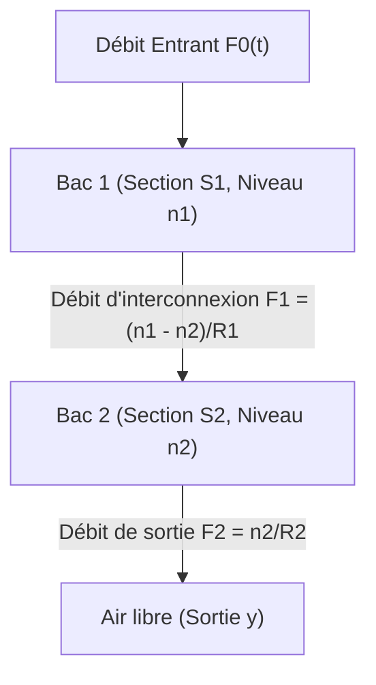
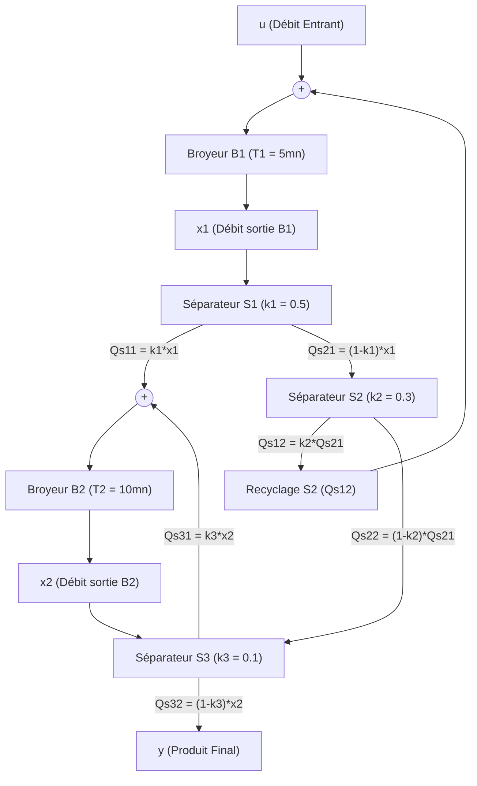

:::section id="td1-intro" eyebrow="TD1 AC439" title="Modélisation par Représentation d'État" summary="Enoncé complet, schémas bloc et correction détaillée des 4 exercices du TD1 en Commande Avancée (Esisar)."
:::

:::grid two-col
:::block type="definition" title="Objectifs pédagogiques"
- **Formalisme interne** : Établir les équations d'état \(\dot{x}(t) = A x(t) + B u(t)\) et de mesure \(y(t) = C x(t) + D u(t)\) à partir de lois physiques (électrique, hydraulique, mécanique, chimique).
- **Choix des variables d'état** : Identifier la mémoire dynamique d'un système (charges de condensateurs, niveaux de cuves, débits de broyeurs).
- **Passage Interne \(\leftrightarrow\) Externe** : Calculer la fonction de transfert \(H(p) = C(pI-A)^{-1}B + D\) à partir des matrices d'état.
- **Gestion des dérivées de la commande** : Maîtriser la mise sous forme canonique de commande en présence de termes en \(\dot{u}(t)\).
:::

:::block type="remember" title="Formules fondamentales"
- **Modèle d'état continu** :
  $$\begin{cases} \dot{x}(t) = A x(t) + B u(t) \\ y(t) = C x(t) + D u(t) \end{cases}$$
- **Fonction de transfert issue de la représentation d'état** :
  $$H(p) = \frac{Y(p)}{U(p)} = C (pI - A)^{-1} B + D$$
- **Inversion de matrice \(2 \times 2\)** :
  $$\begin{bmatrix} a & b \\ c & d \end{bmatrix}^{-1} = \frac{1}{ad - bc} \begin{bmatrix} d & -b \\ -c & a \end{bmatrix}$$
:::
:::

---

:::section id="td1-ex1" eyebrow="Exercice 1" title="Circuit électrique : deux cellules RC en parallèle" summary="Établissement du modèle d'état d'un circuit électrique à deux condensateurs."
:::

### Énoncé de l'exercice 1

On considère le circuit électrique ci-dessous constitué de deux résistances \(R_1, R_2\) et de deux condensateurs \(C_1, C_2\).

- **Entrée** : la tension d'alimentation \(e(t)\).
- **Sortie** : la tension aux bornes du condensateur \(C_2\), notée \(s(t)\).
- **Variables d'état** : les tensions \(x_1(t) = v_{C1}(t)\) et \(x_2(t) = v_{C2}(t)\) respectivement aux bornes de \(C_1\) et \(C_2\).

**Question** : Donner la représentation d'état complète du circuit (déterminer les matrices \(A, B, C, D\)).

#### Schéma interactif CircuitJS

:::circuitjs label="CircuitJS" title="Deux cellules RC en parallèle" height="auto" iframeTitle="Simulation CircuitJS des deux cellules RC en parallèle avec les noeuds x1 et x2" src="https://www.falstad.com/circuit/circuitjs.html?hideMenu=true&cct=%24%201%200.000005%2010.20027730826997%2050%205%2050%205e-11%0Av%20112%20280%20112%2096%200%201%205%205%200%200%200.5%0Aw%20112%2096%20296%2096%200%0Aw%20296%2096%20500%2096%200%0Ar%20296%2096%20296%20208%200%201000%0Ac%20296%20208%20296%20280%200%200.00001%200%0Ar%20500%2096%20500%20208%200%201000%0Ac%20500%20208%20500%20280%200%200.00001%200%0Aw%20112%20280%20296%20280%200%0Aw%20296%20280%20500%20280%200%0Ag%20112%20280%20112%20312%200%0Ax%20133%20174%20158%20177%204%2014%20e(t)%0Ax%20312%20142%20340%20145%204%2014%20R1%0Ax%20516%20142%20544%20145%204%2014%20R2%0Ax%20314%20242%20349%20245%204%2014%20C1%0Ax%20518%20242%20553%20245%204%2014%20C2%0Ax%20258%20216%20280%20219%204%2014%20x1%0Ax%20462%20216%20484%20219%204%2014%20x2%0Ao%200%2064%200%204098%205%200.1%200%201%20e(t)%20-%20entree%0Ao%204%2064%200%204098%205%200.1%201%201%20x1(t)%0Ao%206%2064%200%204098%205%200.1%202%201%20s(t)%20%3D%20x2(t)"
:::

:::block type="method" title="Manipulation conseillée"
Dans CircuitJS, observer les tensions \(x_1(t)\) et \(x_2(t)=s(t)\) lorsque l'entrée \(e(t)\) est sinusoïdale. Les deux cellules RC sont en parallèle : modifier \(R_1C_1\) agit uniquement sur \(x_1\), tandis que modifier \(R_2C_2\) agit uniquement sur \(x_2\).
:::

---

### Correction détaillée de l'exercice 1

#### 1. Application des lois de Kirchhoff sur les deux branches

Le montage contient deux cellules RC **en parallèle** sur la même tension d'entrée \(e(t)\). Les deux états ne sont donc pas couplés directement : chaque branche vérifie sa propre loi de maille.

- **Branche \(R_1-C_1\)** :
  Le courant du condensateur vaut \(i_1=C_1\dot{x}_1\). La loi des mailles donne :
  $$e(t)-R_1 i_1-x_1(t)=0$$
  donc
  $$e(t)-x_1(t)=R_1C_1\dot{x}_1(t)$$
  et finalement :
  $$\dot{x}_1(t)=-\frac{1}{R_1C_1}x_1(t)+\frac{1}{R_1C_1}e(t) \quad \text{(Éq. 1)}$$

- **Branche \(R_2-C_2\)** :
  Le courant du condensateur vaut \(i_2=C_2\dot{x}_2\). La loi des mailles donne :
  $$e(t)-R_2 i_2-x_2(t)=0$$
  donc
  $$e(t)-x_2(t)=R_2C_2\dot{x}_2(t)$$
  et finalement :
  $$\dot{x}_2(t)=-\frac{1}{R_2C_2}x_2(t)+\frac{1}{R_2C_2}e(t) \quad \text{(Éq. 2)}$$

:::block type="remember" title="Conséquence du montage en parallèle"
Comme \(R_1C_1\) et \(R_2C_2\) sont alimentés par la même tension \(e(t)\) mais ne sont pas reliés par une résistance entre leurs points milieux, la matrice \(A\) est diagonale. Il n'y a pas de terme de couplage \(x_1 \to x_2\) ou \(x_2 \to x_1\).
:::

#### 2. Équation de mesure (Sortie)

La sortie \(s(t)\) est directement la tension aux bornes de \(C_2\) (\(x_2\)) :
$$y(t) = s(t) = x_2(t) = 0 \cdot x_1(t) + 1 \cdot x_2(t)$$

#### 3. Forme Matricielle Finale

:::block type="method" title="Représentation d'État du Circuit Électrique"
$$\begin{bmatrix} \dot{x}_1 \\ \dot{x}_2 \end{bmatrix}
=
\begin{bmatrix}
-\frac{1}{R_1C_1} & 0 \\
0 & -\frac{1}{R_2C_2}
\end{bmatrix}
\begin{bmatrix} x_1 \\ x_2 \end{bmatrix}
+
\begin{bmatrix}
\frac{1}{R_1C_1} \\
\frac{1}{R_2C_2}
\end{bmatrix} e(t)$$

$$y(t) = \begin{bmatrix} 0 & 1 \end{bmatrix} \begin{bmatrix} x_1 \\ x_2 \end{bmatrix} + 0 \cdot e(t)$$

Les matrices du système sont :
$$A =
\begin{bmatrix}
-\frac{1}{R_1C_1} & 0 \\
0 & -\frac{1}{R_2C_2}
\end{bmatrix},
\quad
B =
\begin{bmatrix}
\frac{1}{R_1C_1} \\[6pt]
\frac{1}{R_2C_2}
\end{bmatrix},
\quad
C = \begin{bmatrix} 0 & 1 \end{bmatrix},
\quad D = 0$$

Pour les valeurs du schéma CircuitJS, \(R_1=R_2=1\,k\Omega\) et \(C_1=C_2=10\,\mu F\), donc \(\tau_1=\tau_2=RC=10\,ms\). On obtient alors :

$$A=\begin{bmatrix}-100 & 0 \\ 0 & -100\end{bmatrix},
\quad
B=\begin{bmatrix}100 \\ 100\end{bmatrix},
\quad
C=\begin{bmatrix}0 & 1\end{bmatrix},
\quad D=0$$
:::

---

:::section id="td1-ex2" eyebrow="Exercice 2" title="Système Hydraulique à Deux Cuves Interconnectées" summary="Modélisation d'état et calcul de la fonction de transfert d'un système à deux réservoirs."
:::

### Énoncé de l'exercice 2

On considère un système hydraulique formé de 2 bacs communiquant à travers une restriction (robinet) de résistance hydraulique \(R_1\).
- **Bac 1** : section \(S_1\), niveau d'eau \(n_1(t)\), alimenté par un débit entrant volumique \(F_0(t)\).
- **Bac 2** : section \(S_2\), niveau d'eau \(n_2(t)\), se vidant à l'air libre à travers une restriction de résistance \(R_2\) avec un débit de sortie \(F_2(t)\).
- **Loi de débit d'une restriction** : Le débit à travers une restriction de résistance \(R_{ij}\) sous une différence de niveau \(\Delta n\) est \(F = \frac{\Delta n}{R_{ij}}\).
- **Variables d'état** : les deux niveaux d'eau \(x_1 = n_1\) et \(x_2 = n_2\).
- **Entrée** : \(u(t) = F_0(t)\). **Sortie** : \(y(t) = F_2(t)\).

**Questions** :
1. Donner la représentation d'état de ce système (\(A, B, C, D\)).
2. En déduire la fonction de transfert \(H(p) = \frac{F_2(p)}{F_0(p)}\) pour les valeurs numériques suivantes :
   $$S_1 = \frac{1}{6}, \quad S_2 = \frac{3}{2}, \quad R_1 = 4, \quad R_2 = \frac{1}{2}$$

---

### Correction détaillée de l'exercice 2

#### 1. Équations de bilan volumique (Principe de conservation de masse)

- **Principe** : \(\text{Débit entrant} - \text{Débit sortant} = \text{Débit accumulé} = S \cdot \frac{dn}{dt}\).

- **Pour le Bac 1** :
  - Débit entrant : \(F_0(t)\)
  - Débit sortant (vers le bac 2) : \(F_1(t) = \frac{n_1 - n_2}{R_1}\)
  $$F_0 - \frac{n_1 - n_2}{R_1} = S_1 \dot{n}_1 \implies \dot{n}_1 = -\frac{1}{R_1 S_1} n_1 + \frac{1}{R_1 S_1} n_2 + \frac{1}{S_1} F_0 \quad \text{(Éq. 1)}$$

- **Pour le Bac 2** :
  - Débit entrant (depuis le bac 1) : \(F_1(t) = \frac{n_1 - n_2}{R_1}\)
  - Débit sortant (vers l'air libre) : \(F_2(t) = \frac{n_2}{R_2}\)
  $$\frac{n_1 - n_2}{R_1} - \frac{n_2}{R_2} = S_2 \dot{n}_2 \implies \dot{n}_2 = \frac{1}{R_1 S_2} n_1 - \left( \frac{1}{R_1 S_2} + \frac{1}{R_2 S_2} \right) n_2 \quad \text{(Éq. 2)}$$

- **Équation de sortie** :
  $$y(t) = F_2(t) = \frac{n_2(t)}{R_2} = 0 \cdot n_1(t) + \frac{1}{R_2} n_2(t) \quad \text{(Éq. 3)}$$

#### Forme Littérale des Matrices :
$$A = \begin{bmatrix} -\frac{1}{R_1 S_1} & \frac{1}{R_1 S_1} \\[6pt] \frac{1}{R_1 S_2} & -\left( \frac{1}{R_1 S_2} + \frac{1}{R_2 S_2} \right) \end{bmatrix}, \quad B = \begin{bmatrix} \frac{1}{S_1} \\[6pt] 0 \end{bmatrix}, \quad C = \begin{bmatrix} 0 & \frac{1}{R_2} \end{bmatrix}, \quad D = 0$$

---

#### 2. Application numérique et calcul des matrices

Injectons les valeurs numériques : \(S_1 = 1/6\), \(S_2 = 3/2\), \(R_1 = 4\), \(R_2 = 1/2\).

- \(R_1 S_1 = 4 \times \frac{1}{6} = \frac{2}{3} \implies \frac{1}{R_1 S_1} = \frac{3}{2} = 1.5\)
- \(R_1 S_2 = 4 \times \frac{3}{2} = 6 \implies \frac{1}{R_1 S_2} = \frac{1}{6}\)
- \(R_2 S_2 = \frac{1}{2} \times \frac{3}{2} = \frac{3}{4} \implies \frac{1}{R_2 S_2} = \frac{4}{3}\)
- \(\frac{1}{R_1 S_2} + \frac{1}{R_2 S_2} = \frac{1}{6} + \frac{4}{3} = \frac{1 + 8}{6} = \frac{9}{6} = \frac{3}{2} = 1.5\)
- \(\frac{1}{S_1} = 6\)
- \(\frac{1}{R_2} = 2\)

:::block type="method" title="Matrices Numériques obtenues"
$$A = \begin{bmatrix} -1.5 & 1.5 \\[4pt] \frac{1}{6} & -1.5 \end{bmatrix} = \begin{bmatrix} -\frac{3}{2} & \frac{3}{2} \\[4pt] \frac{1}{6} & -\frac{3}{2} \end{bmatrix}, \quad B = \begin{bmatrix} 6 \\[4pt] 0 \end{bmatrix}, \quad C = \begin{bmatrix} 0 & 2 \end{bmatrix}$$
:::

---

#### 3. Calcul explicite de la fonction de transfert \(H(p) = \frac{F_2(p)}{F_0(p)}\)

Utilisons la formule classique Laplace-Matrice : \(H(p) = C (pI - A)^{-1} B\).

- **Calcul de \((pI - A)\)** :
  $$(pI - A) = \begin{bmatrix} p + \frac{3}{2} & -\frac{3}{2} \\[4pt] -\frac{1}{6} & p + \frac{3}{2} \end{bmatrix}$$

- **Déterminant \(\det(pI - A)\)** (Polynôme caractéristique) :
  $$\det(pI - A) = \left(p + \frac{3}{2}\right)^2 - \left(-\frac{3}{2}\right)\left(-\frac{1}{6}\right) = p^2 + 3p + \frac{9}{4} - \frac{1}{4} = p^2 + 3p + 2$$
  Factoration du dénominateur : \(\det(pI - A) = (p + 1)(p + 2)\).

- **Inversion de \((pI - A)\)** :
  $$(pI - A)^{-1} = \frac{1}{p^2 + 3p + 2} \begin{bmatrix} p + \frac{3}{2} & \frac{3}{2} \\[4pt] \frac{1}{6} & p + \frac{3}{2} \end{bmatrix}$$

- **Produit \((pI - A)^{-1} B\)** :
  $$(pI - A)^{-1} \begin{bmatrix} 6 \\ 0 \end{bmatrix} = \frac{1}{p^2 + 3p + 2} \begin{bmatrix} 6 \left(p + \frac{3}{2}\right) \\[4pt] 6 \times \frac{1}{6} \end{bmatrix} = \frac{1}{p^2 + 3p + 2} \begin{bmatrix} 6p + 9 \\ 1 \end{bmatrix}$$

- **Produit final \(C (pI - A)^{-1} B\)** :
  $$H(p) = \begin{bmatrix} 0 & 2 \end{bmatrix} \frac{1}{p^2 + 3p + 2} \begin{bmatrix} 6p + 9 \\ 1 \end{bmatrix} = \frac{2 \times 1}{p^2 + 3p + 2} = \frac{2}{p^2 + 3p + 2}$$

:::block type="method" title="Résultat de la Fonction de Transfert"
$$H(p) = \frac{F_2(p)}{F_0(p)} = \frac{2}{p^2 + 3p + 2} = \frac{1}{1 + 1.5 p + 0.5 p^2}$$

*Vérification physique du gain statique* : Pour \(p = 0\) (régime permanent), \(H(0) = \frac{2}{2} = 1\). Cela signifie qu'en régime permanent, tout le débit entrant sort par la seconde cuve (\(F_2 = F_0\)), ce qui valide parfaitement la conservation de la masse.
:::

---

:::section id="td1-ex3" eyebrow="Exercice 3" title="Équation Différentielle avec Dérivée de la Commande" summary="Mise sous forme d'état d'un système scalaire du 2nd ordre comportant un terme en u'(t)."
:::

### Énoncé de l'exercice 3

Soit le système dynamique continu décrit par l'équation différentielle linéaire suivante :
$$\frac{d^2 y(t)}{dt^2} + a \frac{dy(t)}{dt} + b y(t) = \frac{du(t)}{dt} + c u(t)$$

où \(y(t)\) est la variable de sortie et \(u(t)\) est l'entrée de commande.

**Question** : Donner la représentation d'état du système.

---

### Correction détaillée de l'exercice 3

Dans le domaine de Laplace avec conditions initiales nulles, l'équation s'écrit :
$$(p^2 + a p + b) Y(p) = (p + c) U(p) \implies H(p) = \frac{Y(p)}{U(p)} = \frac{p + c}{p^2 + a p + b}$$

La présence du terme \(\frac{du(t)}{dt}\) empêche le choix naïf \(x_1 = y, x_2 = \dot{y}\) (car \(\dot{x}_2\) ferait apparaître \(\dot{u}\) dans les équations d'état). Deux méthodes rigoureuses permettent d'établir la représentation d'état.

---

#### Méthode 1 : Forme Canonique de Commande (Variable d'état intermédiaire)

Introduisons une variable scalaire intermédiaire \(x_0(t)\) telle que :
$$\frac{X_0(p)}{U(p)} = \frac{1}{p^2 + a p + b} \quad \text{et} \quad Y(p) = (p + c) X_0(p)$$

Dans le domaine temporel, ces deux relations deviennent :
1. \(\ddot{x}_0(t) + a \dot{x}_0(t) + b x_0(t) = u(t) \implies \ddot{x}_0 = -b x_0 - a \dot{x}_0 + u(t)\)
2. \(y(t) = \dot{x}_0(t) + c x_0(t)\)

Posons comme variables d'état les variables de phase de \(x_0\) :
$$\begin{cases} x_1(t) = x_0(t) \\ x_2(t) = \dot{x}_0(t) \end{cases}$$

Leurs dérivées s'écrivent :
$$\begin{cases} \dot{x}_1 = x_2 \\ \dot{x}_2 = -b x_1 - a x_2 + u(t) \end{cases}$$

Et l'équation de mesure :
$$y(t) = c x_1(t) + x_2(t)$$

:::block type="method" title="Représentation d'État (Méthode 1 - Variables de phase)"
$$A = \begin{bmatrix} 0 & 1 \\ -b & -a \end{bmatrix}, \quad B = \begin{bmatrix} 0 \\ 1 \end{bmatrix}, \quad C = \begin{bmatrix} c & 1 \end{bmatrix}, \quad D = 0$$
:::

---

#### Méthode 2 : Changement de Variable Direct (Élimination de \(\dot{u}\))

Posons directement :
- \(x_1 = y\)
- \(\dot{x}_1 = \dot{y} = x_2 + \beta_0 u\). Pour éliminer le terme en \(\dot{u}\) lors de la dérivation de \(x_2\), choisissons \(\beta_0 = 1\), d'où \(x_2 = \dot{y} - u\).

Calculons la dérivée de \(x_2\) :
$$\dot{x}_2 = \ddot{y} - \dot{u}$$

En utilisant l'équation différentielle d'origine \(\ddot{y} = -a \dot{y} - b y + \dot{u} + c u\) :
$$\dot{x}_2 = (-a \dot{y} - b y + \dot{u} + c u) - \dot{u} = -a (x_2 + u) - b x_1 + c u = -b x_1 - a x_2 + (c - a) u$$

:::block type="method" title="Représentation d'État (Méthode 2 - Variable compensée)"
$$\begin{bmatrix} \dot{x}_1 \\ \dot{x}_2 \end{bmatrix} = \begin{bmatrix} 0 & 1 \\ -b & -a \end{bmatrix} \begin{bmatrix} x_1 \\ x_2 \end{bmatrix} + \begin{bmatrix} 1 \\ c - a \end{bmatrix} u(t)$$

$$y(t) = \begin{bmatrix} 1 & 0 \end{bmatrix} \begin{bmatrix} x_1 \\ x_2 \end{bmatrix} + 0 \cdot u(t)$$
:::

---

:::section id="td1-ex4" eyebrow="Exercice 4" title="Extrait d'Examen : Processus Minéralurgique" summary="Modélisation d'une unité industrielle de broyage et séparation de minerais."
:::

### Énoncé de l'exercice 4

Une unité de traitement mécanique de minerais est constituée de deux broyeurs (\(B_1, B_2\)) et de trois séparateurs de particules (\(S_1, S_2, S_3\)).
Les variables considérées sont uniquement les débits de matière en tonnes par minute (\(T/mn\)).

#### Modèles physiques des composants :
1. **Broyeur \(B_i\)** : relation de transfert du premier ordre entre débit entrant \(Q_e\) et débit sortant \(Q_s\) :
   $$\frac{Q_s(p)}{Q_e(p)} = \frac{1}{1 + T_i p} \iff T_i \frac{dQ_s(t)}{dt} + Q_s(t) = Q_e(t)$$
2. **Séparateur \(S_j\)** : coefficient de séparation \(k_j\). Pour un débit entrant \(Q_e\), les deux débits sortants respectent :
   $$Q_{s1} = k_j Q_e \quad \text{(grains grossiers recyclés)}, \quad Q_{s2} = (1 - k_j) Q_e \quad \text{(grains fins)}$$

#### Données numériques :
- Constantes de temps des broyeurs : \(T_1 = 5\text{ mn}\), \(T_2 = 10\text{ mn}\).
- Coefficients de séparation : \(k_1 = 0.5\), \(k_2 = 0.3\), \(k_3 = 0.1\).
- **Variables d'état** : \(x_1 = Q_{sB1}\) (débit de sortie de \(B_1\)) et \(x_2 = Q_{sB2}\) (débit de sortie de \(B_2\)).
- **Entrée** : \(u(t)\) (débit brut entrant).
- **Sortie** : \(y(t)\) (débit de produit fini extrait du système).

**Question** : Donner la représentation d'état du système (\(A, B, C, D\)) sous forme littérale puis numérique.

---

### Correction détaillée de l'exercice 4

#### 1. Analyse des débits aux nœuds du circuit

- **Séparateur \(S_1\)** (reçoit \(x_1\)) :
  - \(Q_{s11} = k_1 x_1 = 0.5 x_1\) (vers l'entrée de \(B_2\))
  - \(Q_{s21} = (1 - k_1) x_1 = 0.5 x_1\) (vers \(S_2\))

- **Séparateur \(S_2\)** (reçoit \(Q_{s21} = (1-k_1)x_1\)) :
  - \(Q_{s12} = k_2 Q_{s21} = k_2 (1 - k_1) x_1 = 0.3 \times 0.5 x_1 = 0.15 x_1\) (recyclé vers l'entrée de \(B_1\))
  - \(Q_{s22} = (1 - k_2) Q_{s21} = (1 - k_2) (1 - k_1) x_1 = 0.7 \times 0.5 x_1 = 0.35 x_1\) (vers \(S_3\))

- **Séparateur \(S_3\)** (reçoit \(Q_{s22}\) et la sortie \(x_2\) de \(B_2\)) :
  - \(Q_{s31} = k_3 x_2 = 0.1 x_2\) (recyclé vers l'entrée de \(B_2\))
  - \(Q_{s32} = (1 - k_3) x_2 = 0.9 x_2\) (sorte finale du procédé \(y\))

---

#### 2. Établissement des équations d'état dynamiques

- **Broyeur \(B_1\)** :
  Le débit entrant dans \(B_1\) est la somme du débit de commande \(u(t)\) et du débit recyclé depuis \(S_2\) (\(Q_{s12}\)) :
  $$Q_{eB1} = u(t) + k_2 (1 - k_1) x_1(t)$$

  L'équation dynamique du 1er ordre s'écrit :
  $$T_1 \dot{x}_1 + x_1 = Q_{eB1} = u + k_2 (1 - k_1) x_1$$
  $$T_1 \dot{x}_1 = \left( k_2 (1 - k_1) - 1 \right) x_1 + u \implies \dot{x}_1 = \frac{k_2 (1 - k_1) - 1}{T_1} x_1 + \frac{1}{T_1} u$$

  *Calcul numérique pour \(\dot{x}_1\)* :
  - \(k_2 (1 - k_1) - 1 = 0.3 \times (1 - 0.5) - 1 = 0.15 - 1 = -0.85\)
  - \(\dot{x}_1 = \frac{-0.85}{5} x_1 + \frac{1}{5} u = -0.17 x_1 + 0.2 u\)

- **Broyeur \(B_2\)** :
  Le débit entrant dans \(B_2\) provient du séparateur \(S_1\) (\(Q_{s11}\)) et du recyclage du séparateur \(S_3\) (\(Q_{s31}\)) :
  $$Q_{eB2} = k_1 x_1(t) + k_3 x_2(t)$$

  L'équation dynamique s'écrit :
  $$T_2 \dot{x}_2 + x_2 = Q_{eB2} = k_1 x_1 + k_3 x_2$$
  $$T_2 \dot{x}_2 = k_1 x_1 + (k_3 - 1) x_2 \implies \dot{x}_2 = \frac{k_1}{T_2} x_1 + \frac{k_3 - 1}{T_2} x_2$$

  *Calcul numérique pour \(\dot{x}_2\)* :
  - \(\frac{k_1}{T_2} = \frac{0.5}{10} = 0.05\)
  - \(\frac{k_3 - 1}{T_2} = \frac{0.1 - 1}{10} = \frac{-0.9}{10} = -0.09\)
  - \(\dot{x}_2 = 0.05 x_1 - 0.09 x_2\)

- **Équation de Sortie \(y(t)\)** :
  Le débit final sortant du processus est le débit de fins du séparateur \(S_2\) transmis directement en sortie :
  $$y(t) = Q_{s22} = (1 - k_2)(1 - k_1) x_1 = (1 - 0.3)(1 - 0.5) x_1 = 0.35 x_1$$

---

#### 3. Synthèse des Matrices Numériques

:::block type="method" title="Représentation d'État Complète du Processus Minéralurgique"
$$\begin{bmatrix} \dot{x}_1 \\ \dot{x}_2 \end{bmatrix} = \begin{bmatrix} -0.17 & 0 \\ 0.05 & -0.09 \end{bmatrix} \begin{bmatrix} x_1 \\ x_2 \end{bmatrix} + \begin{bmatrix} 0.2 \\ 0 \end{bmatrix} u(t)$$

$$y(t) = \begin{bmatrix} 0.35 & 0 \end{bmatrix} \begin{bmatrix} x_1 \\ x_2 \end{bmatrix} + 0 \cdot u(t)$$

Les matrices du modèle d'état sont :
$$A = \begin{bmatrix} -0.17 & 0 \\ 0.05 & -0.09 \end{bmatrix}, \quad B = \begin{bmatrix} 0.2 \\ 0 \end{bmatrix}, \quad C = \begin{bmatrix} 0.35 & 0 \end{bmatrix}, \quad D = 0$$
:::

---

:::section id="td1-conclusion" eyebrow="Synthèse" title="Conclusion et Récapitulatif du TD1" summary="Synthèse des concepts de modélisation par représentation d'état abordés dans ce TD."
:::

:::grid two-col
:::block type="definition" title="Ce qu'il faut retenir"
1. **Dimension du vecteur d'état** : Égale au nombre d'éléments accumulateurs d'énergie ou de matière (2 condensateurs \(\implies n=2\), 2 cuves \(\implies n=2\), 2 broyeurs \(\implies n=2\)).
2. **Méthode systématique** :
   - Identifier les équations différentielles physiques régissant chaque sous-système.
   - Isoler les dérivées de premier ordre de chaque variable d'état.
   - Écrire la relation linéaire sous forme matricielle.
:::

:::block type="remember" title="Propriétés des Matrices obtenues"
- Pour tous les systèmes physiques réels examinés (filtre RC, bacs d'eau, broyeurs), les éléments diagonaux de la matrice \(A\) sont négatifs, traduisant la dissipation d'énergie et la stabilité naturelle en boucle ouverte.
:::
:::
