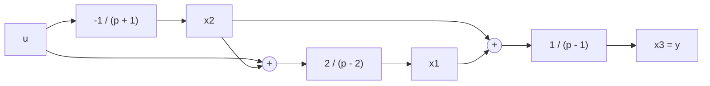

:::section id="td2-intro" eyebrow="TD2 AC439" title="Commandabilité et observabilité" summary="Rappels fondamentaux sur les critères de rang de Kalman, le rôle des sous-espaces de commandabilité et d'observabilité, et les simplifications pôle-zéro."

La **commandabilité** et l'**observabilité** sont les deux propriétés structurelles majeures de la représentation d'état. Elles déterminent s'il est possible de piloter l'ensemble des variables d'état via la commande $u(t)$ et de reconstruire l'état interne à partir des seules mesures disponibles $y(t)$.

### 1. La Commandabilité (au sens de Kalman)
Un système continu stationnaire $\dot{x}(t) = A x(t) + B u(t)$ (où $x \in \mathbb{R}^n$) est **complètement commandable** si et seulement si sa matrice de commandabilité $\mathcal{C}$ est de rang plein ($n$) :

\[
\mathcal{C} = \begin{bmatrix} B & AB & A^2 B & \dots & A^{n-1} B \end{bmatrix}, \quad \text{rang}(\mathcal{C}) = n
\]

:::block type="definition" title="Interprétation Physique et Noyau à Gauche"
*   **Contrôle Total :** Un système commandable permet d'amener l'état $x(t)$ de n'importe quelle condition initiale $x(0)$ à n'importe quel état final $x(t_f)$ en un temps fini $t_f > 0$.
*   **États non commandables :** Si $\text{rang}(\mathcal{C}) = r < n$, le sous-espace commandable est de dimension $r$. Le noyau à gauche de $\mathcal{C}$, défini par $\ker(\mathcal{C}^T) = \{ v \in \mathbb{R}^n \mid v^T \mathcal{C} = 0 \}$, caractérise les directions d'état totalement insensibles à la commande $u(t)$.
:::

### 2. L'Observabilité (au sens de Kalman)
Un système continu stationnaire défini par le couple $(A, C)$ est **complètement observable** si et seulement si sa matrice d'observabilité $\mathcal{O}$ est de rang plein ($n$) :

\[
\mathcal{O} = \begin{bmatrix} C \\ CA \\ CA^2 \\ \vdots \\ CA^{n-1} \end{bmatrix}, \quad \text{rang}(\mathcal{O}) = n
\]

:::block type="definition" title="Interprétation Physique et Noyau à Droite"
*   **Reconstruction d'État :** L'observabilité garantit que la connaissance de l'entrée $u(t)$ et de la sortie $y(t)$ sur un intervalle de temps fini suffit pour déterminer de manière unique l'état initial $x(0)$.
*   **États non observables :** Le noyau à droite de la matrice d'observabilité, $\ker(\mathcal{O}) = \{ v \in \mathbb{R}^n \mid \mathcal{O} v = 0 \}$, contient l'ensemble des états initiaux qui produisent une sortie identiquement nulle ($y(t) \equiv 0$) en l'absence d'entrée.
:::
:::

---

:::section id="td2-ex1" eyebrow="Exercice 1" title="Analyse d'un système représenté par schéma-bloc" summary="Modélisation d'état à partir d'un schéma-bloc, étude des modes, calcul de la fonction de transfert et tests de Kalman."

### Énoncé de l'exercice 1
On considère le système dynamique continu représenté par le schéma-bloc suivant :

1.1 **Donner la représentation d'état** $(A, B, C, D)$ du système en prenant comme variables d'état les sorties des trois blocs dynamiques $x_1, x_2, x_3$.  
1.2 **Déterminer les modes** du système et conclure sur sa stabilité en boucle ouverte.  
1.3 **Donner la fonction de transfert globale** $H(p) = \frac{Y(p)}{U(p)}$.  
1.4 **Le système est-il complètement commandable ? Est-il complètement observable ?**

---

### Correction détaillée de l'exercice 1

#### 1.1 Représentation d'État
Exprimons la dynamique temporelle de chaque variable d'état à partir des blocs fréquentiels $p X_i(p)$ :

1. **Pour $x_1$ :** le bloc \(\frac{2}{p-2}\) reçoit la somme \(x_2+u\). Ainsi $X_1(p) = \frac{2}{p-2}\bigl(X_2(p)+U(p)\bigr)$, donc
   \[
   (p-2)X_1(p)=2X_2(p)+2U(p)
   \quad\Longrightarrow\quad
   \dot{x}_1(t)=2x_1(t)+2x_2(t)+2u(t).
   \]
2. **Pour $x_2$ :** $X_2(p) = \frac{-1}{p+1} U(p) \implies (p+1)X_2(p) = -U(p) \implies \dot{x}_2(t) = -x_2(t) - u(t)$
3. **Pour $x_3$ :** le bloc \(\frac{1}{p-1}\) reçoit la somme \(x_1+x_2\). Ainsi $X_3(p)=\frac{1}{p-1}\bigl(X_1(p)+X_2(p)\bigr)$, donc
   \[
   (p-1)X_3(p)=X_1(p)+X_2(p)
   \quad\Longrightarrow\quad
   \dot{x}_3(t)=x_3(t)+x_1(t)+x_2(t).
   \]
4. **Équation de mesure :** la fiche note \(x_3\) la sortie, donc \(y(t)=x_3(t)\).

Sous forme matricielle $\dot{x}(t) = A x(t) + B u(t)$ et $y(t) = C x(t) + D u(t)$ avec $x(t) = \begin{bmatrix} x_1(t) & x_2(t) & x_3(t) \end{bmatrix}^T$ :

\[
A = \begin{bmatrix} 2 & 2 & 0 \\ 0 & -1 & 0 \\ 1 & 1 & 1 \end{bmatrix}, \quad
B = \begin{bmatrix} 2 \\ -1 \\ 0 \end{bmatrix}, \quad
C = \begin{bmatrix} 0 & 0 & 1 \end{bmatrix}, \quad
D = 0
\]

#### 1.2 Modes du Système et Stabilité
La matrice $A$ est triangulaire par blocs. Ses valeurs propres sont donc directement situées sur sa diagonale principale :

\[
\det(pI - A) = (p - 2)(p + 1)(p - 1) = 0 \implies \begin{cases} \lambda_1 = 2 \\ \lambda_2 = -1 \\ \lambda_3 = 1 \end{cases}
\]

:::block type="warning" title="Analyse de la Stabilité"
*   **Modes propres :** Les modes du système sont $e^{2t}$ (instable), $e^{-t}$ (stable) et $e^t$ (instable).
*   **Conclusion :** Les valeurs propres \(\lambda_1 = 2 > 0\) et \(\lambda_3=1>0\) possèdent une partie réelle strictement positive. Le système est donc **instable en boucle ouverte**.
:::

#### 1.3 Fonction de Transfert Global $H(p)$
Par substitution directe dans le domaine de Laplace :

\[
Y(p)=X_3(p)=\frac{1}{p-1}\bigl(X_1(p)+X_2(p)\bigr)
\]

Or
\[
X_2(p)=\frac{-1}{p+1}U(p),
\qquad
X_1(p)=\frac{2}{p-2}\bigl(X_2(p)+U(p)\bigr).
\]

Donc
\[
X_1(p)
=\frac{2}{p-2}\left(1-\frac{1}{p+1}\right)U(p)
=\frac{2p}{(p-2)(p+1)}U(p).
\]

Mettons au même dénominateur :

\[
H(p)=\frac{Y(p)}{U(p)}
=\frac{1}{p-1}\left(\frac{2p}{(p-2)(p+1)}-\frac{1}{p+1}\right)
=\frac{p+2}{(p-2)(p+1)(p-1)}
\]

:::block type="method" title="Vérification par la Formule Matricielle"
On peut vérifier que $H(p) = C(pI-A)^{-1}B$ :
\[
(pI-A)^{-1} =
\begin{bmatrix}
\frac{1}{p-2} & \frac{2}{(p-2)(p+1)} & 0 \\
0 & \frac{1}{p+1} & 0 \\
\frac{1}{(p-2)(p-1)} & \frac{p}{(p-2)(p+1)(p-1)} & \frac{1}{p-1}
\end{bmatrix}
\]
\[
C(pI-A)^{-1}B
=\begin{bmatrix}0&0&1\end{bmatrix}
\begin{bmatrix}
\frac{1}{p-2} & \frac{2}{(p-2)(p+1)} & 0 \\
0 & \frac{1}{p+1} & 0 \\
\frac{1}{(p-2)(p-1)} & \frac{p}{(p-2)(p+1)(p-1)} & \frac{1}{p-1}
\end{bmatrix}
\begin{bmatrix}2\\-1\\0\end{bmatrix}
=\frac{p+2}{(p-2)(p+1)(p-1)}
\]
:::

#### 1.4 Test de Commandabilité et d'Observabilité

##### A. Commandabilité (Critère de Kalman)
Calculons la matrice de commandabilité $\mathcal{C} = \begin{bmatrix} B & AB & A^2B \end{bmatrix}$ :

\[
B = \begin{bmatrix} 2 \\ -1 \\ 0 \end{bmatrix}, \quad
AB = \begin{bmatrix} 2 & 2 & 0 \\ 0 & -1 & 0 \\ 1 & 1 & 1 \end{bmatrix} \begin{bmatrix} 2 \\ -1 \\ 0 \end{bmatrix} = \begin{bmatrix} 2 \\ 1 \\ 1 \end{bmatrix}, \quad
A^2B=A(AB)=\begin{bmatrix} 6 \\ -1 \\ 4 \end{bmatrix}
\]

D'où :
\[
\mathcal{C} = \begin{bmatrix} 2 & 2 & 6 \\ -1 & 1 & -1 \\ 0 & 1 & 4 \end{bmatrix}
\]

Calculons son déterminant :
\[
\det(\mathcal{C}) = 12 \neq 0
\]

Puisque $\det(\mathcal{C}) \neq 0$, la matrice est de rang 3 (rang plein).  
**Conclusion : Le système est complètement commandable.**

##### B. Observabilité (Critère de Kalman)
Calculons la matrice d'observabilité $\mathcal{O} = \begin{bmatrix} C \\ CA \\ CA^2 \end{bmatrix}$ :

\[
C = \begin{bmatrix} 0 & 0 & 1 \end{bmatrix}, \quad
CA = \begin{bmatrix} 0 & 0 & 1 \end{bmatrix} \begin{bmatrix} 2 & 2 & 0 \\ 0 & -1 & 0 \\ 1 & 1 & 1 \end{bmatrix} = \begin{bmatrix} 1 & 1 & 1 \end{bmatrix}, \quad
CA^2=(CA)A=\begin{bmatrix} 3 & 2 & 1 \end{bmatrix}
\]

D'où :
\[
\mathcal{O} = \begin{bmatrix} 0 & 0 & 1 \\ 1 & 1 & 1 \\ 3 & 2 & 1 \end{bmatrix}
\]

Calculons son déterminant :
\[
\det(\mathcal{O}) = -1 \neq 0
\]

Puisque $\det(\mathcal{O}) \neq 0$, la matrice est de rang 3 (rang plein).  
**Conclusion : Le système est complètement observable.**
:::

---

:::section id="td2-ex2" eyebrow="Exercice 2" title="Test de commandabilité d'un système du second ordre" summary="Calcul de la matrice de commandabilité et analyse du rang pour un système canonique de second ordre."

### Énoncé de l'exercice 2
On considère le système linéaire continu du second ordre défini par :

\[
A = \begin{bmatrix} 0 & 1 \\ -2 & -3 \end{bmatrix}, \quad B = \begin{bmatrix} 0 \\ 1 \end{bmatrix}
\]

2.1 **Donner la matrice de commandabilité et conclure sur la commandabilité du système.**

---

### Correction détaillée de l'exercice 2

#### 2.1 Calcul de la Matrice de Commandabilité
Pour un système d'ordre $n=2$, la matrice de commandabilité est $\mathcal{C} = \begin{bmatrix} B & AB \end{bmatrix}$.

Calculons $AB$ :
\[
AB = \begin{bmatrix} 0 & 1 \\ -2 & -3 \end{bmatrix} \begin{bmatrix} 0 \\ 1 \end{bmatrix} = \begin{bmatrix} 1 \\ -3 \end{bmatrix}
\]

D'où :
\[
\mathcal{C} = \begin{bmatrix} 0 & 1 \\ 1 & -3 \end{bmatrix}
\]

Calculons son déterminant :
\[
\det(\mathcal{C}) = (0 \cdot (-3)) - (1 \cdot 1) = -1 \neq 0
\]

:::block type="remember" title="Conclusion sur la Commandabilité"
La matrice $\mathcal{C}$ est de rang 2 (plein rang $n=2$).  
**Le système est donc complètement commandable au sens de Kalman.**

*Remarque théorique :* La matrice $A$ sous forme compagnon (matrice de phase) avec $B = \begin{bmatrix} 0 & 1 \end{bmatrix}^T$ constitue la **forme canonique de commande**, garantissant structurellement la commandabilité.
:::
:::

---

:::section id="td2-ex3" eyebrow="Exercice 3" title="Analyse comparée de commandabilité sur deux systèmes d'ordre 3" summary="Étude des sous-espaces commandables et identification des états non commandables."

### Énoncé de l'exercice 3
On considère les deux systèmes linéaires du 3ème ordre suivants :

*   **Système 1 :** $A_1 = \begin{bmatrix} 0 & 1 & 0 \\ 0 & 0 & 1 \\ -6 & -11 & -6 \end{bmatrix}, \quad B_1 = \begin{bmatrix} 0 \\ 0 \\ 1 \end{bmatrix}$
*   **Système 2 :** $A_2 = \begin{bmatrix} 0 & 1 & 0 \\ 0 & 0 & 1 \\ 0 & 0 & 0 \end{bmatrix}, \quad B_2 = \begin{bmatrix} 1 \\ 0 \\ 0 \end{bmatrix}$

3.1 **Donner pour chaque système la matrice de commandabilité et conclure.**  
3.2 **Quels sont les états non commandables ?**

---

### Correction détaillée de l'exercice 3

#### 3.1 Analyse de la Commandabilité

##### A. Système 1
Calculons les colonnes de $\mathcal{C}_1 = \begin{bmatrix} B_1 & A_1 B_1 & A_1^2 B_1 \end{bmatrix}$ :

\[
B_1 = \begin{bmatrix} 0 \\ 0 \\ 1 \end{bmatrix}, \quad
A_1 B_1 = \begin{bmatrix} 0 \\ 1 \\ -6 \end{bmatrix}, \quad
A_1^2 B_1 = A_1 (A_1 B_1) = \begin{bmatrix} 0 & 1 & 0 \\ 0 & 0 & 1 \\ -6 & -11 & -6 \end{bmatrix} \begin{bmatrix} 0 \\ 1 \\ -6 \end{bmatrix} = \begin{bmatrix} 1 \\ -6 \\ 25 \end{bmatrix}
\]

D'où :
\[
\mathcal{C}_1 = \begin{bmatrix} 0 & 0 & 1 \\ 0 & 1 & -6 \\ 1 & -6 & 25 \end{bmatrix}
\]

Le déterminant s'obtient immédiatement par le développement selon la première colonne :
\[
\det(\mathcal{C}_1) = 1 \cdot (0 - 1) = -1 \neq 0
\]

**Conclusion pour le Système 1 :** La matrice est de rang plein ($\text{rang}=3$). Le **Système 1 est complètement commandable.**

##### B. Système 2
Calculons les colonnes de $\mathcal{C}_2 = \begin{bmatrix} B_2 & A_2 B_2 & A_2^2 B_2 \end{bmatrix}$ :

\[
B_2 = \begin{bmatrix} 1 \\ 0 \\ 0 \end{bmatrix}, \quad
A_2 B_2 = \begin{bmatrix} 0 & 1 & 0 \\ 0 & 0 & 1 \\ 0 & 0 & 0 \end{bmatrix} \begin{bmatrix} 1 \\ 0 \\ 0 \end{bmatrix} = \begin{bmatrix} 0 \\ 0 \\ 0 \end{bmatrix}, \quad
A_2^2 B_2 = \begin{bmatrix} 0 \\ 0 \\ 0 \end{bmatrix}
\]

D'où :
\[
\mathcal{C}_2 = \begin{bmatrix} 1 & 0 & 0 \\ 0 & 0 & 0 \\ 0 & 0 & 0 \end{bmatrix}
\]

**Conclusion pour le Système 2 :** La matrice a une seule colonne non nulle. Son rang est $\text{rang}(\mathcal{C}_2) = 1 < 3$.  
**Le Système 2 est non complètement commandable.**

#### 3.2 Identification des États Non Commandables
Analysons la dynamique du **Système 2** :

\[
\begin{cases}
\dot{x}_1 = x_2 + u \\
\dot{x}_2 = x_3 \\
\dot{x}_3 = 0
\end{cases}
\]

*   L'entrée $u(t)$ agit uniquement et directement sur la dérivée de $x_1$.
*   Les variables $x_2$ et $x_3$ ont une dynamique autonome totalement indépendante de la commande $u(t)$ ($\dot{x}_3 = 0 \implies x_3(t) = Cte$, $\dot{x}_2 = x_3(t)$).
*   L'image de la matrice de commandabilité est $\text{Im}(\mathcal{C}_2) = \text{Vect}\left(\begin{bmatrix} 1 & 0 & 0 \end{bmatrix}^T\right)$.

:::block type="warning" title="Conclusion sur les États"
*   **L'état $x_1$ est le seul état commandable.**
*   **Les états $x_2$ et $x_3$ sont les états non commandables.**
:::
:::

---

:::section id="td2-ex4" eyebrow="Exercice 4" title="Analyse d'observabilité et calcul des noyaux" summary="Recherche du noyau à droite de la matrice d'observabilité et identification des modes non observables."

### Énoncé de l'exercice 4
On considère les deux systèmes linéaires du second ordre suivants :

*   **Système 1 :** $A_1 = \begin{bmatrix} 1 & 1 \\ 0 & 1 \end{bmatrix}, \quad C_1 = \begin{bmatrix} 1 & 0 \end{bmatrix}$
*   **Système 2 :** $A_2 = \begin{bmatrix} 1 & 1 \\ 0 & 1 \end{bmatrix}, \quad C_2 = \begin{bmatrix} 0 & 1 \end{bmatrix}$

4.1 **Donner pour chaque système la matrice d'observabilité et conclure.**  
4.2 **Quels sont les états non observables ?**

---

### Correction détaillée de l'exercice 4

#### 4.1 Matrice d'Observabilité et Rang

##### A. Système 1
Calculons $\mathcal{O}_1 = \begin{bmatrix} C_1 \\ C_1 A_1 \end{bmatrix}$ :

\[
C_1 = \begin{bmatrix} 1 & 0 \end{bmatrix}, \quad
C_1 A_1 = \begin{bmatrix} 1 & 0 \end{bmatrix} \begin{bmatrix} 1 & 1 \\ 0 & 1 \end{bmatrix} = \begin{bmatrix} 1 & 1 \end{bmatrix}
\]

D'où :
\[
\mathcal{O}_1 = \begin{bmatrix} 1 & 0 \\ 1 & 1 \end{bmatrix}
\]

Calculons son déterminant :
\[
\det(\mathcal{O}_1) = 1 \cdot 1 - 0 = 1 \neq 0 \implies \text{rang}(\mathcal{O}_1) = 2
\]

**Conclusion pour le Système 1 :** Le rang est plein ($n=2$). Le **Système 1 est complètement observable.**

##### B. Système 2
Calculons $\mathcal{O}_2 = \begin{bmatrix} C_2 \\ C_2 A_2 \end{bmatrix}$ :

\[
C_2 = \begin{bmatrix} 0 & 1 \end{bmatrix}, \quad
C_2 A_2 = \begin{bmatrix} 0 & 1 \end{bmatrix} \begin{bmatrix} 1 & 1 \\ 0 & 1 \end{bmatrix} = \begin{bmatrix} 0 & 1 \end{bmatrix}
\]

D'où :
\[
\mathcal{O}_2 = \begin{bmatrix} 0 & 1 \\ 0 & 1 \end{bmatrix}
\]

Les deux lignes sont identiques. Le déterminant est $\det(\mathcal{O}_2) = 0$.  
Le rang est $\text{rang}(\mathcal{O}_2) = 1 < 2$.  
**Conclusion pour le Système 2 : Le Système 2 est non complètement observable.**

#### 4.2 Recherche des États Non Observables du Système 2
L'ensemble des états non observables correspond au noyau à droite de la matrice d'observabilité $\ker(\mathcal{O}_2)$ :

\[
\mathcal{O}_2 v = 0 \iff \begin{bmatrix} 0 & 1 \\ 0 & 1 \end{bmatrix} \begin{bmatrix} v_1 \\ v_2 \end{bmatrix} = \begin{bmatrix} 0 \\ 0 \end{bmatrix} \iff v_2 = 0, \quad v_1 \text{ arbitraire}
\]

Le noyau est donc généré par le vecteur :
\[
\ker(\mathcal{O}_2) = \text{Vect}\left( \begin{bmatrix} 1 \\ 0 \end{bmatrix} \right)
\]

:::block type="definition" title="Interprétation Physique"
Examinons les équations d'état du **Système 2** :
\[
\begin{cases}
\dot{x}_1 = x_1 + x_2 \\
\dot{x}_2 = x_2 \\
y = x_2
\end{cases}
\]
*   La sortie mesurée $y(t) = x_2(t)$ permet de connaître parfaitement l'état $x_2(t)$.
*   Cependant, l'état $x_1(t)$ influence la dérivée de lui-même mais n'apparaît **ni dans la mesure $y(t)$ ni dans l'équation de $x_2$**.
*   Il est donc impossible d'estimer $x_1(t)$ à partir de la mesure $y(t)$.
*   **Conclusion : L'état $x_1$ est l'état non observable.**
:::
:::
