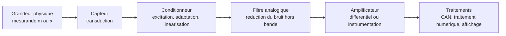
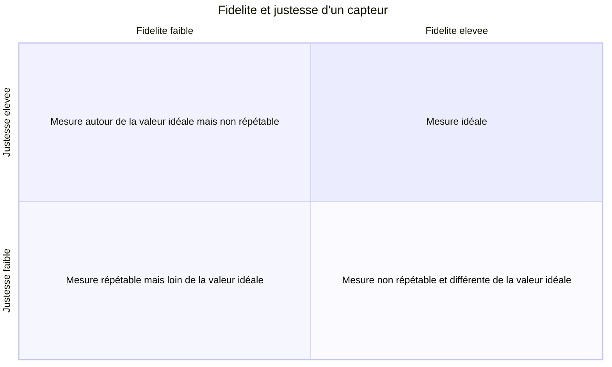
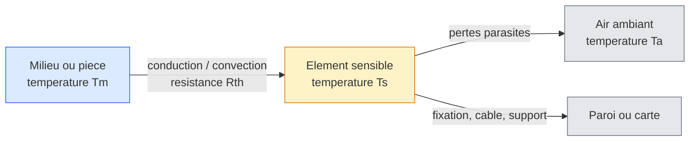

:::section id="ep425-intro" eyebrow="EE-470 / EE-479" title="Capteurs et instrumentation" summary="Mesure, metrologie, conditionnement des capteurs, bruit, temperature, position et electronique de precision."
:::dashboard
:::card class="progress-card" kicker="Parcours" title="7 chapitres"
La chaine de mesure part du mesurande, passe par le capteur, le conditionnement, l'amplification et finit par le traitement numerique.
:::

:::card class="priority-card" kicker="Priorites"
1. Identifier le type de capteur : actif ou passif.
2. Relier sensibilite du capteur et sensibilite du conditionneur.
3. Savoir propager une incertitude et reconnaitre les bruits limites.
4. Choisir un montage : diviseur, pont, 3 fils, 4 fils, boucle 4-20 mA.
5. Lire les limites d'un amplificateur d'instrumentation : TRMC, offset, bande passante.
:::
:::

:::quicklinks
- [Mesure et chaine d'acquisition](#ep425-mesure)
- [Metrologie](#ep425-metrologie)
- [Erreurs et bruits](#ep425-erreurs-bruits)
- [Conditionnement](#ep425-conditionnement)
- [Temperature](#ep425-temperature)
- [Position et inertiel](#ep425-position-inertiel)
- [Amplificateurs d'instrumentation](#ep425-instrumentation)
- [Synthese](#ep425-synthese)
:::

:::block type="neutral" title="Fil rouge"
Un capteur ne donne jamais directement une information parfaite : il transforme une grandeur physique en signal exploitable, mais cette transformation ajoute des offsets, du bruit, des non-linearites, des influences parasites et des contraintes d'impedance. Le role de l'instrumentation est de rendre ce signal mesurable, robuste et interpretable.
:::
:::

:::section id="ep425-mesure" eyebrow="Chapitre 0" title="Introduction generale a la mesure et a l'instrumentation" summary="Definition de la mesure, structure d'une chaine d'acquisition et classification actif/passif des capteurs."

### Principes fondamentaux

La mesure consiste a attribuer un **nombre** a une **grandeur physique, chimique ou biologique** a l'aide d'un instrument de mesure, par rapport a une echelle definie. Elle sert a quantifier objectivement un phenomene pour analyser, surveiller, commander ou prendre une decision.

:::grid two-col
:::block type="definition" title="Elements de la chaine"
- **Mesurande** : grandeur physique que l'on cherche a mesurer.
- **Capteur** : corps d'epreuve et transducteur qui convertit le mesurande en grandeur electrique.
- **Conditionneur** : circuit qui alimente, adapte, compense ou linearise le signal du capteur.
- **Amplificateur d'instrumentation** : etage qui amplifie la difference utile et rejette le mode commun.
:::

:::block type="remember" title="Lecture pratique"
Un signal de capteur est souvent faible : microvolts, millivolts ou petite variation d'impedance. La qualite de la mesure depend donc autant du capteur que de l'electronique autour de lui.
:::
:::

### Classification des capteurs

:::grid two-col
:::block type="definition" title="Capteurs actifs"
Ils fonctionnent comme des generateurs : le mesurande fournit directement une energie electrique.

Exemples : thermocouple, capteur piezoelectrique, capteur a effet Hall.
:::

:::block type="definition" title="Capteurs passifs"
Ils se comportent comme une impedance variable \(R\), \(L\) ou \(C\). Ils necessitent une excitation externe fournie par le conditionneur.

Exemples : thermistance, jauge de contrainte, PT100, capteur capacitif.
:::
:::
:::

:::section id="ep425-metrologie" eyebrow="Chapitre 1" title="Caracteristiques generales et metrologie des capteurs" summary="Courbe de reponse, etalonnage, fidelite, justesse, precision et grandeurs d'influence."

### Courbe de reponse et etalonnage

La courbe de reponse relie le signal de sortie \(s\) au mesurande d'entree \(x\) :

\[
s=f(x)
\]

L'**etalonnage** consiste a determiner experimentalement cette relation a partir de valeurs de reference connues. Il peut etre direct, par comparaison avec un etalon de meme nature, ou indirect lorsque l'on passe par une autre grandeur mesurable.

### Sensibilite, etendue et FSO

La **sensibilite** indique de combien varie le signal de sortie lorsque le mesurande varie. Autour d'un point de fonctionnement (x_0), c'est la pente locale de la courbe d'etalonnage :

\[
S(x_0)=\left.\frac{\mathrm ds}{\mathrm dx}\right|_{x_0}
\]

Son unite est toujours une unite de sortie par unite du mesurande : par exemple \(\mathrm{mV}/^\circ\mathrm C\), \(\Omega/^\circ\mathrm C\) ou \(\mathrm{mV}/\mathrm{kPa}\). Pour un capteur lineaire, (s=Sx+s_0) et la sensibilite est constante. Pour une CTN ou un capteur optique, elle depend du point de fonctionnement : il faut donc employer la pente **locale**, et non seulement une pente moyenne.

:::grid two-col
:::block type="definition" title="Etendue de mesure"
L'etendue de mesure est l'intervalle dans lequel le constructeur garantit les performances :

\[
\text{EM}=[x_{\min},x_{\max}],\qquad \Delta x_{\text{FS}}=x_{\max}-x_{\min}
\]

En dehors de cette plage, le capteur peut saturer, etre non lineaire ou etre endommage.
:::

:::block type="definition" title="FSO : Full-Scale Output"
Le **FSO** est l'excursion de sortie associee a toute l'etendue de mesure :

\[
\mathrm{FSO}=s(x_{\max})-s(x_{\min})
\]

Dans une fiche technique, verifier la convention : certains fabricants indiquent la sortie au plein echelle, d'autres l'ecart entre sortie minimale et maximale.
:::
:::

La sensibilite moyenne se deduit alors simplement du FSO :

\[
S_{\text{moy}}=\frac{\mathrm{FSO}}{\Delta x_{\text{FS}}}
\]

**Exemple.** Un capteur de pression 0--100 kPa de sensibilite ratiometrique \(2\,\mathrm{mV/V}\) alimente sous \(10\,\mathrm V\) fournit un FSO de \(20\,\mathrm{mV}\). Sa sensibilite moyenne vaut donc \(0{,}20\,\mathrm{mV/kPa}\). Le terme « ratiometrique » signifie que le FSO est proportionnel a la tension d'excitation : une variation de l'alimentation devient une erreur si elle n'est pas compensee par une mesure ratiometrique.

:::block type="method" title="Lire une specification en pourcentage FSO"
Une erreur de linearite, d'hysteresis ou de repetabilite de \(\pm0{,}5\,\%\) FSO se convertit en erreur absolue par \(\pm0{,}005\times\mathrm{FSO}\). Dans l'exemple precedent, cela fait \(\pm0{,}10\,\mathrm{mV}\), soit \(\pm0{,}5\,\mathrm{kPa}\) apres conversion par la sensibilite moyenne.
:::

:::plotly id="ep425-sensibilite" label="Courbe d'etalonnage" title="Pente locale, pente moyenne et FSO" height="440" caption="Le FSO est la difference de sortie entre les deux bornes de l'etendue. Pour la courbe non lineaire, la pente et donc la sensibilite varient avec le point de fonctionnement."
{
  "data": [
    { "type": "scatter", "mode": "lines+markers", "x": [0, 25, 50, 75, 100], "y": [0, 5, 10, 15, 20], "name": "Capteur lineaire", "line": { "color": "#0077b6", "width": 3 } },
    { "type": "scatter", "mode": "lines+markers", "x": [0, 25, 50, 75, 100], "y": [0, 2.2, 6.2, 12.5, 20], "name": "Capteur non lineaire", "line": { "color": "#e76f51", "width": 3 } }
  ],
  "layout": {
    "margin": { "t": 50, "r": 34, "b": 68, "l": 76 },
    "xaxis": { "title": "Mesurande x (kPa)", "range": [-5, 105] },
    "yaxis": { "title": "Sortie s (mV)", "range": [-1, 23] },
    "shapes": [
      { "type": "line", "x0": 0, "x1": 100, "y0": 20.9, "y1": 20.9, "line": { "color": "#495057", "dash": "dot" } },
      { "type": "line", "x0": 0, "x1": 100, "y0": 0, "y1": 0, "line": { "color": "#495057", "dash": "dot" } }
    ],
    "annotations": [
      { "x": 50, "y": 21.1, "text": "FSO = 20 mV", "showarrow": false },
      { "x": 50, "y": 10, "text": "S moyenne = 0,20 mV/kPa", "showarrow": true, "ax": -70, "ay": -42 }
    ]
  }
}
:::

### Fidelite, justesse et precision

:::grid two-col
:::block type="definition" title="Fidelite"
Un capteur est fidele si les mesures repetees d'un meme mesurande sont peu dispersees. Elle se lit par un faible ecart-type \(\sigma\).
:::

:::block type="definition" title="Justesse"
Un capteur est juste si la moyenne des mesures \(\bar{x}\) est proche de la valeur vraie \(x_{\text{vraie}}\). Elle concerne surtout l'erreur systematique.
:::
:::

:::block type="remember" title="Precision"
La precision combine les deux criteres : un capteur precis est **a la fois fidele et juste**.
:::

:::plotly id="ep425-fidelite-justesse" label="Mesures répétées" title="Lire fidélité, justesse et précision sur des séries de mesures" height="650" caption="La ligne pointillée représente la valeur de référence, ici 10,00 unités. La fidélité se lit sur la dispersion verticale ; la justesse se lit sur l'écart entre la moyenne des points et cette ligne."
{
  "data": [
    { "type": "scatter", "mode": "lines+markers", "x": [1, 2, 3, 4, 5, 6], "y": [9.96, 10.03, 10.01, 9.98, 10.04, 9.99], "name": "Fidèle et juste", "xaxis": "x", "yaxis": "y", "line": { "color": "#23845a", "width": 2 } },
    { "type": "scatter", "mode": "lines+markers", "x": [1, 2, 3, 4, 5, 6], "y": [9.16, 9.23, 9.21, 9.18, 9.24, 9.19], "name": "Fidèle, mais biaisé", "xaxis": "x2", "yaxis": "y2", "line": { "color": "#e76f51", "width": 2 } },
    { "type": "scatter", "mode": "lines+markers", "x": [1, 2, 3, 4, 5, 6], "y": [8.7, 11.1, 9.6, 10.8, 8.9, 10.9], "name": "Juste en moyenne, peu fidèle", "xaxis": "x3", "yaxis": "y3", "line": { "color": "#0077b6", "width": 2 } },
    { "type": "scatter", "mode": "lines+markers", "x": [1, 2, 3, 4, 5, 6], "y": [7.8, 10.5, 8.4, 11.4, 7.3, 10.2], "name": "Ni fidèle ni juste", "xaxis": "x4", "yaxis": "y4", "line": { "color": "#6c757d", "width": 2 } }
  ],
  "layout": {
    "margin": { "t": 44, "r": 30, "b": 60, "l": 66 },
    "showlegend": false,
    "xaxis": { "domain": [0, 0.46], "anchor": "y", "showticklabels": false },
    "yaxis": { "domain": [0.57, 1], "title": "Valeur mesurée", "range": [7, 12] },
    "xaxis2": { "domain": [0.54, 1], "anchor": "y2", "showticklabels": false },
    "yaxis2": { "domain": [0.57, 1], "title": "Valeur mesurée", "range": [7, 12] },
    "xaxis3": { "domain": [0, 0.46], "anchor": "y3", "title": "Numéro de mesure" },
    "yaxis3": { "domain": [0, 0.40], "title": "Valeur mesurée", "range": [7, 12] },
    "xaxis4": { "domain": [0.54, 1], "anchor": "y4", "title": "Numéro de mesure" },
    "yaxis4": { "domain": [0, 0.40], "title": "Valeur mesurée", "range": [7, 12] },
    "shapes": [
      { "type": "line", "xref": "x domain", "yref": "y", "x0": 0, "x1": 1, "y0": 10, "y1": 10, "line": { "color": "#495057", "dash": "dot" } },
      { "type": "line", "xref": "x2 domain", "yref": "y2", "x0": 0, "x1": 1, "y0": 10, "y1": 10, "line": { "color": "#495057", "dash": "dot" } },
      { "type": "line", "xref": "x3 domain", "yref": "y3", "x0": 0, "x1": 1, "y0": 10, "y1": 10, "line": { "color": "#495057", "dash": "dot" } },
      { "type": "line", "xref": "x4 domain", "yref": "y4", "x0": 0, "x1": 1, "y0": 10, "y1": 10, "line": { "color": "#495057", "dash": "dot" } }
    ],
    "annotations": [
      { "xref": "paper", "yref": "paper", "x": 0.23, "y": 1.06, "text": "Fidèle et juste : précis", "showarrow": false, "font": { "color": "#23845a" } },
      { "xref": "paper", "yref": "paper", "x": 0.77, "y": 1.06, "text": "Fidèle, mais pas juste", "showarrow": false, "font": { "color": "#e76f51" } },
      { "xref": "paper", "yref": "paper", "x": 0.23, "y": 0.46, "text": "Juste en moyenne, peu fidèle", "showarrow": false, "font": { "color": "#0077b6" } },
      { "xref": "paper", "yref": "paper", "x": 0.77, "y": 0.46, "text": "Ni fidèle ni juste", "showarrow": false, "font": { "color": "#6c757d" } }
    ]
  }
}
:::

:::block type="method" title="Méthode de lecture"
1. Comparer la moyenne \(\bar{x}\) à la référence : un écart constant révèle un **biais**, donc un défaut de justesse.
2. Observer l'étalement des mesures ou calculer \(\sigma\) : un faible \(\sigma\) traduit une bonne **fidélité**.
3. Qualifier de **précise** une chaîne qui réunit ces deux propriétés sur la plage d'utilisation demandée.
:::

### Grandeurs d'influence

Une grandeur d'influence \(x_p\) est une grandeur autre que le mesurande qui perturbe la reponse du capteur. Exemple classique : la temperature modifie la resistance d'une jauge utilisee pour mesurer un deplacement.

:::block type="method" title="Reflexe de conception"
1. Identifier le mesurande utile.
2. Lister les grandeurs d'influence possibles.
3. Choisir une topologie qui les rejette naturellement : pont differentiel, push-pull, montage 3 fils, 4 fils ou compensation logicielle.
:::
:::

:::section id="ep425-erreurs-bruits" eyebrow="Chapitre 2" title="Analyse des erreurs, bruits et propagation des incertitudes" summary="Incertitudes, propagation par derivees partielles, bruit thermique, bruit de grenaille et profondeur de peau."

### Incertitudes de mesure

Toute mesure experimentale doit etre presentee avec son incertitude :

\[
x=x_{\text{mes}}\pm \Delta x
\]

Pour \(N\) mesures repetees, on estime la valeur par la moyenne et la dispersion par l'ecart-type experimental :

\[
\bar{x}=\frac{1}{N}\sum_{i=1}^{N}x_i
\qquad
\sigma_x=\sqrt{\frac{1}{N-1}\sum_{i=1}^{N}(x_i-\bar{x})^2}
\]

### Propagation des erreurs

:::block type="theorem" title="Fonction d'une seule variable"
Pour \(z=f(x)\) et de petites variations :

\[
\Delta z \approx \left|\frac{\partial f}{\partial x}\right|\Delta x
\]
:::

:::block type="theorem" title="Fonction de deux variables"
Pour \(z=f(x,y)\), en tenant compte de la covariance \(\sigma_{xy}\) :

\[
\sigma_z^2=
\left(\frac{\partial f}{\partial x}\right)^2\sigma_x^2+
\left(\frac{\partial f}{\partial y}\right)^2\sigma_y^2+
2\frac{\partial f}{\partial x}\frac{\partial f}{\partial y}\sigma_{xy}
\]

Si \(x\) et \(y\) sont independantes, le terme de covariance est nul.
:::

:::block type="method" title="Pire des cas"
Pour \(z=f(x_1,\dots,x_m)\), l'incertitude maximale absolue s'ecrit :

\[
\Delta z=\sum_{i=1}^{m}\left|\frac{\partial f}{\partial x_i}\right|\Delta x_i
\]
:::

### Bruits intrinseques

:::grid two-col
:::block type="theorem" title="Bruit thermique"
Pour une resistance \(R\), dans une bande \(\Delta f\) :

\[
\overline{i_J^2}=\frac{4k_B T}{R}\Delta f
\qquad
\overline{e_J^2}=4k_BTR\Delta f
\]

\(k_B \approx 1{,}38\times 10^{-23}\,\text{J/K}\).
:::

:::block type="theorem" title="Bruit de grenaille"
Pour un courant continu \(I\) traversant une jonction :

\[
\overline{i_{sh}^2}=2qI\Delta f
\]

\(q \approx 1{,}602\times 10^{-19}\,\text{C}\).
:::
:::

:::block type="theorem" title="Profondeur de peau"
Pour un conducteur de conductivite \(\sigma\), de permeabilite \(\mu\), parcouru a la frequence \(f\) :

\[
\delta=\frac{1}{\sqrt{\pi f\mu\sigma}}
\]
:::
:::

:::section id="ep425-conditionnement" eyebrow="Chapitre 3" title="Electronique de conditionnement des capteurs passifs" summary="Transformer une variation d'impedance en tension, courant ou frequence mesurable."

### Sensibilite totale

La sensibilite totale relie la variation de sortie a la variation du mesurande :

\[
S_T=\frac{\partial V_s}{\partial x}
=\frac{\partial V_s}{\partial Z_c}\frac{\partial Z_c}{\partial x}
=S_{\text{cond}}S_{\text{capteur}}
\]

:::block type="remember" title="Idee centrale"
Un excellent capteur peut donner une mauvaise mesure si le conditionneur est mal choisi. La sensibilite utile est un produit : transduction physique puis conversion electrique.
:::

### Diviseur de tension

Le diviseur potentiometrique traduit une variation de resistance \(R_c\) en tension :

\[
V_s=V_e\frac{R_c}{R_p+R_c}
\]

Si \(R_c=R_0+\Delta R\) :

\[
V_s=V_e\frac{R_0+\Delta R}{R_p+R_0+\Delta R}
\]

:::block type="warning" title="Limite"
La relation est non lineaire et la sortie contient un offset continu. Les fluctuations de l'alimentation \(V_e\) se transmettent directement a la mesure.
:::

:::circuitjs label="Conditionneur" title="Diviseur resistif avec capteur variable" iframeTitle="Simulation CircuitJS d'un diviseur resistif pour capteur" src="https://www.falstad.com/circuit/circuitjs.html?hideMenu=true&cct=$+1+0.000005+10.2+50+5+50%0Av+96+256+96+96+0+0+40+5+0+0+0.5%0Ar+96+96+224+96+0+10000%0Ar+224+96+224+256+0+10000%0Aw+96+256+224+256+0%0Ao+1+64+0+4099+5+0.1+0+2%0A"
:::

### Pont de Wheatstone

Le pont de Wheatstone supprime l'offset a l'equilibre et reduit l'effet des fluctuations d'alimentation. Pour \(V_s=V_2-V_1\) :

\[
V_s=\left(\frac{R_2R_3-R_1R_4}{(R_1+R_2)(R_3+R_4)}\right)V_e
\]

:::circuitjs label="Pont" title="Pont de Wheatstone" iframeTitle="Simulation CircuitJS d'un pont de Wheatstone" src="https://www.falstad.com/circuit/circuitjs.html?hideMenu=true&cct=$+1+0.000005+10.2+50+5+50%0Av+96+256+96+64+0+0+40+5+0+0+0.5%0Aw+96+64+224+64+0%0Aw+96+256+224+256+0%0Ar+160+64+160+160+0+10000%0Ar+160+160+160+256+0+10000%0Ar+288+64+288+160+0+10000%0Ar+288+160+288+256+0+11000%0Aw+224+64+288+64+0%0Aw+224+256+288+256+0%0Aw+160+160+208+160+0%0Aw+288+160+240+160+0%0Ao+3+64+0+4099+5+0.1+0+2%0A"
:::

:::grid two-col
:::block type="method" title="Quart de pont"
Un seul capteur actif :

\[
R_2=R_0+\Delta R,\quad R_1=R_3=R_4=R_0
\]

\[
V_s=\frac{\Delta R}{4R_0+2\Delta R}V_e
\approx \frac{\Delta R}{4R_0}V_e
\]
:::

:::block type="method" title="Demi-pont push-pull"
Deux capteurs en sens opposes :

\[
R_1=R_0-\Delta R,\quad R_2=R_0+\Delta R
\]

\[
V_s=\frac{\Delta R}{2R_0}V_e
\]

La sensibilite est doublee et une influence commune peut s'annuler.
:::
:::

:::block type="method" title="Pont entier"
Avec \(R_1=R_4=R_0-\Delta R\) et \(R_2=R_3=R_0+\Delta R\) :

\[
V_s=\frac{\Delta R}{R_0}V_e
\]

La reponse est lineaire et la sensibilite est quatre fois celle du quart de pont linearise.
:::

### Linearisations actives et circuits resonnants

Un AOP peut etre associe au pont pour imposer un courant ou une tension de fonctionnement qui rend la relation plus lineaire. Un autre choix consiste a faire porter l'information par une frequence :

\[
f_0=\frac{1}{2\pi\sqrt{LC}}
\]

Pour de petites variations :

\[
\frac{\Delta f}{f_0}\approx -\frac{1}{2}\frac{\Delta L}{L_0}
\qquad
\frac{\Delta f}{f_0}\approx -\frac{1}{2}\frac{\Delta C}{C_0}
\]

:::circuitjs label="Frequence" title="Oscillateur Colpitts a resonance LC" iframeTitle="Simulation CircuitJS d'un oscillateur Colpitts a resonance LC" src="https://www.falstad.com/circuit/circuitjs.html?hideMenu=true&startCircuit=colpitts.txt"
:::

### Capteur deporte

:::grid two-col
:::block type="method" title="Montage 3 fils"
La troisieme ligne ramene la tension de mesure sur une entree a haute impedance. Les resistances de ligne se compensent si les fils sont identiques.
:::

:::block type="method" title="Montage 4 fils"
Deux fils injectent le courant, deux fils mesurent la tension. Comme l'entree de mesure consomme un courant negligeable, les chutes dans les fils de sense n'affectent presque pas \(V_s=R_cI\).
:::
:::

:::block type="remember" title="Boucle 4-20 mA"
Le conditionneur distant convertit la grandeur en courant : \(4\,\text{mA}\) pour le minimum, \(20\,\text{mA}\) pour le maximum. Une rupture de cable se detecte naturellement par \(0\,\text{mA}\).
:::
:::

:::section id="ep425-temperature" eyebrow="Chapitre 4" title="Capteurs de temperature et linearisation" summary="RTD, CTN, diode silicium et pyrometrie optique."

### Contact thermique

La mesure de temperature par contact suppose un equilibre thermique : deux corps en contact prolonge atteignent la meme temperature lorsqu'il n'y a plus de transfert net de chaleur.

### Zone thermique et dynamique de mesure

La **zone thermique** est la region du systeme dont le capteur represente effectivement la temperature. Elle ne se reduit pas au point geometrique ou se trouve la sonde : elle depend des chemins de conduction, de convection et de rayonnement qui relient l'objet, la sonde et son environnement.

Une sonde posee sur une paroi mesure donc un compromis entre la temperature de la paroi, celle de l'air et celle du support. Pour que la zone thermique corresponde bien au mesurande, il faut maximiser le couplage avec la zone visee (bon contact, pate thermique, immersion suffisante) et limiter les fuites vers l'environnement (isolation, fils fins, ecran radiatif si necessaire).

:::grid two-col
:::block type="theorem" title="Modele thermique du premier ordre"
En assimilant la sonde a une capacite thermique \(C_{th}\) reliee au milieu par une resistance thermique \(R_{th}\) :

\[
C_{th}\frac{\mathrm dT_s}{\mathrm dt}=\frac{T_m-T_s}{R_{th}}+P_{\text{auto}}
\qquad
\tau=R_{th}C_{th}
\]

\(P_{\text{auto}}\) est l'echauffement produit par la mesure elle-meme.
:::

:::block type="remember" title="Constante de temps"
Pour un saut de temperature et sans auto-echauffement, la sonde atteint 63 % de l'ecart final apres \(\tau\), 95 % apres environ \(3\tau\) et 99 % apres environ \(5\tau\). Une faible inertie thermique accelere la mesure, mais peut rendre la sonde plus fragile.
:::
:::

:::plotly id="ep425-zone-thermique" label="Dynamique thermique" title="Reponse d'une sonde apres un saut de temperature" height="410" caption="Exemple : le milieu passe de 20 °C a 80 °C. La ligne pointillee indique la valeur atteinte a une constante de temps."
{
  "series": [
    { "generator": "function", "range": [0, 25], "points": 200, "y": "80-60*exp(-x/5)", "name": "Temperature de la sonde Ts", "line": { "color": "#e76f51", "width": 3 } },
    { "generator": "function", "range": [0, 25], "points": 2, "y": 80, "name": "Temperature du milieu Tm", "line": { "color": "#0077b6", "width": 2, "dash": "dash" } }
  ],
  "layout": {
    "margin": { "t": 48, "r": 34, "b": 65, "l": 76 },
    "xaxis": { "title": "Temps (s)" },
    "yaxis": { "title": "Temperature (°C)", "range": [15, 85] },
    "shapes": [
      { "type": "line", "x0": 5, "x1": 5, "y0": 20, "y1": 80, "line": { "color": "#495057", "dash": "dot" } },
      { "type": "line", "x0": 0, "x1": 5, "y0": 57.9, "y1": 57.9, "line": { "color": "#495057", "dash": "dot" } }
    ],
    "annotations": [
      { "x": 5, "y": 57.9, "text": "t = τ : 63 % de l'ecart", "showarrow": true, "ax": 78, "ay": -28 }
    ]
  }
}
:::

:::block type="warning" title="Auto-echauffement"
Un courant de mesure dans une PT100 ou une CTN dissipe une puissance \(P\). A l'equilibre, il cree approximativement une erreur \(\Delta T\approx R_{th}P\). Reduire le courant d'excitation, mesurer par impulsions ou ameliorer l'echange thermique limite cette erreur.
:::

### RTD et PT100

Les metaux purs ont une resistivite qui croit presque lineairement avec la temperature. Pour une PT100 :

\[
R_0=100\,\Omega \quad \text{a } 0^\circ\text{C}
\]

\[
R(T)=R_0(1+AT+BT^2)\approx R_0(1+\alpha T)
\]

avec \(\alpha \approx 3{,}85\times 10^{-3}\,^\circ\text{C}^{-1}\).

### Thermistances CTN

Une CTN a une sensibilite elevee mais une reponse fortement non lineaire :

\[
R_c(T)=R_0\exp\left[\beta\left(\frac{1}{T}-\frac{1}{T_0}\right)\right]
\]

ou \(T\) et \(T_0\) sont en kelvins.

:::block type="method" title="Linearisation par resistance parallele"
On place une resistance \(R_1\) en parallele avec la CTN :

\[
R_{\text{eq}}(T)=\frac{R_1R_c(T)}{R_1+R_c(T)}
\]

On choisit \(R_1\) pour annuler la derivee seconde au point de fonctionnement \(T_0\) :

\[
R_1=R_c(T_0)\left(\frac{\beta-2T_0}{\beta+2T_0}\right)
\]
:::

:::circuitgrid
:::circuitjs label="Temperature" title="CTN linearisee par resistance parallele" iframeTitle="Simulation CircuitJS d'une thermistance linearisee" src="https://www.falstad.com/circuit/circuitjs.html?hideMenu=true&cct=$+1+0.000005+10.2+50+5+50%0Av+96+224+96+64+0+0+40+5+0+0+0.5%0Ar+96+64+224+64+0+10000%0Ar+224+64+224+224+0+10000%0Ar+272+64+272+224+0+12000%0Aw+224+64+272+64+0%0Aw+224+224+272+224+0%0Aw+96+224+224+224+0%0Ao+1+64+0+4099+5+0.1+0+2%0A"
:::
:::

### Diodes et circuits integres silicium

La tension d'une jonction p-n polarisee a courant constant decroit presque lineairement avec la temperature, avec une sensibilite typique de \(-2\,\text{mV}/^\circ\text{C}\).

\[
I=CT^m e^{-\frac{E_g}{k_BT}}\left(e^{\frac{qV}{mk_BT}}-1\right)
\]

### Pyrometrie optique

La pyrometrie mesure sans contact le rayonnement thermique emis par un corps.

:::grid two-col
:::block type="theorem" title="Stefan-Boltzmann"
\[
P=\epsilon\sigma AT^4
\]

\(\epsilon\) est l'emissivite et \(\sigma \approx 5{,}67\times 10^{-8}\,\text{W/m}^2\text{K}^4\).
:::

:::block type="theorem" title="Wien"
\[
\lambda_{\text{max}}T=2898\,\mu\text{m}\cdot\text{K}
\]
:::
:::
:::

:::section id="ep425-position-inertiel" eyebrow="Chapitre 5" title="Capteurs de position, inertiels et autres grandeurs" summary="Potentiometres, inductifs, capacitifs, accelerometres, gyroscopes, Hall, triangulation et interferometrie."

### Deplacement potentiometrique

Un curseur mobile sur piste resistive donne une tension proportionnelle au deplacement :

\[
V_s=V_e\frac{x}{D}
\qquad
V_s=V_e\frac{\omega}{\omega_{\text{max}}}
\]

:::circuitjs label="Position" title="Capteur potentiometrique de deplacement" iframeTitle="Simulation CircuitJS d'un capteur potentiometrique" src="https://www.falstad.com/circuit/circuitjs.html?hideMenu=true&cct=$+1+0.000005+10.2+50+5+50%0Av+96+256+96+96+0+0+40+5+0+0+0.5%0Ar+96+96+224+96+0+5000%0Ar+224+96+224+256+0+5000%0Aw+96+256+224+256+0%0Ao+1+64+0+4099+5+0.1+0+2%0A"
:::

### Capteur inductif a noyau mobile

Deux inductances varient symetriquement avec le deplacement :

\[
L_1=L_0(1-ax)
\qquad
L_2=L_0(1+ax)
\]

Dans un pont d'impedance excite par \(e(t)=E\cos(\omega_0t)\) :

\[
v_m(t)=\frac{1}{2}\left(\frac{Z_2-Z_1}{Z_1+Z_2}\right)e(t)
\approx
\frac{aE}{2}x(t)\cos(\omega_0t)
\]

:::block type="warning" title="Detection synchrone"
Le signal est une modulation d'amplitude sans porteuse. Pour retrouver \(x(t)\) avec son signe, il faut une demodulation synchrone suivie d'un filtre passe-bas.
:::

### Capteurs capacitifs

:::grid two-col
:::block type="theorem" title="Capacite plane"
\[
C=\epsilon_0\epsilon_r\frac{A}{d}
\]
:::

:::block type="theorem" title="Capacite cylindrique"
\[
C=\frac{2\pi\epsilon_0\epsilon_r\ell}{\ln(r_2/r_1)}
\]
:::
:::

### Centrales inertielles

:::block type="theorem" title="Accelerometre masse-ressort-amortisseur"
\[
\frac{d^2x}{dt^2}+\frac{b}{M}\frac{dx}{dt}+\frac{k}{M}x=-a_{\text{boitier}}
\]
:::

:::block type="theorem" title="Gyroscope"
\[
\vec{a}_{\text{Coriolis}}=-2\vec{\omega}\wedge\vec{v}
\]
:::

La trajectoire s'estime par integration de la vitesse angulaire et double integration de l'acceleration :

\[
\theta(t)=\theta_0+\int_{t_0}^{t}\omega(t')\,dt'
\qquad
x(t)=x_0+\int_{t_0}^{t}\left(\int_{t_0}^{t'}a(\tau)\,d\tau\right)dt'
\]

### Autres capteurs

:::grid two-col
:::block type="theorem" title="Effet Hall"
\[
V_H=R_H\frac{iB}{w}
\]
:::

:::block type="theorem" title="Triangulation optique"
\[
x=\frac{fd}{\ell}
\]
:::
:::

:::block type="theorem" title="Interferometre de Michelson"
\[
I=I_{\text{ref}}+I_x+2\sqrt{I_{\text{ref}}I_x}
\cos\left[\frac{4\pi}{\lambda}(L_x-L_{\text{ref}})\right]
\]
:::
:::

:::section id="ep425-instrumentation" eyebrow="Chapitre 6" title="Electronique de precision et amplificateurs d'instrumentation" summary="Gain differentiel, mode commun, TRMC, offset et bande passante utile."

### Gain differentiel, mode commun et TRMC

Un amplificateur de mesure reel amplifie la difference utile \(v_d=v_2-v_1\), mais aussi une partie de la tension moyenne de mode commun :

\[
v_{mc}=\frac{1}{2}(v_1+v_2)
\]

\[
v_s=G_dv_d+G_{mc}v_{mc}
\]

:::block type="theorem" title="Taux de rejet du mode commun"
\[
\tau_r=\frac{G_d}{G_{mc}}
\qquad
\text{CMR}=20\log_{10}(\tau_r)
\]

Les amplificateurs de precision affichent typiquement un CMR de \(80\,\text{dB}\) a plus de \(120\,\text{dB}\).
:::

### Amplificateur differentiel a un AOP

Si \(R_1=R_3\) et \(R_2=R_4\), le gain de mode commun est nul dans le modele ideal. En pratique, le desappariement des resistances limite le rejet :

\[
G_{mc}\approx \frac{4\epsilon G_d}{1+G_d}
\]

\[
\tau_{rmc}\approx \frac{1+G_d}{4\epsilon}
\]

:::circuitgrid
:::circuitjs label="Instrumentation" title="Amplificateur differentiel" iframeTitle="Simulation CircuitJS d'un amplificateur differentiel" src="https://www.falstad.com/circuit/circuitjs.html?hideMenu=true&startCircuit=amp-diff.txt"
:::

:::circuitjs label="Instrumentation" title="AOP de mesure et offset" iframeTitle="Simulation CircuitJS d'un AOP de mesure" src="https://www.falstad.com/circuit/circuitjs.html?hideMenu=true&startCircuit=opamp.txt"
:::
:::

:::block type="remember" title="Ordres de grandeur"
- Pour \(G_d=100\) et \(\epsilon=5\%\), \(\tau_r\approx 505\), soit environ \(54\,\text{dB}\).
- Pour \(G_d=100\) et \(\epsilon=0{,}1\%\), \(\tau_r\approx 25\,000\), soit environ \(88\,\text{dB}\).
:::

### Degradation frequentielle et offset

Le TRMC n'est constant qu'a basse frequence. Au-dela d'une frequence de coupure \(f_{cr}\) :

\[
\tau_r(f)\approx \frac{\tau_{r0}}{\sqrt{1+\left(\frac{f}{f_{cr}}\right)^2}}
\]

La tension de decalage d'entree \(e_d\) modelise les dissymetries internes de l'AOP. Elle se place comme une petite source de tension parasite en serie avec une entree et derive avec la temperature.

### Bande passante a epsilon pres

La bande passante utile pour une erreur relative \(\epsilon\) est plus restrictive que la bande passante a \(-3\,\text{dB}\). Pour un premier ordre :

\[
f_\epsilon=f_1\sqrt{\frac{\epsilon(2-\epsilon)}{1-\epsilon}}
\approx f_1\sqrt{2\epsilon}
\]

Pour augmenter la bande passante utile a gain total \(T_0\) conserve, on cascade \(n\) etages identiques de gain \(T_n=T_0^{1/n}\) :

\[
\frac{f_{n\epsilon}}{f_{1\epsilon}}
=\frac{T_0^{\frac{n-1}{n}}}{\sqrt{n}}
\]

:::block type="method" title="Exemple"
Pour \(T_0=100\) et une precision de \(1\%\), passer de 1 etage a 2 etages multiplie la bande passante utile par environ \(7{,}07\).
:::
:::

:::section id="EP425-Capteur-td" eyebrow="Travaux diriges" title="TD corrige — Capteurs et instrumentation" summary="Treize exercices d'application avec corrections detaillees."
:::card class="chapter-card" kicker="TD 1" title="Recueil d'exercices corriges"
Etalonnage, sensibilite et FSO, Pt100, propagation d'incertitudes, temperature, jauges de contrainte, capteurs optiques et capacitifs.

[Ouvrir le TD corrige](EP425-Capteur-td1.html)
:::
:::

:::section id="ep425-synthese" eyebrow="Revision finale" title="Ce qu'il faut savoir refaire sans le cours" summary="Liste courte des automatismes attendus en instrumentation."

:::grid two-col
:::block type="method" title="Calculs indispensables"
1. Propager une incertitude par derivees partielles.
2. Calculer la sortie d'un diviseur resistif.
3. Etablir la sortie d'un pont de Wheatstone.
4. Lineariser un pont pour quart, demi et pont entier.
5. Calculer un TRMC en dB.
:::

:::block type="remember" title="Choix de montage"
- Diviseur : simple, mais offset et sensibilite a l'alimentation.
- Pont : mesure differentielle et compensation.
- 4 fils : reference pour les faibles resistances.
- 4-20 mA : robuste pour capteur deporte industriel.
- Amplificateur d'instrumentation : indispensable si le signal utile est faible devant le mode commun.
:::
:::

:::block type="warning" title="Pieges classiques"
- Confondre fidelite, justesse et precision.
- Oublier les grandeurs d'influence.
- Utiliser une bande passante \(-3\,\text{dB}\) alors que l'enonce demande une precision a \(\epsilon\) pres.
- Ne pas distinguer bruit de tension serie et bruit de courant parallele.
- Traiter un pont de Wheatstone comme deux diviseurs independants sans signe de sortie.
:::
:::
