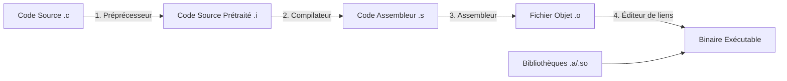
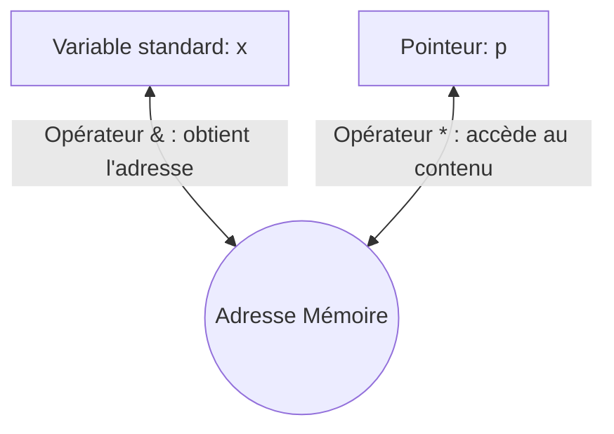

---
title: IN331-Algo - Programmation C et algorithmique
subject: IN331-Algo
type: course
---

:::section id="in331-intro" eyebrow="Semestre 5" title="Programmation en C et algorithmique" summary="Cours de référence sur les bases du langage C, la compilation sous Linux, les structures de données et les méthodes de programmation robustes."

:::dashboard
:::card class="chapter-card" pill="C" title="Socle de compétences" href="#in331-chap1-fondations" link="Commencer"
Autonomie en programmation C sous Linux : écrire, compiler, tester, structurer et déboguer des programmes impératifs.
:::
:::card class="chapter-card" pill="Algo" title="Structures de données" href="#in331-chap5-structures" link="Réviser"
Piles, files, pointeurs, allocation dynamique et listes chaînées pour manipuler des données en mémoire.
:::
:::card class="chapter-card" pill="Make" title="Projet modulaire" href="#in331-chap2-modularite" link="Structurer"
Organisation `.h` / `.c`, compilation séparée et automatisation avec `make`.
:::
:::

:::quicklinks
- [Chapitre 1 : écriture, compilation et exécution](#in331-chap1-fondations)
- [Chapitre 2 : modularité et outil Make](#in331-chap2-modularite)
- [Chapitre 3 : tableaux et paramètres](#in331-chap3-tableaux)
- [Chapitre 4 : entrées/sorties, fichiers et chaînes](#in331-chap4-fichiers-chaines)
- [Chapitre 5 : structures, piles et files](#in331-chap5-structures)
- [Chapitre 6 : pointeurs](#in331-chap6-pointeurs)
- [Chapitre 7 : récursivité et débogage](#in331-chap7-recursivite-debug)
- [Chapitre 8 : allocation dynamique et listes chaînées](#in331-chap8-allocation-listes)
- [Synthèse de révision](#in331-revision)
:::

:::block type="remember" title="Fil directeur"
Le cours suit la progression naturelle d'un programme C : écrire une fonction correcte, compiler proprement, découper en modules, manipuler des collections, puis raisonner explicitement sur la mémoire avec les pointeurs et l'allocation dynamique.
:::

:::
:::section id="in331-chap1-fondations" eyebrow="Chapitre 1" title="Écriture, Compilation et Exécution de Programmes C Simples" summary="Fondements du langage C, types de base, structures de contrôle, fonctions élémentaires et méthodologie de tests."

Ce chapitre aborde la structure minimale d'un programme en C, les types fondamentaux, ainsi que les structures de contrôle (conditions, choix, boucles) indispensables à l'écriture de tout algorithme simple [5, 12, 13].

### 1. Mon premier programme C & Compilation
La structure élémentaire de tout programme C réside dans l'inclusion des bibliothèques de base (préprocesseur) et de la fonction principale `main()` [12].

```c
#include <stdio.h>

int main() {
    printf("Bonjour\n"); /* \n signifie passage à la ligne */
    return 0;
}
```

:::cplayground label="Exercice interactif" title="Modifier un premier programme C"
```c
#include <stdio.h>

int main() {
    printf("Bonjour IN331\n");
    return 0;
}
```
:::

:::grid two-col
:::block type="method" title="Compilation & Exécution"
Pour transformer ce fichier source en un binaire exécutable, nous utilisons le compilateur `gcc` sous UNIX [13] :
1. **Compilation** :
   ```bash
   gcc prog1.c -Wall -o prog1
   ```
   *L'option `-Wall` active tous les avertissements de syntaxe (essentiel pour l'apprentissage).*
2. **Exécution** :
   ```bash
   ./prog1
   ```
:::

:::block type="definition" title="Identificateurs & Commentaires"
- **Identificateurs** : Noms de variables, fonctions, etc. Formés de lettres, chiffres (pas au début) et du caractère `_` (ex: `valeur_1`, `_init`) [14].
- **Commentaires** : Encadrés par `/*` et `*/`. Attention, les commentaires ne s'imbriquent pas [14].
:::
:::

### 2. Types de base et constantes
Le C est un langage statiquement typé. Chaque variable doit avoir un type défini à sa déclaration [14] :

| Famille | Mot-clé C | Description | Exemples de constantes |
| :--- | :--- | :--- | :--- |
| **Caractère** | `char` | Stocke un caractère ou un petit entier (1 octet) [14] | `'a'`, `'\n'` [15] |
| **Entier** | `int`, `short int`, `long int` | Entiers signés ou non (`unsigned`) [14] | `42`, `104L` [15] |
| **Flottant** | `float`, `double`, `long double` | Nombres réels à virgule flottante [14] | `3.14`, `2.6` [15] |

:::block type="remember" title="Définition de constantes"
Pour définir une constante nommée, la directive du préprocesseur `#define` est la plus utilisée car elle ne consomme pas de mémoire (remplacement textuel avant compilation) [15] :
```c
#define PI 3.14159  /* Pas de point-virgule ';' à la fin ! */
```
:::

### 3. Opérateurs d'incrémentation et opérateurs binaires

:::grid two-col
:::block type="warning" title="Post & Pré incrémentation"
Les opérateurs `++` et `--` se comportent différemment selon leur position [22] :
- **Pré-incrémentation (`++j`)** : la valeur est incrémentée *avant* l'évaluation de l'expression.
- **Post-incrémentation (`i++`)** : l'expression conserve la valeur d'origine, l'incrémentation se fait *après* [22].
```c
int i = 0, j = 0;
int a = ++i; /* a vaut 1, i vaut 1 */
int b = j++; /* b vaut 0, j vaut 1 */
```
:::

:::block type="definition" title="Opérateurs Binaires"
Ces opérateurs effectuent des opérations bit à bit (bit-wise) sur les entiers [23] :
- `&` : ET logique bit à bit.
- `|` : OU logique bit à bit.
- `^` : OU exclusif (XOR).
- `~` : Complément à un (inversion).
*Ne pas confondre avec les opérateurs logiques booléens `&&` (ET) et `||` (OU).*
:::
:::

:::cplayground label="Boucle" title="Observer une boucle for simple"
```c
#include <stdio.h>

int main() {
    for (int i = 0; i < 5; i++) {
        printf("%d\n", i);
    }
    return 0;
}
```
:::

### 4. Structures Conditionnelles

:::grid two-col
:::block type="method" title="Structures if...else"
L'instruction conditionnelle requiert des parenthèses obligatoires autour de la condition [16] :
```c
if (x > 0) {
    x = x + 1;
} else {
    x = 1;
}
```
L'affectation en C est une expression qui renvoie une valeur. Ainsi `i = (j = k) + 1;` est valide mais peut prêter à confusion [16].
:::

:::block type="method" title="Le Choix Multiple (switch)"
Pour tester une variable contre plusieurs constantes entières ou caractères, on utilise `switch` [17] :
```c
switch (note_lettre) {
    case 'A': printf("Très bien\n"); break;
    case 'B': printf("Bien\n"); break;
    default: printf("Insuffisant\n");
}
```
*Le `break` est obligatoire sous chaque bloc pour éviter de "glisser" vers les cas suivants.*
:::
:::

:::cplayground label="Condition" title="Tester une condition if...else"
```c
#include <stdio.h>

int main() {
    int note = 14;

    if (note >= 10) {
        printf("Valide\n");
    } else {
        printf("A retravailler\n");
    }

    return 0;
}
```
:::

### 5. Structures Itératives (Boucles)
Le C propose trois types d'itérations [20] :

```c
/* 1. Boucle While : évaluation de la condition AVANT chaque tour */
while (condition) {
    /* instructions */
}

/* 2. Boucle Do...While : exécution d'AU MOINS UN tour, évaluation APRÈS */
do {
    /* instructions */
} while (condition);

/* 3. Boucle For : initialisation, condition de continuité, expression de pas */
for (expression_init; condition_continuite; expression_pas) {
    /* instructions */
}
```

:::block type="remember" title="Règle d'or algorithmique"
Une boucle bien construite **ne doit pas** contenir d'instructions de rupture brutale comme `return`, `break` ou `continue` dans son corps [80]. La sortie de la boucle doit se faire **exclusivement** par l'évaluation de sa condition de continuité [80].
```c
/* MAUVAISE PRATIQUE */
for (i = 0; i < N; i++) {
    if (T[i] == element) return i;
}

/* BONNE PRATIQUE */
for (i = 0; i < N && T[i] != element; i++) {}
return (i < N) ? i : -1;
```
:::

### 6. Fonctions et Procédures (Bases)
Le C ne possède pas de concept de "procédure". Il ne connaît que les **fonctions** [24]. Une procédure est simulée par une fonction renvoyant le type spécial `void` [24].

```c
/* Prototype de la fonction (signature) */
int somme(int i, int j); 

/* Définition de la fonction */
int somme(int i, int j) {
    int res = i + j; /* Variable locale résidant sur la pile d'exécution */
    return res;
}
```

:::cplayground label="Fonction" title="Appeler une fonction simple"
```c
#include <stdio.h>

int main() {
    int a = 7;
    int b = 5;
    int resultat = a + b;

    printf("Somme = %d\n", resultat);
    return 0;
}
```
:::

### 7. Méthodologie de test
Pour chaque programme écrit, il est fondamental de définir un **jeu de tests** complet et de consigner les comportements observés [29, 30] :
- **Cas nominaux** : valeurs standards de fonctionnement.
- **Cas limites (aux bornes)** : tester les valeurs minimales et maximales tolérées par le système.
- **Cas d'erreurs (hors spécifications)** : entrées invalides (ex: diviseur nul, année négative) pour s'assurer de la robustesse du programme [30].

:::

:::section id="in331-chap2-modularite" eyebrow="Chapitre 2" title="Modularité, Compilation Séparée et Outil Make" summary="Le processus de compilation en 4 étapes, la structuration en modules .h/.c et la configuration avancée de Makefile."

Pour des projets conséquents, regrouper l'intégralité du code dans un seul fichier devient ingérable [51]. Ce chapitre aborde le découpage modulaire et l'automatisation de la compilation [6].

### 1. La chaîne de compilation (Les 4 étapes)
Lorsqu'on exécute la commande `gcc`, 4 transformations successives s'opèrent de manière invisible pour créer le fichier exécutable final [31, 32] :



1. **Le Préprocesseur (Preprocessing)** : Analyse les directives commençant par `#`. Il réalise les remplacements textuels des macros (`#define`) et insère textuellement le contenu des fichiers d'en-tête (`#include`) [32].
2. **La Compilation (Compiling)** : Traduit le code C prétraité en langage assembleur, qui décrit précisément les instructions du processeur cible [33]. On peut générer ce fichier via `gcc -S prog.c` (produit un `.s`) [33].
3. **L'Assemblage (Assembling)** : Traduit le langage assembleur en code machine binaire (fichier "objet", extension `.o`) [34]. On peut générer ce fichier via `gcc -c prog.c` [34].
4. **L'Édition de liens (Linking)** : Rassemble les différents fichiers objets (`.o`) et résout les adresses des fonctions externes (comme `printf` provenant des bibliothèques système) pour produire le binaire exécutable final [35, 38, 39].

### 2. Organisation modulaire d'un projet

:::grid two-col
:::block type="definition" title="Architecture Fichiers .h / .c"
Un module est composé de deux fichiers [52] :
- **Fichier d'en-tête (`.h`)** : Contient l'interface publique du module (déclarations de types complexes, prototypes de fonctions, macros) [52]. Il exporte les fonctionnalités utilisables par d'autres modules [53].
- **Fichier d'implémentation (`.c`)** : Contient le code concret des fonctions déclarées dans le `.h` [52].
:::

:::block type="warning" title="Gardes d'inclusion conditionnelle"
Pour éviter qu'un fichier d'en-tête ne soit inclus plusieurs fois lors d'une même compilation (provoquant des erreurs de double déclaration), on encadre systématiquement le contenu de tout fichier `.h` par des gardes [55, 56] :
```c
#ifndef __MONMODULE_H__
#define __MONMODULE_H__

/* Déclarations */
void ma_fonction(void);

#endif /* __MONMODULE_H__ */
```
:::
:::

### 3. L'Outil Make
Make automatise le processus de compilation en ne recompilant que les fichiers sources ayant subi des modifications depuis la dernière compilation, réduisant drastiquement le temps de build [40].

:::block type="method" title="Syntaxe d'une règle Make"
Un fichier `Makefile` (M majuscule obligatoire) réside dans le répertoire racine du projet [41] :
```makefile
cible : dependances
	commandes
```
*⚠️ Attention : La commande de la ligne suivante doit obligatoirement être précédée par une **tabulation** et non par des espaces [44].*
:::

#### Variables automatiques et configuration avancée
Make fournit des variables automatiques extrêmement puissantes pour simplifier l'écriture des règles [47] :

- `$@` : Représente le nom exact de la cible courante [48].
- `$<` : Représente le nom de la première dépendance [48].
- `$^` : Représente la liste de toutes les dépendances de la cible [48].
- `$?` : Représente les dépendances plus récentes que la cible [48].

Voici un exemple de `Makefile` robuste et générique pour un projet découpé en modules [46, 48] :

```makefile
CC = gcc
CFLAGS = -Wall -Wextra -g
BIN = programme_final
OBJECTS = main.o module1.o module2.o

all: $(BIN)

$(BIN): $(OBJECTS)
	$(CC) $(CFLAGS) $^ -o $@

main.o: main.c module1.h module2.h
	$(CC) $(CFLAGS) -c $< -o $@

module1.o: module1.c module1.h
	$(CC) $(CFLAGS) -c $< -o $@

module2.o: module2.c module2.h
	$(CC) $(CFLAGS) -c $< -o $@

clean:
	rm -f $(OBJECTS) $(BIN)
```

:::

:::section id="in331-chap3-tableaux" eyebrow="Chapitre 3" title="Les Tableaux et le Passage de Paramètres" summary="Manipulation de tableaux à une et deux dimensions, passage aux fonctions et gestion des arguments du main."

Un tableau est une suite contiguë d'éléments de même type stockés en mémoire [123].

### 1. Tableaux à une dimension (1D)
La déclaration d'un tableau spécifie son type, son nom et son nombre d'éléments [67, 68] :

```c
#define TAILLE 12
float precipitations[TAILLE]; /* Réserve en mémoire TAILLE * sizeof(float) octets consécutifs [123] */
```

:::grid two-col
:::block type="warning" title="Limites des indices"
En C, l'indice d'un tableau de taille `n` commence **obligatoirement à 0** et se termine à **`n - 1`** [69].
- Accéder à `T[n]` provoque un comportement indéterminé (corruption mémoire, plantage ou débordement) car le compilateur C ne réalise aucune vérification de débordement aux limites à l'exécution.
:::

:::block type="method" title="Initialisation au vol"
Il est possible d'initialiser un tableau au moment de sa déclaration [71] :
```c
float precipitations[3] = {66.0, 72.6, 82.8};
/* Si on omet la dimension, le compilateur la calcule automatiquement */
float precipitations[] = {66.0, 72.6, 82.8}; /* Taille 3 */
```
:::
:::

:::cplayground label="Tableau" title="Parcourir un tableau avec une boucle"
```c
#include <stdio.h>

int main() {
    int somme = 0;

    for (int i = 0; i < 4; i++) {
        somme = somme + i;
        printf("i=%d\n", i);
    }

    printf("Somme des indices = %d\n", somme);
    return 0;
}
```
:::

### 2. Passage de tableaux dans les fonctions
En langage C, **le nom d'un tableau désigne un pointeur** constant contenant l'adresse du tout premier élément du tableau (`&T[0]`) [69].

:::block type="theorem" title="Équivalence Tableau / Pointeur"
Lorsqu'on passe un tableau à une fonction, on lui transmet en réalité l'adresse de son premier élément [69]. Par conséquent, **la fonction travaille directement sur le tableau d'origine** (passage par adresse implicite) [132]. Tout changement dans la fonction altère le tableau de l'appelant.

De plus, la fonction n'a aucun moyen de connaître la taille du tableau reçue, elle doit donc obligatoirement la recevoir dans un paramètre supplémentaire [70] :
```c
void afficherTableau(float T[], int n) {
    for (int i = 0; i < n; i++) {
        printf("%6.2f ", T[i]);
    }
}
```
:::

### 3. Arguments de la ligne de commande (argc, argv)
La fonction principale `main` peut recevoir des paramètres directement saisis par l'utilisateur dans le terminal lors du lancement [81, 82] :

```c
int main(int argc, char *argv[])
```

- `argc` (*argument count*) : Nombre entier positif représentant le nombre de paramètres saisis (incluant le nom de l'exécutable) [82].
- `argv` (*argument vector*) : Tableau de chaînes de caractères (`char*`) contenant les arguments [82]. `argv[0]` est toujours le nom ou chemin de l'exécutable [82].

:::block type="method" title="Exemple d'utilisation"
Si on exécute `./monProg 42 test`, `argc` vaudra 3 et :
- `argv[0]` = `"./monProg"` [83]
- `argv[1]` = `"42"` [83]
- `argv[2]` = `"test"` [83]
:::

### 4. Tableaux à deux dimensions (Matrices)
Une matrice est déclarée en spécifiant les dimensions des lignes et colonnes [85] :

```c
int T[3][4]; /* 3 lignes, 4 colonnes */
```

:::grid two-col
:::block type="definition" title="Représentation en mémoire"
En C, les tableaux multidimensionnels sont stockés de façon **linéaire**, ligne par ligne (row-major order) :
`T[0][0], T[0][1] ... T[0][3], T[1][0] ... T[2][3]`.
:::

:::block type="method" title="Passage aux fonctions"
Pour passer une matrice à une fonction, le compilateur doit connaître la taille de la seconde dimension (les colonnes) pour calculer correctement les décalages mémoire. Il faut donc la figer dans le prototype [87] :
```c
void afficherMatrice(int T[][4], int nbLignes) {
    for (int i = 0; i < nbLignes; i++) {
        for (int j = 0; j < 4; j++) {
            printf("%d ", T[i][j]);
        }
        printf("\n");
    }
}
```
:::
:::

:::

:::section id="in331-chap4-fichiers-chaines" eyebrow="Chapitre 4" title="Entrées/Sorties, Fichiers & Chaînes de Caractères" summary="Gestion des flux standard, manipulation sécurisée de chaînes de caractères et persistance des données sur fichier."

Les entrées-sorties permettent l'interaction avec l'utilisateur et les supports de stockage externe [91].

### 1. Les Flux Standards (stdio.h)
Le C gère les interactions d'entrée/sortie via des **flux** (channels) d'octets [91]. Trois flux standard sont automatiquement ouverts au démarrage du programme [92] :
- `stdin` : Entrée standard (généralement le clavier) [92].
- `stdout` : Sortie standard (généralement le terminal) [92].
- `stderr` : Sortie d'erreur (flux non bufférisé, dédié aux rapports d'erreurs) [92].

```c
int printf(const char * format, ...); /* Écrit sur stdout [92, 93] */
int scanf(const char * format, ...);  /* Lit depuis stdin [92, 93] */
```

:::cplayground label="Diagnostic" title="Repérer l'erreur classique avec scanf"
```c
#include <stdio.h>

int main() {
    int age;
    scanf("%d", age);
    printf("Age = %d\n", age);
    return 0;
}
```
:::

### 2. Les Chaînes de Caractères
En langage C, **une chaîne de caractères n'est pas un type primitif** [94]. C'est un simple tableau de caractères (`char[]`) qui obéit à une convention fondamentale [94] :

:::block type="definition" title="Le Caractère Nul '\\0'"
Une chaîne de caractères valide se termine obligatoirement par le caractère spécial **`'\0'`** (caractère de valeur ASCII 0) [94]. C'est ce marqueur qui indique aux fonctions de manipulation où s'arrête la chaîne en mémoire [94].
:::

:::grid two-col
:::block type="warning" title="Allocation & Taille"
Un tableau de taille `TAILLE` ne peut stocker qu'une chaîne de longueur maximale de **`TAILLE - 1`** caractères, car une case doit être réservée pour le `'\0'` final [95].
```c
char chaine[8] = "bonjour";
/* En mémoire :
   | b | o | n | j | o | u | r | \0 |
   L'initialisation automatique ajoute le \0 [96]
*/
```
:::

:::block type="remember" title="Fonctions de <string.h>"
La bibliothèque standard fournit des outils incontournables [97] :
- `strlen(s)` : Renvoie le nombre de caractères (excluant le `\0`) [97].
- `strcpy(dest, src)` : Copie `src` dans `dest` (attention aux débordements !) [97].
- `strcmp(s1, s2)` : Compare s1 et s2 alphabétiquement (renvoie 0 si égalité) [97, 103].
:::
:::

### 3. Manipulation des fichiers
La persistance de données passe par l'utilisation de fichiers représentés par des structures de type `FILE *` [106].

:::block type="method" title="Protocole de manipulation"
La manipulation d'un fichier suit rigoureusement 3 étapes [106, 109, 110, 111] :
1. **Ouverture** via `fopen()` : retourne un descripteur de flux [106].
2. **Traitement** en lecture (`fscanf`, `fgetc`) ou écriture (`fprintf`, `fputc`) [110, 111].
3. **Fermeture** obligatoire via `fclose()` pour vider les tampons d'écriture et libérer les ressources système [109].
:::

```c
#include <stdio.h>
#include <stdlib.h>

int main() {
    FILE *fic = fopen("donnees.txt", "r"); /* Mode lecture seule [107, 108] */
    if (fic == NULL) {
        perror("Erreur lors de l'ouverture du fichier"); /* [112] */
        exit(1);
    }
    
    int val;
    /* Lecture formatée jusqu'à la fin de fichier */
    while (fscanf(fic, "%d", &val) == 1) {
        printf("Valeur lue : %d\n", val);
    }
    
    fclose(fic); /* Fermeture */
    return 0;
}
```

:::block type="warning" title="Le piège de feof()"
La fonction `feof(FILE *fic)` ne permet pas de prédire la fin du fichier [112]. Elle ne renvoie vrai **qu'après** qu'une opération de lecture a échoué en tentant de lire au-delà du dernier octet disponible [112]. Évitez d'écrire `while (!feof(fic))` car la dernière valeur lue risque d'être traitée deux fois par accident si la lecture finale échoue. Préférez tester la valeur de retour de la fonction de lecture elle-même (`fscanf` ou `fgets`).
:::

:::

:::section id="in331-chap5-structures" eyebrow="Chapitre 5" title="Structures de Données Complexes et Structures Linéaires" summary="Définition de types personnalisés avec struct, encapsulation modulaire et structures de type Pile / File."

Les structures permettent de regrouper sous un même identificateur plusieurs variables de types potentiellement différents (champs ou membres) [9, 116].

### 1. Les Structures de Données (`struct`)
Pour éviter de manipuler des variables éparses, on crée un enregistrement structuré [116] :

```c
/* Déclaration d'un type structuré représentant une fraction */
typedef struct {
    int num; /* Numérateur */
    int den; /* Dénominateur */
} Fraction; /* 'Fraction' devient un type à part entière grâce à typedef [117] */
```

:::grid two-col
:::block type="method" title="Déclaration et accès"
On accède aux champs d'une instance de structure à l'aide de l'opérateur **point `.`** [118] :
```c
Fraction f1;
f1.num = 3;
f1.den = 4;
printf("Fraction : %d/%d\n", f1.num, f1.den);
```
:::

:::block type="remember" title="Passage par valeur"
En C, le passage d'une structure en paramètre d'une fonction se fait par **valeur**. Toute la structure est recopiée sur la pile d'exécution. Si la structure est volumineuse (ex: un tableau de termes pour un polynôme), cela est inefficace. On préfère passer son **adresse** via un pointeur (voir Chapitre 6).
:::
:::

### 2. Notion de structures de données linéaires (Pile / File)
Les Piles (Stack, structure LIFO - *Last In First Out*) et Files (Queue, structure FIFO - *First In First Out*) sont fondamentales pour la structuration d'algorithmes complexes [120] :

:::grid two-col
:::block type="definition" title="La Pile (LIFO)"
Les insertions (empilement) et retraits (dépilement) se font d'un seul côté, appelé le **sommet** de la pile [120].
- Exemple d'utilisation : Évaluation d'expressions post-fixes (Notation Polonaise Inversée) où l'on empile les opérandes et dépile lors de la rencontre d'un opérateur [120].
:::

:::block type="definition" title="La File (FIFO)"
Les insertions se font d'un côté (queue) et les suppressions de l'autre (tête) [120].
- Exemple classique : Gestion de files d'attente d'impression ou paquets réseau.
:::
:::

:::

:::section id="in331-chap6-pointeurs" eyebrow="Chapitre 6" title="Les Pointeurs et la Gestion d'Adresses (Deep-Dive)" summary="Analyse approfondie de la mémoire, opérateurs d'adresses et d'indirection, arithmétique fine des pointeurs et passage par adresse."

Les pointeurs représentent l'un des concepts les plus puissants et les plus redoutés du langage C [10]. Maîtriser les pointeurs est le palier fondamental pour devenir un développeur C autonome [1, 2].

### 1. Concepts fondamentaux : Mémoire, Adresses et Pointeurs
La mémoire vive (RAM) d'un ordinateur peut être modélisée comme un gigantesque tableau d'octets consécutifs [124]. Chaque octet possède un numéro unique qui l'identifie : son **adresse mémoire** (un nombre entier, généralement représenté en hexadécimal) [124].

:::block type="definition" title="Qu'est-ce qu'un Pointeur ?"
Un **pointeur** est une variable ordinaire, à un détail près : la valeur qu'il stocke n'est pas une donnée brute (comme un entier ou un caractère), mais l'**adresse mémoire** d'une autre variable [124].
- On dit alors que le pointeur "pointe vers" cette variable [125].
:::

### 2. Déclaration et Opérateurs Clés (`&` et `*`)
Pour manipuler des pointeurs, on utilise deux opérateurs spécifiques [126, 127] :



- **`&` (Opérateur d'adresse)** : Permet de récupérer l'adresse mémoire d'une variable [126].
- **`*` (Opérateur d'indirection ou de déréférencement)** : Placé devant un pointeur, il permet d'accéder (en lecture ou en écriture) au contenu de la case mémoire dont le pointeur détient l'adresse [127].

:::grid two-col
:::block type="definition" title="Syntaxe de déclaration"
On déclare un pointeur en insérant un caractère `*` entre son type de destination et son identificateur [125] :
```c
int x = 5;    /* Entier classique */
int *p = NULL; /* Pointeur vers un entier */
/* p contient l'adresse spéciale NULL par sécurité */
```
*⚠️ NULL indique par convention qu'un pointeur ne pointe sur aucune zone mémoire valide [127]. Tenter de déréférencer un pointeur NULL provoque un plantage immédiat (Segmentation Fault).*
:::

:::block type="method" title="Liaison adresse-pointeur"
```c
p = &x; /* p contient désormais l'adresse de x [127] */
*p = 12; /* Le contenu à l'adresse stockée dans p devient 12.
            Par conséquent, x vaut désormais 12 ! */
```
:::
:::

#### Représentation Mémoire Interactive (Schéma Applicatif)
Supposons que la variable `x` (de type `int`, occupant 4 octets) réside en mémoire à l'adresse **`0x3000`** et qu'un pointeur `p` réside à l'adresse **`0x30A8`** :

| Adresse | Variable | Contenu en mémoire | Description |
| :---: | :---: | :---: | :--- |
| **`0x3000`** | `x` | `12` | Valeur entière stockée par `x` [127, 128] |
| ... | | | |
| **`0x30A8`** | `p` | `0x3000` | Valeur du pointeur `p` (adresse de `x`) [127, 128] |

### 3. Arithmétique des Pointeurs
L'arithmétique des pointeurs permet d'effectuer des opérations d'addition ou de soustraction sur les pointeurs pour se déplacer de façon contiguë en mémoire [128].

:::block type="warning" title="La règle de mise à l'échelle automatique (Scaling)"
Quand on ajoute un entier `n` à un pointeur `p`, l'adresse finale n'est **pas** incrémentée de `n` octets. Le compilateur multiplie automatiquement `n` par la **taille du type de destination** (la taille de l'objet pointé) [129] :
$$\text{Nouvelle Adresse} = \text{Adresse Initiale} + (n \times \text{sizeof}(TYPE))$$
:::

```c
int T[5] = {10, 20, 30, 40, 50};
int *p = T; /* p pointe sur T[0] (adresse de départ, ex: 0x1000) */

/* p + 1 calcule : 0x1000 + 1 * sizeof(int) = 0x1000 + 4 octets = 0x1004 */
int *q = p + 1; /* q pointe sur T[1] */
printf("Valeur : %d\n", *q); /* Affiche 20 */
```

#### Équivalence stricte entre Tableaux et Pointeurs
En raison de cette arithmétique, l'accès à un élément via l'opérateur crochet `[]` n'est qu'un "sucre syntaxique" masquant une opération de déréférencement d'un pointeur [129] :
$$\mathbf{T[i]} \equiv \mathbf{*(T + i)}$$
$$\mathbf{p[i]} \equiv \mathbf{*(p + i)}$$

:::block type="remember" title="Preuve d'équivalence"
Si vous déclarez `int T[50]` et un pointeur `int *i = T;` [130], les syntaxes suivantes ciblent exactement la même donnée mémoire [130] :
- `T[4]`
- `i[4]`
- `*(T + 4)`
- `*(i + 4)`
:::

### 4. Le passage de paramètres par adresse
En langage C, **tous les passages de paramètres se font rigoureusement par valeur** (par copie) [132]. La fonction appelée reçoit une copie locale de la valeur des variables transmises, l'empêchant de modifier les variables d'origine situées dans la pile de la fonction appelante [132].

:::block type="method" title="Simuler le passage par référence"
Pour qu'une fonction puisse modifier une variable d'un autre contexte (comme le fait implicitement la fonction `scanf`), on doit lui passer **l'adresse** de cette variable [132, 133]. Le paramètre formel de la fonction devient alors un pointeur [132] :
```c
/* Version incorrecte (passage par valeur) */
void swap_incorrect(int a, int b) {
    int temp = a;
    a = b;
    b = temp;
} /* Les modifications sont perdues à la sortie */

/* Version correcte (passage par adresse) */
void swap_correct(int *p1, int *p2) {
    int temp = *p1;
    *p1 = *p2;
    *p2 = temp;
}
```
Dans `main()`, on appelle cette fonction en fournissant les adresses des variables [132] :
```c
int x = 5, y = 10;
swap_correct(&x, &y); /* x devient 10, y devient 5 */
```
:::

:::cplayground label="Pointeurs" title="Adresse ou valeur pointée ?"
```c
#include <stdio.h>

int main() {
    int x = 5;
    int *p = &x;

    x = 12;
    printf("x = %d\n", x);

    return 0;
}
```
:::

### 5. Pointers to Pointers (Double pointeurs)
Puisqu'un pointeur est lui-même une variable résidant en mémoire à une adresse donnée, il est parfaitement possible de stocker cette adresse dans un autre pointeur. On obtient alors un **pointeur de pointeur** (double pointeur) :

```c
int x = 42;
int *p = &x;   /* p contient l'adresse de x */
int **pp = &p; /* pp contient l'adresse de p */
```

- `*pp` donne `p` (l'adresse de `x`).
- `**pp` donne `x` (la valeur `42`).

*Ce concept de double pointeur est capital lorsque l'on souhaite qu'une fonction puisse allouer de la mémoire ou modifier l'adresse de départ d'un pointeur d'origine (comme la tête d'une liste chaînée) [150].*

:::

:::section id="in331-chap7-recursivite-debug" eyebrow="Chapitre 7" title="Récursivité & Débogage" summary="Utilisation de débogueurs pour observer la pile d'exécution et écriture de fonctions récursives."

Le comportement de la mémoire et les appels de fonctions récursifs peuvent être visualisés précisément grâce à des débogueurs [10, 135].

### 1. Débogage d'un programme (gdb / ddd)
Le débogueur permet de suspendre l'exécution d'un programme à des endroits précis (**breakpoints**) et d'exécuter le code instruction par instruction pour analyser l'état de la mémoire et déceler les bugs [135, 136].

:::block type="method" title="Compilation pour débogage"
Pour que le débogueur puisse faire le lien avec votre fichier source original, le code binaire doit intégrer une table des symboles. Cela s'effectue en passant l'option **`-g`** au compilateur [135] :
```bash
gcc -g prog.c -o prog
```
:::

#### Commandes fondamentales du débogueur (gdb)
- `break <nom_fonction_ou_ligne>` : Définit un point d'arrêt où le programme se mettra en pause [136].
- `run` (ou `r`) : Démarre l'exécution jusqu'au premier breakpoint [136].
- `next` (ou `n`) : Exécute l'instruction courante et passe à la ligne suivante (sans entrer dans les appels de fonctions) [136].
- `step` (ou `s`) : Similaire à next, mais si l'instruction courante est un appel de fonction, le débogueur **entre** dans cette fonction pour l'analyser pas à pas [137].
- `print <var>` (ou `p`) : Affiche la valeur instantanée de la variable [137].
- `display <var>` : Demande d'afficher la variable à chaque pas d'exécution [137].

### 2. Programmation Récursive
Une fonction est dite **récursive** lorsqu'elle s'appelle elle-même au cours de son exécution [138].

:::block type="warning" title="La règle fondamentale de la récursion"
Toute fonction récursive doit obligatoirement définir au moins un **cas de base** (condition d'arrêt) ne nécessitant aucun appel récursif [138]. Sans cela, la fonction s'appelle indéfiniment jusqu'à saturer l'espace de la pile système dédiée aux appels de fonctions, provoquant un plantage par **débordement de pile** (Stack Overflow) [143].
:::

:::grid two-col
:::block type="theorem" title="Exemple du calcul du PGCD"
Définition mathématique du PGCD récursif [26] :
- $pgcd(a, 0) = a$ (Cas de base) [26].
- $pgcd(a, b) = pgcd(b, a \pmod b)$ (Cas récursif) [26].

```c
int pgcd(int a, int b) {
    if (b == 0) {
        return a; /* Cas de base */
    }
    return pgcd(b, a % b); /* Cas récursif */
}
```
:::

:::block type="warning" title="Limites de la Récursivité"
Chaque appel de fonction empile un bloc d'activation (variables locales, paramètres, adresse de retour) sur la pile d'exécution [143]. Si la récursion est trop profonde, la mémoire de la pile sature [143]. De plus, certains algorithmes écrits récursivement sans précaution provoquent des calculs redondants catastrophiques (ex: Fibonacci naïf de complexité exponentielle $O(2^n)$) [139, 143]. Tout programme récursif peut être traduit de manière itérative (boucles) pour être plus efficace en mémoire [143].
:::
:::

:::cplayground label="Récursivité" title="Calculer un PGCD avec une fonction récursive"
```c
#include <stdio.h>

int pgcd(int a, int b) {
    if (b == 0) {
        return a;
    }

    return pgcd(b, a % b);
}

int main() {
    int a = 48;
    int b = 18;
    int resultat = pgcd(a, b);

    printf("pgcd(%d, %d) = %d\n", a, b, resultat);
    return 0;
}
```
:::

:::

:::section id="in331-chap8-allocation-listes" eyebrow="Chapitre 8" title="Allocation Dynamique de Mémoire & Listes Chaînées" summary="Gestion du tas mémoire, prévention des fuites mémoires et implémentation complète de listes chaînées."

L'allocation dynamique permet de réserver de la mémoire pendant l'exécution du programme, s'adaptant ainsi au volume exact de données à traiter [144, 148].

### 1. Pile mémoire (Stack) vs Tas mémoire (Heap)

:::grid two-col
:::block type="definition" title="La Pile (Stack)"
Zone mémoire gérée automatiquement par le système. Elle héberge les variables locales des fonctions. La mémoire est allouée à l'entrée de la fonction et automatiquement détruite dès que la fonction se termine. Sa taille est limitée.
:::

:::block type="definition" title="Le Tas (Heap)"
Zone mémoire de grande taille gérée manuellement par le programmeur. C'est ici que s'effectue l'allocation dynamique [144]. La mémoire y reste allouée tant que le développeur ne demande pas explicitement sa libération [144].
:::
:::

### 2. Les fonctions de base (`malloc` & `free`)
Ces fonctions résident dans la bibliothèque standard `<stdlib.h>` [50, 144].

```c
void * malloc(size_t taille_octets);
```
- Réserve une zone contiguë de la taille spécifiée dans le tas [149] et renvoie un pointeur générique (`void *`) vers son premier octet [149].
- Si le système n'a plus assez de mémoire, `malloc` échoue et renvoie `NULL` [106, 149].

```c
void free(void *pointeur);
```
- Libère la zone mémoire préalablement allouée à l'adresse indiquée [144].

:::block type="warning" title="Règles de sécurité absolue"
1. **Tester le retour de malloc** : Toujours vérifier si le pointeur obtenu n'est pas `NULL` avant de s'en servir [149].
2. **Éviter les fuites mémoire (Memory Leaks)** : Tout bloc mémoire réservé par `malloc` doit être impérativement libéré par `free` une fois son usage terminé.
3. **Éviter les pointeurs suspendus (Dangling Pointers)** : Après avoir libéré un pointeur, affectez-lui la valeur `NULL` pour éviter de le réutiliser ou de le libérer une seconde fois par accident.
:::

```c
int *T = (int *) malloc(10 * sizeof(int)); /* Alloue un tableau dynamique de 10 entiers */
if (T == NULL) {
    perror("Échec d'allocation dynamique");
    exit(1);
}
/* Traitement */
T[0] = 42;

free(T); /* Libération obligatoire de la mémoire */
T = NULL; /* Sécurisation du pointeur */
```

:::cplayground label="Allocation" title="Tester les bons réflexes avec malloc"
```c
#include <stdio.h>
#include <stdlib.h>

int main() {
    int *notes = (int *) malloc(3 * sizeof(int));

    if (notes == NULL) {
        printf("Allocation impossible\n");
        return 1;
    }

    printf("Allocation reussie\n");
    free(notes);
    notes = NULL;

    return 0;
}
```
:::

### 3. Listes Chaînées
Une liste chaînée est une structure de données linéaire où chaque élément (un "nœud") est alloué dynamiquement et détient l'adresse de l'élément suivant [148].

:::block type="definition" title="Structure d'un nœud en C"
```c
typedef struct element element;
struct element {
    int valeur;       /* Donnée stockée */
    element *suivant; /* Pointeur vers l'élément successeur [148] */
};
typedef element* liste; /* Une liste est caractérisée par l'adresse de son premier élément (tête) [148, 149] */
```
:::

#### Opérations classiques sur une Liste Chaînée
Voici les fonctions complètes pour la gestion d'une liste chaînée triée, intégrant les explications indispensables sur les pointeurs.

```c
#include <stdio.h>
#include <stdlib.h>

typedef struct element element;
struct element {
    int valeur;
    element *suivant;
};
typedef element* liste;

/* 1. Afficher tous les éléments de la liste dans l'ordre */
void afficherListe(liste l) {
    liste courant = l;
    while (courant != NULL) {
        printf("%d -> ", courant->valeur); /* Opérateur -> pour accéder à travers un pointeur [149] */
        courant = courant->suivant;
    }
    printf("NULL\n");
}
```

:::block type="warning" title="Pourquoi utiliser un pointeur de pointeur (liste *l) ?"
Pour l'insertion et la suppression, le prototype des fonctions de gestion de liste utilise `liste *l` (qui équivaut en réalité au type `element **l`, c'est-à-dire un double pointeur ou pointeur sur l'adresse de tête de liste) [150] :
- En C, tout paramètre est transmis par copie [132]. Si on passait un simple pointeur `liste l` (`element* l`), la fonction recevrait une copie de l'adresse de tête.
- Si l'insertion s'effectue au tout début (nouvelle tête), la fonction doit modifier l'adresse stockée dans le pointeur d'origine du `main()`.
- Modifier une simple copie locale n'aurait aucune répercussion sur le pointeur du `main()`. C'est pourquoi nous devons passer **l'adresse du pointeur** (`&L` de type `element**`) pour pouvoir modifier directement sa valeur à distance [150] !
:::

```c
/* 2. Insérer une valeur en maintenant la liste triée */
void insererElement(int x, liste *l) {
    /* l est de type element** (adresse du pointeur de tête) */
    element *nouveau = (element *) malloc(sizeof(element)); /* [149] */
    if (nouveau == NULL) {
        perror("Allocation échouée");
        exit(1);
    }
    nouveau->valeur = x;
    nouveau->suivant = NULL;

    /* Recherche de la position d'insertion avec deux pointeurs */
    element *courant = *l; /* Déréférencement pour obtenir le pointeur de tête d'origine */
    element *precedent = NULL;

    while (courant != NULL && courant->valeur < x) {
        precedent = courant;
        courant = courant->suivant;
    }

    if (precedent == NULL) {
        /* Insertion en tête de liste : modifie le pointeur d'origine */
        nouveau->suivant = *l;
        *l = nouveau; /* L'adresse d'origine est mise à jour avec le nouveau nœud */
    } else {
        /* Insertion au milieu ou en fin de liste */
        nouveau->suivant = courant;
        precedent->suivant = nouveau;
    }
}

/* 3. Supprimer le i-ème élément de la liste */
void supprimerElement(int i, liste *l) {
    if (*l == NULL) return; /* Liste vide */

    element *courant = *l;
    element *precedent = NULL;
    int index = 0;

    /* Parcours jusqu'au i-ème élément */
    while (courant != NULL && index < i) {
        precedent = courant;
        courant = courant->suivant;
        index++;
    }

    if (courant != NULL) {
        if (precedent == NULL) {
            /* Suppression en tête : la tête devient l'élément suivant */
            *l = courant->suivant;
        } else {
            /* Suppression au milieu ou en fin */
            precedent->suivant = courant->suivant;
        }
        free(courant); /* Libération de la mémoire occupée par l'élément supprimé */
    }
}
```

:::
:::section id="in331-revision" eyebrow="Révision" title="Synthèse opérationnelle" summary="Les points à maîtriser avant un contrôle ou un TP noté."

:::cplayground label="À corriger" title="S'entraîner à lire les diagnostics"
```c
#include <stdio.h>

int main() {
    int x = 3
    printf("x = %d\n", x);
    return 0;
}
```
:::

:::grid two-col
:::block type="remember" title="Réflexes de programmation C"
- Compiler avec `gcc -Wall -Wextra -g` pendant le développement.
- Initialiser les variables et les pointeurs avant utilisation.
- Vérifier les bornes des tableaux : un tableau de taille `n` s'indice de `0` à `n - 1`.
- Tester les retours de fonctions sensibles : `fopen`, `fscanf`, `malloc`.
- Libérer chaque bloc obtenu par allocation dynamique avec `free`.
:::

:::block type="method" title="Questions de validation"
- La fonction modifie-t-elle une donnée de l'appelant ? Si oui, passer son adresse.
- Le module expose-t-il seulement ce qui est nécessaire dans le `.h` ?
- La boucle possède-t-elle une condition de continuité claire ?
- Le cas de base d'une fonction récursive est-il atteint à coup sûr ?
- Une liste chaînée peut-elle changer de tête ? Si oui, transmettre un pointeur sur la tête.
:::
:::

:::
