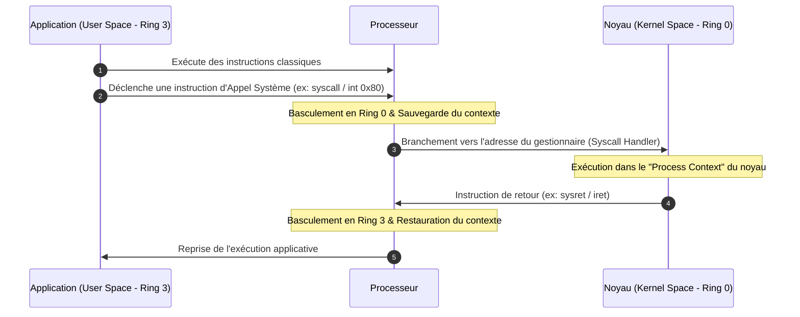
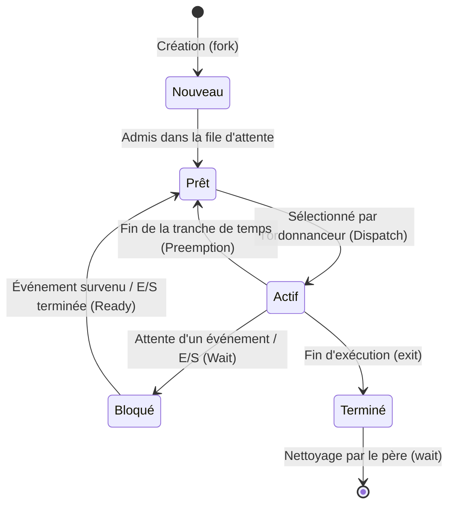
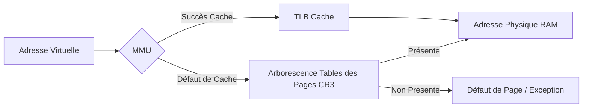
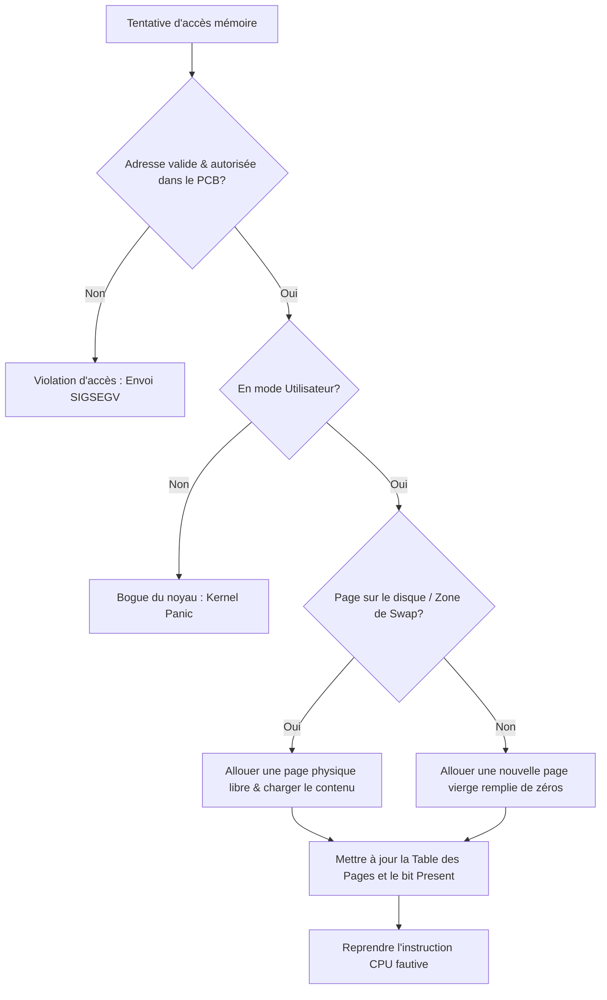
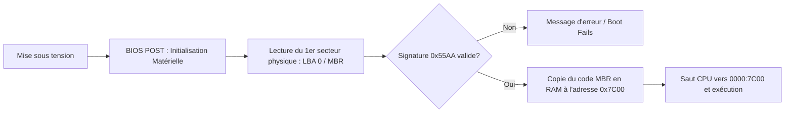
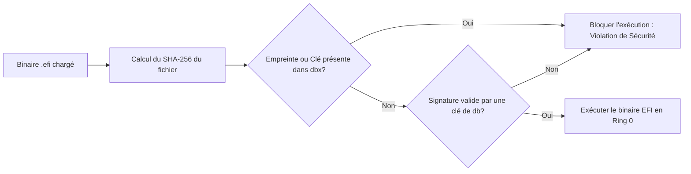
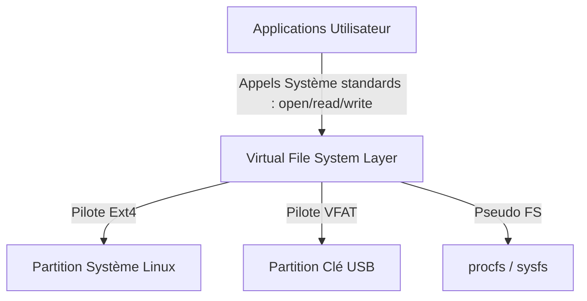
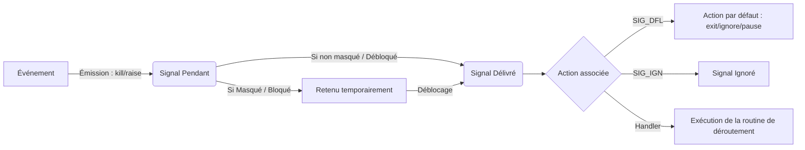
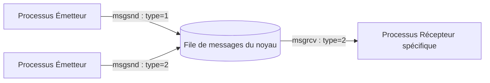
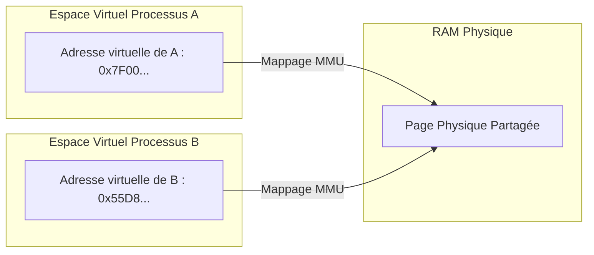

:::section id="in333-intro" eyebrow="Semestre 5" title="IN333 — Systèmes d'exploitation" summary="Comprendre comment le noyau arbitre le processeur, la mémoire, le stockage et les communications entre processus."

:::quicklinks
- [Architecture & CPU](#chap-1-architecture)
- [Gestion des Processus](#chap-2-processus)
- [Mémoire Virtuelle](#chap-3-memoire)
- [Boot, MBR, UEFI, Secure Boot](#chap-4-boot)
- [Systèmes de Fichiers](#chap-5-fs)
- [Signaux UNIX](#chap-6-signaux)
- [IPC System V](#chap-7-ipc)
- [Fiche de révision](#in333-revision)
:::

:::grid two-col
:::block type="remember" title="Fil directeur"
Un système d'exploitation est à la fois un **gestionnaire de ressources** et une **couche d'abstraction**. Pour chaque mécanisme, il faut savoir identifier la ressource protégée, la structure maintenue par le noyau, l'appel système utilisé et les changements de contexte provoqués.
:::

:::block type="method" title="Méthode de lecture du cours"
1. Partir de l'événement vu par le programme utilisateur.
2. Repérer la transition vers le noyau.
3. Suivre les structures modifiées : PCB, tables de pages, VFS ou objets IPC.
4. Identifier les coûts : commutation, copie, défaut de page ou accès au stockage.
:::
:::
:::

:::section id="chap-1-architecture" eyebrow="Chapitre 1" title="Architecture des Systèmes d'Exploitation et Modes d'Exécution" summary="Ce chapitre explore les fondations matérielles des systèmes d'exploitation, l'isolation par les anneaux de protection du CPU, et la gestion des événements asynchrones et synchrones."

Un système d'exploitation moderne a pour rôle d'abstraire le matériel physique afin d'offrir une interface homogène et sécurisée aux applications applicatives. Pour garantir la stabilité globale de la plateforme, le processeur physique et le noyau collaborent étroitement via des restrictions d'exécution strictes.

### 1. Les Modes d'Exécution du Processeur (Privilege Rings)

Pour empêcher une application utilisateur de corrompre l'intégrité du système (en accédant directement à la mémoire d'autres processus ou à des périphériques d'E/S critiques), les architectures matérielles modernes implémentent des niveaux de privilège appelés **Protection Rings**.

:::grid two-col
:::block type="definition" title="Mode Utilisateur (User Mode - Ring 3)"
Le processeur s'exécute avec les privilèges les plus bas. L'accès direct aux instructions matérielles critiques (par exemple, la désactivation des interruptions) et aux zones mémoire protégées (espace noyau) est strictement interdit par le matériel. Si une application Ring 3 tente d'outrepasser ces droits, une exception matérielle est immédiatement levée.
:::

:::block type="definition" title="Mode Noyau (Kernel/Supervisor Mode - Ring 0)"
Le processeur s'exécute avec les privilèges maximaux (Ring 0 sur x86). Le noyau a un accès total et non restreint à toutes les instructions de l'unité centrale, aux registres de contrôle (tels que CR3 sur x86), et à la totalité de la mémoire physique.
:::
:::

#### Mécanisme de Transition (Appel Système)

Les applications s'exécutent par défaut en mode utilisateur. Lorsqu'elles ont besoin d'accéder à un service matériel (lecture de fichier, envoi réseau, etc.), elles doivent solliciter le noyau via un **appel système (syscall)**. Cette opération bascule le processeur en Ring 0 de manière contrôlée. Le noyau vérifie la légitimité de l'appelant, exécute l'action demandée pour le compte du processus, puis réactive le Ring 3 avant de rendre la main.



### 2. Interruptions Matérielles vs Exceptions

Le flux d'exécution standard du processeur peut être dérouté par deux types d'événements distincts :

| Caractéristique | Interruption Matérielle (Hardware Interrupt) | Exception / Anomalie (Software Trap/Exception) |
| :--- | :--- | :--- |
| **Origine** | Matérielle (externe au processeur) | Interne (déclenchée par l'instruction en cours) |
| **Synchronisme** | **Asynchrone** (peut survenir à tout instant) | **Synchrone** (reproductible sur la même instruction) |
| **Exemples** | Timer système (tick), pression de touche clavier, réception réseau, contrôleur disque | Division par zéro, défaut de page, instruction invalide, accès mémoire hors-limite |
| **Traitement** | Handler d'interruption référencé par l'IDT | Handler d'exception ou envoi d'un signal au processus |

### 3. Contexte de Processus (Process Context) vs Contexte d'Interruption (Interrupt Context)

Le noyau s'exécute dans l'un de ces deux contextes exclusifs, ce qui détermine ses capacités opératoires :

:::grid two-col
:::block type="remember" title="Process Context (Contexte Processus)"
- **Définition** : Le noyau s'exécute pour le compte d'une application utilisateur (par exemple, lors du traitement d'un appel système).
- **Propriétés** : Le noyau a accès à l'espace mémoire virtuelle du processus appelant. **L'exécution peut s'endormir ou être bloquée** (en attente d'une E/S disque ou réseau) car le planificateur (scheduler) pourra facilement commuter vers un autre processus et réveiller celui-ci plus tard.
:::

:::block type="warning" title="Interrupt Context (Contexte Interruption)"
- **Définition** : Le noyau traite une interruption matérielle asynchrone.
- **Propriétés** : Ce code n'est associé à **aucun processus utilisateur**. **Il est formellement interdit de s'endormir, de bloquer ou d'appeler des fonctions susceptibles d'être bloquantes** (comme l'allocation de mémoire bloquante ou l'attente d'une ressource). Bloquer ici gèlerait l'ensemble du processeur. Le traitement doit être ultra-rapide.
:::
:::

#### Traitement des Interruptions en deux parties (Top Half / Bottom Half)

Comme le traitement d'une interruption doit être le plus court possible pour ne pas rater d'autres événements, le noyau Linux scinde le travail en deux :
1. **Top Half (Moitié supérieure)** : Exécutée immédiatement en *Interrupt Context*. Elle effectue le strict minimum : acquitter l'interruption auprès du contrôleur matériel, copier les données brutes dans un tampon temporaire et planifier la seconde partie.
2. **Bottom Half (Moitié inférieure)** : Exécutée de manière asynchrone un peu plus tard. Elle traite les données accumulées (par exemple, décoder les paquets réseau). Sous Linux, cette tâche est gérée par des fils d'exécution spécifiques du noyau (comme le thread `ksoftirqd`).

:::

:::section id="chap-2-processus" eyebrow="Chapitre 2" title="Gestion et Ordonnancement des Processus" summary="Modélisation dynamique des programmes en exécution : cycle de vie des processus, structure interne du PCB, appels système UNIX fondamentaux et mécanismes de commutation de contexte."

### 1. Processus vs Programme et Cycle de vie

Un **programme** est une entité statique stockée sur un support de stockage (un fichier binaire exécutable tel qu'un fichier ELF). Un **processus** est une entité dynamique, représentant ce programme chargé en mémoire vive et en cours d'exécution par l'unité centrale.

#### Cycle de vie et états d'un processus

Durant son existence, un processus transite continuellement entre différents états gérés par l'ordonnanceur :



- **Nouveau** : Le processus est en cours d'allocation et de chargement initial par le système.
- **Prêt (Ready)** : Le processus est prêt à s'exécuter et attend que l'ordonnanceur lui alloue un processeur.
- **Actif (Running)** : Le processeur exécute actuellement les instructions du processus.
- **Bloqué (Blocked / Waiting)** : Le processus est suspendu en attente d'une ressource matérielle ou d'un signal (lecture disque, paquet réseau, etc.).
- **Terminé (Terminated)** : Le processus a achevé son code. Ses ressources sont libérées, mais il subsiste temporairement à l'état de **zombie** pour permettre à son père de lire son code de retour.

### 2. Le Bloc de Contrôle de Processus (Process Control Block - PCB)

Toutes les métadonnées d'un processus sont stockées dans une structure de données interne appelée **PCB** (dans Linux, il s'agit de la structure `struct task_struct`). Le PCB contient notamment :
- L'identificateur du processus (**PID**) et de son père (**PPID**).
- L'**état actuel** du processus.
- Le **compteur d'instructions (PC - Program Counter)** pointant vers la prochaine instruction à exécuter.
- Les copies de sauvegarde des **registres de l'unité centrale** lors d'une mise en pause.
- Les informations d'**ordonnancement** (priorité relative *nice*, politique d'ordonnancement).
- Les pointeurs de **gestion mémoire** (tables des pages, adresses de segments).
- Les structures de **gestion des signaux** (masques des signaux pendants et bloqués, vecteurs d'actions).
- L'état des **entrées/sorties** (descripteurs des fichiers ouverts, sockets, périphériques).

### 3. Les Appels Système UNIX Fondamentaux

Le cycle de vie des processus sous UNIX repose sur quatre primitives fondamentales :

:::grid two-col
:::block type="method" title="fork()"
Crée un nouveau processus fils en copiant presque à l'identique l'espace d'adressage du processus père. 
- **Retour** : L'appel renvoie `0` dans le processus fils, et le **PID du fils** dans le processus père. Renvoie `-1` en cas d'échec.
- **Optimisation Copy-On-Write (COW)** : Pour éviter de dupliquer inutilement la mémoire physique, le père et le fils partagent initialement les mêmes pages physiques de données configurées en *lecture seule*. Si l'un des processus tente une écriture, une exception de défaut de page se déclenche et le noyau duplique la page concernée à ce moment précis.
:::

:::block type="method" title="execve() / exec()"
Remplace l'image mémoire du processus courant (code, données, pile, tas) par un nouveau programme exécutable. Le processus conserve son PID, mais commence à exécuter le nouveau code depuis son point d'entrée.
:::

:::block type="method" title="exit() / _exit()"
Demande l'arrêt du processus. Les fichiers ouverts sont fermés et les tampons vidés. Le processus libère ses ressources physiques mais reste dans l'état de **zombie**. Le signal `SIGCHLD` est envoyé au père pour lui signaler cette mort.
:::

:::block type="method" title="wait() / waitpid()"
Suspend l'exécution du processus père jusqu'à ce qu'un de ses fils se termine. Cet appel permet d'extraire le code de retour du fils zombie, ce qui déclenche sa suppression définitive de la table des processus du noyau.
:::
:::

:::block type="method" title="Utiliser le laboratoire Linux intégré"
Après avoir cliqué sur **Démarrer Linux**, attendre l'invite de commande puis cliquer dans le terminal. La machine v86 exécute Arch Linux avec Bash, GCC et les outils de développement.

:::block type="warning" title="Premier démarrage de la sandbox"
Le noyau, l’image de démarrage corrigée et les fichiers utilisés par Linux sont téléchargés progressivement. Le premier démarrage est donc plus long ; les suivants réutilisent les fichiers déjà conservés. Attendre le message **Linux est prêt** avant de compiler.

Le statut **Cache Linux actif** indique le nombre de fichiers conservés. En cas de téléchargement défectueux, le bouton **Réinitialiser le cache Linux** permet de les télécharger à nouveau. Ce cache accélère les chargements, mais ne sauvegarde pas vos fichiers : un redémarrage réinitialise la machine. Une connexion reste nécessaire pour les outils et fichiers jamais téléchargés.

Une seule machine est conservée en mémoire : démarrer un autre exemple arrête automatiquement la précédente, une fois ses ressources initiales chargées. Si le stockage du navigateur est indisponible, le laboratoire le signale et continue avec des téléchargements réseau.
:::

Le terminal permet ensuite de manipuler réellement les processus, les signaux et les objets IPC. Quelques commandes utiles :

```bash
ps aux                 # observer les processus
strace -f ./main       # suivre les appels système, y compris ceux du fils
ipcs                   # afficher les objets IPC System V
ipcrm --help           # voir comment supprimer un objet IPC
kill -SIGINT PID       # envoyer un signal à un processus
```

La session est ouverte avec l’utilisateur **root** sur la machine nommée **localhost** : son dossier personnel `~` est `/root`. Au démarrage, le contenu de l’éditeur est enregistré dans `~/main.c` (`/root/main.c`), accessible directement avec `cat main.c` depuis ce dossier. Pour tester un exemple :

1. Compiler avec GCC :

   ```bash
   gcc -std=c11 -D_POSIX_C_SOURCE=200809L -Wall -Wextra /root/main.c -o /root/main
   ```

2. Exécuter le binaire :

   ```bash
   /root/main
   ```

Après une modification dans l'éditeur de gauche, cliquer sur **Envoyer vers main.c**, puis relancer la compilation. Le bouton **Compiler et exécuter** réalise directement ces deux opérations. Le clavier du terminal suit la disposition AZERTY du navigateur ; les raccourcis `Ctrl+C`, `Ctrl+D`, `Ctrl+L` et `Ctrl+Z` restent disponibles. **Coller dans le terminal** injecte le contenu du presse-papiers sans ouvrir de nouvelle page. La commande `echo $?` affiche le code de retour du dernier programme.
:::

:::linuxplayground id="in333-linux-fork" label="Linux v86" title="Enchaînement réel fork / exec / wait" caption="Les PID, fork, execvp et wait sont exécutés par le noyau Linux de la machine v86."
```c
#include <errno.h>
#include <stdio.h>
#include <stdlib.h>
#include <unistd.h>
#include <sys/types.h>
#include <sys/wait.h>

int main(void) {
    pid_t pid = fork();

    if (pid == -1) {
        perror("Échec du fork");
        return EXIT_FAILURE;
    }

    if (pid == 0) {
        // execvp reçoit un nom de programme, puis un tableau terminé par NULL.
        const char *programme = "echo"; // Recherche du programme dans PATH.
        char *arguments[] = {"echo", "[exec] Le fils exécute maintenant un autre programme.", NULL};

        printf("[Fils] PID = %ld. Remplacement par echo...\n", (long)getpid());
        fflush(stdout); // Afficher le message avant le remplacement de l'image.
        execvp(programme, arguments);

        // En cas de succès, execvp ne revient jamais ici.
        perror("Échec de execvp (echo)");
        _exit(127);
    }

    printf("[Père] PID = %ld. Attente du fils %ld...\n",
           (long)getpid(), (long)pid);
    int status;
    pid_t child_pid;
    do {
        child_pid = waitpid(pid, &status, 0);
    } while (child_pid == -1 && errno == EINTR);

    if (child_pid == -1) {
        perror("Échec de waitpid");
        return EXIT_FAILURE;
    }
    if (WIFEXITED(status)) {
        int code = WEXITSTATUS(status);
        printf("[Père] Le fils %ld s'est terminé avec le code %d.\n",
               (long)child_pid, code);
        return code;
    }
    if (WIFSIGNALED(status)) {
        printf("[Père] Le fils a été arrêté par le signal %d.\n", WTERMSIG(status));
    }
    return EXIT_FAILURE;
}
```
:::


:::annotation title="Bien distinguer les deux arguments de execvp"
La signature est `int execvp(const char *file, char *const argv[])` :

- `file` est une chaîne contenant le nom ou le chemin du programme, ici `"echo"`.
- `argv` est le tableau des arguments ; son premier élément nomme le programme et son dernier élément doit être `NULL`.

Avec `char *args[] = {"echo", "Bonjour", NULL}`, l'appel correct est **`execvp(args[0], args)`**, jamais `execvp(args, args)`. Le second appel transmet l'adresse du tableau à la place d'une chaîne.

Si l'ancien code est encore présent dans une page déjà ouverte, recharger le cours, puis cliquer sur **Compiler et exécuter** pour remplacer `/root/main.c` et recompiler. Recharger la page arrête la machine en cours ; copier auparavant le code que vous souhaitez conserver.
:::

### 4. Ordonnancement, Préemption et Commutation de Contexte

L'**ordonnanceur (scheduler)** est le composant du noyau chargé de répartir le temps de processeur disponible entre tous les processus prêts.

- **Time Slice (Tranche de temps)** : Portion minimale de temps CPU allouée à un processus (quelques millisecondes) pour donner l'illusion d'une exécution simultanée (multitâche).
- **Priorité (Nice Value)** : Consigne de priorité relative variant typiquement de `-20` (priorité maximale) à `19` (priorité minimale, très "gentil" avec les autres).
- **Préemption** : Capacité du noyau à interrompre de force un processus actif pour attribuer le processeur à un processus plus prioritaire (par exemple, suite à un signal de minuteur/tick système).

#### Commutation de Contexte (Context Switch)

Lors du passage d'un processus $P_A$ à un processus $P_B$, le noyau effectue les opérations suivantes :
1. Sauvegarde des registres CPU de $P_A$ (compteur d'instructions, pointeur de pile) dans son PCB.
2. Mise à jour de l'état de $P_A$ dans le PCB (passe de *Actif* à *Prêt* ou *Bloqué*).
3. **Modification du registre CR3 (PTBR)** pour pointer vers le répertoire des pages mémoire de $P_B$. Cette action **invalide et vide le cache TLB** (Translation Lookaside Buffer), ce qui engendre un coût en performances pour les futures traductions d'adresses.
4. Chargement des registres sauvegardés de $P_B$ depuis son PCB dans l'unité centrale pour relancer son exécution.

:::

:::section id="chap-3-memoire" eyebrow="Chapitre 3" title="Gestion de la Mémoire" summary="L'abstraction de la mémoire physique : pagination virtuelle, rôle de la MMU/TLB, traitement des défauts de page, swap et algorithmes d'allocation système."

### 1. Pagination Virtuelle et Abstraction Matérielle

Pour isoler les processus et simuler de vastes espaces d'adressage continus, les systèmes modernes utilisent le mécanisme de **pagination**. La mémoire physique est découpée en blocs de taille fixe appelés pages physiques (*page frames*, généralement de 4 Ko). L'espace logique vu par l'application est découpé en pages virtuelles.

:::grid two-col
:::block type="definition" title="Memory Management Unit (MMU)"
Composant matériel intégré au processeur assurant la translation à la volée des adresses virtuelles (manipulées par le programme) en adresses physiques (dans la RAM réelle) en parcourant les tables de pages fournies par le noyau.
:::

:::block type="definition" title="Translation Lookaside Buffer (TLB)"
Cache associatif ultra-rapide embarqué dans le processeur qui conserve les traductions virtuelles-physiques récentes afin d'éviter de parcourir à chaque accès la structure arborescente des tables de pages en RAM.
:::
:::



### 2. Le Mécanisme de Défaut de Page (Page Fault)

Lorsqu'un processus tente d'accéder à une adresse virtuelle, et que l'indicateur de présence (*present bit*) de la page correspondante dans la table de pages est à zéro, la MMU échoue et lève une exception synchrone de **Page Fault**. 

Le noyau prend alors le contrôle et applique l'algorithme suivant :



### 3. Allocation Mémoire du Noyau : Buddy Algorithm et Slab Allocator

Le noyau gère son propre espace mémoire et l'allocation des pages physiques pour les processus selon deux architectures complémentaires :

- **Buddy Allocator (Algorithme des jumeaux)** : Répond aux demandes de grands blocs de pages contiguës. Il divise la mémoire physique disponible en puissances de 2 (par exemple 4Ko, 8Ko, 16Ko, 32Ko...). Lors d'une libération, deux blocs adjacents de même taille créés par division (les "buddies") sont automatiquement fusionnés pour éviter la fragmentation physique.
- **Slab Allocator** : Évite le gaspillage et la fragmentation interne pour les petites structures de données répétitives du noyau (par exemple, les PCB, les descripteurs de fichiers). Il pré-alloue des blocs de pages (Slabs) et y organise des caches d'objets déjà construits et initialisés, prêts à être réutilisés.

### 4. Politique d'Échange (Swap) et Algorithme LRU

Lorsque la mémoire RAM physique s'approche de la saturation, le noyau doit libérer de l'espace en déchargeant certaines pages mémoire inactives vers un espace disque dédié appelé partition de **Swap**.
- **Least Recently Used (LRU)** : Algorithme prédictif consistant à identifier et déplacer vers le Swap les pages physiques qui n'ont pas été accédées depuis le plus longtemps.
- Si un processus tente à nouveau d'accéder à l'une de ces pages déchargées, un défaut de page se produit, et le noyau charge de force la page depuis le disque vers la RAM (quitte à en décharger une autre), au prix d'un ralentissement temporaire lié aux E/S physiques.

:::

:::section id="chap-4-boot" eyebrow="Chapitre 4" title="Démarrage d'un Système, MBR, UEFI et Secure Boot" summary="L'analyse détaillée de l'amorce matérielle d'une machine : comparaison entre les architectures BIOS/MBR et UEFI/GPT, programmation bas niveau et mécanismes de sécurité cryptographique."

### 1. Le Processus d'Amorçage Traditionnel (BIOS / MBR)

Au démarrage d'un PC d'ancienne génération, le micrologiciel **BIOS** (Basic Input/Output System) stocké en mémoire morte réalise les tests d'auto-diagnostic matériels (**POST**). 



#### Structure Géométrique du Secteur MBR (512 Octets)

Le premier secteur physique d'un périphérique (LBA 0) contient le **Master Boot Record** structuré de la manière suivante :

| Zone d'Offset | Taille (Octets) | Rôle de la Structure |
| :--- | :--- | :--- |
| `0x000` à `0x1BD` | 446 octets | Code exécutable d'amorce (Boot Code) |
| `0x1BE` à `0x1FD` | 64 octets | Table des partitions primaires (4 entrées de 16 octets) |
| `0x1FE` à `0x1FF` | 2 octets | Signature magique d'amorce : `0x55AA` |

:::block type="neutral" title="Enrichissement Pratique : Écriture d'un code d'amorce MBR en assembleur x86"
Voici un squelette de code en assembleur x86 (Real Mode 16 bits) prêt à être compilé avec l'assembleur `NASM`. Ce code initialise les registres de segments, affiche un message d'accueil à l'écran via l'interruption vidéo du BIOS `INT 0x10`, puis se fige dans une boucle infinie.

```asm
[org 0x7c00]          ; Indique au compilateur que le code est chargé en 0x7C00

start:
    cli               ; Désactive les interruptions pendant l'initialisation
    xor ax, ax        ; Réinitialise AX à 0
    mov ds, ax        ; Segment de données DS = 0
    mov es, ax        ; Segment supplémentaire ES = 0
    mov ss, ax        ; Segment de pile SS = 0
    mov sp, 0x7c00    ; Initialise le pointeur de pile juste sous le code d'amorce
    sti               ; Réactive les interruptions

    mov si, msg       ; Charge l'adresse du message dans le registre SI
    call print_string ; Appelle la fonction d'affichage

hang:
    jmp hang          ; Boucle infinie pour figer le système

print_string:
    mov ah, 0x0e      ; Fonction BIOS 0x0E : Télécripteur (écriture d'un caractère)
.loop:
    lodsb             ; Charge le caractère pointé par SI dans AL, et incrémente SI
    cmp al, 0         ; Vérifie si c'est la fin de la chaîne (caractère nul)
    je .done          ; Si oui, quitte la fonction
    int 0x10          ; Interruption vidéo BIOS : affiche le caractère de AL
    jmp .loop
.done:
    ret

msg db 'Amorçage du cours IN333 réussi !', 13, 10, 0

times 510-($-$$) db 0 ; Remplissage du reste du secteur (jusqu'à l'octet 510) avec des zéros
dw 0xaa55             ; Signature magique MBR finale (0x55AA inversée pour l'Endianness)
```

Pour compiler ce code et générer l'image binaire brute de 512 octets, exécutez la commande :
```bash
nasm -f bin boot.asm -o boot.bin
```
:::

### 2. L'Évolution Moderne (UEFI & Partitions GPT)

Le standard **UEFI** (Unified Extensible Firmware Interface) résout les limitations historiques du BIOS :
- **Prise en charge de la table GPT (GUID Partition Table)** : Permet jusqu'à 128 partitions primaires sans structure étendue complexe.
- **Adressage LBA 64 bits** : Gère des disques de taille gigantesque (> 2 To).
- **Redondance et intégrité** : Deux copies de la table de partitions (principale au début et backup à la fin) avec validation par somme de contrôle CRC32.
- **Exécution d'applications** : UEFI inclut sa propre couche logicielle capable de charger des pilotes et des fichiers binaires exécutables (au format PE/COFF) écrits en langage C.


:::block type="neutral" title="Enrichissement Technique : Squelette d'une Application UEFI en C"
Contrairement à l'assembleur x86 bas niveau requis pour le MBR, les développeurs d'applications UEFI peuvent utiliser le langage C. Le point d'entrée n'est pas un traditionnel `main` mais `efi_main`.

```c
#include <efi.h>
#include <efilib.h>

// Point d'entrée standard d'un exécutable UEFI
EFI_STATUS
EFIAPI
efi_main (EFI_HANDLE ImageHandle, EFI_SYSTEM_TABLE *SystemTable) {
    // Initialise la bibliothèque UEFI standard
    InitializeLib(ImageHandle, SystemTable);
    
    // Réinitialise le périphérique de sortie standard (ConOut)
    SystemTable->ConOut->Reset(SystemTable->ConOut, FALSE);
    
    // Affiche un message à l'écran (chaîne de caractères larges / Unicode)
    SystemTable->ConOut->OutputString(SystemTable->ConOut, L"Hello World depuis l'application UEFI de cours !\r\n");
    
    // Attend une pression de touche pour terminer proprement l'application
    EFI_INPUT_KEY Key;
    SystemTable->ConIn->Reset(SystemTable->ConIn, FALSE);
    while (SystemTable->ConIn->ReadKeyStroke(SystemTable->ConIn, &Key) == EFI_NOT_READY);
    
    return EFI_SUCCESS;
}
```
:::

### 3. Fonctionnement Détaillé du Secure Boot

:::block type="remember" title="Secure Boot (Démarrage Sécurisé)"
Le **Secure Boot** est une fonctionnalité de la spécification UEFI conçue pour empêcher le chargement de pilotes matériels ou de chargeurs d'amorçage non signés ou malveillants au démarrage du système.
:::

Pour valider l'intégrité de la chaîne de démarrage, l'UEFI gère une hiérarchie de clés cryptographiques stockées de manière sécurisée en NVRAM :

1. **Platform Key (PK)** : Clé publique du constructeur de la carte mère. Elle établit le lien de confiance matériel de niveau supérieur. Seul le détenteur de la clé privée correspondante peut mettre à jour les clés KEK.
2. **Key Exchange Key (KEK)** : Clés de confiance permettant d'autoriser la mise à jour des bases de données de signatures (db et dbx). Généralement, les constructeurs y intègrent la clé publique de Microsoft et de distributeurs d'OS reconnus.
3. **Signature Database (db)** : Contient la liste blanche des clés publiques et des empreintes de hachage (SHA-256) des binaires autorisés à démarrer sur la machine (comme le chargeur `shim` ou Grub signé).
4. **Forbidden Signatures Database (dbx)** : Contient la liste noire des clés publiques compromises et des empreintes de codes malveillants révoqués. Si une signature correspond à une entrée de `dbx`, l'amorçage est immédiatement bloqué, même si elle figure dans `db`.



:::

:::section id="chap-5-fs" eyebrow="Chapitre 5" title="Stockage, Partitions et Systèmes de Fichiers" summary="L'organisation physique et logique de la persistance : géométrie mécanique vs mémoire flash, schémas MBR et GPT, structures inode de systèmes de fichiers et couche VFS."

### 1. Technologies Physiques de Stockage

Pour concevoir des structures logiques adaptées, il faut d'abord appréhender les contraintes matérielles de la persistance :

:::grid two-col
:::block type="definition" title="Disque Dur Mécanique (HDD)"
- **Géométrie** : Composé de plateaux rotatifs, de pistes magnétiques concentriques divisées en secteurs physiques de taille fixe (traditionnellement 512 octets), et de têtes de lecture montées sur un bras mobile.
- **Adressage** : Historiquement géré via la géométrie physique CHS (Cylinder-Head-Sector), il est désormais abstrait sous forme de blocs logiques linéaires numérotés par l'adressage **LBA (Logical Block Addressing)**.
- **Performance** : Mauvaise pour les accès aléatoires à cause de la latence mécanique de déplacement physique du bras.
:::

:::block type="definition" title="Disque Solid State (SSD) et Flash NAND"
- **Technologie** : Pas de pièce mobile. Composé de cellules de silicium.
- **Contraintes** : On peut lire/écrire au niveau de la *page* (ex: 4Ko), mais on ne peut effacer qu'au niveau du *bloc* complet (ex: 256Ko). De plus, le nombre de cycles d'écriture est limité.
- **FTL & Contrôleur** : Nécessite une intelligence logicielle intégrée au contrôleur (Wear Leveling) pour répartir l'usure physique sur le silicium. Dans l'embarqué sans contrôleur, on utilise des systèmes adaptés comme JFFS2 ou UBIFS.
:::
:::

### 2. Le Système de Fichiers (File System)

Le rôle du système de fichiers est de structurer les blocs physiques continus fournis par le périphérique LBA pour y organiser une arborescence de fichiers et dossiers manipulables par l'utilisateur.

- **Taille de bloc logique (Block Size)** : Choix de compromis. Si le bloc est trop petit, la gestion des métadonnées devient trop lourde. S'il est trop grand, la fragmentation interne engendre d'importantes pertes d'espace disque.
- **Structure par Inode (ext2/ext3/ext4)** : Chaque fichier est identifié de manière unique par un index numérique associé à une structure **Inode**. L'Inode contient toutes les métadonnées du fichier (taille, droits, dates, pointeurs de blocs), sauf son nom d'usage (stocké dans le bloc de données de son répertoire parent).

#### La Journalisation (Journaling)

La journalisation protège l'intégrité de l'arborescence contre les coupures brutales d'alimentation. Avant d'effectuer une écriture définitive de données ou de métadonnées, le système enregistre l'opération planifiée dans une zone circulaire protégée appelée le **Journal**. Si un crash survient, le système rejoue ou annule les transactions inachevées du journal lors du montage suivant pour éviter les incohérences structurelles, sans qu'il soit nécessaire de vérifier l'intégralité de la partition.

### 3. La Couche VFS (Virtual File System)

Pour permettre au système d'accéder de manière transparente à des partitions de types radicalement différents (NTFS, Ext4, FAT32), le noyau UNIX s'appuie sur la couche d'abstraction **VFS** (Virtual File System).



#### Les Pseudo-Systèmes de Fichiers : /proc et /sys

Sous Linux, "tout est fichier". Le noyau utilise l'interface VFS pour projeter son état interne et ses périphériques directement dans l'arborescence utilisateur sous la forme de pseudo-fichiers de texte dynamique :
- **`/proc`** : Donne un accès en temps réel aux caractéristiques de fonctionnement de la mémoire et des processus système (par exemple `/proc/cpuinfo` ou le répertoire `/proc/[PID]/maps` décrivant les zones mémoires).
- **`/sys`** : Permet de configurer dynamiquement les pilotes de périphériques, les contrôleurs matériels et l'arbre d'interconnexion des bus du noyau.

:::

:::section id="chap-6-signaux" eyebrow="Chapitre 6" title="La Gestion des Signaux UNIX" summary="Le mécanisme asynchrone fondamental d'IPC : cycle de vie d'un signal, structures de gestion dans le PCB d'un processus et implémentation POSIX avancée."

### 1. cycle de vie d'un Signal

Un **signal** est une notification asynchrone envoyée par le noyau à un processus pour l'avertir de l'occurrence d'un événement particulier (anomalie matérielle, action de l'utilisateur avec `Ctrl+C`, ou requête d'un autre processus).

Le cycle de vie d'un signal se décompose en trois états distincts :



1. **Pendant (Pending)** : Le signal a été émis (généré par le noyau ou un processus via l'appel `kill()`) mais n'a pas encore été traité par le destinataire.
2. **Délivré (Delivered)** : Le processus prend en compte le signal et déclenche l'action qui lui est associée.
3. **Bloqué / Masqué (Blocked / Masked)** : Le processus choisit volontairement de retarder la prise en compte du signal. Le signal reste pendant à l'état de latence jusqu'à ce que le processus retire le masque.

### 2. Représentation Interne dans le PCB

Pour chaque processus, le noyau maintient dans son PCB trois structures binaires fondamentales (bitmaps) :
- **Indicateurs de signaux pendants** : Chaque bit à `1` indique qu'un signal de numéro $N$ est en attente de délivrance.
- **Indicateurs de signaux bloqués** : Chaque bit à `1` indique que le signal de numéro $N$ est actuellement masqué par le processus.
- **Pointeurs vers les comportements** : Un tableau de pointeurs de fonctions associant chaque numéro de signal à la fonction à exécuter à sa réception.

### 3. Les Primitives d'Émission et de Réception

- **`kill(pid_t pid, int sig)`** : Permet à un processus d'envoyer un signal `sig` au processus identifié par son `pid`. Si `sig = 0`, l'appel teste simplement l'existence du processus cible sans lui envoyer de signal.
- **`raise(int sig)`** : Raccourci permettant à un processus de s'envoyer un signal à lui-même.
- **`signal(int sig, void (*action)(int))`** : Primitive historique (et désormais dépréciée pour sa portabilité imparfaite) permettant d'associer une routine à un signal. L'action peut être :
  - `SIG_DFL` : Comportement par défaut (arrêt avec ou sans fichier *core dump*, suspension, ou ignorance).
  - `SIG_IGN` : Le signal est tout simplement ignoré (impossible pour les signaux critiques `SIGKILL` et `SIGSTOP`).
  - `HANDLER` : Pointeur vers une fonction utilisateur prenant le numéro du signal reçu en paramètre.

### 4. Fonctions POSIX Avancées (sigaction)

Pour éviter les limitations de l'appel `signal()` (perte temporaire du comportement réentrant, mauvaise portabilité), la norme POSIX définit des primitives rigoureuses :

- **`sigset_t`** : Type de données binaire représentant un ensemble de signaux. Manipulable via `sigemptyset()`, `sigfillset()`, `sigaddset()`, et `sigdelset()`.
- **`sigprocmask(int op, const sigset_t *set, sigset_t *oldset)`** : Permet de configurer dynamiquement le masque des signaux bloqués. L'opérateur `op` peut prendre les valeurs `SIG_BLOCK` (union), `SIG_UNBLOCK` (soustraction) ou `SIG_SETMASK` (remplacement).

:::block type="method" title="La Structure et l'Appel sigaction"
L'appel `sigaction()` configure de manière sûre et atomique le comportement associé à un signal :

```c
#include <signal.h>
int sigaction(int sig, const struct sigaction *act, struct sigaction *oldact);
```

La structure `struct sigaction` est définie de la manière suivante :
```c
struct sigaction {
    void (*sa_handler)(int);      // Pointeur vers le handler classique
    sigset_t sa_mask;             // Signaux à bloquer SUPPLÉMENTAIRES durant l'exécution du handler
    int sa_flags;                 // Options avancées (ex: SA_RESTART pour relancer les appels interrompus)
};
```
:::

:::linuxplayground id="in333-linux-signaux" label="Linux v86" title="Gestion réelle de SIGINT avec sigaction" caption="Après le lancement de ./main, utiliser Ctrl+C dans le terminal pour que Linux délivre réellement SIGINT au processus."
```c
#include <stdio.h>
#include <stdlib.h>
#include <unistd.h>
#include <signal.h>

// Routine de traitement du signal SIGINT (Ctrl+C)
void handle_sigint(int sig) {
    (void)sig;
    // N'appeler que des fonctions async-signal-safe dans un handler.
    const char msg[] = "\n[Handler] Signal capté ! Fin propre du processus.\n";
    write(STDOUT_FILENO, msg, sizeof(msg) - 1);
    _exit(EXIT_SUCCESS);
}

int main() {
    struct sigaction sa;
    
    // Initialise la structure
    sa.sa_handler = handle_sigint;
    sigemptyset(&sa.sa_mask); // Ne bloque aucun signal supplémentaire
    sa.sa_flags = SA_RESTART; // Relance automatiquement les appels système interrompus
    
    // Installe le handler pour SIGINT
    if (sigaction(SIGINT, &sa, NULL) == -1) {
        perror("Erreur sigaction");
        exit(EXIT_FAILURE);
    }
    
    printf("Processus démarré. Appuyez sur Ctrl+C pour déclencher le handler...\n");
    
    // Boucle infinie d'attente
    while (1) {
        sleep(1);
    }
    return 0;
}
```
:::

:::

:::section id="chap-7-ipc" eyebrow="Chapitre 7" title="Communication Inter-Processus (IPC System V)" summary="Mécanismes de partage d'informations et de synchronisation locale de bas niveau : Files de messages, Ensembles de sémaphores et Mémoires partagées."

### 1. Introduction et Gestion des Clés IPC

Les mécanismes d'IPC (Inter-Process Communication) de System V permettent à des processus s'exécutant sur une même machine locale d'échanger des données ou de se synchroniser de manière efficace. 

Chaque objet IPC persistant géré par le noyau possède une double identité :
- **Une Clé Externe (`key_t`)** : Valeur entière globale permettant à des processus indépendants de désigner le même objet.
- **Un Identifiant Interne** : Entier positif généré par le noyau lors de la création de l'objet, utilisé comme descripteur dans les appels système de lecture/écriture.

:::block type="method" title="Génération de clés avec ftok()"
Pour obtenir une clé système unique liée à l'arborescence de fichiers, on utilise la fonction `ftok()` :

```c
#include <sys/ipc.h>
key_t ftok(const char *path, int id);
```
Cette fonction génère de manière déterministe une clé unique à partir des informations de l'index du fichier (*inode*) identifié par `path` (qui doit obligatoirement exister) et d'un entier arbitraire `id`.
:::

### 2. Files de Messages System V (Message Queues)

Une file de messages est une liste chaînée stockée dans l'espace mémoire du noyau. Contrairement à un tube de données continu, les données y transitent sous forme de paquets structurés identifiables et typés.



- **`msgget(key_t key, int msgflg)`** : Crée une file ou retrouve son identifiant interne à partir de sa clé. L'option `IPC_CREAT` force la création, et `IPC_EXCL` génère une erreur si l'objet existe déjà.
- **`msgsnd(int msqid, const void *msgp, size_t msgsz, int msgflg)`** : Envoie un message dans la file. Le paramètre `msgp` pointe vers une structure utilisateur commençant par un champ obligatoire `long msg_type` suivi du corps du message.
- **`msgrcv(int msqid, void *msgp, size_t msgsz, long msgtyp, int msgflg)`** : Extrait un message de la file. Le paramètre `msgtyp` permet de filtrer et dépiler de manière sélective le premier message d'un type précis, ce qui autorise le multiplexage de processus sur une seule file.
- **`msgctl(int msqid, int cmd, struct msqid_ds *buf)`** : Lit, modifie les permissions ou supprime définitivement l'objet du noyau avec la commande `IPC_RMID`.

### 3. Ensembles de Sémaphores System V

Un sémaphore est une variable entière non négative protégée en écriture, servant de verrou logique pour synchroniser l'accès à des ressources physiques partagées (exclusion mutuelle).

Les opérations fondamentales définies par Dijkstra sont :
- **Opération P(S)** : Si $S > 0$, décrémente $S \leftarrow S - 1$. Si $S == 0$, bloque le processus appelant jusqu'à ce que $S$ augmente.
- **Opération V(S)** : Incrémente $S \leftarrow S + 1$ et réveille les processus endormis.

#### Implémentation Système V
System V ne gère pas de sémaphores isolés, mais des **ensembles de sémaphores** identifiés collectivement.

- **`semget(key_t key, int nsems, int semflg)`** : Récupère ou crée l'ensemble contenant `nsems` sémaphores.
- **`semop(int semid, struct sembuf *sops, size_t nsops)`** : Exécute de manière atomique un tableau d'opérations `sops` sur plusieurs sémaphores de l'ensemble. La structure `struct sembuf` est définie par :
  ```c
  struct sembuf {
      unsigned short sem_num; // Numéro du sémaphore ciblé (0 à nsems-1)
      short sem_op;           // Si > 0: opération V. Si < 0: opération P. Si = 0: attente de nullité.
      short sem_flg;          // Options (ex : SEM_UNDO pour annuler automatiquement en cas de mort)
  };
  ```
- **`semctl(int semid, int semnum, int cmd, ...)`** : Permet d'initialiser individuellement les valeurs des sémaphores (`SETVAL` ou `SETALL`) ou de supprimer l'ensemble (`IPC_RMID`).

### 4. Mémoire Partagée System V (Shared Memory - SHM)

C'est le mécanisme d'IPC le plus rapide disponible, car il évite la copie de données entre l'espace utilisateur et l'espace noyau. Les processus partagent physiquement les mêmes pages physiques de RAM directement mappées dans leurs espaces d'adressage virtuels respectifs.



:::block type="warning" title="Synchronisation indispensable"
Comme les écritures et lectures en mémoire partagée s'effectuent à la vitesse du processeur sans passer par le noyau, aucun verrou intégré ne protège les données contre les écritures concurrentes (Race Conditions). **Il est obligatoire d'utiliser un ensemble de sémaphores System V parallèlement à la SHM** pour en réguler les accès en exclusion mutuelle.
:::

- **`shmget(key_t key, size_t size, int shmflg)`** : Crée ou récupère le segment de mémoire partagée de taille `size` octets.
- **`shmat(int shmid, const void *shmaddr, int shmflg)`** : Rattache le segment physique à l'espace virtuel du processus courant. Si `shmaddr = NULL`, le système choisit l'adresse la plus adaptée pour assurer la portabilité. Renvoie l'adresse virtuelle de départ sous forme de pointeur générique `void*`.
- **`shmdt(const void *shmaddr)`** : Détache le segment de l'espace d'adressage virtuel. Les modifications de données restent persistantes dans la RAM physique.
- **`shmctl(int shmid, int cmd, struct shmid_ds *buf)`** : Permet notamment de marquer le segment pour destruction définitive avec `IPC_RMID`. Le noyau ne détruira effectivement les structures de la RAM physique que lorsque plus aucun processus ne sera rattaché à celle-ci (`shm_nattch = 0`).

:::

:::section id="in333-revision" eyebrow="Synthèse" title="Fiche de révision" summary="Les mécanismes et distinctions à maîtriser avant un contrôle."
:::grid two-col
:::block type="remember" title="Distinctions fondamentales"
- Programme statique / processus en exécution.
- Mode utilisateur / mode noyau.
- Interruption asynchrone / exception synchrone.
- Processus prêt / actif / bloqué / zombie.
- Adresse virtuelle / adresse physique.
- Signal pendant / bloqué / délivré.
- File de messages / mémoire partagée / sémaphore.
:::

:::block type="method" title="Questions à savoir traiter"
1. Décrire intégralement un appel système et une commutation de contexte.
2. Expliquer un défaut de page, depuis la MMU jusqu'à la reprise de l'instruction.
3. Comparer BIOS/MBR et UEFI/GPT.
4. Suivre un accès fichier à travers VFS.
5. Écrire un gestionnaire avec `sigaction()` sans opération non sûre.
6. Choisir un mécanisme IPC et prévoir sa synchronisation et sa destruction.
:::
:::

:::block type="warning" title="Pièges classiques"
- `exec()` ne crée pas un nouveau processus : il remplace son image mémoire.
- Un processus zombie ne s'exécute plus, mais attend encore son acquittement par le père.
- Un défaut de page n'est pas nécessairement une erreur : il peut déclencher une allocation ou un chargement légitime.
- La mémoire partagée ne fournit aucune exclusion mutuelle implicite.
- `SIGKILL` et `SIGSTOP` ne peuvent être ni capturés, ni bloqués, ni ignorés.
:::
:::
