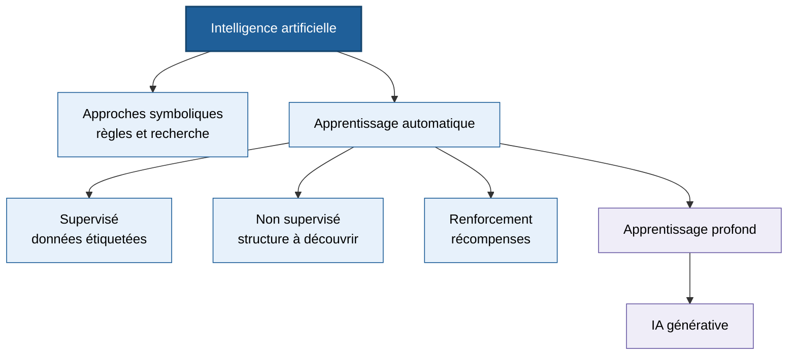
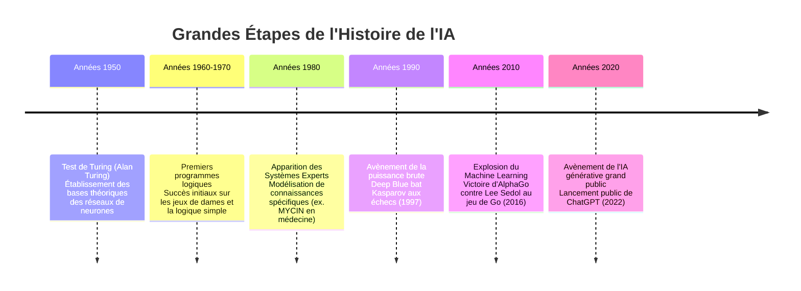
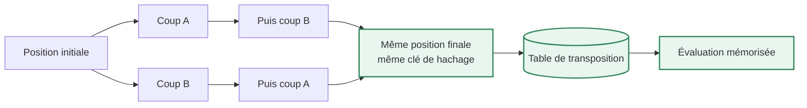
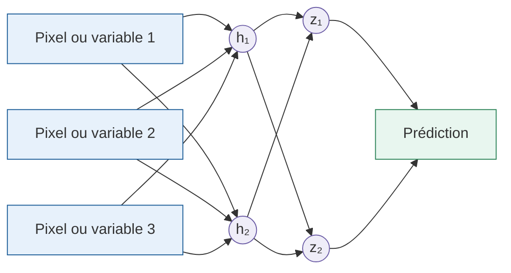
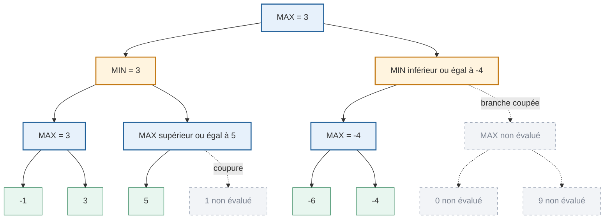

:::section id="ia-organisation" eyebrow="Semestre 7" title="Intelligence artificielle" summary="Fondements de l'IA, recherche dans les jeux, Min-Max, élagage alpha-bêta, projet Gomoku et introduction à l'apprentissage profond."

:::quicklinks
- [Concepts fondamentaux](#ia-definitions)
- [Repères historiques](#ia-historique)
- [Min-Max et alpha-bêta](#ia-jeux-echecs)
- [Projet Gomoku](#ia-gomoku)
- [Deep learning](#ia-deep-learning)
- [Exercice corrigé](#ia-exercice)
- [Explosion combinatoire](#ia-combinatoire)
:::

:::dashboard
:::card class="chapter-card" pill="Algorithmes" title="Décider dans un jeu" href="#ia-jeux-echecs" link="Étudier Min-Max"
Comprendre comment une fonction d'évaluation, Min-Max et l'élagage alpha-bêta permettent de choisir un coup sans explorer l'arbre complet.
:::

:::card class="chapter-card" pill="Projet" title="Construire une IA de Gomoku" href="#ia-gomoku" link="Voir le projet"
Mettre en pratique la recherche adversariale, le réglage des poids et les tables de transposition dans une réalisation Java.
:::
:::

Ce cours de **4ème Année du Cycle Ingénieur de l'Esisar (Grenoble INP)**, dispensé par **Jean-Baptiste Caignaert**, aborde les bases scientifiques et méthodologiques de l'Intelligence Artificielle. Le cours met l'accent sur la pratique et la compréhension profonde des algorithmes, plutôt que sur la simple utilisation d'outils d'IA générative.

### Volume horaire et calendrier
Le module s'articule autour de :
- **6 sessions de Cours-TD (CM/TD)**
- **6 sessions de Travaux Dirigés (TD)** dédiées au projet Gomoku
- **4 sessions de Travaux Pratiques (TP)** consacrées au projet ACS

:::grid two-col
:::block type="remember" title="Formule de Note Globale"
La note finale du module ($N_1$) est calculée selon la formule de pondération suivante :

Avec :
- **$CC_1$ (40%)** : Contrôle Continu basé sur l'évaluation des projets, comprenant une soutenance orale pour valider la compréhension individuelle de chaque membre du binôme.
- **$ET_1$ (60%)** : Examen Terminal écrit d'une durée de 2h00.
:::

:::block type="method" title="Modalités Pratiques"
1. **Binôme** : Tous les projets de TD/TP se font en binôme.
2. **Matériel** : Il est obligatoire d'amener au moins un ordinateur portable par binôme à chaque session avec l'IDE **Eclipse** et **Java** installés pour coder les solutions d'IA.
:::
:::

### Les deux projets pratiques du module
Le cours est jalonné de deux réalisations d'ingénierie concrètes :
- **Le Projet Gomoku (TD)** : Développement en Java d'une IA capable de jouer de manière optimale au jeu Gomoku (alignement de 5 pierres), se mesurant aux IA des autres étudiants lors d'un concours final.
- **Le Projet ACS (TP)** : Application pratique de l'algorithme d'optimisation par colonie de fourmis (*Ant Colony System*).

:::

:::section id="ia-definitions" eyebrow="Chapitre 1" title="Concepts Fondamentaux et Terminologie" summary="Introduction aux définitions formelles de l'IA, distinctions entre IA Micro/Macro, classification des types d'IA et terminologie du Machine Learning."

L'**Intelligence Artificielle (IA)** désigne l'ensemble des techniques et méthodes permettant à une machine (ordinateur, robot, système embarqué, etc.) de simuler certains aspects de l'intelligence humaine.

Ces aspects incluent notamment :
- **Apprendre** à partir de données (ex. reconnaître un visage).
- **Raisonner** (ex. calcul de la meilleure stratégie de jeu).
- **Comprendre** le langage naturel (ex. traduction automatique).
- **Percevoir** l'environnement (ex. détection d'obstacles en conduite autonome).
- **Prendre des décisions** (ex. recommandations de produits).

#### IA Macro vs IA Micro
Le cours introduit une distinction importante dans l'usage industriel et applicatif de l'IA :

:::grid two-col
:::block type="definition" title="L'IA Micro"
Représente un **composant d'IA spécifique** ou un outil isolé effectuant une tâche de traitement ciblée.
*Exemple :* L'agent conversationnel **ChatGPT**.
:::

:::block type="definition" title="L'IA Macro"
Représente une **solution globale enrichie** par l'intégration de multiples couches d'intelligence artificielle.
*Exemple :* Une plateforme de VOD qui intègre des recommandations personnalisées de contenu à l'utilisateur.
:::
:::

#### Typologie des Systèmes d'IA
Les systèmes d'IA sont classés selon leurs capacités cognitives :

| Type d'IA | Description | Exemple |
| :--- | :--- | :--- |
| **IA Faible (ou Spécialisée)** | Algorithme dédié à la résolution d'une seule tâche spécifique. | Reconnaissance vocale, filtres anti-spam, diagnostics médicaux. |
| **IA Forte (ou Générale)** | Intelligence comparable à l'humain, capable de transférer ses compétences. | Non réalisée à ce jour. |
| **Superintelligence** | IA hypothétique dépassant de loin toutes les capacités cognitives humaines. | Concept théorique. |

#### Terminologie du Machine Learning et Deep Learning

:::grid two-col
:::block type="definition" title="Algorithme vs Programme"
- **Algorithme** : Description d'une suite d'étapes permettant d'obtenir un résultat à partir d'entrées (ex. une recette de cuisine).
- **Programme informatique** : Ensemble d'instructions logiques destinées à être exécutées par un ordinateur. Un programme est la traduction concrète d'un algorithme dans un langage informatique.
:::

:::block type="definition" title="Machine Learning vs Deep Learning"
- **Machine Learning (Apprentissage Automatique)** : Sous-domaine de l'IA qui consiste à réaliser un programme qui va « apprendre » à dérouler un algorithme en analysant des données, ce qui produira un modèle.
- **Deep Learning (Apprentissage Profond)** : Sous-domaine du Machine Learning dans lequel le modèle est un **réseau de neurones artificiels**.
:::
:::

:::grid two-col
:::block type="definition" title="Supervisé vs Non-Supervisé"
- **Apprentissage Supervisé** : Les données fournies en entrée sont **étiquetées** (elles contiennent la réponse attendue pour chaque exemple).
- **Apprentissage Non-Supervisé** : Les données fournies en entrée ne sont **pas étiquetées**. Le système doit regrouper ou classifier les données par lui-même.
:::

:::block type="remember" title="Notion de Variable Cachée"
Dans les réseaux de neurones profonds, une **variable cachée (hidden variable)** est une variable intermédiaire calculée au sein des couches internes du réseau. Elle permet de capturer des relations non-linéaires complexes et des abstractions de caractéristiques qui ne sont pas directement visibles dans les données brutes d'entrée.
:::
:::

*Cette carte représente une inclusion de familles techniques : le deep learning est une famille du machine learning, lui-même inclus dans l'IA. L'IA ne se réduit donc pas aux réseaux de neurones.*

:::

:::section id="ia-historique" eyebrow="Chapitre 2" title="Perspective Historique de l'IA" summary="Chronologie des grandes avancées de l'intelligence artificielle, de sa fondation théorique aux réseaux profonds et à l'IA générative moderne."

L'histoire de l'IA est marquée par des cycles d'optimisme scientifique intense suivis de périodes de scepticisme (les hivers de l'IA), rythmés par l'évolution de la puissance de calcul et de la disponibilité des données.

#### Focus sur les Moments de Rupture Historiques

- **Le Test de Turing (1950)** : Alan Turing propose une expérience de pensée dans laquelle un humain doit distinguer, lors d'une conversation à l'aveugle, s'il échange avec un autre humain ou avec une machine. Si le sujet ne peut faire la différence, la machine est qualifiée d'intelligente.
- **Deep Blue (1997)** : Le supercalculateur d'IBM, mesurant près de deux mètres de haut et pesant 700 kg, bat le champion du monde d'échecs Garry Kasparov. C'est le triomphe de la **puissance de calcul brute** appliquée à un arbre de recherche, paramétré spécifiquement contre un seul joueur humain.
- **AlphaGo (2016)** : Le jeu de Go possède une complexité combinatoire trop importante pour être résolue par de la force brute. L'IA AlphaGo de Google DeepMind bat le champion Lee Sedol (4-1). Le **Coup 37** du match 2, joué de manière inattendue par l'IA, a démontré une capacité de créativité algorithmique inédite en calculant des probabilités de gain à très long terme.

:::block type="warning" title="Pourquoi l'essor du Deep Learning fut-il si tardif ?"
La théorie fondamentale des réseaux de neurones multicouches a été écrite dès les années 50-70. Cependant, l'essor concret n'a eu lieu que dans les années 2010 pour quatre raisons majeures :
1. **La taille des bases de données** : Dans les années 90, nos jeux de données étiquetés étaient beaucoup trop petits pour entraîner des modèles profonds.
2. **La vitesse de calcul** : Les processeurs d'ancienne génération étaient trop lents. L'utilisation des architectures GPU (puces graphiques) a permis un gain de puissance phénoménal (multiplié par 50 en 3 ans au début des années 2010).
3. **L'initialisation des poids** : Les chercheurs ne savaient pas initialiser correctement les poids d'un réseau profond, ce qui bloquait la convergence lors de la rétropropagation.
4. **La fonction d'activation** : L'utilisation de mauvaises fonctions d'activation (telles que la fonction sigmoïde, provoquant la disparition du gradient) a été remplacée par des fonctions plus adaptées (comme ReLU).
:::

:::

:::section id="ia-jeux-echecs" eyebrow="Chapitre 3" title="Théorie des Jeux : Algorithmes de Recherche" summary="Étude détaillée des techniques de prise de décision dans les jeux à deux joueurs : fonctions d'évaluation, algorithme Min-Max et élagage Alpha-Beta."

Dans les jeux de stratégie combinatoires abstraits (Échecs, Dames, Gomoku, Go), la machine doit explorer un arbre de possibilités pour sélectionner le coup optimal.

#### 1. La Fonction d'Évaluation
Il est impossible d'explorer l'arbre de jeu jusqu'à la fin de la partie (feuilles terminales) à cause de l'explosion combinatoire. On limite donc la recherche à une certaine **profondeur $depth$** et on évalue l'état du plateau de jeu à l'aide d'une **fonction d'évaluation $f_{eval}$**.

Aux échecs, la fonction d'évaluation la plus fondamentale est de nature **matérielle** :

\\[
V = \sum Poids(\text{Pièces Blancs}) - \sum Poids(\text{Pièces Noirs})
\\]

:::grid two-col
:::block type="definition" title="Poids Classiques des Pièces"
Pour évaluer un plateau, on utilise la grille de valeurs standard suivante :
- **Pion ($\kappa$)** : $1$ point
- **Cavalier ($\lambda$)** : $3$ points
- **Fou ($\mu$)** : $3$ points
- **Tour ($\nu$)** : $5$ points
- **Dame ($\xi$)** : $9$ points
:::

:::block type="warning" title="Limites de l'Évaluation Statique"
L'évaluation matérielle brute est insuffisante car elle ne tient pas compte du contexte dynamique de la partie :
- **Moment de la partie** : La valeur relative d'un échange (ex. Pion contre Cavalier, valant -1 + 3 = +2) dépend de la phase de jeu.
- **Positionnement** : Un Cavalier centralisé a beaucoup plus de valeur qu'un Cavalier bloqué sur le bord du plateau.
- **Sécurité** : Un avantage matériel peut être inutile si la position mène à un échec et mat inévitable.
:::
:::

#### 2. L'Algorithme Min-Max
L'algorithme Min-Max permet de déterminer le coup optimal pour un joueur en faisant l'hypothèse que l'adversaire joue également de manière parfaite.

- **MAX** : Cherche à prendre la décision qui maximise la fonction d'évaluation.
- **MIN** : Joueur adverse qui cherche à minimiser la valeur pour MAX, réduisant sa perte potentielle.

L'algorithme effectue une recherche en profondeur dans l'arbre des coups possibles, puis fait « remonter » les évaluations :
1. À un nœud **MAX**, la valeur affectée est le **maximum** des valeurs de ses fils.
2. À un nœud **MIN**, la valeur affectée est le **minimum** des valeurs de ses fils.

:::block type="remember" title="Règle d'or du Min-Max"
On considère toujours que l'adversaire prendra la meilleure décision possible pour lui (celle qui minimise notre score), ce qui en réalité n'est pas toujours le cas. Si l'adversaire fait une erreur, notre situation sera simplement encore meilleure que prévu.
:::

#### 3. L'Élagage Alpha-Beta
L'élagage Alpha-Beta est une optimisation du Min-Max qui permet d'éviter d'explorer des branches de l'arbre dont on sait qu'elles ne seront jamais choisies, allégeant ainsi grandement la recherche sans aucune perte d'exactitude.

On définit deux variables qui sont propagées durant la recherche :
- **$\alpha$** : La valeur du meilleur choix trouvé jusqu'à présent pour **MAX** (borne inférieure du score).
- **$\beta$** : La valeur du meilleur choix trouvé jusqu'à présent pour **MIN** (borne supérieure du score).

:::block type="method" title="Principe de Coupe"
Pendant le parcours de l'arbre, dès que l'on rencontre une situation où :

\\[
\beta \le \alpha
\\]

On arrête d'explorer les fils restants de ce nœud (on effectue une **coupe**), car la décision finale à la racine ne pourra jamais emprunter cette branche.
:::

:::plotly id="ia-minmax-alpha-beta" label="Coût de recherche" title="Min-Max et alpha-bêta dans le meilleur cas" height="440" caption="Avec un facteur de branchement b = 10, un bon ordonnancement permet à alpha-bêta de rechercher approximativement deux fois plus profond pour un même ordre de coût."
{
  "series": [
    {
      "generator": "function",
      "range": [1, 10],
      "points": 10,
      "y": "pow(10, x)",
      "name": "Min-Max : b^d",
      "line": { "width": 3 }
    },
    {
      "generator": "function",
      "range": [1, 10],
      "points": 10,
      "y": "pow(10, x / 2)",
      "name": "Alpha-bêta idéal : b^(d/2)",
      "line": { "width": 3, "dash": "dash" }
    }
  ],
  "layout": {
    "xaxis": { "title": "Profondeur d" },
    "yaxis": { "title": "Nombre de nœuds évalués", "type": "log" },
    "legend": { "orientation": "h", "y": 1.14 },
    "margin": { "l": 75, "r": 25, "t": 60, "b": 60 }
  },
  "config": { "responsive": true, "displaylogo": false }
}
:::

:::block type="remember" title="Ce que suppose la courbe alpha-bêta"
Le gain maximal nécessite d'examiner d'abord les meilleurs coups. Dans le pire cas, avec un mauvais ordre d'exploration, alpha-bêta visite autant de nœuds que Min-Max ; le résultat choisi reste cependant identique.
:::

:::

:::section id="ia-gomoku" eyebrow="Chapitre 4" title="Application Pratique : Projet Gomoku" summary="Étude du projet Gomoku (5 in a row) en Java sous Eclipse : modélisation du jeu, conception de l'évaluation dynamique et techniques de transposition."

Le projet Gomoku consiste à coder en Java une IA compétitive capable de jouer sur un plateau de $19 \times 19$. Les joueurs posent chacun leur tour une pierre de leur couleur. Le premier qui aligne exactement $5$ pierres (horizontalement, verticalement ou diagonalement) l'emporte.

#### Problématique de l'Explosion Combinatoire au Gomoku
Le facteur de branchement au Gomoku est immense au début de la partie (jusqu'à $361$ coups possibles pour le premier coup), ce qui rend indispensable une fonction d'évaluation très fine et des optimisations de recherche pour jouer dans la limite de **30 secondes par coup**.

#### Optimisation 1 : Amélioration de la Fonction d'Évaluation par Auto-Apprentissage
La qualité de l'IA repose sur les coefficients (poids) attribués aux différentes configurations de plateau (ex. alignement de 3 pierres = 47 points).

:::block type="method" title="Méthode de Réglage Automatique des Poids"
Plutôt que de régler manuellement les poids, on applique une démarche d'optimisation par simulation :
1. **IA vs IA** : On fait s'affronter deux IA disposant de jeux de poids légèrement différents.
2. **Parties de masse** : On lance des milliers de parties automatisées en boucle.
3. **Mise à jour** : On enregistre les victoires et défaites en fonction des variations de ces poids pour faire converger les poids vers les valeurs optimales.
:::

#### Optimisation 2 : Gain de Profondeur via Tables de Transposition
Lors de la recherche Min-Max, le programme réévalue de nombreuses fois des configurations de plateau identiques mais atteintes via des séquences de coups différentes (transpositions). Pour éviter ces calculs redondants :

:::block type="method" title="Mise en Œuvre des Tables de Transposition"
1. **Identifiant Unique** : On trouve une possibilité d'indiquer un identifiant unique de plateau (généralement via un hachage).
2. **Mémorisation** : Si on a un plateau X unique, on sauvegarde les évaluations des plateaux possibles.
3. **Rappel rapide** : Lorsque la recherche rencontre un plateau déjà évalué, on récupère sa valeur directement, ce qui permet d'aller en profondeur beaucoup plus vite.
:::

*Deux ordres de coups peuvent conduire au même plateau. La table reconnaît cette transposition grâce à sa clé et évite de recalculer tout le sous-arbre.*

:::

:::section id="ia-deep-learning" eyebrow="Chapitre 5" title="Perspectives du Deep Learning" summary="Compréhension des fondements des réseaux de neurones profonds, de l'essor tardif du Deep Learning et des variables cachées."

Le Deep Learning est le sous-domaine de l'apprentissage automatique utilisant des réseaux de neurones artificiels pour apprendre des représentations complexes à partir de grands volumes de données.

*Chaque liaison porte un poids appris. Les couches cachées transforment progressivement les données brutes en caractéristiques utiles à la prédiction.*

#### Pourquoi cet essor si tardif ?
Bien que les théories des réseaux de neurones et de l'apprentissage aient été écrites dès les années 1950-1970, leur essor applicatif n'a eu lieu que dans les années 2010 pour plusieurs raisons majeures :
1. **Bases de données trop petites** : Dans les années 90, les jeux de données labellisés étaient insuffisants pour entraîner efficacement des architectures profondes sans surapprentissage.
2. **Vitesse de calcul insuffisante** : Les ordinateurs étaient beaucoup trop lents avant l'utilisation massive des GPU (processeurs de cartes graphiques), qui ont apporté un boost de puissance de calcul de 50x en 3 ans.
3. **Initialisation des poids** : On n'était pas en mesure d'initialiser correctement les poids des connexions avant l'entraînement, bloquant la convergence du réseau.
4. **Fonctions d'activation inadéquates** : L'utilisation de mauvaises fonctions d'activation (comme la fonction sigmoïde provoquant l'évanouissement du gradient) empêchait l'apprentissage sur plus de 2 couches cachées.

:::block type="remember" title="Notion de Variable Cachée"
Une **variable cachée (hidden variable)** désigne une caractéristique intermédiaire apprise de manière autonome par les couches internes (cachées) d'un réseau de neurones profonds. Contrairement aux entrées brutes et aux sorties du système, ces variables représentent des abstractions logiques (ex. des formes ou motifs géométriques complexes dans un classificateur d'images) apprises par le réseau pour optimiser ses prédictions.
:::

:::plotly id="ia-surapprentissage" label="Généralisation" title="Apparition du surapprentissage" height="440" caption="Après le minimum de l'erreur de validation, poursuivre l'entraînement améliore encore les données d'apprentissage mais dégrade les performances sur des données nouvelles."
{
  "data": [
    {
      "type": "scatter",
      "mode": "lines",
      "x": [28, 28],
      "y": [0, 1.1],
      "name": "Arrêt anticipé",
      "line": { "dash": "dot", "width": 2, "color": "#667085" }
    }
  ],
  "series": [
    {
      "generator": "function",
      "range": [0, 80],
      "points": 161,
      "y": "0.12 + 0.9 * exp(-x / 18)",
      "name": "Erreur d'entraînement",
      "line": { "width": 3 }
    },
    {
      "generator": "function",
      "range": [0, 80],
      "points": 161,
      "y": "0.22 + 0.75 * exp(-x / 14) + 0.00012 * pow(x, 2)",
      "name": "Erreur de validation",
      "line": { "width": 3 }
    }
  ],
  "layout": {
    "xaxis": { "title": "Époque d'entraînement" },
    "yaxis": { "title": "Erreur", "range": [0, 1.1] },
    "legend": { "orientation": "h", "y": 1.16 },
    "margin": { "l": 65, "r": 25, "t": 65, "b": 60 }
  },
  "config": { "responsive": true, "displaylogo": false }
}
:::

:::block type="warning" title="Lire les trois zones"
Au début, les deux erreurs diminuent : le modèle apprend. Près du minimum de validation se trouve un bon compromis. Ensuite, l'écart entre les courbes augmente : le modèle mémorise trop les données d'entraînement et généralise moins bien.
:::

:::

:::section id="ia-exercice" eyebrow="TD d'entraînement" title="Exercice Corrigé : Résolution d'un Arbre Min-Max" summary="Exercice d'entraînement pour comprendre pas à pas le déroulement de l'algorithme Min-Max et l'identification des coupes Alpha-Beta."

:::exercise label="Exercice 1" title="Élagage d'un arbre de décision"
Soit l'arbre de jeu représenté ci-dessous. Le premier nœud à la racine est un nœud **MAX**. Les valeurs des feuilles terminales (profondeur 3) sont données de gauche à droite.

Déterminez la valeur remontée à la racine par l'algorithme Min-Max, ainsi que les branches coupées par l'élagage Alpha-Beta.

*Bleu : nœuds MAX ; orange : nœuds MIN ; vert : feuilles réellement évaluées ; gris pointillé : branches ignorées par alpha-bêta.*

:::block type="method" title="Correction Détaillée Étape par Étape"
**Étape 1 : Exploration du sous-arbre gauche (nœud A)**
1. On descend sur `C1` (MAX). Ses fils sont `-1` et `3`. `C1` choisit le maximum : **$C1 = 3$**.
   - En remontant cette valeur vers `A` (MIN), sa meilleure borne supérieure devient $\beta_A=3$.
2. On passe à `C2` (MAX). Le premier fils de `C2` est `5`.
   - La borne inférieure locale devient $\alpha_{C2}=5$. Comme $\alpha_{C2}\ge\beta_A$, la condition de coupe alpha-bêta est satisfaite.
   - Or, le parent de `C2` est `A` (un nœud MIN). `A` cherche à minimiser et possède déjà une alternative de valeur `3` (via `C1`).
   - Par conséquent, `A` ne choisira jamais la branche `C2` (puisqu'elle donnera au moins `5`, ce qui est pire que `3` du point de vue de MIN).
   - On effectue donc une **coupe Alpha-Beta** : on n'évalue pas le fils droit de `C2` (la feuille contenant la valeur `1`).
   - La valeur du nœud MIN `A` remonte donc à : **$A = 3$**.

**Étape 2 : Exploration du sous-arbre droit (nœud B)**
1. On descend sur `C3` (MAX). Ses fils sont `-6` et `-4`. `C3` prend le maximum : **$C3 = -4$**.
   - La valeur temporaire du nœud MIN `B` est donc au maximum de `$-4$` ($\le -4$).
   - À la racine (nœud MAX), nous savons que nous pouvons déjà obtenir un score de `3` en choisissant le côté gauche (`A = 3`).
   - Puisque le nœud `B` (MIN) donnera une valeur finale inférieure ou égale à `$-4$`, le joueur MAX à la racine ne choisira jamais d'aller vers `B`.
   - On peut donc réaliser immédiatement une **coupe Alpha-Beta de toute la branche restante sous B**. On n'explore pas le nœud `C4` (et ses fils `0` et `9`).
   - La valeur finale remontée à la racine `Root` est donc : **$Root = 3$**.
:::

:::

:::

:::section id="ia-combinatoire" eyebrow="Visualisation" title="Explosion Combinatoire des Jeux" summary="Graphique interactif permettant d'appréhender visuellement l'explosion exponentielle de l'espace d'états des jeux selon leur facteur de branchement."

:::plotly id="ia-combinatoire-graph" label="Explosion combinatoire" title="Nombre d'états à évaluer (b^d)" height="420" caption="Ce graphique interactif illustre l'explosion combinatoire du nombre de positions théoriques à évaluer en fonction de la profondeur de l'arbre d et du facteur de branchement moyen b du jeu."
{
  "series": [
    {
      "generator": "function",
      "range": [1, 8],
      "points": 50,
      "scale": "log",
      "y": "pow(3, x)",
      "name": "Morpion / Tic-Tac-Toe (b=3)"
    },
    {
      "generator": "function",
      "range": [1, 8],
      "points": 50,
      "scale": "log",
      "y": "pow(10, x)",
      "name": "Échecs (modèle réduit b=10)"
    },
    {
      "generator": "function",
      "range": [1, 8],
      "points": 50,
      "scale": "log",
      "y": "pow(20, x)",
      "name": "Gomoku (modèle réduit b=20)"
    }
  ],
  "layout": {
    "xaxis": { "title": "Profondeur de l'arbre (d)" },
    "yaxis": { "title": "Nombre d'états possibles", "type": "log" }
  },
  "config": {
    "responsive": true
  }
}
:::

:::
