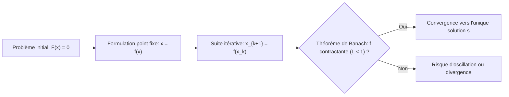
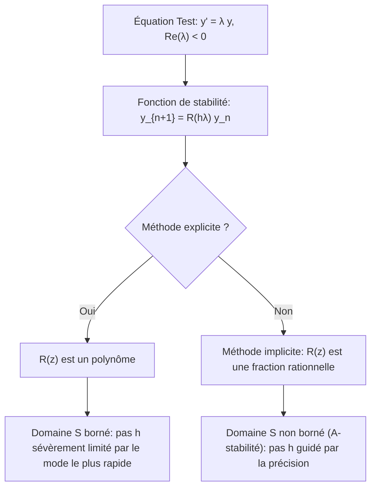

---
title: MT461-Methode-numerique - Revision ESISAR
subject: MT461-Methode-numerique
type: course
---

:::section id="mt461-intro" eyebrow="Semestre 7" title="MT461-Methode-numerique" summary="Analyse numérique et calcul scientifique : erreurs, arithmétique flottante, résolution non linéaire et intégration numérique des EDO."
:::dashboard
:::card class="progress-card" kicker="Parcours" title="3 modules"
Erreur numérique, solveurs non linéaires, puis méthodes numériques pour les équations différentielles ordinaires.
:::

:::card class="priority-card" kicker="Priorités"
1. Identifier les sources d erreur et leurs effets sur un calcul.
2. Savoir lire les limites de l arithmétique flottante IEEE 754.
3. Justifier convergence, ordre et stabilité d une méthode itérative.
4. Choisir un schéma d intégration adapté au problème de Cauchy.
5. Reconnaître les problèmes raides et les limites des méthodes explicites.
:::
:::

:::quicklinks
- [Module 1 : erreurs et arithmétique machine](#mt461-module-1)
- [Module 2 : équations non linéaires](#mt461-module-2)
- [Module 3 : EDO](#mt461-module-3)
- [Synthèse](#mt461-synthese)
:::

:::block type="neutral" title="Fil rouge du cours"
Ce cours regroupe l'ensemble des fondements théoriques et algorithmiques enseignés dans le cadre du module **MA 347 (Calcul Scientifique)**. Il traite de la modélisation mathématique face aux contraintes du calcul sur machine à précision finie, de la convergence des solveurs itératifs non linéaires, et des schémas d'intégration numérique des équations différentielles ordinaires avec leurs contraintes de stabilité.
:::

:::block type="neutral" title="Organisation MT461"
Le module s'articule autour des CM de calcul scientifique, de TD d'analyse numérique et de TP sur RStudio. Les notes CM1-CM2 ajoutées au dossier ont été intégrées dans les modules correspondants : arithmétique machine, propagation des erreurs, point fixe et théorème de Banach.
:::
:::

:::section id="mt461-module-1" eyebrow="Module 1" title="Analyse d'erreurs et arithmétique machine" summary="Erreurs numériques, flottants IEEE 754, arrondis, conditionnement et stabilité algorithmique."

### 1. Typologie et sources des erreurs numériques

En calcul scientifique, l'évaluation numérique d'un phénomène physique cumule quatre sources distinctes d'imprécision :

1. **Erreur de modélisation** : Écart intrinsèque existant entre le phénomène physique réel et les équations mathématiques choisies pour le décrire (simplifications de lois physiques, linéarisations).
2. **Erreur sur les données** : Incertitudes expérimentales affectant les paramètres d'entrée, tolérances de fabrication ou imprécision sur les constantes physiques.
3. **Erreur de troncature ou de discrétisation** : Erreur introduite par le schéma numérique lorsqu'on remplace un processus continu ou infini par un processus discret ou fini (développement de Taylor tronqué, discrétisation temporelle ou spatiale, arrêt prématuré d'une suite itérative).
4. **Erreur d'arrondi machine** : Discrétisation propre à l'ensemble des nombres réels induite par l'arithmétique à précision finie des calculateurs numériques.

:::block type="warning" title="Conséquences critiques des erreurs de calcul"
L'arithmétique sur machine peut avoir des conséquences industrielles dramatiques lorsqu'elle n'est pas maîtrisée :
* **Vol 501 d'Ariane 5 (4 juin 1996)** : Le lanceur bascule et explose après 30 secondes de vol à 3 700 m d'altitude. La perte totale du guidage résultait d'un dépassement de capacité (*overflow*) lors de la conversion d'une vitesse horizontale flottante sur 64 bits vers un entier signé sur 16 bits.
* **Instabilité par récurrence intégrale** : Soit l'intégrale $I_n = \int_1^e x^2 (\ln x)^n \, dx$ avec $I_0 = \frac{e^3 - 1}{3}$. La relation exacte par intégration par parties $I_n = \frac{e^3}{3} - \frac{n}{3} I_{n-1}$ amplifie l'erreur initiale par un facteur proportionnel à $\prod \frac{k}{3}$, entraînant une divergence explosive et des résultats négatifs aberrants dès quelques itérations.
:::

### 2. Représentation des réels sur ordinateur

Le volume mémoire étant fini, l'ordinateur ne représente qu'un sous-ensemble discret $\mathbb{M} \subset \mathbb{R}$.

#### Représentation en virgule fixe
Un réel $x$ est représenté en base $b \ge 2$ par un signe $s$, une partie entière sur $n$ chiffres et une mantisse fractionnaire sur $m$ chiffres :

$$x = (-1)^s \sum_{i=-m}^{n-1} a_i b^i \quad \text{avec } a_i \in \{0, \dots, b-1\} \text{ et } s \in \{0, 1\}$$

* Le plus grand réel représentable est $x_M = b^n - b^{-m}$.
* Le plus petit réel strictement positif représentable est $x_m = b^{-m}$.
* Les nombres sont uniformément répartis avec un pas constant égal à $b^{-m}$.
* En **complément à deux** (base 2), le réel est représenté sur $[-2^n \,,\, 2^n - 2^{-m}]$ par $x = -s \cdot 2^n + \sum_{i=-m}^{n-1} a_i 2^i$.

#### Représentation en virgule flottante normalisée
Un réel non nul est représenté par :

$$x = \pm 0,m_1 m_2 \dots m_t \times b^e \quad \text{avec } m_1 \neq 0, \quad m_i \in \{0, \dots, b-1\}, \quad e \in [e_m, e_M]$$

La mantisse normalisée appartient à l'intervalle $[b^{-1}, 1 - b^{-t}]$.

:::block type="definition" title="Norme IEEE 754 (Standard Floating Point)"
Un mot mémoire flottant contient trois champs : un bit de signe \(s\), un exposant décalé sur \(p\) bits, et une fraction de mantisse sur \(t\) bits. En base 2, l'exposant stocké \(E\) utilise le biais :

\[
\text{biais}=2^{p-1}-1
\qquad\text{et}\qquad
E=e+\text{biais}
\]

Pour les nombres normalisés, le bit de tête de la mantisse vaut 1 et n'est pas stocké en simple/double précision : la précision effective vaut donc \(t+1\) bits.

| Format | Total bits | Base \(b\) | Fraction stockée \(t\) | Bits exposant \(p\) | Biais | \(e_{\min}\) normal | \(e_{\max}\) normal |
| :--- | :---: | :---: | :---: | :---: | :---: | :---: | :---: |
| **IEEE single** | 32 | 2 | 23 | 8 | 127 | \(-126\) | \(+127\) |
| **IEEE double** | 64 | 2 | 52 | 11 | 1023 | \(-1022\) | \(+1023\) |
| **IEEE extended 80 bits** | 80 | 2 | 63 | 15 | 16383 | \(-16382\) | \(+16383\) |

* En simple précision, le plus petit normal vaut \(2^{-126}\) et le plus grand normal vaut \((2-2^{-23})2^{127}\) dans l'écriture IEEE \(1.f\times2^e\).
* **Underflow** : le résultat est trop proche de zéro pour être représenté comme normal ; il peut devenir dénormalisé, puis zéro.
* **Overflow** : \(|x|\) dépasse le plus grand flottant fini représentable ; le résultat devient typiquement \(\pm\infty\).
:::

:::block type="theorem" title="Cardinalité d'un système flottant normalisé"
Pour une base \(b\), une mantisse normalisée de longueur \(t\), et des exposants compris entre \(e_m\) et \(e_M\), le nombre de valeurs représentables, zéro inclus et dénormalisés exclus, est :

\[
N=1+2(b-1)b^{t-1}(e_M-e_m+1)
\]

Le facteur 2 vient du signe, \((b-1)b^{t-1}\) compte les mantisses normalisées, et \((e_M-e_m+1)\) compte les exposants possibles.
:::

:::block type="method" title="Exemple jouet : flottants binaires"
Pour un système binaire \(b=2\), avec \(t=3\) bits de mantisse et \(e\in[-2,1]\) :

\[
N=1+2(2-1)2^{3-1}(1-(-2)+1)=33
\]

À exposant fixé, le pas vaut \(b^{e-t}\). Quand l'exposant augmente d'une unité, le pas est multiplié par la base : la grille machine se dilate quand on s'éloigne de zéro.
:::

:::block type="warning" title="Répartition non uniforme des flottants"

:::plotly id="mt461-plot-flottants" title="Virgule fixe et virgule flottante" label="Graphique interactif" height="420" caption="Zoome autour de zero : la virgule flottante concentre les valeurs representables pres de zero, alors que la virgule fixe garde un pas constant."
{
  "series": [
    {
      "generator": "function",
      "range": [
        -4,
        4
      ],
      "points": 33,
      "y": 1,
      "type": "scatter",
      "mode": "markers",
      "name": "Virgule fixe : echantillonnage uniforme de pas constant Delta x = b^(-m)",
      "marker": {
        "color": "#0077b6",
        "symbol": "line-ns-open",
        "size": 14,
        "line": {
          "width": 3
        }
      },
      "xaxis": "x",
      "yaxis": "y",
      "hovertemplate": "x = %{x}<extra></extra>"
    },
    {
      "generator": "floating-distribution",
      "minExponent": -5,
      "maxExponent": 1,
      "mantissas": [
        1,
        1.25,
        1.5,
        1.75
      ],
      "limit": 4,
      "level": 1,
      "type": "scatter",
      "mode": "markers",
      "name": "Virgule flottante : densite geometrique maximale pres de 0",
      "marker": {
        "color": "#e58a00",
        "symbol": "line-ns-open",
        "size": 14,
        "line": {
          "width": 3
        }
      },
      "xaxis": "x2",
      "yaxis": "y2",
      "hovertemplate": "x = %{x}<extra></extra>"
    }
  ],
  "data": [
    {
      "x": [
        -0.125,
        0.125,
        0.125,
        -0.125,
        -0.125
      ],
      "y": [
        0.82,
        0.82,
        1.18,
        1.18,
        0.82
      ],
      "type": "scatter",
      "mode": "lines",
      "fill": "toself",
      "name": "Zone d'underflow (|x| < b^(e_m-1))",
      "line": {
        "color": "#f4a261",
        "width": 1
      },
      "fillcolor": "rgba(244,162,97,0.24)",
      "xaxis": "x2",
      "yaxis": "y2",
      "hoverinfo": "skip"
    },
    {
      "x": [
        -4.5,
        -3.5,
        -3.5,
        -4.5,
        -4.5
      ],
      "y": [
        0.78,
        0.78,
        1.22,
        1.22,
        0.78
      ],
      "type": "scatter",
      "mode": "lines",
      "fill": "toself",
      "name": "Zone d'overflow (|x| >= b^(e_M))",
      "line": {
        "color": "#b57bd1",
        "width": 1
      },
      "fillcolor": "rgba(181,123,209,0.24)",
      "xaxis": "x2",
      "yaxis": "y2",
      "hoverinfo": "skip"
    },
    {
      "x": [
        3.5,
        4.5,
        4.5,
        3.5,
        3.5
      ],
      "y": [
        0.78,
        0.78,
        1.22,
        1.22,
        0.78
      ],
      "type": "scatter",
      "mode": "lines",
      "fill": "toself",
      "name": "Zone d'overflow symetrique",
      "showlegend": false,
      "line": {
        "color": "#b57bd1",
        "width": 1
      },
      "fillcolor": "rgba(181,123,209,0.24)",
      "xaxis": "x2",
      "yaxis": "y2",
      "hoverinfo": "skip"
    }
  ],
  "layout": {
    "margin": {
      "t": 86,
      "r": 360,
      "b": 70,
      "l": 82
    },
    "legend": {
      "x": 1.02,
      "y": 0.5,
      "xanchor": "left",
      "yanchor": "middle",
      "bgcolor": "rgba(255,255,255,0.92)",
      "bordercolor": "#d4d8df",
      "borderwidth": 1,
      "font": {
        "size": 13
      }
    },
    "hovermode": "closest",
    "title": {
      "text": "La virgule flottante concentre les nombres pres de zero alors que la virgule fixe est uniforme",
      "x": 0.5,
      "xanchor": "center"
    },
    "grid": {
      "rows": 2,
      "columns": 1,
      "pattern": "independent",
      "roworder": "top to bottom"
    },
    "xaxis": {
      "title": "Valeur reelle representee (x)",
      "range": [
        -4.5,
        4.5
      ],
      "zeroline": true
    },
    "yaxis": {
      "range": [
        0.65,
        1.35
      ],
      "showticklabels": false,
      "title": "",
      "zeroline": false
    },
    "xaxis2": {
      "title": "Valeur reelle representee (x)",
      "range": [
        -4.5,
        4.5
      ],
      "zeroline": true
    },
    "yaxis2": {
      "range": [
        0.65,
        1.35
      ],
      "showticklabels": false,
      "title": "",
      "zeroline": false
    },
    "annotations": [
      {
        "x": 3.55,
        "y": 1.22,
        "xref": "x",
        "yref": "y",
        "text": "Pas constant Delta x = 0.25 Risque d overflow rapide",
        "showarrow": true,
        "arrowhead": 2,
        "ax": -80,
        "ay": -42,
        "bgcolor": "#fff7ed",
        "bordercolor": "#d95f02"
      },
      {
        "x": 0.18,
        "y": 1.18,
        "xref": "x2",
        "yref": "y2",
        "text": "Forte densite pres de zero",
        "showarrow": true,
        "arrowhead": 2,
        "ax": -120,
        "ay": -40,
        "bgcolor": "#f0fdf4",
        "bordercolor": "#e58a00"
      }
    ],
    "showlegend": true
  }
}
:::

:::block type="neutral" title="Lecture du graphique"
**Observation.** En virgule fixe, les points sont regulierement espaces : le pas est constant sur tout l'intervalle. En virgule flottante, les points sont tres serres autour de 0 puis s'ecartent lorsque la valeur absolue augmente. Les zones colorees rappellent les deux limites pratiques : sous une certaine valeur, on tombe en *underflow* ; au-dela de la valeur maximale representable, on tombe en *overflow*.

**Interpretation.** La virgule flottante ne donne pas une precision absolue constante, mais une precision relative a peu pres constante sur chaque intervalle d'exposant. C'est pour cela qu'un calcul peut etre tres precis pres de 0 tout en devenant plus grossier sur de grands ordres de grandeur. Le graphe sert donc a visualiser l'idee centrale : la machine ne manipule pas tous les reels, mais une grille non uniforme de nombres representables.
:::

Pour tout exposant fixé $e$, les réels représentables sont en progression arithmétique de pas constant $b^{e-t}$. L'espacement relatif entre deux nombres consécutifs varie en fonction de l'intervalle $[b^{e-1}, b^e[$, créant une concentration maximale au voisinage de zéro et une dispersion accrue aux grands nombres.
:::

### 3. Techniques d'arrondis et précision machine

Le passage d'un réel $x \in \mathbb{R}$ à son approximation machine est noté $\text{fl}(x)$. Deux politiques de base sont utilisées :

1. **Troncature (*Chopping*)** :
   $$x_c = \text{sign}(x) \cdot \text{trunc}\left(|x| b^{t-e}\right) \cdot b^{e-t}$$
   * Erreur absolue maximale : $\delta_{\max} = b^{e-t}$.
   * Erreur relative maximale :
     $$\rho_x = \frac{|x - x_c|}{|x|} \le \frac{b^{e-t}}{b^{e-1}} = b^{1-t} = h$$
     La constante $h = b^{1-t}$ définit la **précision machine**.

2. **Arrondi au plus proche (*Rounding*)** :
   $$x_r = \text{sign}(x) \cdot \text{trunc}\left(|x| b^{t-e} + \frac{1}{2}\right) \cdot b^{e-t}$$
   * Erreur absolue maximale : $\delta_{\max} = \frac{b^{e-t}}{2}$.
   * Erreur relative maximale : $\rho_x \le \frac{b^{1-t}}{2} = \frac{h}{2}$.

:::block type="definition" title="Erreurs a priori et a posteriori"
Avec \(x\) exact et \(\hat{x}=\text{fl}(x)\) :

\[
\delta=\hat{x}-x,\qquad \rho=\frac{\delta}{x}
\]

\[
\delta'=x-\hat{x},\qquad \rho'=\frac{\delta'}{\hat{x}}
\]

Les deux conventions sont liées par :

\[
x=\hat{x}(1+\rho')
\qquad\text{et}\qquad
\hat{x}=x(1+\rho)
\]

Donc :

\[
1+\rho'=\frac{1}{1+\rho}
\qquad
\rho'=\frac{1}{1+\rho}-1=-\rho+\rho^2-\rho^3+\cdots
\]

Au premier ordre, pour \(|\rho|\ll1\), on retient \(\rho'\simeq-\rho\).
:::

:::block type="method" title="Exemple résolu : chopping et rounding"
On veut représenter \(x=0{,}37527\times10^{-2}\) en base \(10\), avec une mantisse \(t=3\) et un exposant \(e=-2\).

Par chopping :

\[
x_c=10^{-5}\operatorname{trunc}(0{,}37527\times10^{-2}\times10^5)
=10^{-5}\operatorname{trunc}(375{,}27)
=0{,}375\times10^{-2}
\]

\[
\delta'=x-x_c=0{,}00027\times10^{-2}=0{,}27\times10^{-5}\le10^{-5}
\]

\[
\rho'=\frac{0{,}27\times10^{-5}}{0{,}375\times10^{-2}}
\approx 7{,}2\times10^{-4}
\]

Par rounding, on ajoute un demi pas avant la troncature :

\[
x_r=10^{-5}\operatorname{trunc}(375{,}27+0{,}5)
=0{,}375\times10^{-2}
\]

Pour \(y=0{,}37587\times10^{-2}\), le chopping donne \(0{,}375\times10^{-2}\), alors que le rounding donne :

\[
y_r=10^{-5}\operatorname{trunc}(375{,}87+0{,}5)
=0{,}376\times10^{-2}
\]

L'erreur absolue d'arrondi vaut alors \(0{,}13\times10^{-5}\), inférieure à la borne \(\frac{1}{2}10^{-5}\).
:::

### 4. Arithmétique flottante et chiffres de garde

L'ensemble machine $\mathbb{M}$ n'est pas stable pour les opérations usuelles : si $x, y \in \mathbb{M}$, alors $x * y \notin \mathbb{M}$ en général. L'évaluation suit le modèle :

$$\text{fl}(x * y) = (x * y)(1 + \rho) \quad \text{avec } |\rho| \le h$$

:::block type="method" title="Algorithme d'addition et de soustraction machine"
Pour évaluer $\text{fl}(x \pm y)$ avec $x = m_x b^{e_x}$ et $y = m_y b^{e_y}$ ($e_x \ge e_y$) :
1. **Dénormalisation** : Décaler la mantisse de $y$ de $k = e_x - e_y$ positions vers la droite pour aligner les exposants sur $e_x$.
2. **Opération** : Additionner ou soustraire les mantisses alignées.
3. **Renormalisation** : Réajuster l'exposant si la mantisse résultante déborde ou n'est plus normalisée, puis appliquer l'arrondi (chopping ou rounding).
:::

:::block type="theorem" title="Théorème du chiffre de garde"
Dans l'arithmétique flottante notée $\text{FP}(b, t, \text{cl}, q)$ (avec $q$ chiffres de garde) :
* Pour la **multiplication**, le produit intermédiaire doit être calculé avec assez de chiffres avant l'arrondi final ; on ne l'analyse pas comme une simple addition alignée.
* Pour la **soustraction** $x - y$ ($x > y > 0$, $e_x = e_y + k$) :
  * Si $k = 0$, aucune perte de précision.
  * Si $k = 1$, la présence d'au moins **un chiffre de garde ($q \ge 1$) est obligatoire**, sans quoi l'erreur relative peut devenir catastrophique.
  * Si $k > 1$, on n'a pas l'annihilation critique de deux mantisses presque identiques ; le petit opérande peut tout de même être partiellement ou totalement absorbé par l'arrondi.
* Dans le modèle simplifié du cours, une arithmétique correctement gardée et arrondie permet d'écrire $\text{fl}(x * y) = (x * y)(1 + \rho)$ avec une borne \(|\rho|\) de l'ordre de la précision machine, tant que l'on évite overflow, underflow et cancellation catastrophique.
:::

:::block type="definition" title="Sticky Bit"
Le **sticky bit** est positionné à 1 si au moins un bit non nul a été éliminé après le chiffre de garde lors du décalage, et 0 sinon. Il ne remplace pas l'arrondi : il donne l'information nécessaire pour choisir correctement entre troncature, arrondi au plus proche ou arrondi dirigé.
:::

:::block type="method" title="Lecture du chiffre de garde"
Lors de l'alignement des exposants, le nombre de plus petit exposant est décalé vers la droite. Le chiffre de garde conserve temporairement le premier chiffre qui sortirait de la mantisse utile ; le sticky bit mémorise si d'autres chiffres non nuls ont été perdus plus loin.

Cette mécanique explique pourquoi une soustraction entre nombres très proches peut rester correcte avec garde, mais se dégrader brutalement sans garde.
:::

:::block type="warning" title="Perte d'associativité dans $\mathbb{M}$"
L'addition machine n'est pas associative. En base 10 avec $t = 3$ :
$$(0,100 \cdot 10^{-3} + 0,300 \cdot 10^{-6}) + 0,700 \cdot 10^{-6} = 0,100 \cdot 10^{-3}$$
$$0,100 \cdot 10^{-3} + (0,300 \cdot 10^{-6} + 0,700 \cdot 10^{-6}) = 0,101 \cdot 10^{-3}$$

Dans le premier regroupement :

\[
0{,}100\times10^{-3}+0{,}0003\times10^{-3}
=0{,}1003\times10^{-3}
\xrightarrow{\text{fl}}0{,}100\times10^{-3}
\]

puis :

\[
0{,}100\times10^{-3}+0{,}0007\times10^{-3}
=0{,}1007\times10^{-3}
\xrightarrow{\text{fl}}0{,}100\times10^{-3}
\]

Dans le second regroupement :

\[
0{,}300\times10^{-6}+0{,}700\times10^{-6}
=1{,}000\times10^{-6}
=0{,}001\times10^{-3}
\]

puis :

\[
0{,}100\times10^{-3}+0{,}001\times10^{-3}
=0{,}101\times10^{-3}
\]

La différence vient de la troncature prématurée des petits termes lorsqu'ils sont ajoutés séparément au grand terme.
:::

:::block type="method" title="Soustraction avec et sans chiffre de garde"
On considère \(x=0{,}1000\times10^0\) et \(y=0{,}0999\times10^{-1}\), avec une mantisse de longueur \(t=4\). Les exposants diffèrent de \(k=1\), cas sensible pour la soustraction.

Sans chiffre de garde, on aligne \(y\) sur l'exposant de \(x\), puis on tronque :

\[
y=0{,}0099[9]\times10^0
\xrightarrow{\text{tronqué à }t=4}
0{,}0099\times10^0
\]

\[
\text{fl}(x-y)=0{,}1000\times10^0-0{,}0099\times10^0
=0{,}0901\times10^0
=0{,}9010\times10^{-1}
\]

Avec un chiffre de garde :

\[
\text{fl}(x-y)=0{,}1000[0]\times10^0-0{,}0099[9]\times10^0
=0{,}0900[1]\times10^0
=0{,}9001\times10^{-1}
\]

Le résultat exact attendu est \(0{,}9001\times10^{-1}\). Sans garde, l'erreur atteint donc le troisième chiffre significatif.
:::

### 5. Propagation des erreurs et conditionnement

Soit $x$ la valeur exacte et $\hat{x} = \text{fl}(x)$ sa représentation machine. On définit l'écart absolu $\delta(x) = \hat{x} - x$ et l'écart relatif $\rho(x) = \frac{\delta(x)}{x}$.

#### Propagation à travers les opérations arithmétiques

| Opération | Écart absolu $\delta(x * y)$ | Écart relatif $\rho(x * y)$ | Comportement |
| :---: | :---: | :---: | :--- |
| **Addition** | $\delta(x) + \delta(y)$ | $\frac{x}{x+y}\rho(x) + \frac{y}{x+y}\rho(y)$ | Amortissement si $x, y > 0$ |
| **Soustraction** | $\delta(x) - \delta(y)$ | $\frac{x}{x-y}\rho(x) - \frac{y}{x-y}\rho(y)$ | **Amplification critique** si $x \approx y$ |
| **Multiplication** | $x\delta(y) + y\delta(x)$ | $\rho(x) + \rho(y)$ | Stationnaire |
| **Division** | $\frac{\delta(x)}{y} - \frac{x}{y^2}\delta(y)$ | $\rho(x) - \rho(y)$ | Stationnaire |

:::block type="warning" title="Phénomène d'annihilation (perte de chiffres significatifs)"
Lorsque l'on soustrait deux nombres très proches entachés d'erreurs initiales ($x \approx y$), le dénominateur $x - y \to 0$ amplifie considérablement l'erreur relative.
* **Exemple classique** : Calcul de $f(x, y) = x^2 - y^2$.
  * Algorithme 1 : $\alpha = x^2, \, \beta = y^2, \, \text{res} = \alpha - \beta \implies \rho = \frac{2x^2}{x^2-y^2}\rho(x) - \frac{2y^2}{x^2-y^2}\rho(y)$ (instable pour $x \approx y$).
  * Algorithme 2 : $\alpha = x - y, \, \beta = x + y, \, \text{res} = \alpha \times \beta$ (formulation mathématiquement équivalente mais bien conditionnée).
:::

#### Fonctions scalaires et multivariables
* Pour $f: \mathbb{R} \to \mathbb{R}$ dérivable :
  $$\rho(f(x)) \simeq \frac{x f'(x)}{f(x)} \rho(x)$$
* Pour une composée $f \circ g$ :
  $$\rho(f \circ g)(x) \simeq \left[\frac{g(x) f'(g(x))}{f(g(x))}\right] \left[\frac{x g'(x)}{g(x)}\right] \rho(x)$$
* Pour $f: \mathbb{R}^2 \to \mathbb{R}$ de classe $\mathcal{C}^2$ :
  $$\rho(f(x, y)) = \rho(x) \frac{x \frac{\partial f}{\partial x}(x, y)}{f(x, y)} + \rho(y) \frac{y \frac{\partial f}{\partial y}(x, y)}{f(x, y)}$$

:::plotly id="mt461-plot-annihilation" title="Amplification par annihilation numerique" label="Graphique interactif" height="420" caption="Quand deux valeurs deviennent proches, le denominateur x-y devient petit et l erreur relative peut exploser."
{
  "series": [
    {
      "generator": "function",
      "range": [
        1e-7,
        0.1
      ],
      "points": 120,
      "y": "min(8, 0.5e-7 / x)",
      "type": "scatter",
      "mode": "lines",
      "name": "Algo 1 naif x^2 - y^2 (theorie : amplification E_a ~= x0/(2 epsilon) * h)",
      "line": {
        "color": "#d95f02",
        "width": 4
      },
      "scale": "log"
    },
    {
      "generator": "function",
      "range": [
        1e-7,
        0.1
      ],
      "points": 120,
      "y": "max(1e-8, min(8, 0.5e-7 / x) * (0.18 + 0.18 * sin(i * 1.7) + 0.08 * cos(i * 0.6)))",
      "type": "scatter",
      "mode": "markers",
      "name": "Algo 1 : simulation numerique deterministe des arrondis machine",
      "marker": {
        "color": "#f4a261",
        "size": 5,
        "opacity": 0.62
      },
      "scale": "log"
    },
    {
      "generator": "function",
      "range": [
        1e-7,
        0.1
      ],
      "points": 120,
      "y": "3e-7",
      "type": "scatter",
      "mode": "lines",
      "name": "Algo 2 factorise (x-y)(x+y) (theorie : stable E_a <= 3h)",
      "line": {
        "color": "#009e73",
        "width": 4
      },
      "scale": "log"
    },
    {
      "generator": "function",
      "range": [
        1e-7,
        0.1
      ],
      "points": 120,
      "y": "max(1e-8, 1.1e-7 * (0.55 + 0.35 * sin(i * 2.1) + 0.25 * cos(i * 0.4)))",
      "type": "scatter",
      "mode": "markers",
      "name": "Algo 2 : simulation numerique deterministe des arrondis machine",
      "marker": {
        "color": "#66c2a5",
        "size": 5,
        "opacity": 0.65
      },
      "scale": "log"
    },
    {
      "generator": "function",
      "range": [
        1e-7,
        0.1
      ],
      "points": 2,
      "y": 1,
      "type": "scatter",
      "mode": "lines",
      "name": "Erreur relative 100% (perte totale d'information)",
      "line": {
        "color": "#111827",
        "width": 3,
        "dash": "dot"
      },
      "scale": "log"
    },
    {
      "generator": "function",
      "range": [
        1e-7,
        0.1
      ],
      "points": 2,
      "y": 1.19e-7,
      "type": "scatter",
      "mode": "lines",
      "name": "Precision machine float32 (h approx 1.19e-7)",
      "line": {
        "color": "#858585",
        "width": 3,
        "dash": "dash"
      },
      "scale": "log"
    }
  ],
  "layout": {
    "margin": {
      "t": 86,
      "r": 360,
      "b": 70,
      "l": 82
    },
    "legend": {
      "x": 1.02,
      "y": 0.5,
      "xanchor": "left",
      "yanchor": "middle",
      "bgcolor": "rgba(255,255,255,0.92)",
      "bordercolor": "#d4d8df",
      "borderwidth": 1,
      "font": {
        "size": 13
      }
    },
    "hovermode": "closest",
    "title": {
      "text": "L'algorithme naif amplifie l'erreur d'arrondi alors que la forme factorisee reste stable",
      "x": 0.5,
      "xanchor": "center"
    },
    "xaxis": {
      "title": "Ecart epsilon = x - y (avec x = 1.0)",
      "type": "log",
      "range": [
        -7.2,
        -0.8
      ]
    },
    "yaxis": {
      "title": "Erreur relative algorithmique |calcul - exact| / |exact|",
      "type": "log",
      "range": [
        -8,
        1
      ]
    },
    "annotations": [
      {
        "x": 0.000002,
        "y": 1.8,
        "text": "Instabilite critique : erreur > 100% quand epsilon < 10^(-7)",
        "showarrow": true,
        "arrowhead": 2,
        "ax": 95,
        "ay": -18,
        "bgcolor": "#fff7ed",
        "bordercolor": "#d95f02"
      }
    ],
    "showlegend": true
  }
}
:::

:::block type="neutral" title="Lecture du graphique"
**Observation.** Quand l'ecart $\epsilon = x-y$ diminue, la courbe de l'algorithme naif $x^2-y^2$ remonte fortement : l'erreur relative est amplifiee jusqu'a depasser le seuil de 100 %. A l'inverse, la forme factorisee $(x-y)(x+y)$ reste presque horizontale, proche du niveau de precision machine.

**Interpretation.** Les deux formules sont mathematiquement identiques, mais elles ne sont pas equivalentes numeriquement. Dans $x^2-y^2$, on soustrait deux nombres presque egaux : les chiffres significatifs communs disparaissent, puis l'erreur relative explose car le resultat exact est petit. La factorisation isole directement le petit ecart $x-y$ et evite cette soustraction catastrophique. C'est l'exemple typique d'un algorithme instable pour un probleme pourtant simple.
:::
:::block type="definition" title="Stabilité d'un algorithme et problème bien posé"
Soit $E_a$ l'erreur introduite par l'algorithme numérique et $E_i$ l'erreur inévitable propre aux données du problème.
1. Un algorithme est dit **numériquement stable** lorsque $|E_a| \le |E_i|$.
2. Un problème est dit **mal posé** lorsque $E_i \gg 1$.
:::

:::block type="remember" title="Règles d'or du calcul numérique"
1. Éviter impérativement la soustraction de deux grandeurs quasi égales et imprécises.
2. Évaluer les formulations mathématiques alternatives numériquement stables.
3. Surveiller en permanence les bornes pour éviter les zones d'*overflow* et d'*underflow*.
:::
:::

:::section id="mt461-module-2" eyebrow="Module 2" title="Résolution d'équations et systèmes non linéaires" summary="Point fixe, accélération de convergence, sécante, Newton-Raphson et systèmes non linéaires."

La résolution d'équations scalaires ou vectorielles $F(x) = 0$ repose sur leur mise sous forme de problème de point fixe $x = f(x)$.

### 1. Théorème du point fixe de Banach

:::block type="theorem" title="Théorème du point fixe de Banach (1922)"
Soit $I = [a, b] \subset \mathbb{R}$ un intervalle fermé non vide et $f : I \to \mathbb{R}$ une application vérifiant :
1. **Stabilité** : $f(I) \subset I$.
2. **Contraction lipschitzienne** : $\exists L \in [0, 1[$ tel que $\forall x, y \in I, \, |f(x) - f(y)| \le L |x - y|$.

Alors :
1. Il existe un **unique** point fixe $s \in I$ tel que $f(s) = s$.
2. Pour tout germe initial $x_0 \in I$, la suite $x_{n+1} = f(x_n)$ converge vers $s$.
3. **Majorations des erreurs** :
   * **Estimation *a priori*** :
     $$|x_n - s| \le \frac{L^n}{1 - L} |x_1 - x_0|$$
   * **Estimation *a posteriori*** (en cours de calcul, plus précise) :
     $$|x_n - s| \le \frac{L}{1 - L} |x_n - x_{n-1}|$$
:::

#### Démonstration détaillée

:::block type="method" title="Étape 1 : la suite est de Cauchy"
Par récurrence sur \(k\), la contraction donne :

\[
|x_{k+1}-x_k|
=|f(x_k)-f(x_{k-1})|
\le L|x_k-x_{k-1}|
\le \cdots \le L^k|x_1-x_0|
\]

Pour \(m>n\), l'inégalité triangulaire donne :

\[
|x_m-x_n|
\le |x_m-x_{m-1}|+\cdots+|x_{n+1}-x_n|
\]

En injectant la majoration précédente :

\[
|x_m-x_n|
\le \left(L^{m-1}+L^{m-2}+\cdots+L^n\right)|x_1-x_0|
\]

\[
|x_m-x_n|
\le L^n\left(\sum_{j=0}^{m-n-1}L^j\right)|x_1-x_0|
\le \frac{L^n}{1-L}|x_1-x_0|
\]

Comme \(0\le L<1\), \(L^n\to0\). La suite \((x_n)\) est donc de Cauchy.
:::

:::block type="method" title="Étape 2 : existence du point fixe"
L'espace \(\mathbb{R}\) est complet : toute suite de Cauchy y converge. Il existe donc \(s\in\mathbb{R}\) tel que \(x_n\to s\).

Comme \(I\) est fermé et que \(x_n\in I\) pour tout \(n\), on a \(s\in I\). La contraction implique la continuité de \(f\), donc :

\[
x_{n+1}=f(x_n)
\quad\Longrightarrow\quad
s=f(s)
\]

La limite est bien un point fixe.
:::

:::block type="method" title="Étape 3 : unicité"
Supposons deux points fixes \(s_1\) et \(s_2\) dans \(I\). Alors :

\[
|s_1-s_2|=|f(s_1)-f(s_2)|\le L|s_1-s_2|
\]

Si \(s_1\ne s_2\), comme \(L<1\), cela impose \(|s_1-s_2|<|s_1-s_2|\), contradiction. Le point fixe est unique.
:::

:::block type="method" title="Étape 4 : bornes d'erreur"
Pour la borne a priori, on fixe \(n\) et on fait tendre \(m\) vers l'infini dans l'inégalité précédente :

\[
|x_n-s|
\le \frac{L^n}{1-L}|x_1-x_0|
\]

Pour la borne a posteriori, on repart du dernier pas calculé :

\[
|x_{k+1}-x_k|\le L^{k-n+1}|x_n-x_{n-1}|
\]

En sommant puis en faisant \(m\to\infty\) :

\[
|x_n-s|
\le \frac{L}{1-L}|x_n-x_{n-1}|
\]

Cette seconde estimation est souvent plus serrée, car elle utilise la dernière correction effectivement observée.
:::

:::plotly id="mt461-plot-point-fixe" title="Iteration de point fixe" label="Graphique interactif" height="420" caption="Les marches montrent la suite x_{n+1}=g(x_n). Ici g est contractante : la suite converge vers l intersection avec y=x."
{
  "series": [
    {
      "generator": "function",
      "range": [
        1.2,
        2.5
      ],
      "points": 160,
      "y": "0.5 * (x + 2 / x)",
      "type": "scatter",
      "mode": "lines",
      "name": "Fonction contractante f(x) = 0.5*(x + 2/x)",
      "line": {
        "color": "#0077b6",
        "width": 4
      }
    },
    {
      "generator": "function",
      "range": [
        1.2,
        2.5
      ],
      "points": 2,
      "y": "x",
      "type": "scatter",
      "mode": "lines",
      "name": "Bissectrice y = x",
      "line": {
        "color": "#858585",
        "width": 3,
        "dash": "dash"
      }
    },
    {
      "generator": "fixed-point-staircase",
      "x0": 2.4,
      "steps": 4,
      "formula": "0.5 * (x + 2 / x)",
      "type": "scatter",
      "mode": "lines+markers",
      "name": "Trajectoire iterative (x_k, f(x_k))",
      "line": {
        "color": "#d95f02",
        "width": 4
      },
      "marker": {
        "size": 7
      }
    },
    {
      "generator": "point",
      "x": "sqrt(2)",
      "y": "sqrt(2)",
      "type": "scatter",
      "mode": "markers",
      "name": "Point fixe unique s = sqrt(2) approx 1.4142",
      "marker": {
        "color": "#009e73",
        "size": 17
      }
    }
  ],
  "layout": {
    "margin": {
      "t": 86,
      "r": 360,
      "b": 70,
      "l": 82
    },
    "legend": {
      "x": 1.02,
      "y": 0.5,
      "xanchor": "left",
      "yanchor": "middle",
      "bgcolor": "rgba(255,255,255,0.92)",
      "bordercolor": "#d4d8df",
      "borderwidth": 1,
      "font": {
        "size": 13
      }
    },
    "hovermode": "closest",
    "title": {
      "text": "La contraction (|f'| < 1) dirige l'escalier vers la solution en 4 pas seulement",
      "x": 0.5,
      "xanchor": "center"
    },
    "xaxis": {
      "title": "Itere courant x",
      "range": [
        1.2,
        2.5
      ]
    },
    "yaxis": {
      "title": "Image f(x) / suivant y",
      "range": [
        1.2,
        2.5
      ]
    },
    "annotations": [
      {
        "x": 1.4142,
        "y": 1.4142,
        "text": "Convergence geometrique rapide |x_n - s| <= L^n / (1-L) * |x_1 - x_0|",
        "showarrow": true,
        "arrowhead": 2,
        "ax": -115,
        "ay": -92,
        "bgcolor": "#f0fdf4",
        "bordercolor": "#009e73"
      }
    ],
    "showlegend": true
  }
}
:::

:::block type="neutral" title="Lecture du graphique"
**Observation.** La courbe bleue represente $f(x)=\frac{1}{2}(x+2/x)$ et la droite grise represente $y=x$. Leur intersection est le point fixe $s=\sqrt{2}$. La trajectoire orange forme un escalier : on part d'un $x_0$, on monte jusqu'a la courbe $f$, puis on revient horizontalement vers la droite $y=x$ pour obtenir l'itere suivant.

**Interpretation.** L'escalier se resserre rapidement vers $\sqrt{2}$ car la fonction est contractante autour de la solution : l'erreur est reduite a chaque iteration. Visuellement, plus la pente de $f$ pres du point fixe est faible en valeur absolue, plus les marches se rapprochent vite de l'intersection. Ce graphique met donc en image le theoreme de Banach : existence, unicite et convergence lorsque $|f'|<1$ sur l'intervalle etudie.
:::

:::grid two-col
:::block type="method" title="Exemple : \(x=\cos x\)"
Sur \(I=[0,1]\), la fonction \(f(x)=\cos x\) vérifie \(f(I)\subset I\), car \(f(0)=1\) et \(f(1)\approx 0{,}5403\).

Comme \(\cos\) est décroissante sur \([0,1]\), on a plus précisément :

\[
f(I)=[\cos(1),1]\subset[0,1]
\]

Par le théorème des accroissements finis :

\[
|f(x_1)-f(x_2)|\le \max_{z\in[0,1]}|\sin z|\,|x_1-x_2|
\]

Donc \(L=\sin(1)<1\), et la suite converge vers l'unique point fixe \(s\approx0{,}73908\).
:::

:::block type="method" title="Exemple : fraction continue"
Pour \(a>1\), la fraction continue

\[
s=\frac{1}{a+\frac{1}{a+\cdots}}
\]

se traite par \(f(x)=\frac{1}{a+x}\) sur \([0,+\infty[\). On a :

\[
0<f(x)\le \frac{1}{a}
\]

donc \(f([0,+\infty[)\subset[0,+\infty[\). Pour la contraction :

\[
|f(x_1)-f(x_2)|\le \frac{1}{a^2}|x_1-x_2|
\]

La contraction donne l'unique limite positive :

\[
s=\frac{-a+\sqrt{a^2+4}}{2}
\]

Si \(0<a\le1\), cette majoration ne donne plus \(L<1\), même si la suite peut encore converger. C'est un bon rappel : les hypothèses de Banach sont suffisantes, pas nécessaires.
:::
:::

:::block type="method" title="Variante (semi-)locale du point fixe"
La vérification de $f(I) \subset I$ étant difficile en dimension $N$, on utilise une version semi-locale :
Soit $x_0 \in \mathbb{R}$, $I = [x_0 - c, x_0 + c]$ avec $\|f'\|_\infty = \max_{x \in I} |f'(x)| \le L < 1$. Si :
$$|f(x_0) - x_0| \le c(1 - L)$$
alors le théorème de Banach s'applique dans la boule fermée $S = \left\{x \in \mathbb{R} \mid |x - x_1| \le \frac{L}{1-L} |x_1 - x_0|\right\}$.
:::

### 2. Vitesse, ordre et accélération de la convergence

Soit $e_n = x_n - s$ l'erreur à l'itération $n$, et $N_n = \log_{10}\left|\frac{s}{e_n}\right|$ le nombre de chiffres significatifs corrects en base 10.

#### Définitions de l'ordre de convergence
* **Ordre selon Schroeder (1870)** (pour les itérations stationnaires $x_{n+1} = f(x_n)$) :
  Si $f'(s) = f''(s) = \dots = f^{(m-1)}(s) = 0$ et $f^{(m)}(s) \neq 0$, alors :
  $$e_{n+1} \sim \frac{f^{(m)}(s)}{m!} e_n^m \implies \lim_{n \to \infty} \frac{e_{n+1}}{e_n^m} = C \neq 0$$
  * Si $m = 1$ (ordre linéaire) : le nombre de chiffres significatifs augmente d'une constante $R = -\log_{10} C$ par itération.
  * Si $m > 1$ (ordre superlinéaire) : le nombre de décimales exactes est **multiplié par $m$ à chaque pas** ($N_n \sim m N_{n-1}$).

* **Ordre selon Traub (1964)** (applicable à toute suite convergente) :
  $$\lim_{n \to \infty} \frac{|e_{n+1}|}{|e_n|^p} = C \in ]0, +\infty[$$
  Le paramètre $p \ge 1$ n'est pas nécessairement entier.

#### Accélération de convergence d'Aitken et Aitken-Steffensen

:::block type="method" title="Procédé $\Delta^2$ d'Aitken (1926)"
Pour une suite à convergence linéaire ($e_{n+1}/e_n \to \lambda$ avec $|\lambda| < 1$), on utilise l'opérateur aux différences finies $\Delta x_n = x_{n+1} - x_n$ et $\Delta^2 x_n = x_{n+2} - 2x_{n+1} + x_n$ :

$$x'_n = x_n - \frac{(\Delta x_n)^2}{\Delta^2 x_n} = \frac{x_n x_{n+2} - x_{n+1}^2}{x_{n+2} - 2x_{n+1} + x_n}$$

* Accélération prouvée : $e'_n = o(e_n)$.
* **Invariance par translation** : Poser $\tilde{x}_n = x_n - h \implies \tilde{x}'_n = x'_n - h$. Cela permet de stocker les chiffres stabilisés $h$, de poursuivre sur le résidu petit, et de s'affranchir des limites de précision machine.
:::

:::block type="method" title="Algorithme d'Aitken-Steffensen (1933)"
Applique le procédé $\Delta^2$ en cascade directement sur la récurrence de point fixe $x_{n+1} = f(x_n)$ :

$$x_{n+1} = g(x_n) \quad \text{avec} \quad g(x) = x - \frac{(f(x) - x)^2}{f(f(x)) - 2f(x) + x}$$

* Si $f'(s) \neq 0$ (méthode initiale d'ordre 1), alors $g'(s) = 0$ : **la méthode devient automatiquement d'ordre 2**.
* **Avantage majeur** : Ne nécessite que 2 évaluations de $f$ par pas, et **aucune évaluation de dérivée $f'$**.
:::

:::plotly id="mt461-plot-convergence" title="Comparaison des vitesses de convergence" label="Graphique interactif" height="420" caption="Passe l axe des ordonnees en log : une pente plus forte correspond a une convergence plus rapide."
{
  "series": [
    {
      "generator": "sequence",
      "nStart": 0,
      "nEnd": 10,
      "y": "pow(10, -0.7 * n)",
      "type": "scatter",
      "mode": "lines+markers",
      "name": "Point fixe lineaire (p=1) : gain constant approx 0.7 decimale/pas",
      "line": {
        "color": "#0077b6",
        "width": 4,
        "dash": "dash"
      },
      "marker": {
        "size": 9
      }
    },
    {
      "generator": "sequence",
      "nStart": 0,
      "nEnd": 8,
      "y": "pow(10, -0.43 * pow(n, 1.618))",
      "type": "scatter",
      "mode": "lines+markers",
      "name": "Methode de la Secante (p=1.618) : 1 evaluation de F par pas",
      "line": {
        "color": "#e58a00",
        "width": 4
      },
      "marker": {
        "symbol": "square",
        "size": 9
      }
    },
    {
      "generator": "sequence",
      "nStart": 0,
      "nEnd": 5,
      "y": "max(2e-16, pow(10, -pow(2, n)))",
      "type": "scatter",
      "mode": "lines+markers",
      "name": "Aitken-Steffensen (p=2) : quadratique sans derivee",
      "line": {
        "color": "#009e73",
        "width": 4
      },
      "marker": {
        "symbol": "diamond",
        "size": 10
      }
    },
    {
      "generator": "sequence",
      "nStart": 0,
      "nEnd": 5,
      "y": "max(1e-16, pow(10, -0.6 * pow(2, n)))",
      "type": "scatter",
      "mode": "lines+markers",
      "name": "Newton-Raphson (p=2) : doublement des decimales a chaque pas",
      "line": {
        "color": "#d95f02",
        "width": 4
      },
      "marker": {
        "symbol": "triangle-up",
        "size": 10
      }
    },
    {
      "generator": "function",
      "range": [
        0,
        10
      ],
      "points": 2,
      "y": 1e-15,
      "type": "scatter",
      "mode": "lines",
      "name": "Seuil precision double (IEEE-754 64 bits)",
      "line": {
        "color": "#858585",
        "width": 3,
        "dash": "dot"
      }
    }
  ],
  "layout": {
    "margin": {
      "t": 86,
      "r": 360,
      "b": 70,
      "l": 82
    },
    "legend": {
      "x": 1.02,
      "y": 0.5,
      "xanchor": "left",
      "yanchor": "middle",
      "bgcolor": "rgba(255,255,255,0.92)",
      "bordercolor": "#d4d8df",
      "borderwidth": 1,
      "font": {
        "size": 13
      }
    },
    "hovermode": "closest",
    "title": {
      "text": "Newton atteint la precision machine en 5 pas contre plus de 20 pour le point fixe",
      "x": 0.5,
      "xanchor": "center"
    },
    "xaxis": {
      "title": "Numero d'iteration (n)",
      "range": [
        0,
        10
      ]
    },
    "yaxis": {
      "title": "Erreur absolue |x_n - s| (echelle logarithmique)",
      "type": "log",
      "range": [
        -16,
        0.2
      ]
    },
    "showlegend": true
  }
}
:::

:::block type="neutral" title="Lecture du graphique"
**Observation.** L'axe vertical est logarithmique : descendre d'une graduation revient a gagner plusieurs ordres de grandeur sur l'erreur. Le point fixe lineaire baisse regulierement mais lentement. La secante descend plus vite. Newton-Raphson et Aitken-Steffensen chutent brutalement, puis atteignent le plancher de precision machine.

**Interpretation.** Une convergence d'ordre 1 signifie que l'erreur est multipliee par un facteur presque constant a chaque pas : c'est fiable, mais lent. Les methodes d'ordre 2 doublent approximativement le nombre de decimales correctes a chaque iteration lorsque l'on est assez proche de la racine. Le graphe explique pourquoi Newton est spectaculaire localement, mais aussi pourquoi il ne sert a rien d'iterer indefiniment : une fois le seuil machine atteint, les arrondis dominent et la courbe ne peut plus descendre de maniere significative.
:::
### 3. Méthodes itératives de résolution de $F(x) = 0$

On modifie la recherche de racine sous forme sécante générale $x_{k+1} = x_k - \frac{F(x_k)}{\mu_k}$.

#### Méthode de la corde parallèle
La pente est maintenue constante : $\mu_k = \tan \phi$. La convergence est d'ordre 1 (linéaire).

#### Méthode de la sécante
La pente est réévaluée à chaque pas par la corde joignant les deux derniers itérés :

$$x_{n+1} = x_n - F(x_n) \frac{x_n - x_{n-1}}{F(x_n) - F(x_{n-1})}$$

* Relation de propagation d'erreur :
  $$e_{n+1} \sim e_n e_{n-1} \frac{F''(s)}{2 F'(s)}$$
* Posons $c_k = \ln|e_k|$. On obtient l'équation de récurrence $c_{k+1} \sim c_k + c_{k-1} + D$ dont l'équation caractéristique associée est $p^2 - p - 1 = 0$.
* La racine positive donne l'**ordre de Traub** :
  $$p = \frac{1 + \sqrt{5}}{2} \approx 1,618 \quad (\text{nombre d'or})$$
* **Efficacité machine** : Ne demande qu'une seule nouvelle évaluation de $F(x_n)$ par pas (en conservant $F(x_{n-1})$ en mémoire). Deux pas de sécante coûtent 2 évaluations pour un ordre effectif $(1,618)^2 \approx 2,618 > 2$, surpassant souvent Newton-Raphson en temps de calcul sur les polynômes via le schéma de Horner.

### 4. Étude approfondie de la méthode de Newton-Raphson

La tangente locale définit la pente : $\mu_n = F'(x_n)$.

:::block type="method" title="Méthode de Newton-Raphson scalaire"
$$x_{n+1} = x_n - \frac{F(x_n)}{F'(x_n)} = f(x_n)$$
* **Ordre de convergence** :
  $$f'(s) = 1 - \frac{(F'(s))^2 - F(s)F''(s)}{(F'(s))^2} = 0 \quad (\text{puisque } F(s) = 0 \text{ et } F'(s) \neq 0)$$
  La méthode est donc **d'ordre 2 (quadratique)** au voisinage d'une racine simple.
:::

:::block type="warning" title="Cas des racines multiples"
Si $s$ est racine de multiplicité $p > 1$ ($F(s) = \dots = F^{(p-1)}(s) = 0$ et $F^{(p)}(s) \neq 0$) :
* Newton classique retombe à un ordre 1 avec $f'(s) = 1 - \frac{1}{p} \neq 0$.
* **Correction** : Pour restaurer la convergence quadratique ($p=2$), on utilise la formule pondérée :
  $$x_{n+1} = x_n - p \frac{F(x_n)}{F'(x_n)}$$
:::

:::block type="theorem" title="Convergence globale de Newton-Raphson (Théorème de Fourier)"
Soit $F \in \mathcal{C}^2([a, b])$ vérifiant :
1. $F(a) F(b) < 0$ (existence d'au moins une racine).
2. $F''$ garde un signe constant sur $[a, b]$ (convexité ou concavité stricte, assurant l'absence de point d'inflexion).
3. Conditions aux limites de non-sortie de l'intervalle :
   $$\left|\frac{F(c)}{F'(c)}\right| \le b - a \quad \text{pour } c = a \text{ et } c = b$$
Alors, pour tout $x_0 \in [a, b]$, la méthode de Newton-Raphson converge vers l'unique racine $s \in [a, b]$.
:::

:::block type="theorem" title="Propriété auto-correctrice de Newton-Raphson en machine"
Considérons les itérations calculées en arithmétique flottante avec erreur relative $\sigma_k$ sur l'itéré $\bar{z}_k = z_k(1 + \sigma_k)$ et erreur locale d'opération $\tau_{k+1}$ :

$$\bar{z}_{k+1} \approx z_{k+1} \left(1 + \sigma_k \frac{z_k f'(z_k)}{f(z_k)} + \tau_{k+1}\right)$$

Comme $f'(z_k) \xrightarrow[k \to \infty]{} f'(s) = 0$ et $\frac{z_k}{f(z_k)} \to 1$ :
$$\left|\frac{z_k f'(z_k)}{f(z_k)}\right| < 1$$
Le coefficient de propagation de l'erreur antérieure s'annule asymptotiquement : **l'algorithme de Newton-Raphson est auto-correcteur**, effaçant au fil des itérations les erreurs d'arrondis injectées aux étapes précédentes.
:::

#### Généralisation aux systèmes non linéaires multivariables
Pour $f : \mathbb{R}^N \to \mathbb{R}^N$ de classe $\mathcal{C}^1$, on développe au premier ordre : $f(x_n) + Df(x_n) \cdot (x_{n+1} - x_n) = 0$ où $Df(x_n)$ est la **matrice jacobienne** :

$$[Df(x)]_{ij} = \frac{\partial f_i}{\partial x_j}(x)$$

:::block type="method" title="Algorithme de Newton multivariable"
On ne calcule **jamais l'inverse explicite** $[Df(x_n)]^{-1}$. À chaque itération :
1. Évaluer le vecteur résidu $f(x_n)$ et la matrice jacobienne $Df(x_n)$.
2. Résoudre le système linéaire en la correction $y$ :
   $$[Df(x_n)] y = -f(x_n)$$
3. Mettre à jour : $x_{n+1} = x_n + y$.
:::

### 5. Algorithmes de classe « EASY »

:::block type="definition" title="Classe de complexité EASY"
Un algorithme, une fonction ou une constante est qualifié de **EASY** si le nombre d'opérations sur les bits (*bit complexity*) nécessaire pour obtenir un résultat avec $n$ bits corrects est de l'ordre de $n^{1 + \varepsilon(n)}$ avec $\lim_{n \to \infty} \varepsilon(n) = 0$.
:::

* La multiplication de deux entiers de $n$ bits est EASY selon l'algorithme de Schönhage-Strassen (1971) avec $M(n) = O(n \ln n \ln \ln n)$.
* **Calcul de l'inverse $1/C$ sans division matérielle** :
  On cherche la racine de $F(z) = \frac{1}{z} - C = 0$ par Newton-Raphson :
  $$z_{k+1} = z_k - \frac{\frac{1}{z_k} - C}{-\frac{1}{z_k^2}} = z_k (2 - C z_k)$$
  Cette itération ne contient que **deux multiplications et une soustraction**. Le coût total pour atteindre $n$ bits vérifie $T(n) \approx 4 M(n)$ : la division est donc EASY.
* **Calcul de $\sqrt{C}$** : Solution de $F(z) = z^2 - C = 0 \implies z_{k+1} = \frac{1}{2}\left(z_k + \frac{C}{z_k}\right)$.
* **Théorème de réciproque EASY** : Si $\phi(x)$ et $\phi'(x)$ sont EASY, et que Newton-Raphson converge pour $\phi(z) - y = 0$, alors la fonction réciproque $\phi^{-1}(y)$ est également EASY (exemple : calcul de $y = e^x$ via $x - \ln y = 0$).
:::

:::section id="mt461-module-3" eyebrow="Module 3" title="Résolution numérique des équations différentielles ordinaires (EDO)" summary="Problème de Cauchy, méthodes à un pas, multi-pas, stabilité absolue et problèmes raides."

### 1. Le problème de Cauchy et son conditionnement

:::block type="definition" title="Problème de Cauchy scalaire"
Trouver une fonction $y \in \mathcal{C}^1([a, b])$ vérifiant :
$$\begin{cases} y'(x) = f(x, y(x)) \quad \forall x \in [a, b] \\ y(a) = \eta \end{cases}$$
:::

:::block type="theorem" title="Théorème fondamental de Cauchy-Lipschitz"
Soit $f : [a, b] \times \mathbb{R} \to \mathbb{R}$ continue et lipschitzienne par rapport à sa seconde variable sur $[a, b]$ ($\exists L \ge 0$ tel que $\forall y_1, y_2, \, |f(x, y_1) - f(x, y_2)| \le L |y_1 - y_2|$). Alors :
1. Il existe une **unique solution** $y(x)$ sur $[a, b]$.
2. $y \in \mathcal{C}^1([a, b])$.
3. La solution dépend de manière continue de la condition initiale $\eta$ et du second membre $f$.
:::

:::block type="theorem" title="Dépendance continue et Lemme de Grönwall"
Soit $y$ la solution exacte et $z$ la solution perturbée vérifiant $z'(x) = f(x, z) + \delta(x)$ avec $z(a) = \eta + \delta_a$. L'écart $d(x) = z(x) - y(x)$ vérifie :

$$|d(x)| \le |\delta_a| e^{L(x-a)} + \|\delta\|_\infty E_L(x-a) \quad \text{avec } E_L(\xi) = \frac{e^{L\xi} - 1}{L}$$

$E_L$ est la **fonction de Lipschitz associée à $L$**.
:::

:::block type="warning" title="Caractère pessimiste de la borne de Grönwall"
Pour une équation fortement amortie telle que $y' = -50y$ ($L = 50$), la borne fournit un facteur $e^{50(x-a)}$ exponentiellement croissant alors qu'en réalité, les perturbations s'atténuent rapidement vers zéro.
:::

### 2. Méthodes à un pas (*One-step methods*)

Sur une grille $x_n = a + n h$ ($h = \frac{b-a}{N}$), l'intégration de $y'(t) = f(t, y(t))$ donne la relation variationnelle exacte :

$$y(x_{n+1}) = y(x_n) + h \Delta(x_n, y(x_n), h) \quad \text{où } \Delta(x, y, h) = \frac{1}{h} \int_x^{x+h} f(t, y(t)) \, dt$$

Le schéma numérique à pas séparé s'écrit :

$$y_{n+1} = y_n + h \Phi(x_n, y_n, h)$$

* **Erreur locale de discrétisation** : $\Delta(x, y, h) - \Phi(x, y, h) = O(h^p)$.
* **Erreur globale accumulée** : $e_n = y_n - y(x_n)$ vérifie :
  $$|e_n| \le e^{L_\Phi (x_n - a)} |e_0| + E_{L_\Phi}(x_n - a) O(h^p) = O(h^p)$$
  La méthode est dite d'**ordre $p$**.

#### Schéma d'Euler explicite (ordre 1)
Choix direct $\Phi(x, y, h) = f(x, y)$ :
$$y_{n+1} = y_n + h f(x_n, y_n)$$

#### Méthodes de Runge-Kutta (RK)
Pour éviter le calcul lourd des dérivées partielles successives de $f$, les méthodes de Runge-Kutta calculent des pentes intermédiaires $k_i$ :

$$h \Phi(x, y, h) = \sum_{i=1}^s R_i k_i$$

:::block type="method" title="Famille des méthodes RK2 (ordre 2)"
$$k_1 = h f(x_n, y_n)$$
$$k_2 = h f(x_n + \alpha h, y_n + \alpha k_1)$$
$$y_{n+1} = y_n + \left(1 - \frac{1}{2\alpha}\right) k_1 + \frac{1}{2\alpha} k_2$$
* **Méthode de Heun (1900)** ($\alpha = 1$) : $y_{n+1} = y_n + \frac{1}{2}(k_1 + k_2)$ avec $k_2 = h f(x_n+h, y_n+k_1)$.
* **Méthode du point milieu** ($\alpha = 1/2$) : $y_{n+1} = y_n + k_2$ avec $k_2 = h f\left(x_n + \frac{h}{2}, y_n + \frac{k_1}{2}\right)$.
:::

:::block type="method" title="Méthode classique de Runge-Kutta d'ordre 4 (RK4)"
Nécessite 4 évaluations de $f$ par pas :
$$\begin{cases} 
k_1 = h f(x_n, y_n) \\ 
k_2 = h f\left(x_n + \frac{h}{2}, y_n + \frac{k_1}{2}\right) \\ 
k_3 = h f\left(x_n + \frac{h}{2}, y_n + \frac{k_2}{2}\right) \\ 
k_4 = h f(x_n + h, y_n + k_3) 
\end{cases}$$

$$y_{n+1} = y_n + \frac{1}{6}(k_1 + 2k_2 + 2k_3 + k_4)$$
L'erreur de discrétisation locale est en $O(h^5)$, assurant une convergence globale d'**ordre 4** ($|e_n| = O(h^4)$).
:::

### 3. Méthodes à pas liés (*Multi-step methods*)

Une méthode à $k$ pas utilise l'historique des $k$ points précédents :

$$\sum_{j=0}^k \alpha_j y_{n+j} = h \sum_{j=0}^k \beta_j f(x_{n+j}, y_{n+j}) \quad (\alpha_k \neq 0, \, |\alpha_0| + |\beta_0| \neq 0)$$

* Si $\beta_k = 0$ : méthode **explicite** (formule type prédicteur).
* Si $\beta_k \neq 0$ : méthode **implicite** (formule type correcteur) nécessitant la résolution d'une équation non linéaire à chaque pas.

:::block type="method" title="Schémas Prédicteur-Correcteur"
On utilise un prédicteur explicite pour générer une estimation initiale $y_{n+k}^{(0)}$, puis on effectue quelques itérations de point fixe sur le correcteur implicite :

$$\alpha_k y_{n+k}^{(i+1)} + \sum_{j=0}^{k-1} \alpha_j y_{n+j} = h \left[ \beta_k f\left(x_{n+k}, y_{n+k}^{(i)}\right) + \sum_{j=0}^{k-1} \beta_j f_{n+j} \right]$$

La constante de Lipschitz du point fixe vaut $L_F = h \frac{|\beta_k|}{\alpha_k} L_f$. La convergence du correcteur impose la condition stricte :
$$h < \frac{\alpha_k}{L_f |\beta_k|}$$
:::

#### Polynômes caractéristiques et consistance
On associe à la méthode à $k$ pas deux polynômes caractéristiques :
$$P(z) = \sum_{j=0}^k \alpha_j z^j \quad \text{et} \quad \sigma(z) = \sum_{j=0}^k \beta_j z^j$$

:::block type="theorem" title="Conditions de consistance"
1. **Consistance d'ordre 1** :
   $$P(1) = 0 \iff \sum_{j=0}^k \alpha_j = 0$$
   $$P'(1) = \sigma(1) \iff \sum_{j=1}^k j \alpha_j = \sum_{j=0}^k \beta_j$$
2. **Ordre de précision $p$** : L'erreur locale résiduelle développée en série de Taylor s'annule jusqu'à l'ordre $p$ inclus ($C_0 = C_1 = \dots = C_p = 0$ et $C_{p+1} \neq 0$).
:::

:::block type="theorem" title="Théorème d'équivalence de Dahlquist (1959)"
Une méthode multi-pas linéaire est **convergente** si et seulement si elle est **consistante** et **zéro-stable**.

* **Condition de zéro-stabilité (Dahlquist)** :
  Toutes les racines du premier polynôme caractéristique $P(z) = 0$ sont de **module inférieur ou égal à 1**, et les racines de module 1 sont **strictement simples**.
:::

:::block type="warning" title="Cas d'école : Instabilité de la méthode de Milne-Simpson"
Le correcteur de Milne s'écrit $y_{n+1} = y_{n-1} + \frac{h}{3}(f_{n+1} + 4f_n + f_{n-1})$.
* $P(z) = z^2 - 1 \implies$ racines $z_1 = 1$ et $z_2 = -1$ (racines simples de module 1 : stable au sens de Dahlquist).
* $P(1) = 0$ et $P'(1) = 2 = \sigma(1) \implies$ consistant d'ordre 4.
* **Comportement sur le problème test $y' = \lambda y$** : L'équation caractéristique admet pour racines $r_1 = e^{\lambda h} + O(h^5)$ (solution physique) et $r_2 = -e^{-\lambda h / 3} + O(h^3)$ (mode parasite).
  La solution numérique générale vaut :
  $$y_n = A e^{\lambda x} + B (-1)^n e^{-\frac{\lambda x}{3}} + O(h^4)$$
  Pour un système stable ($\text{Re}(\lambda) < 0$), alors que la solution physique $e^{\lambda x} \to 0$, le **mode parasite oscille et croît exponentiellement** en $e^{|\lambda| x / 3}$ ! Bien que stable et consistante, la méthode de Milne est **inutilisable en pratique**.
:::

:::plotly id="mt461-plot-milne" title="Mode physique et mode parasite de Milne-Simpson" label="Graphique interactif" height="420" caption="Le mode physique decroit, mais le mode parasite alterne de signe et grandit : c est le piege pratique du schema."
{
  "series": [
    {
      "generator": "function",
      "range": [
        0,
        5
      ],
      "points": 150,
      "y": "exp(-4*x)",
      "type": "scatter",
      "mode": "lines",
      "name": "Solution physique exacte y(x) = exp(-4x) (amortissement stable)",
      "line": {
        "color": "#111827",
        "width": 4
      }
    },
    {
      "generator": "function",
      "range": [
        0,
        5
      ],
      "points": 26,
      "y": "exp(-4*x) * (1 + 0.015 * sin(i))",
      "type": "scatter",
      "mode": "lines+markers",
      "name": "Runge-Kutta 4 (RK4) : convergence parfaite vers 0",
      "line": {
        "color": "#009e73",
        "width": 4
      },
      "marker": {
        "size": 7
      }
    },
    {
      "generator": "function",
      "range": [
        0,
        5
      ],
      "points": 26,
      "y": "exp(-4*x) + (x > 0 ? 0.0025 * (i % 2 === 0 ? 1 : -1) * exp(4*x/3) : 0)",
      "type": "scatter",
      "mode": "lines+markers",
      "name": "Milne-Simpson : oscillation parasite divergente (-1)^n * exp(4x/3)",
      "line": {
        "color": "#d95f02",
        "width": 4
      },
      "marker": {
        "symbol": "square",
        "size": 8
      }
    },
    {
      "generator": "function",
      "range": [
        0,
        5
      ],
      "points": 150,
      "y": "0.0025 * exp(4*x/3)",
      "type": "scatter",
      "mode": "lines",
      "name": "Enveloppe theorique de croissance du mode parasite",
      "line": {
        "color": "#858585",
        "width": 3,
        "dash": "dot"
      }
    },
    {
      "generator": "function",
      "range": [
        0,
        5
      ],
      "points": 150,
      "y": "-0.0025 * exp(4*x/3)",
      "type": "scatter",
      "mode": "lines",
      "name": "Enveloppe theorique negative du mode parasite",
      "showlegend": false,
      "line": {
        "color": "#858585",
        "width": 3,
        "dash": "dot"
      }
    }
  ],
  "layout": {
    "margin": {
      "t": 86,
      "r": 360,
      "b": 70,
      "l": 82
    },
    "legend": {
      "x": 1.02,
      "y": 0.5,
      "xanchor": "left",
      "yanchor": "middle",
      "bgcolor": "rgba(255,255,255,0.92)",
      "bordercolor": "#d4d8df",
      "borderwidth": 1,
      "font": {
        "size": 13
      }
    },
    "hovermode": "closest",
    "title": {
      "text": "Milne-Simpson diverge explosivement des x > 3 alors que RK4 et l'exact s'amortissent a zero",
      "x": 0.5,
      "xanchor": "center"
    },
    "xaxis": {
      "title": "Temps d'integration x",
      "range": [
        0,
        5
      ]
    },
    "yaxis": {
      "title": "Solution y(x)",
      "range": [
        -3.5,
        3.5
      ]
    },
    "annotations": [
      {
        "x": 4.4,
        "y": 2.2,
        "text": "Mode parasite oscillant r_2 = -exp(-lambda*h/3) : croissance exponentielle non physique",
        "showarrow": true,
        "arrowhead": 2,
        "ax": -150,
        "ay": 155,
        "bgcolor": "#fff7ed",
        "bordercolor": "#d95f02"
      }
    ],
    "showlegend": true
  }
}
:::

:::block type="neutral" title="Lecture du graphique"
**Observation.** La solution exacte $e^{-4x}$ s'amortit rapidement vers 0, et RK4 suit ce comportement stable. La courbe de Milne-Simpson semble d'abord correcte, puis une oscillation alternee apparait et grandit. Les enveloppes pointillees montrent que cette oscillation parasite augmente exponentiellement.

**Interpretation.** Le probleme continu est stable, donc on s'attendrait a voir toutes les solutions numeriques s'amortir. Pourtant le schema de Milne-Simpson transporte un mode parasite de la forme $(-1)^n e^{|\lambda|x/3}$. Il respecte les criteres classiques de consistance et de zero-stabilite, mais son comportement sur ce probleme test revele une instabilite pratique. Le message du graphe est important : un schema d'ordre eleve peut donner de mauvais resultats si sa dynamique numerique contient un mode non physique.
:::
### 4. Stabilité absolue et problèmes raides (*Stiff problems*)

:::block type="definition" title="Problème raide (*Stiff*)"
Un système différentiel est raide lorsque coexistent des échelles temporelles extrêmement contrastées, dues par exemple à des constantes de réaction chimique très divergentes (ex. $0,04$, $10^4$, $3 \cdot 10^7$). La matrice jacobienne du système linéarisé $\dot{w} = A w$ présente alors des valeurs propres négatives réelles très éloignées en amplitude ($|\lambda_{\min}| \ll |\lambda_{\max}|$).
:::

#### Équation test de Dahlquist et domaine de stabilité
Pour étudier la propagation numérique sur les modes stables, on utilise le problème test :

$$y' = \lambda y \quad \text{avec } \text{Re}(\lambda) < 0$$

Appliquée à cette équation, toute méthode produit une relation de récurrence $y_{n+1} = R(h\lambda) y_n$, où $R(z)$ est la **fonction de stabilité**.

:::block type="definition" title="Domaine de stabilité absolue"
La zone du plan complexe définie par :
$$\mathcal{S} = \{ z = h\lambda \in \mathbb{C} \mid |R(z)| < 1 \}$$
Le pas d'intégration est impérativement contraint par la condition :
$$h \lambda \in \mathcal{S}$$
:::

:::block type="warning" title="Faiblesse des méthodes explicites pour les problèmes raides"
Pour toute méthode explicite (un pas ou pas liés), la fonction de stabilité $R(z)$ est **un polynôme**. Un polynôme n'étant jamais borné quand $|z| \to \infty$, le domaine $\mathcal{S}$ est obligatoirement **borné** :
* Pour Euler explicite : $|1 + z| < 1 \implies h < \frac{2}{|\lambda_{\max}|}$.
* Pour RK4 : $R(z) = 1 + z + \frac{z^2}{2} + \frac{z^3}{6} + \frac{z^4}{24} \implies h < \frac{2,7}{|\lambda_{\max}|}$.
Même après disparition complète des régimes transitoires rapides, l'utilisateur est contraint de conserver un pas $h$ microscopique sous peine d'instabilité explosive.
:::

:::plotly id="mt461-plot-stabilite" title="Domaines de stabilite absolue" label="Graphique interactif" height="420" caption="Euler explicite n est stable que dans le disque centre en -1. Les methodes A-stables couvrent tout le demi-plan gauche."
{
  "series": [
    {
      "generator": "parametric",
      "range": [
        0,
        "2*PI"
      ],
      "points": 181,
      "x": "-1 + cos(t)",
      "y": "sin(t)",
      "type": "scatter",
      "mode": "lines",
      "fill": "toself",
      "name": "Euler explicite : disque |1+z| <= 1 (axe reel [-2, 0])",
      "line": {
        "color": "#d95f02",
        "width": 4
      },
      "fillcolor": "rgba(217,95,2,0.24)"
    },
    {
      "generator": "rk4-stability-boundary",
      "points": 180,
      "type": "scatter",
      "mode": "lines",
      "fill": "toself",
      "name": "Runge-Kutta 4 (RK4) : region bornee etendue (axe reel [-2.78, 0])",
      "line": {
        "color": "#0077b6",
        "width": 4
      },
      "fillcolor": "rgba(0,119,182,0.24)"
    }
  ],
  "data": [
    {
      "x": [
        -4,
        0,
        0,
        -4,
        -4
      ],
      "y": [
        -3.4,
        -3.4,
        3.4,
        3.4,
        -3.4
      ],
      "type": "scatter",
      "mode": "lines",
      "fill": "toself",
      "name": "Trapeze / Crank-Nicolson : A-stable (Re(z) <= 0 sans borne)",
      "line": {
        "color": "#66c2a5",
        "width": 2
      },
      "fillcolor": "rgba(102,194,165,0.20)"
    },
    {
      "x": [
        -4,
        1.5
      ],
      "y": [
        0,
        0
      ],
      "type": "scatter",
      "mode": "lines",
      "name": "Axe reel",
      "showlegend": false,
      "line": {
        "color": "#111827",
        "width": 2
      }
    },
    {
      "x": [
        0,
        0
      ],
      "y": [
        -3.4,
        3.4
      ],
      "type": "scatter",
      "mode": "lines",
      "name": "Axe imaginaire",
      "showlegend": false,
      "line": {
        "color": "#111827",
        "width": 2
      }
    }
  ],
  "layout": {
    "margin": {
      "t": 86,
      "r": 360,
      "b": 70,
      "l": 82
    },
    "legend": {
      "x": 1.02,
      "y": 0.5,
      "xanchor": "left",
      "yanchor": "middle",
      "bgcolor": "rgba(255,255,255,0.92)",
      "bordercolor": "#d4d8df",
      "borderwidth": 1,
      "font": {
        "size": 13
      }
    },
    "hovermode": "closest",
    "title": {
      "text": "Les methodes implicites s'affranchissent de la barriere de stabilite de Dahlquist",
      "x": 0.5,
      "xanchor": "center"
    },
    "xaxis": {
      "title": "Partie reelle Re(h*lambda)",
      "range": [
        -3.8,
        1.5
      ],
      "zeroline": false
    },
    "yaxis": {
      "title": "Partie imaginaire Im(h*lambda)",
      "range": [
        -3.2,
        3.2
      ],
      "scaleanchor": "x",
      "scaleratio": 1,
      "zeroline": false
    },
    "annotations": [
      {
        "x": -2,
        "y": 0,
        "text": "Rigidite / Stiff limit Euler explicite : h < 2 / |lambda_max|",
        "showarrow": true,
        "arrowhead": 2,
        "ax": -90,
        "ay": -120,
        "bgcolor": "#fff7ed",
        "bordercolor": "#d95f02"
      },
      {
        "x": -2.78,
        "y": 0,
        "text": "RK4 : pas maximal h < 2.78 / |lambda_max|",
        "showarrow": true,
        "arrowhead": 2,
        "ax": -105,
        "ay": 140,
        "bgcolor": "#eef6ff",
        "bordercolor": "#0077b6"
      }
    ],
    "showlegend": true
  }
}
:::

:::block type="neutral" title="Lecture du graphique"
**Observation.** Le disque orange d'Euler explicite est petit : sur l'axe reel, il ne couvre que $[-2,0]$. La zone RK4 est plus large et va environ jusqu'a $-2.78$, mais elle reste bornee. La zone verte du trapeze / Crank-Nicolson couvre tout le demi-plan gauche $\operatorname{Re}(z) \le 0$.

**Interpretation.** Pour l'equation test $y'=\lambda y$, la stabilite impose $z=h\lambda$ dans le domaine colore de la methode. Si le probleme est raide, certaines valeurs propres ont une tres grande valeur absolue negative : avec Euler ou RK4, le pas $h$ doit rester minuscule pour garder $h\lambda$ dans la zone stable. Les methodes A-stables, comme le trapeze implicite, ne sont pas limitees par cette barriere sur le demi-plan gauche ; le pas peut alors etre choisi pour la precision plutot que pour survivre a la raideur.
:::
:::block type="theorem" title="Théorème de Nevanlinna-Jeltsch"
Aucune méthode explicite ne fournit de résultat universellement supérieur pour les équations raides. Lorsque l'on compare les domaines de stabilité ramenés à une quantité de travail équivalente (domaines réduits / *scaled stability domains*), les domaines ne sont jamais emboîtés l'un dans l'autre : chaque méthode explicite n'est meilleure qu'une autre que pour une raideur spécifique.
:::

:::block type="method" title="Solution : Les méthodes implicites et l'A-stabilité"
Pour intégrer efficacement les problèmes raides, on a recours à des schémas implicites :
1. **Euler implicite** :
   $$y_{n+1} = y_n + h f(x_{n+1}, y_{n+1}) \implies R(z) = \frac{1}{1 - z}$$
   Stable pour $|1 - z| > 1$, couvrant tout le demi-plan complexe gauche $\text{Re}(z) < 0$.
2. **Méthode du trapèze (Crank-Nicolson)** :
   $$y_{n+1} = y_n + \frac{h}{2} \left(f(x_n, y_n) + f(x_{n+1}, y_{n+1})\right)$$
   Sur l'équation test $y' = \lambda y$ :
   $$y_{n+1} = \frac{1 + \frac{h\lambda}{2}}{1 - \frac{h\lambda}{2}} y_n \implies R(z) = \frac{1 + z/2}{1 - z/2}$$
   Comme $|1 + z/2| \le |1 - z/2|$ pour tout $\text{Re}(z) \le 0$, le domaine de stabilité absolue contient **strictement l'ensemble du demi-plan gauche** : la méthode est dite **A-stable**, permettant de choisir $h$ uniquement en fonction de la dynamique lente sans restriction de stabilité.
:::
:::

:::section id="mt461-synthese" eyebrow="Synthèse" title="Synthèse générale des concepts" summary="Tableau récapitulatif des méthodes, atouts et risques numériques."

:::block type="remember" title="Tableau comparatif des schémas numériques étudiés"

| Problématique | Méthode | Ordre de convergence | Atout principal | Risque / Contrainte majeure |
| :--- | :--- | :---: | :--- | :--- |
| **Point fixe** | Banach scalaire/vectoriel | 1 | Théorie robuste, estimations d'erreur | Contraction $L < 1$ exigée |
| **Accélération** | Aitken-Steffensen | 2 | Ordre 2 sans calcul de dérivée | Sensibilité aux arrondis si $x_n \to 0$ |
| **Racine $F(x)=0$** | Sécante | $1,618$ | 1 seule évaluation de $F$ par pas | Convergence locale dépendant du germe |
| **Racine $F(x)=0$** | Newton-Raphson | 2 | Convergence quadratique, auto-correcteur | Évaluation de $F'$ ou Jacobienne |
| **EDO (un pas)** | Runge-Kutta 4 (RK4) | 4 | Très haute précision, pas variable | Instabilité sur problèmes raides |
| **EDO (multi-pas)** | Milne-Simpson | 4 | Ordre élevé avec peu d'évaluations | **Mode parasite explosif** si $\text{Re}(\lambda) < 0$ |
| **EDO (raide)** | Trapèze implicite | 2 | **A-stabilité**, pas contraint par la raideur | Résolution implicite à chaque pas |
:::
:::
