---
title: "Notes de Cours : CM 1 et CM 2 (MT461 - Calcul Scientifique)"
description: "Synthèse détaillée et complétée des deux premiers cours magistraux : arithmétique machine, analyse d'erreurs, point fixe et théorème de Banach avec démonstrations rigoureuses."
tags: [calcul-scientifique, analyse-erreurs, ieee-754, point-fixe, banach, precision-machine]
---

# Notes de Cours : CM 1 & CM 2 (Calcul Scientifique)

:::neutral
#### Organisation générale du module MT461 (Calcul Scientifique) [1]
* **Volume horaire** : 12 séances au total, réparties en **9 Cours Magistraux (CM)** et **3 Travaux Dirigés (TD)** [1].
* **Séances de Travaux Pratiques (TP)** : 4 séances de TP axées sur l'apprentissage et l'application sur le logiciel **RStudio** [1].
* **Modalités d'évaluation** :
  * **Examen final (60 %)** : Prévu le **27 janvier** [1].
  * **Évaluation de TP (40 %)** : Épreuve orale se déroulant entre le **18 et le 22 janvier** [1]. L'étudiant tire au sort l'un des 3 sujets de TP préparés à l'avance et le présente à l'aide de slides [1].
* **Objectifs principaux** :
  * Résoudre de grands problèmes physiques par l'analyse et la modélisation numérique [8].
  * Concevoir et développer des algorithmes numériquement stables et précis [8, 9].
  * Comprendre les limites inhérentes à l'arithmétique à précision finie des ordinateurs [8].
* **Références bibliographiques de référence** :
  * Ralston & Rabinowitz (*A First Course in Numerical Analysis*, chapitres 1, 5, 8) [133].
  * Rappaz & Picasso (*Introduction à l'analyse numérique*, chapitres 8, 9) [133].
:::

---

## CM 1 : Analyse d’erreurs et Représentation Machine

Le premier cours magistral jette les bases de l'analyse numérique en décrivant comment les nombres sont stockés et manipulés par les ordinateurs, et comment les erreurs se propagent au cours des opérations élémentaires [12].

### 1. Représentation en Virgule Flottante Normalisée (VFN)

Dans un ordinateur, les réels ne peuvent pas être représentés de manière infinie. On définit l'ensemble des **nombres machine** $\mathbb{M} \subset \mathbb{R}$ [51, 52]. Tout nombre machine non nul $x \in \mathbb{M}$ est représenté sous forme de virgule flottante normalisée (VFN) par la relation suivante [1, 22] :

$$x = \pm \, .d_1 d_2 \dots d_t \times \beta^e$$

Où [1, 29, 31] :
* $\beta \ge 2$ est la **base** du système de numération (généralement $\beta = 2$ pour les ordinateurs) [22, 27].
* $d_1 d_2 \dots d_t$ représente la **mantisse** de longueur $t$ (le nombre de chiffres significatifs) [27, 35].
* La normalisation impose que le premier chiffre de la mantisse soit non nul, soit **$d_1 \neq 0$** [29]. En base $\beta$, chaque chiffre vérifie $d_i \in \{0, \dots, \beta - 1\}$ [24, 29].
* Par conséquent, la mantisse normalisée appartient toujours à l'intervalle :
  $$\text{mantisse} \in \left[ \beta^{-1} \,,\, 1 - \beta^{-t} \right] \quad \text{(par exemple $[0.1 , 0.99\dots9]$ en base 10)} [31]$$
* $e$ est l'**exposant**, un entier relatif borné par les limites matérielles de la machine [27, 29] :
  $$e \in [e_m \,,\, e_M] [29]$$

:::warning
#### Zones de non-représentabilité [31]
* **Zone d'Overflow (Dépassement supérieur)** : Se produit lorsque la valeur absolue du nombre est trop grande, c'est-à-dire $|x| > (1 - \beta^{-t}) \times \beta^{e_M}$. La machine renvoie généralement une valeur spéciale $+ \infty$ ou $- \infty$.
* **Zone d'Underflow (Dépassement inférieur)** : Se produit lorsque le nombre est trop petit pour être normalisé, soit $0 < |x| < \beta^{-1} \times \beta^{e_m}$.
:::

#### Format IEEE 754 (Standard de représentation) [27, 35]
Le standard IEEE 754 définit précisément l'organisation des bits en mémoire pour représenter un nombre réel sous la forme [35] :
$$\begin{array}{|c|c|c|}
\hline
\text{Signe (s)} & \text{Exposant biaisé (E)} & \text{Partie fractionnaire de la mantisse (F)} \\
\hline
1 \text{ bit} & p \text{ bits} & t \text{ bits} \\
\hline
\end{array}$$

Pour optimiser le stockage, la mantisse normalisée en binaire s'écrit sous la forme $1.F_1 F_2 \dots F_{t-1}$. Comme le premier bit est toujours égal à $1$ (normalisation binaire), il est **implicite** et n'est pas stocké en mémoire (on gagne ainsi un bit de précision).
* **Le biais de l'exposant** : L'exposant stocké $E$ est toujours positif pour simplifier les comparaisons matérielles. On utilise un décalage appelé **biais** tel que $E = e + \text{biais}$. En IEEE 754 simple précision (32 bits), le biais vaut $2^{8-1}-1 = 127$ ; en double précision, il vaut $2^{11-1}-1 = 1023$.
* **Valeurs réservées** :
  * $E = [0,0,\dots,0]$ est utilisé pour représenter le nombre **$0$** ou les nombres dénormalisés [1].
  * $E = [1,1,\dots,1]$ est utilisé pour représenter les **infinis** ($\pm \infty$) ou la valeur **NaN** (*Not a Number*, pour les opérations interdites comme $0/0$) [1].

---

### 2. Dénombrement et répartition des nombres machine

Soit un ensemble de nombres machine caractérisé par la base $\beta$, la longueur de mantisse $t$, et les bornes d'exposant $[e_m, e_M]$ [38].

:::theorem
#### Cardinalité de l'ensemble machine $\mathbb{M}$
Le nombre total de valeurs réelles distinctes représentables dans ce système (y compris le nombre $0$) est donné par la formule [38, 39] :
$$N = 1 + 2 \, (\beta - 1) \, \beta^{t-1} \, (e_M - e_m + 1) [38, 39]$$
:::

#### Exemple d'application détaillé [38]
Considérons un système jouet très simplifié à base binaire ($\beta = 2$), avec une mantisse à $t = 3$ bits, un exposant sur $p = 3$ bits avec un biais matériel de $b = 3$, soit un exposant réel $e \in [e_m, e_M] = [-2, 1]$ [1, 38]. 

Calculons le nombre de flottants représentables dans ce système :
$$N = 1 + 2 \times (2 - 1) \times 2^{3-1} \times (1 - (-2) + 1) = 1 + 2 \times 1 \times 4 \times 4 = 33 \text{ nombres} [38, 39]$$

Voici la liste complète et ordonnée de ces 33 nombres réels machine [1, 2] :
* **Zéro** : $0$
* **Pour l'exposant $e = -2$** :
  * $\pm (.100)_2 \times 2^{-2} = \pm \frac{1}{2} \times \frac{1}{4} = \pm \frac{4}{32}$ (le plus petit nombre strictement positif, noté $x_m$) [1]
  * $\pm (.101)_2 \times 2^{-2} = \pm \left(\frac{1}{2} + \frac{1}{8}\right) \times \frac{1}{4} = \pm \frac{5}{32}$ [2]
  * $\pm (.110)_2 \times 2^{-2} = \pm \left(\frac{1}{2} + \frac{1}{4}\right) \times \frac{1}{4} = \pm \frac{6}{32}$ [2]
  * $\pm (.111)_2 \times 2^{-2} = \pm \left(\frac{1}{2} + \frac{1}{4} + \frac{1}{8}\right) \times \frac{1}{4} = \pm \frac{7}{32}$ [2]
* **Pour l'exposant $e = -1$** :
  * $\pm (.100)_2 \times 2^{-1} = \pm \frac{1}{2} \times \frac{1}{2} = \pm \frac{8}{32}$
  * $\pm (.101)_2 \times 2^{-1} = \pm \frac{10}{32}$
  * $\pm (.110)_2 \times 2^{-1} = \pm \frac{12}{32}$
  * $\pm (.111)_2 \times 2^{-1} = \pm \frac{14}{32}$
* **Pour l'exposant $e = 0$** :
  * $\pm (.100)_2 \times 2^0 = \pm \frac{1}{2} = \pm \frac{16}{32}$
  * $\pm (.101)_2 \times 2^0 = \pm \frac{20}{32}$
  * $\pm (.110)_2 \times 2^0 = \pm \frac{24}{32}$
  * $\pm (.111)_2 \times 2^0 = \pm \frac{28}{32}$
* **Pour l'exposant $e = 1$** :
  * $\pm (.100)_2 \times 2^1 = \pm 1 = \pm \frac{32}{32}$
  * $\pm (.101)_2 \times 2^1 = \pm 1.25 = \pm \frac{40}{32}$
  * $\pm (.110)_2 \times 2^1 = \pm 1.50 = \pm \frac{48}{32}$
  * $\pm (.111)_2 \times 2^1 = \pm 1.75 = \pm \frac{56}{32}$ (le plus grand nombre représentable, noté $x_M$)

```mermaid
gantt
    title Répartition non uniforme des nombres machine positifs
    dateFormat  X
    axisFormat %s
    section Densité
    e = -2 (pas de 1/32) : active, 4, 7
    e = -1 (pas de 2/32) : active, 8, 14
    e =  0 (pas de 4/32) : active, 16, 28
    e =  1 (pas de 8/32) : active, 32, 56
```

:::warning
#### Analyse de la répartition [40]
On constate de manière frappante que **les nombres machine ne sont pas répartis uniformément sur la droite réelle** [40].
* Pour un exposant fixé $e$, l'espacement entre deux nombres machine consécutifs est **constant et égal au pas $\beta^{e-t}$** [42, 43].
* Lorsque l'exposant augmente de 1, le pas entre les nombres est multiplié par la base $\beta$ [40]. Les nombres machine sont ainsi extrêmement denses au voisinage de $0$, et s'espacent de plus en plus au fur et à mesure que l'on s'en éloigne [40].
:::

---

### 3. Techniques d'arrondis et mesures d'erreurs

Pour représenter un réel quelconque $x \in \mathbb{R}$ dans l'ensemble discret $\mathbb{M}$, on définit une fonction de projection $\text{fl}(x) \in \mathbb{M}$ [43]. Deux politiques d'arrondis sont enseignées [43, 44] :

1. **Le Chopping (Troncature simple)** [43, 44] :
   On élimine simplement tous les chiffres de la mantisse au-delà de la position $t$ [13].
   $$x_c = \text{sign}(x) \cdot \text{trunc}\left(|x| \cdot \beta^{t-e}\right) \cdot \beta^{e-t} [44]$$
   L'erreur absolue maximale de chopping est de **$\beta^{e-t}$** [44].

2. **Le Rounding (Arrondi au plus proche)** [43, 44] :
   On sélectionne le nombre machine le plus proche de $x$ [2]. En base binaire, cela revient à ajouter la moitié de la base au dernier rang significatif avant de tronquer [44].
   $$x_r = \text{sign}(x) \cdot \text{trunc}\left(|x| \cdot \beta^{t-e} + \frac{1}{2}\right) \cdot \beta^{e-t} [44]$$
   L'erreur absolue maximale de rounding est deux fois plus petite, soit **$\frac{\beta^{e-t}}{2}$** [44].

#### Définition des erreurs à priori et à posteriori [45]
Soit $x$ la valeur exacte et $\hat{x} = \text{fl}(x)$ sa valeur approchée en machine [45] :
* **Écart absolu** : $\delta = \hat{x} - x \quad \text{(à priori)}$ et $\delta' = x - \hat{x} \quad \text{(à posteriori)}$ [45]
* **Écart relatif** : $\rho = \frac{\delta}{x} \quad \text{(à priori)}$ et $\rho' = \frac{\delta'}{\hat{x}} \quad \text{(à posteriori)}$ [45]

:::definition
#### Majoration des erreurs et précision machine [46]
Dans le cas du **chopping**, l'erreur relative à priori est bornée de façon indépendante de l'exposant par [46] :
$$|\rho| = \frac{|x - \text{fl}(x)|}{|x|} \le \frac{\beta^{e-t}}{\beta^{e-1}} = \beta^{1-t}$$
La quantité **$h = \beta^{1-t}$** est appelée la **précision machine** (ou epsilon de la machine) [46].
Dans le cas du **rounding**, la majoration est deux fois plus petite :
$$|\rho| \le \frac{\beta^{1-t}}{2} = \frac{h}{2}$$
:::

:::method
#### Linéarisation de la relation d'erreur relative [2, 3]
Les deux définitions de l'erreur relative ($\rho$ et $\rho'$) sont reliées par la relation exacte [2] :
$$x = \hat{x}(1 + \rho') \iff \hat{x}(1 + \rho) = \hat{x}(1 + \rho') \iff 1 + \rho' = \frac{1}{1 + \rho}$$
En effectuant un développement en série (division selon les puissances croissantes), on obtient [2] :
$$\rho' = \frac{1}{1+\rho} - 1 = -\rho + \rho^2 - \rho^3 + \rho^4 \dots$$
Pour des erreurs petites au voisinage de la précision machine ($\rho \ll 1$), on effectue une **linéarisation** [2, 3] :
$$\rho' \simeq - \rho [2, 3]$$
:::

#### Exemple pratique résolu à la main [3]
Soit le réel $x = 0.37527 \times 10^{-2}$ à représenter dans un système à base décimale ($\beta = 10$) avec une mantisse $t = 3$ et un exposant $e = -2$ [3].
* **Par Chopping** [3] :
  * Formule : $x_c = 10^{-5} \times \text{trunc}(0.37527 \times 10^{-2} \times 10^5) = 10^{-5} \times \text{trunc}(375.27) = 0.375 \times 10^{-2}$ [3].
  * Écart absolu à posteriori : $\delta' = x - x_c = 0.00027 \times 10^{-2} = 0.27 \times 10^{-5} \le 10^{-5}$ (la borne $\beta^{e-t} = 10^{-5}$ est bien respectée) [3].
  * Écart relatif à posteriori : $\rho' = \frac{0.27 \times 10^{-5}}{0.375 \times 10^{-2}} = 0.00072$ (largement inférieur à la précision machine $h = 10^{1-3} = 0.01$) [3].
* **Par Rounding** [3] :
  * Formule : $x_r = 10^{-5} \times \text{trunc}(375.27 + 0.5) = 10^{-5} \times \text{trunc}(375.77) = 0.375 \times 10^{-2}$ [3].
  * Pour un réel différent, par exemple $y = 0.37587 \times 10^{-2}$ :
    * Chopping : $y_c = 0.375 \times 10^{-2}$ ($\delta' = 0.87 \times 10^{-5}$).
    * Rounding : $y_r = 10^{-5} \times \text{trunc}(375.87 + 0.5) = 10^{-5} \times \text{trunc}(376.37) = 0.376 \times 10^{-2}$.
    * Écart absolu de rounding : $\delta'_R = |y - y_r| = 0.13 \times 10^{-5}$, ce qui respecte la borne maximale $\frac{\beta^{e-t}}{2} = 0.5 \times 10^{-5}$.

---

### 4. Opérations arithmétiques machine et Chiffre de garde

Sur une machine à précision finie, les propriétés algébriques classiques de l'ensemble $\mathbb{R}$ ne sont plus garanties (par exemple, **l'addition machine n'est pas associative**) [56, 58].

:::warning
#### Perte d'associativité : Preuve numérique [56, 58]
En base $\beta = 10$ avec une mantisse $t = 3$ et par chopping, évaluons les deux ordres d'addition suivants [58] :
* **Calcul A** : $(0.100 \times 10^{-3} + 0.300 \times 10^{-6}) + 0.700 \times 10^{-6}$
  * Première étape : $0.100 \times 10^{-3} + 0.0003 \times 10^{-3} = 0.1003 \times 10^{-3} \xrightarrow{\text{fl}} 0.100 \times 10^{-3}$ [58].
  * Deuxième étape : $0.100 \times 10^{-3} + 0.0007 \times 10^{-3} = 0.1007 \times 10^{-3} \xrightarrow{\text{fl}} 0.100 \times 10^{-3}$ [58].
* **Calcul B** : $0.100 \times 10^{-3} + (0.300 \times 10^{-6} + 0.700 \times 10^{-6})$
  * Première étape : $0.300 \times 10^{-6} + 0.700 \times 10^{-6} = 1.000 \times 10^{-6} = 0.001 \times 10^{-3}$ [58].
  * Deuxième étape : $0.100 \times 10^{-3} + 0.001 \times 10^{-3} = 0.101 \times 10^{-3}$ [58].
On constate une différence significative sur le dernier chiffre, due à la troncature prématurée des petits nombres [58].
:::

#### Rôle crucial du chiffre de garde (*Guard digit*) [4, 55]
Pour effectuer l'addition ou la soustraction de deux nombres machine, il est nécessaire de dénormaliser le plus petit nombre afin d'aligner son exposant sur le plus grand [51]. Lors de ce décalage vers la droite, des chiffres de la mantisse sortent de l'accumulateur.

Si l'on n'utilise pas de registres physiques temporaires plus larges contenant des **chiffres de garde**, la perte de précision peut être dramatique.

:::theorem
#### Théorème du chiffre de garde pour la soustraction [54]
Soient deux nombres machine positifs proches $x, y \in \mathbb{M}$ avec des exposants réels tels que $e_x = e_y + k$ [54].
1. Si $k = 0$ (exposants identiques), la soustraction s'effectue sans aucune perte de précision, même sans chiffre de garde [54].
2. **Si $k = 1$, la présence d'au moins un chiffre de garde ($q \ge 1$) est indispensable** [54]. Sans chiffre de garde, l'erreur relative finale peut être multipliée par un ordre de grandeur complet [4].
3. Si $k > 1$, on n'a pas l'annihilation critique de deux mantisses presque identiques ; le petit opérande peut tout de même être partiellement ou totalement absorbé par l'arrondi [55].
:::

#### Preuve par l'exemple (Soustraction avec $k=1$) [4]
Soient $x = 0.1000 \times 10^0$ et $y = 0.0999 \times 10^{-1}$ (exposants $e_x = 0$ et $e_y = -1$, donc $k = e_x - e_y = 1$) [4]. La longueur de la mantisse est de $t = 4$ [4].
* **Sans chiffre de garde ($q = 0$)** [4] :
  Dénormalisation de $y$ pour l'aligner sur l'exposant $e_x = 0$ :
  $$y = 0.0099[9] \times 10^0 \xrightarrow{\text{tronqué à } t=4} 0.0099 \times 10^0 [4]$$
  Soustraction machine :
  $$\text{fl}(x - y) = 0.1000 \times 10^0 - 0.0099 \times 10^0 = 0.0901 \times 10^0 = 0.9010 \times 10^{-1} [4]$$
* **Avec un chiffre de garde ($q = 1$)** [4] :
  On conserve le chiffre qui déborde lors de l'alignement dans un registre de garde temporaire :
  $$\text{fl}(x - y) = 0.1000[0] \times 10^0 - 0.0099[9] \times 10^0 = 0.0900[1] \times 10^0 = 0.9001 \times 10^{-1} [4]$$
Le résultat calculé sans chiffre de garde ($0.9010 \times 10^{-1}$) présente une erreur sur le troisième chiffre significatif par rapport au résultat exact ($0.9001 \times 10^{-1}$), soit une dégradation massive de la précision [4].

:::definition
#### Le Sticky Bit [60]
Pour affiner l'arrondi après soustraction en mode chopping, on ajoute un bit logique supplémentaire appelé **sticky bit** [60].
* Le sticky bit est positionné à $1$ si au moins un chiffre non nul a été éliminé plus loin vers la droite lors de la phase de dénormalisation (au-delà du chiffre de garde), et $0$ sinon [60].
* Il donne l'information nécessaire pour choisir correctement l'arrondi final, notamment lorsqu'un arrondi dirigé ou au plus proche dépend des bits éliminés [60].
:::

---

### 5. Propagation des erreurs

Lorsqu'on enchaîne les calculs, les erreurs d'arrondis commises à chaque étape intermédiaire se propagent et peuvent s'amplifier [63].

Soient deux variables réelles exactes $x$ et $y$, et leurs représentations machine respectives $\text{fl}(x) = x(1 + \rho_x)$ et $\text{fl}(y) = y(1 + \rho_y)$ [64].

#### Règles de propagation élémentaire [64]

| Opération | Formule de l'erreur absolue $\delta$ | Formule de l'erreur relative propagée $\rho$ |
| :---: | :---: | :---: |
| **Addition** | $\delta(x + y) = \delta(x) + \delta(y) [64]$ | $\rho(x + y) = \frac{x}{x+y}\rho(x) + \frac{y}{x+y}\rho(y) [64]$ |
| **Soustraction** | $\delta(x - y) = \delta(x) - \delta(y) [64]$ | $\rho(x - y) = \frac{x}{x-y}\rho(x) - \frac{y}{x-y}\rho(y) [64]$ |
| **Multiplication** | $\delta(x \cdot y) \simeq x\delta(y) + y\delta(x) [146]$ | $\rho(x \cdot y) \simeq \rho(x) + \rho(y) [146]$ |
| **Division** | $\delta(x/y) \simeq \frac{\delta(x)}{y} - \frac{x}{y^2}\delta(y) [146]$ | $\rho(x/y) \simeq \rho(x) - \rho(y) [146]$ |

:::warning
#### Phénomène d'annihilation (Cancellation) [64, 147]
La formule de propagation de l'erreur relative pour la soustraction montre que si $x \approx y$, le dénominateur $x - y$ tend vers zéro [64]. L'erreur relative finale $\rho(x-y)$ explose alors vers l'infini, effaçant tous les chiffres significatifs communs [64]. C'est l'**annihilation** [64, 147].
:::

#### Propagation à travers une fonction de plusieurs variables [65]
Soit une fonction $f : \mathbb{R}^2 \to \mathbb{R}$ de classe $\mathcal{C}^2$ appliquée à deux entrées entachées d'erreurs d'arrondis [65]. Par développement de Taylor de premier ordre, l'erreur relative globale est estimée par [65] :

$$\rho(f(x, y)) \simeq \rho(x) \frac{x \cdot \frac{\partial f}{\partial x}(x, y)}{f(x, y)} + \rho(y) \frac{y \cdot \frac{\partial f}{\partial y}(x, y)}{f(x, y)} [65]$$

:::remember
#### Exemple crucial : Sensibilité de $f(x,y) = x^2 - y^2$ [65]
Calculons les dérivées partielles de cette fonction :
$$\frac{\partial f}{\partial x} = 2x \quad \text{et} \quad \frac{\partial f}{\partial y} = -2y$$
En injectant ces dérivées dans la formule générale, on obtient [65] :
$$\rho(f(x, y)) = 2 \left( \frac{x^2}{x^2 - y^2} \right) \rho(x) - 2 \left( \frac{y^2}{x^2 - y^2} \right) \rho(y) [65]$$
Si $x \approx y$, la quantité $x^2 - y^2$ au dénominateur est extrêmement petite, ce qui amplifie de manière gigantesque les erreurs d'entrée $\rho(x)$ et $\rho(y)$ [65]. Cet algorithme est **numériquement instable** au voisinage de la diagonale $x = y$ [65].
:::

---

## CM 2 : Résolution d'équations non linéaires et cadre du point fixe

Le second cours s'intéresse à la résolution de l'équation $F(x) = 0$ par des méthodes itératives [38]. Il formalise l'analyse de convergence à l'aide de la théorie géométrique du point fixe et du théorème de Banach [38, 39, 41].

### 1. Le problème du point fixe

Pour résoudre numériquement une équation non linéaire difficile $F(x) = 0$, on la transforme de façon mathématiquement équivalente en une relation de point fixe [38] :
$$F(x) = 0 \iff x = f(x) [38]$$

À partir d'une estimation initiale choisie $x_0$, on génère une suite d'approximations successives par la relation de récurrence d'ordre 1 [38] :
$$x_{n+1} = f(x_n) \quad \forall n \ge 0 [38]$$

#### Interprétation graphique [40, 58]
Géométriquement, trouver un point fixe revient à chercher l'intersection entre la droite $y = x$ (première bissectrice) et la courbe représentative de la fonction $y = f(x)$ [40, 58]. La suite des itérés dessine graphiquement un **cheminement en escalier** (ou en escargot) convergent si la pente locale de $f$ est douce au voisinage de l'intersection [40, 58].

---

### 2. Théorème fondamental de point fixe de Banach (1922)

:::theorem
#### Théorème de Banach dans $\mathbb{R}$ [41]
Soit $I = [a, b] \subset \mathbb{R}$ un intervalle fermé, stable par $f$, c'est-à-dire vérifiant [41] :
$$\text{(1)} \quad f(I) \subset I [41]$$
On suppose de plus que $f$ est **lipschitzienne et contractante** sur $I$, c'est-à-dire qu'il existe une constante de contraction $L \in [0, 1[$ telle que [41] :
$$\text{(2)} \quad \forall x, y \in I, \quad |f(x) - f(y)| \le L |x - y| [41]$$

Alors [41] :
1. Il existe **un unique point fixe** $s \in I$ tel que $f(s) = s$ [41].
2. Pour tout choix de la valeur initiale $x_0 \in I$, la suite itérative $x_{n+1} = f(x_n)$ converge vers $s$ [41].
3. **Majorations d'erreurs théoriques** :
   * **Évaluation à priori** (dépend uniquement du premier pas) [41] :
     $$|x_n - s| \le \frac{L^n}{1-L} |x_1 - x_0| [41]$$
   * **Évaluation à posteriori** (on-line, dépend de la dernière correction) [41] :
     $$|x_n - s| \le \frac{L}{1-L} |x_n - x_{n-1}| [41]$$
     En pratique, comme $|x_n - x_{n-1}| \ll |x_1 - x_0|$, l'estimation à posteriori s'avère beaucoup plus serrée et représentative de l'erreur réelle [41].
:::

---

### 3. Démonstration complète du Théorème de Banach [43, 44, 45, 46]

Cette démonstration rigoureuse est structurée en 4 étapes progressives comme enseigné au cours [43, 44, 45].

#### Étape 1 : Preuve que la suite $(x_n)$ est une suite de Cauchy [43]
Par définition de la récurrence, on montre par récurrence sur $k$ que :
$$|x_{k+1} - x_k| = |f(x_k) - f(x_{k-1})| \le L |x_k - x_{k-1}| \le \dots \le L^k |x_1 - x_0| [43]$$
Soient deux indices $m, n \in \mathbb{N}$ avec $m > n$ [43]. Par l'inégalité triangulaire classique [43] :
$$|x_m - x_n| \le |x_m - x_{m-1}| + |x_{m-1} - x_{m-2}| + \dots + |x_{n+1} - x_n| [43]$$
En factorisant le terme d'erreur initial et en appliquant la majoration de récurrence [43] :
$$|x_m - x_n| \le \left( L^{m-1} + L^{m-2} + \dots + L^n \right) |x_1 - x_0| = L^n \left( \sum_{j=0}^{m-n-1} L^j \right) |x_1 - x_0| [43]$$
En utilisant la somme exacte de la série géométrique de raison $L < 1$ [43] :
$$|x_m - x_n| \le L^n \frac{1 - L^{m-n}}{1 - L} |x_1 - x_0| \le \frac{L^n}{1-L} |x_1 - x_0| [43]$$
Comme $0 \le L < 1$, on a $\lim_{n \to \infty} L^n = 0$. Par conséquent [43] :
$$\lim_{n, m \to \infty} |x_m - x_n| = 0$$
La suite $(x_n)$ est donc une suite de Cauchy dans $\mathbb{R}$ [43].

#### Étape 2 : Convergence et existence du point fixe [44]
L'espace $\mathbb{R}$ étant complet, toute suite de Cauchy y converge [44]. Il existe donc $s \in \mathbb{R}$ tel que :
$$\lim_{n \to \infty} x_n = s [44]$$
Puisque l'intervalle $I$ est fermé et que tous les termes $x_n \in I$ (car $x_0 \in I$ et $f(I) \subset I$), la limite appartient nécessairement à l'intervalle : $s \in I$ [44].
De plus, la propriété lipschitzienne (2) implique que $f$ est uniformément continue sur $I$ [44]. En passant à la limite dans la relation de récurrence [44] :
$$x_{n+1} = f(x_n) \implies \lim_{n \to \infty} x_{n+1} = \lim_{n \to \infty} f(x_n) \implies s = f(s) [44]$$
La limite $s$ est bien un point fixe de $f$ [44].

#### Étape 3 : Preuve de l'unicité du point fixe [44]
Supposons par l'absurde qu'il existe deux points fixes distincts $s_1, s_2 \in I$ tels que $s_1 = f(s_1)$, $s_2 = f(s_2)$ et $s_1 \neq s_2$ [44].
En appliquant la stricte contraction de $f$ [44] :
$$|s_1 - s_2| = |f(s_1) - f(s_2)| \le L |s_1 - s_2| [44]$$
Comme $L < 1$, on obtient :
$$|s_1 - s_2| < |s_1 - s_2|$$
Ce qui est mathématiquement absurde [44]. L'unicité du point fixe $s$ est démontrée [44].

#### Étape 4 : Démonstration des majorations d'erreur [44, 45]
* **Majoration à priori** [44] :
  Dans l'inégalité de Cauchy établie à l'étape 1, fixons $n$ et faisons tendre l'indice supérieur $m$ vers l'infini [43] :
  $$|x_n - s| = \lim_{m \to \infty} |x_m - x_n| \le \lim_{m \to \infty} \left( \frac{L^n - L^m}{1-L} \right) |x_1 - x_0| = \frac{L^n}{1-L} |x_1 - x_0| [43, 44]$$
* **Majoration à posteriori** [45] :
  Pour tout indice intermédiaire $k \ge n$, on peut écrire de la même manière $|x_{k+1} - x_k| \le L^{k-n} |x_{n+1} - x_n| \le L^{k-n+1} |x_n - x_{n-1}|$ [45].
  Par sommation triangulaire [45] :
  $$|x_m - x_n| \le \sum_{j=1}^{m-n} |x_{n+j} - x_{n+j-1}| \le \left( \sum_{j=1}^{m-n} L^j \right) |x_n - x_{n-1}| \le \frac{L(1 - L^{m-n})}{1-L} |x_n - x_{n-1}| [45]$$
  En faisant tendre $m \to \infty$, on obtient [45] :
  $$|x_n - s| \le \frac{L}{1-L} |x_n - x_{n-1}| [45]$$

---

### 4. Exemples d'applications classiques résolus

#### Exemple #1 : Résolution de l'équation $x = \cos(x)$ sur $[0, 1]$ [42]
1. **Vérification de la stabilité $f(I) \subset I$** [42] :
   L'intervalle d'étude est $I = [0, 1]$. La fonction cosinus est strictement décroissante sur cet intervalle.
   $$f(0) = \cos(0) = 1 \quad \text{et} \quad f(1) = \cos(1) \approx 0.5403 \in [0, 1]$$
   Puisque $f$ est monotone, on a bien $f(I) = [\cos(1), 1] \subset [0, 1]$. La stabilité est vérifiée [42].
2. **Preuve de la contraction** [42] :
   La fonction $f(x) = \cos(x)$ est continûment dérivable sur $I$ [42]. Par le théorème des accroissements finis (TAF), pour tout $x_1, x_2 \in I$, il existe $\xi$ strictement compris entre $x_1$ et $x_2$ tel que [42] :
   $$|f(x_1) - f(x_2)| = |-\sin(\xi)| \cdot |x_1 - x_2| \le \left(\max_{z \in [0, 1]} |\sin(z)|\right) \cdot |x_1 - x_2| [42]$$
   La fonction sinus étant croissante sur $[0, 1]$, la constante de contraction optimale est [42] :
   $$L = \sin(1) \approx 0.8415 < 1 [42]$$
   Toutes les hypothèses du théorème de Banach étant validées, la suite converge de manière unique vers le point fixe $s \approx 0.73908$ (nombre de Dottie) pour n'importe quel germe initial $x_0 \in [0, 1]$ [42].

#### Exemple #2 : Convergence d'une fraction continue infinie [42, 43]
On s'intéresse à la valeur de la fraction continue infinie suivante pour $a > 1$ [42] :
$$s = \frac{1}{a + \frac{1}{a + \frac{1}{a + \dots}}} [42]$$

1. **Modélisation par point fixe** [42] :
   On définit naturellement la suite itérative par la fonction [42] :
   $$f(x) = \frac{1}{a + x} \quad \text{sur } I = [0, \infty[ [42, 43]$$
2. **Stabilité** [43] :
   Pour tout $x \ge 0$, on a $a + x \ge a > 0 \implies 0 < f(x) \le \frac{1}{a}$. On a bien $f(I) \subset I$ [43].
3. **Contraction** [43] :
   Soient $x_1, x_2 \in [0, \infty[$ [43] :
   $$|f(x_1) - f(x_2)| = \left| \frac{1}{a + x_1} - \frac{1}{a + x_2} \right| = \frac{|x_1 - x_2|}{(a + x_1)(a + x_2)} [43]$$
   Comme $x_1, x_2 \ge 0$, le dénominateur est strictement minoré par $a^2$ [43] :
   $$(a + x_1)(a + x_2) \ge a^2$$
   Par conséquent :
   $$|f(x_1) - f(x_2)| \le \frac{1}{a^2} |x_1 - x_2| [43]$$
   Puisque $a > 1$, la constante de Lipschitz vérifie $L = \frac{1}{a^2} < 1$, ce qui garantit la contraction stricte de l'application [43].
4. **Calcul de la limite** [43] :
   La suite converge vers l'unique point fixe positif $s \ge 0$ vérifiant [43] :
   $$s = \frac{1}{a+s} \iff s^2 + as - 1 = 0 \implies s = \frac{-a + \sqrt{a^2 + 4}}{2} [43]$$

:::remember
#### Limites physiques des critères suffisants [43]
En réalité, la suite converge pour tout paramètre réel $a > 0$ [43]. Cependant, si $a \in ]0, 1]$, le rapport de lipschitzianité $L = \frac{1}{a^2}$ devient supérieur ou égal à 1 [43].
Cela illustre parfaitement que **les conditions du théorème de Banach (notamment la contraction $L < 1$) sont des conditions suffisantes, mais nullement nécessaires** pour assurer la convergence d'une suite [43].
:::

---

### 5. Variante semi-locale du Théorème de Banach

En dimension supérieure ($N > 1$), vérifier la condition globale de stabilité de l'intervalle $f(I) \subset I$ est une tâche extrêmement complexe [45]. On utilise alors une variante semi-locale, qui garantit la convergence dans un voisinage restreint à partir d'un point initial $x_0$ bien choisi [45].

:::theorem
#### Théorème de convergence semi-locale [45]
Soit une fonction $f \in \mathcal{C}^1(I)$ définie sur un voisinage fermé $I = [x_0 - c \,,\, x_0 + c]$ [45].
On suppose que la dérivée est bornée par [45] :
$$\|f'\|_\infty = \max_{x \in I} |f'(x)| \le L < 1 [45]$$
Si le premier pas de l'algorithme vérifie la condition de proximité [45] :
$$|f(x_0) - x_0| \le c \, (1 - L) [45]$$
Alors le théorème de point fixe s'applique de manière locale, et la suite converge de façon unique vers $s$ au sein de la boule fermée définie par [45] :
$$S := \left\{ x \in \mathbb{R} \;\middle|\; |x - x_1| \le \frac{L}{1-L} |x_1 - x_0| \right\} \subset I [45]$$
:::

---

## Synthèse comparative pour l'examen

:::remember
#### Formulaire récapitulatif des erreurs d'arrondis

* **Précision machine** : $h = \beta^{1-t} \quad \text{(Chopping)} [46]$ et $h = \frac{\beta^{1-t}}{2} \quad \text{(Rounding)}$
* **Erreur relative de troncature** : $\rho_x \le h [46]$
* **Erreur d'opération machine** : $\text{fl}(x * y) = (x * y)(1 + \rho) \quad \text{avec } |\rho| \le h [52, 55]$
* **Propagation linéaire (Gradient)** : $\rho(f(x, y)) \simeq \rho(x) \frac{x \partial_x f}{f} + \rho(y) \frac{y \partial_y f}{f} [65]$
* **Annihilation par soustraction** : Danger d'amplification d'erreur relative si $x \approx y$ [64, 147]
:::

:::remember
#### Formulaire récapitulatif du point fixe de Banach

* **Schéma itératif** : $x_{n+1} = f(x_n) [38]$
* **Condition de convergence** : $f(I) \subset I \quad \text{et} \quad |f'(x)| \le L < 1 \quad \forall x \in I [41, 45]$
* **Estimation théorique (à priori)** : $|x_n - s| \le \frac{L^n}{1-L} |x_1 - x_0| [41]$
* **Estimation de calcul (à posteriori)** : $|x_n - s| \le \frac{L}{1-L} |x_n - x_{n-1}| [41]$
:::
