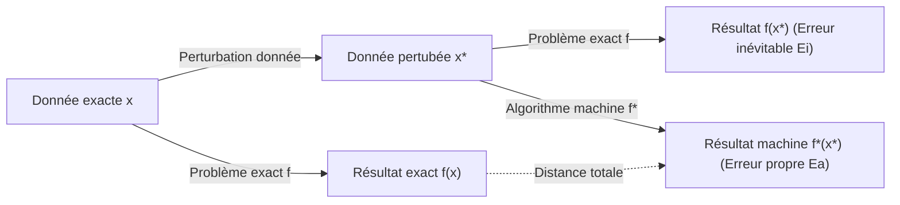
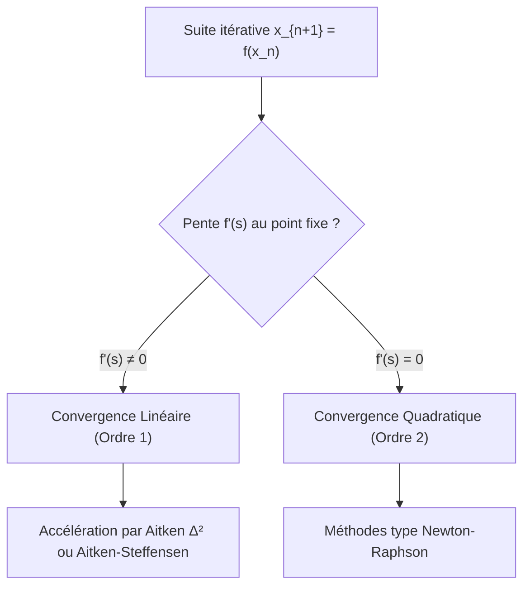

# CM 3 & TD 1 : Propagation d'Erreurs, Conditionnement et Résolution d'Équations Non Linéaires

:::neutral
Ce document regroupe et complète l'intégralité des notes manuscrites du **troisième Cours Magistral (CM 3)** et du **premier Travaux Dirigés (TD 1)** du module **MA 347 / MT 461 (Calcul Scientifique)**. Il aborde l'analyse quantitative de la propagation des erreurs, la distinction fondamentale entre conditionnement et stabilité numérique, l'outil des graphes de calcul, ainsi que l'étude des méthodes itératives non linéaires avancées (Sécante, Newton-Raphson et accélération d'Aitken-Steffensen).
:::

---

## Partie 1 : Notes du CM 3 — Propagation d'Erreurs et Conditionnement

### 1. Propagation des erreurs à travers les fonctions scalaires

Soit $x$ la valeur exacte d'un paramètre et $\hat{x} = x + \delta x = x(1 + \rho(x))$ sa valeur approchée en machine, avec :
* $\delta x = \hat{x} - x$ : l'erreur absolue sur $x$.
* $\rho(x) = \frac{\delta x}{x}$ : l'erreur relative sur $x$.

#### A. Linéarisation par développement de Taylor
Soit $f : \mathbb{R} \to \mathbb{R}$ une fonction de classe $\mathcal{C}^1$ au voisinage de $x \neq 0$ avec $f(x) \neq 0$. Par développement de Taylor au premier ordre :

\\[f(\hat{x}) = f(x + \delta x) = f(x) + f'(x) \delta x + o(\delta x)\\]

L'erreur absolue sur l'image $f(x)$ s'écrit :
\\[\delta(f(x)) = f(\hat{x}) - f(x) \simeq f'(x) \delta x\\]

L'erreur relative sur l'image $\rho(f(x))$ devient :
\\[\rho(f(x)) = \frac{\delta(f(x))}{f(x)} \simeq \frac{f'(x) \delta x}{f(x)} = \left( \frac{x f'(x)}{f(x)} \right) \frac{\delta x}{x} = C_{f}(x) \cdot \rho(x)\\]

:::definition
#### Coefficient de propagation d'une fonction
Le **coefficient de propagation de l'erreur relative** de la fonction $f$ au point $x$ est défini par :

\\[C_{f}(x) = \frac{x f'(x)}{f(x)}\\]

Il indique par quel facteur l'erreur relative sur la donnée d'entrée $x$ est multipliée lors de l'évaluation de $f(x)$.
:::

#### B. Exemples usuels de coefficients de propagation
1. **Racine carrée $f(x) = \sqrt{x}$** (pour $x > 0$) :
   \\[f'(x) = \frac{1}{2\sqrt{x}} \implies C_{f}(x) = \frac{x \cdot \frac{1}{2\sqrt{x}}}{\sqrt{x}} = \frac{1}{2}\\]
   * **Propriété** : L'extraction de racine carrée **divise par 2** l'erreur relative initiale. L'opération est très fortement amortie.

2. **Puissance $f(x) = x^p$** ($p \in \mathbb{R}^*$) :
   \\[f'(x) = p x^{p-1} \implies C_{f}(x) = \frac{x \cdot p x^{p-1}}{x^p} = p\\]
   * **Propriété** : L'erreur relative est multipliée par l'exposant $p$.

3. **Composition de fonctions $h(x) = (g \circ f)(x) = g(f(x))$** :
   Par la règle de dérivation en chaîne $h'(x) = f'(x) g'(f(x))$ :
   \\[\rho((g \circ f)(x)) \simeq \left( \frac{f(x) g'(f(x))}{g(f(x))} \right) \cdot \left( \frac{x f'(x)}{f(x)} \right) \cdot \rho(x) = C_g(f(x)) \cdot C_f(x) \cdot \rho(x)\\]
   * **Propriété** : Les coefficients de propagation des fonctions composées **se multiplient**.

---

### 2. Conditionnement d'un problème vs Stabilité d'un algorithme

:::definition
#### Erreur Inévitable ($E_i$) et Erreur d'Algorithme ($E_a$)
Lors du calcul numérique d'une grandeur $y = f(x)$ :
1. **Conditionnement du problème (Erreur inévitable $E_i$)** : Mesure la sensibilité intrinsèque de la solution exacte $f(x)$ aux perturbations des données d'entrée $x$. Un problème est dit **mal conditionné** si une infime variation sur $x$ entraîne une variation massive sur $f(x)$ ($|E_i| \gg 1$).
2. **Stabilité numérique de l'algorithme (Erreur d'algorithme $E_a$)** : Mesure les erreurs d'arrondis propres injectées par la suite d'opérations élémentaires de l'algorithme $f^*$. Un algorithme est dit **numériquement stable** si $|E_a| \le |E_i|$.
:::

#### Majoration par l'inégalité triangulaire
Soit $f(x)$ la fonction mathématique exacte, $f(x^*)$ la valeur exacte calculée sur la donnée perturbée $x^*$, et $f^*(x^*)$ la valeur produite en machine par l'algorithme :

\\[d(f(x), f^*(x^*)) \le \underbrace{d(f(x), f(x^*))}_{\text{Conditionnement } (E_i)} + \underbrace{d(f(x^*), f^*(x^*))}_{\text{Stabilité de l'algorithme } (E_a)}\\]

---

### 3. Étude comparative : Calcul de $f(a, b) = a^2 - b^2$

Pour évaluer $z = a^2 - b^2$ ($a, b > 0$), étudions deux algorithmes mathématiquement équivalents :

#### A. Algorithme I (Naïf) : $z = a^2 - b^2$
* **Graphe de calcul** :
  1. $x_1 = a \times a \implies \rho(x_1) = 2\rho(a) + \rho_1$
  2. $x_2 = b \times b \implies \rho(x_2) = 2\rho(b) + \rho_2$
  3. $x_3 = x_1 - x_2 \implies \rho(x_3) = \frac{x_1}{x_1-x_2} \rho(x_1) - \frac{x_2}{x_1-x_2} \rho(x_2) + \rho_3$

* **Développement complet de l'erreur relative** :
  \\[\rho^I(x_3) = \underbrace{\frac{2a^2}{a^2-b^2} \rho(a) - \frac{2b^2}{a^2-b^2} \rho(b)}_{\text{Erreur inévitable } E_i} + \underbrace{\frac{a^2}{a^2-b^2} \rho_1 - \frac{b^2}{a^2-b^2} \rho_2 + \rho_3}_{\text{Erreur propre à l'algorithme } E_a}\\]

:::warning
#### Instabilité de l'Algorithme I
Lorsque $a \approx b$, le dénominateur $a^2 - b^2 \to 0$. L'erreur propre à l'algorithme $E_a$ tend vers l'infini : **l'Algorithme I est numériquement instable** en raison de l'annihilation lors de la soustraction finale.
:::

#### B. Algorithme II (Factorisé) : $z = (a - b)(a + b)$
* **Graphe de calcul** :
  1. $y_1 = a - b \implies \rho(y_1) = \frac{a}{a-b}\rho(a) - \frac{b}{a-b}\rho(b) + \tilde{\rho}_1$
  2. $y_2 = a + b \implies \rho(y_2) = \frac{a}{a+b}\rho(a) + \frac{b}{a+b}\rho(b) + \tilde{\rho}_2$
  3. $y_3 = y_1 \times y_2 \implies \rho(y_3) = \rho(y_1) + \rho(y_2) + \tilde{\rho}_3$

* **Développement complet de l'erreur relative** :
  \\[\rho^{II}(y_3) = \underbrace{\frac{2a^2}{a^2-b^2} \rho(a) - \frac{2b^2}{a^2-b^2} \rho(b)}_{\text{Erreur inévitable } E_i} + \underbrace{\tilde{\rho}_1 + \tilde{\rho}_2 + \tilde{\rho}_3}_{\text{Erreur propre à l'algorithme } E_a}\\]

:::theorem
#### Stabilité Numérique de l'Algorithme II
Dans l'Algorithme II, l'erreur propre de calcul vaut $|E_a| = |\tilde{\rho}_1 + \tilde{\rho}_2 + \tilde{\rho}_3| \le 3h$ (où $h$ est la précision machine).
Cette erreur est **totalement indépendante de la proximité entre $a$ et $b$** : **l'Algorithme II est numériquement stable**.
:::

---

## Partie 2 : Notes du TD 1 — Exercices Corrigés d'Analyse d'Erreurs

:::exercise
#### Exercice 1 : Arithmétique b-aire et représentations (Base 7)
Soit la représentation flottante normalisée en base $\beta = 7$, avec $t = 5$ digits de mantisse et $e$ codé sur $4$ bits.

1. **Exposants extrêmes ($e_m, e_M$)** :
   En complément à 2 sur 4 bits : $e \in [-2^3, 2^3 - 1] = [-8, 7] \implies e_m = -8, \, e_M = 7$.
2. **Nombres extrêmes en valeur absolue ($x_m, x_M$)** :
   * $x_m = b^{-1} \cdot b^{e_m} = 7^{-1} \cdot 7^{-8} = 7^{-9} \approx 2,478 \times 10^{-8}$.
   * $x_M = (1 - 7^{-5}) \cdot 7^7 = 7^7 - 7^2 = 823543 - 49 = 823494$.
3. **Cardinal de l'ensemble machine $\#(\mathbb{M})$** :
   \\[\#(\mathbb{M}) = 1 + 2 \cdot (b-1) \cdot b^{t-1} \cdot (e_M - e_m + 1) = 1 + 2 \cdot (6) \cdot 7^4 \cdot (7 - (-8) + 1) = 1 + 12 \cdot 2401 \cdot 16 = 461\,001\\]
4. **Précision machine $h$ (mode Chopping)** :
   \\[h = b^{1-t} = 7^{-4} = \frac{1}{2401} \approx 4,1649 \times 10^{-4}\\]
5. **Représentation de $1/3$ et $-4/7$ en Chopping** :
   * En base 7, $1/3 = 0,22222\dots_7 = +0,22222_7 \times 7^0$.
     $\text{fl}(1/3) = 0,22222_7 = \sum_{i=1}^5 2 \cdot 7^{-i} = \frac{2}{7} \frac{1 - 7^{-5}}{1 - 7^{-1}} = \frac{1}{3}(1 - 7^{-5})$.
     Erreur absolue : $\delta = \frac{1}{3} \cdot 7^{-5}$. Erreur relative : $\rho = 7^{-5} \approx 5,95 \times 10^{-5} \le h$.
   * $-4/7 = -0,40000_7 \times 7^0$ : représentable **exactement** (erreur nulle).
:::

:::exercise
#### Exercice 2 : Équation du second degré $x^2 + 2px - q = 0$ ($q \ge 0$)
On cherche la plus grande racine réelle $x_M = -p + \sqrt{p^2 + q}$.

1. **Conditionnement du problème** :
   Calcul des coefficients de propagation par dérivées partielles :
   \\[C_p = \frac{p \frac{\partial x_M}{\partial p}}{x_M} = \frac{p \left(-1 + \frac{p}{\sqrt{p^2+q}}\right)}{-p + \sqrt{p^2+q}} = -\frac{p}{\sqrt{p^2+q}}\\]
   \\[C_q = \frac{q \frac{\partial x_M}{\partial q}}{x_M} = \frac{q \left(\frac{1}{2\sqrt{p^2+q}}\right)}{-p + \sqrt{p^2+q}} = \frac{q}{2\sqrt{p^2+q}(\sqrt{p^2+q}-p)} = \frac{\sqrt{p^2+q}+p}{2\sqrt{p^2+q}}\\]
   * Si $p > 0$ et $p^2 \gg q$, $\sqrt{p^2+q} - p \to 0$ : le problème de calculer $x_M$ par la formule directe est **mal conditionné** (annihilation entre $-p$ et $\sqrt{p^2+q}$).

2. **Algorithme stable alternatif** :
   En multipliant par la quantité conjuguée :
   \\[x_M = \frac{(-p + \sqrt{p^2+q})(-p - \sqrt{p^2+q})}{-p - \sqrt{p^2+q}} = \frac{q}{p + \sqrt{p^2+q}}\\]
   Dans cette seconde formulation, le dénominateur contient une **addition de deux termes de même signe** ($p + \sqrt{p^2+q} > 0$), éliminant tout risque d'annihilation. L'algorithme est numériquement stable pour toutes valeurs de $p, q \ge 0$.
:::

---

## Partie 3 : Notes du CM 3 (Suite) — Résolution d'Équations Non Linéaires

Dans la recherche des racines de $F(x) = 0 \iff x = f(x)$, nous analysons la rapidité de convergence des suites itératives $x_{n+1} = f(x_n)$.

---

### 1. Vitesse, Ordre et Gain en Chiffres Significatifs

Soit $e_n = x_n - s$ l'erreur à l'étape $n$. On note $N_n = \log_{10} \left| \frac{s}{e_n} \right|$ le nombre de chiffres significatifs exacts en base 10.

#### A. Définition de Schroeder (1870)
Pour une suite stationnaire $x_{n+1} = f(x_n)$ avec $f$ suffisamment régulière :
Si $f'(s) = f''(s) = \dots = f^{(m-1)}(s) = 0$ et $f^{(m)}(s) \neq 0$, alors par développement de Taylor :

\\[e_{n+1} \sim \frac{f^{(m)}(s)}{m!} e_n^m \implies \lim_{n \to \infty} \frac{e_{n+1}}{e_n^m} = C \neq 0\\]

:::theorem
#### Évolution du nombre de chiffres significatifs
* **Ordre 1 ($m = 1$, linéaire)** :
  \\[N_{n+1} \sim N_n - \log_{10}|f'(s)|\\]
  À chaque itération, on **ajoute un nombre constant** $R = -\log_{10}|f'(s)|$ de décimales exactes.
* **Ordre supérieur ($m > 1$, superlinéaire / quadratique)** :
  \\[N_{n+1} \sim m \cdot N_n - \log_{10} |C|\\]
  À chaque itération, le nombre de chiffres significatifs exacts est **multiplié par $m$** (ex. pour $m=2$, on double le nombre de décimales exactes à chaque pas).
:::

#### B. Définition générale de Traub (1964)
Une suite convergente $(x_n) \to s$ est d'ordre $p \ge 1$ au sens de Traub si :
\\[\lim_{n \to \infty} \frac{|e_{n+1}|}{|e_n|^p} = C \in ]0, +\infty[\\]
*(Remarque : $p$ n'est pas nécessairement un nombre entier, comme pour la méthode de la sécante où $p \approx 1,618$).*

---

### 2. Méthodes d'Accélération de Convergence

#### A. Procédé $\Delta^2$ d'Aitken (1926)
Soit une suite $(x_n) \to s$ à convergence linéaire ($e_{n+1} \sim \lambda e_n$ avec $|\lambda| < 1$).
En écrivant $x_{n+1} - s \approx \lambda(x_n - s)$ et $x_{n+2} - s \approx \lambda(x_{n+1} - s)$, l'élimination de $\lambda$ fournit l'estimateur accéléré :

\\[x'_n = x_n - \frac{(\Delta x_n)^2}{\Delta^2 x_n} = \frac{x_n x_{n+2} - x_{n+1}^2}{x_{n+2} - 2x_{n+1} + x_n}\\]
où $\Delta x_n = x_{n+1} - x_n$ et $\Delta^2 x_n = x_{n+2} - 2x_{n+1} + x_n$.

:::method
#### Propriété d'Invariance par Translation
Le procédé d'Aitken est invariant par translation : si $\tilde{x}_n = x_n - h$, alors $\tilde{x}'_n = x'_n - h$.
**Application pratique** : Lorsque quelques décimales sont stabilisées (ex. $h = 2,273$), on peut mémoriser $h$, travailler sur le résidu petit $\tilde{x}_n = x_n - h$, et **dépasser la limite de précision machine** en évitant le phénomène d'annihilation.
:::

#### B. Algorithme d'Aitken-Steffensen (1933)
Appliqué en cascade à une récurrence de point fixe $x_{n+1} = f(x_n)$, le schéma s'écrit :

\\[x_{n+1}^* = x_n - \frac{(f(x_n) - x_n)^2}{f(f(x_n)) - 2f(x_n) + x_n}\\]

:::theorem
#### Gain d'ordre de Steffensen
Si la suite initiale $x_{n+1} = f(x_n)$ est à convergence **linéaire** ($f'(s) \neq 0$), l'algorithme d'Aitken-Steffensen devient **automatiquement d'ordre 2 (quadratique)**.
**Avantage clé** : Garantit une convergence quadratique avec seulement 2 évaluations de $f$ par pas et **sans aucun calcul de dérivée $f'$**.
:::

---

### 3. Synthèse des Méthodes Itératives pour $F(x) = 0$

Pour résoudre $F(x) = 0$, on adapte la pente $\mu_k$ dans la formule générale $x_{k+1} = x_k - \frac{F(x_k)}{\mu_k}$ :

| Méthode | Choix de la pente $\mu_k$ | Formule itérative | Ordre $p$ | Coût par pas |
| :--- | :---: | :--- | :---: | :---: |
| **Corde Parallèle** | $\mu_k = \tan \phi = \text{cte}$ | $x_{k+1} = x_k - \frac{F(x_k)}{\tan \phi}$ | $p = 1$ | 1 éval. de $F$ |
| **Sécante** | $\mu_k = \frac{F(x_k) - F(x_{k-1})}{x_k - x_{k-1}}$ | $x_{k+1} = x_k - F(x_k) \frac{x_k - x_{k-1}}{F(x_k) - F(x_{k-1})}$ | $p = \frac{1+\sqrt{5}}{2} \approx 1,618$ | 1 éval. de $F$ |
| **Newton-Raphson** | $\mu_k = F'(x_k)$ | $x_{k+1} = x_k - \frac{F(x_k)}{F'(x_k)}$ | $p = 2$ | 1 éval. $F$, 1 éval. $F'$ |

:::remember
#### Remarques sur Newton-Raphson
1. **Racines multiples** : Si $s$ est de multiplicité $m > 1$ ($F(s) = \dots = F^{(m-1)}(s) = 0$), Newton classique chute à un ordre 1. On restaure l'ordre 2 via la formule modifiée :
   \\[x_{k+1} = x_k - m \frac{F(x_k)}{F'(x_k)}\\]
2. **Propriété Auto-Correctrice Machine** : Les erreurs d'arrondis injectées lors des itérations précédentes sont effacées asymptotiquement car le coefficient de propagation $f'(z_k) \to f'(s) = 0$.
:::

---

🎯 **Prochaine étape suggérée** : Préparer une fiche de synthèses d'exercices d'examen sur la propagation d'erreurs et Newton-Raphson, ou aborder la rédaction du support du **TD 2 (Résolution d'équations non linéaires)**.
