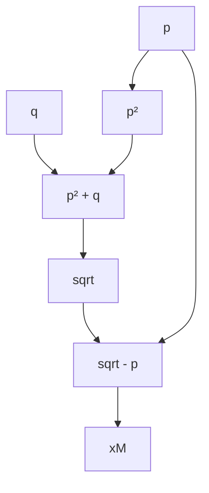

:::quicklinks
- [Exercice 1 : Arithmétique flottante en base 7](#mt461-td1-ex1)
- [Exercice 2 : Résolution d'une équation du 2nd degré, stabilité et conditionnement](#mt461-td1-ex2)
- [Exercice 3 : Sensibilité de fonctions et étude comparative de formules](#mt461-td1-ex3)
- [Exercice 4 : Conditionnement et stabilité de $\sqrt{x+1} - \sqrt{x}$](#mt461-td1-ex4)
- [Exercice 5 : Conditionnement d'une fonction exponentielle trigonométrique](#mt461-td1-ex5)
- [Exercice 6 : Sens de sommation et accumulation d'erreurs d'arrondi](#mt461-td1-ex6)
- [Exercice 7 : Instabilité par récurrence et mode parasite](#mt461-td1-ex7)
:::

:::block type="neutral" title="Présentation du TD"
Ce document regroupe l'**énoncé complet** et la **correction détaillée et expliquée** du TD N°1 du cours de Calcul Scientifique (MA 347 / MT 461). Chaque exercice comporte un rappel des notions théoriques clés, la démarche pas à pas et l'interprétation numérique des résultats.
:::

---

:::section id="mt461-td1-ex1" eyebrow="Exercice 1" title="Arithmétique flottante en base 7"

:::exercise label="Exercice 1" title="Énoncé"
On considère une représentation en virgule flottante normalisée en base $\beta = 7$, avec $t = 5$ digits dans la mantisse et un exposant $e$ codé sur $p = 4$ bits.

1. Quels sont le plus grand exposant, $e_M$, et le plus petit exposant, $e_m$, dans cette représentation ?
2. Calculer la valeur, $x_m$, du plus petit nombre machine en valeur absolue, et la valeur, $x_M$, du plus grand nombre machine en valeur absolue.
3. Calculer le nombre de nombres réels que l'on peut représenter exactement, c'est-à-dire le nombre de nombres machine, $\#(\mathbb{M})$.
4. Calculer la précision machine, notée $h$.
5. Déterminer les distances entre 2 nombres machines consécutifs d'exposant $e$ pour $e \in [e_m, e_M]$.
6. Donner les représentations dans cette arithmétique en virgule flottante des nombres réels $\frac{1}{3}$ et $-\frac{4}{7}$ (exposants et mantisses), en utilisant l'approximation par troncature (technique dite de « *chopping* »). Calculer les erreurs d'arrondis correspondantes, absolues et relatives.
:::

---

:::block type="method" title="Correction détaillée de l’exercice 1"

#### 1. Détermination des exposants extrêmes $e_m$ et $e_M$

:::block type="warning" title="Convention retenue : exposant biaisé avec codes réservés"
Pour cette correction, on adopte un codage pédagogique **inspiré d’IEEE 754** : biais $B=2^{p-1}-1=7$, code `0000` réservé aux zéros et subnormaux, code `1111` réservé aux infinis et NaN. Les codes des nombres normalisés vont de `0001` à `1110`.

Le modèle reste en **base 7**, avec la mantisse $0.d_1d_2d_3d_4d_5$ de l’énoncé ; ce n’est pas un format IEEE 754 standard. On définit ici explicitement $e=E-B$ pour cette écriture. Voir les [conventions du cours](MT461-Methode-numerique.html#mt461-module-1).
:::

:::block type="definition" title="Bornes des exposants normalisés"
Avec $p=4$, le biais vaut $B=7$ et les exposants stockés utilisables vérifient $1 \le E \le 14$. Ainsi :

$$e_m=1-7=-6, \quad e_M=14-7=7.$$

Il y a $14-1+1=14$ exposants normalisés, les deux autres codes étant réservés.
:::

* **Plus petit exposant** : $e_m = -6$
* **Plus grand exposant** : $e_M = 7$

---

#### 2. Plus petit et plus grand nombre machine ($x_m$ et $x_M$)

Tout nombre en virgule flottante normalisée non nul s'écrit :
$$x = \pm 0.d_1 d_2 d_3 d_4 d_5 \times \beta^e \quad \text{avec } d_1 \in \{1, \dots, \beta-1\} \text{ et } d_i \in \{0, \dots, \beta-1\} \text{ pour } i \ge 2$$

* **Plus petit nombre normalisé positif $x_m$** :
  Il est obtenu avec le signe $+$, la plus petite mantisse normalisée possible ($d_1 = 1, d_2 = d_3 = d_4 = d_5 = 0$) et le plus petit exposant $e_m = -6$ :
  $$x_m = 0.10000_7 \times 7^{-6} = 1 \cdot 7^{-1} \cdot 7^{-6} = 7^{-7}$$
  En base 10, sa valeur vaut :
  $$x_m = 7^{-7} = \frac{1}{823543} \approx 1.2143 \times 10^{-6}$$

* **Plus grand nombre machine positif $x_M$** :
  Il est obtenu avec la plus grande mantisse possible ($d_1 = d_2 = d_3 = d_4 = d_5 = 6$) et le plus grand exposant $e_M = 7$ :
  $$x_M = 0.66666_7 \times 7^7 = \left(1 - 7^{-5}\right) \times 7^7 = 7^7 - 7^2$$
  Calcul exact :
  $$7^7 = 823543 \quad \text{et} \quad 7^2 = 49 \implies x_M = 823543 - 49 = 823494$$

---

#### 3. Cardinalité de l'ensemble machine $\#(\mathbb{M})$

:::block type="theorem" title="Formule de dénombrement des nombres machines"
On compte ici les nombres normalisés et zéro (une seule valeur réelle), en excluant les subnormaux, les infinis et NaN. Pour ce sous-ensemble d’un système $\text{FP}(\beta, t, e_m, e_M)$ le cardinal est :
$$\#(\mathbb{M}) = 1 + 2 \cdot (\beta - 1) \cdot \beta^{t-1} \cdot (e_M - e_m + 1)$$
* **$1$** représente le zéro.
* **$2$** tient compte des deux signes ($\pm$).
* **$\beta - 1$** est le nombre de choix pour le premier chiffre non nul $d_1$.
* **$\beta^{t-1}$** est le nombre de combinaisons pour les $t-1$ chiffres suivants.
* **$e_M - e_m + 1$** est le nombre total d'exposants distincts.
:::

Application numérique avec $\beta = 7$, $t = 5$, $e_m = -6$, $e_M = 7$ ($e_M - e_m + 1 = 14$) :
$$\#(\mathbb{M}) = 1 + 2 \times (7 - 1) \times 7^{5-1} \times (7 - (-6) + 1)$$
$$\#(\mathbb{M}) = 1 + 2 \times 6 \times 7^4 \times 14 = 1 + 12 \times 2401 \times 14 = 1 + 403368 = 403369$$

---

#### 4. Précision machine $h$

:::block type="definition" title="Précision machine (unit roundoff)"
En mode de troncature (*chopping*), la précision machine $h$ représente le majorant de l'erreur relative de représentation pour les réels non nuls dans le domaine normalisé, hors dépassement de capacité et sous-flux :
$$h = \beta^{1-t}$$
:::

Pour $\beta = 7$ et $t = 5$ :
$$h = 7^{1-5} = 7^{-4} = \frac{1}{2401} \approx 4.1649 \times 10^{-4}$$

---

#### 5. Distance entre deux nombres machines consécutifs

Pour un exposant fixé $e$, la distance (ou pas de la grille de discrétisation) entre deux réels représentables consécutifs est constante et vaut :
$$\Delta x(e) = \beta^{e-t} = 7^{e-5}$$

* Pour le plus petit exposant $e_m = -6$ : $\Delta x(-6) = 7^{-11} \approx 5.0573 \times 10^{-10}$.
* Pour l'exposant $e = 0$ : $\Delta x(0) = 7^{-5} = \frac{1}{16807} \approx 5.95 \times 10^{-5}$.
* Pour le plus grand exposant $e_M = 7$ : $\Delta x(7) = 7^{7-5} = 7^2 = 49$.

---

#### 6. Représentation et calcul des erreurs pour $1/3$ et $-4/7$

##### A. Pour $x = \frac{1}{3}$ :
Décomposons $\frac{1}{3}$ en base 7 :
$$\frac{1}{3} = \frac{2}{7} + \frac{2}{49} + \frac{2}{343} + \dots = 0.22222\dots_7 \times 7^0$$

En gardant $t = 5$ digits par *chopping* :
$$\text{fl}\left(\frac{1}{3}\right) = 0.22222_7 \times 7^0$$
Exposant $e = 0$, mantisse $m = .22222_7$.

Convertissons le représentant machine en fraction exacte :
$$x_c = 2 \sum_{k=1}^5 7^{-k} = 2 \cdot \frac{7^{-1} (1 - 7^{-5})}{1 - 7^{-1}} = \frac{1}{3}\left(1 - 7^{-5}\right)$$

* **Erreur absolue** :
  $$\delta = \left| x - x_c \right| = \left| \frac{1}{3} - \frac{1}{3}(1 - 7^{-5}) \right| = \frac{1}{3} 7^{-5} = \frac{1}{50421} \approx 1.983 \times 10^{-5}$$
* **Erreur relative** :
  $$\rho = \frac{\delta}{|x|} = \frac{\frac{1}{3} 7^{-5}}{\frac{1}{3}} = 7^{-5} \approx 5.9499 \times 10^{-5}$$
  On vérifie bien que $\rho = 7^{-5} \le h = 7^{-4} \approx 4.16 \times 10^{-4}$.

##### B. Pour $y = -\frac{4}{7}$ :
Décomposons $-\frac{4}{7}$ en base 7 :
$$y = -0.4_7 \times 7^0 = -0.40000_7 \times 7^0$$

Sa représentation s'arrête exactement au premier digit :
$$\text{fl}(y) = -0.40000_7 \times 7^0$$
Exposant $e = 0$, mantisse $m = -.40000_7$.

* **Erreur absolue** : $\delta = 0$
* **Erreur relative** : $\rho = 0$
(Le nombre est exactement représentable dans cette arithmétique).

---

:::

:::

:::section id="mt461-td1-ex2" eyebrow="Exercice 2" title="Résolution d'une équation du 2nd degré, stabilité et conditionnement"

:::exercise label="Exercice 2" title="Énoncé"
On se propose de calculer la plus grande racine réelle $x_M$ de l'équation du second ordre :
$$x^2 + 2px - q = 0 \quad \text{avec } p, q \in \mathbb{R} \text{ et } q \ge 0$$

1. Calculer l'erreur propagée depuis les données (erreur inévitable) correspondant au calcul de $x_M$. Y a-t-il des valeurs des données $p$ et $q$ pour lesquelles ce problème est mal conditionné ?
2. Proposer un algorithme de calcul direct de la solution $x_M$ fondé sur l'évaluation de l'expression exacte $x_M := -p + \sqrt{p^2 + q}$ et établir le graphe de calcul correspondant.
3. En déduire l'expression de l'erreur relative totale sur le résultat. Préciser les parties de cette erreur correspondantes à l'erreur inévitable et à l'erreur propre à l'algorithme. Pour quelles valeurs de $p$ et $q$ l'algorithme est-il instable ?
4. Pour les valeurs des paramètres $p$ et $q$ pour lesquelles l'algorithme proposé est instable, proposer un autre algorithme direct et montrer que celui-ci est numériquement stable.
:::

---

:::block type="method" title="Correction détaillée de l’exercice 2"

#### 1. Conditionnement du problème et erreur inévitable

La solution exacte considérée est la fonction $x_M(p, q) = -p + \sqrt{p^2 + q}$.

:::block type="definition" title="Rappel : Propagation différentielle des erreurs relatives"
Pour une fonction multivariable $f(p, q)$, l'erreur relative $g_f$ engendrée par les erreurs relatives sur les données $g_p = \frac{\delta p}{p}$ et $g_q = \frac{\delta q}{q}$ s'écrit au premier ordre :
$$g_f \approx \left( \frac{p}{f} \frac{\partial f}{\partial p} \right) g_p + \left( \frac{q}{f} \frac{\partial f}{\partial q} \right) g_q$$
:::

Calculons les dérivées partielles de $x_M$ :
$$\frac{\partial x_M}{\partial p} = -1 + \frac{p}{\sqrt{p^2 + q}} = \frac{p - \sqrt{p^2 + q}}{\sqrt{p^2 + q}} = -\frac{x_M}{\sqrt{p^2 + q}}$$
$$\frac{\partial x_M}{\partial q} = \frac{1}{2\sqrt{p^2 + q}}$$

Injectons ces dérivées dans la formule du coefficient de propagation :
$$g_{x_M} = \left( \frac{p}{x_M} \cdot \frac{-x_M}{\sqrt{p^2 + q}} \right) g_p + \left( \frac{q}{x_M} \cdot \frac{1}{2\sqrt{p^2 + q}} \right) g_q$$
$$g_{x_M} = \underbrace{\left( -\frac{p}{\sqrt{p^2 + q}} \right)}_{C_p} g_p + \underbrace{\left( \frac{q}{2 x_M \sqrt{p^2 + q}} \right)}_{C_q} g_q$$

Simplifions le coefficient $C_q$ en utilisant l'identité $x_M (p + \sqrt{p^2 + q}) = q \implies \frac{q}{x_M} = p + \sqrt{p^2 + q}$ :
$$C_q = \frac{p + \sqrt{p^2 + q}}{2\sqrt{p^2 + q}} = \frac{1}{2} \left( 1 + \frac{p}{\sqrt{p^2 + q}} \right)$$

##### Analyse du conditionnement :
* Pour tout $q \ge 0$, $\left| \frac{p}{\sqrt{p^2 + q}} \right| \le 1$.
* Ainsi, $|C_p| \le 1$ et $|C_q| \le 1$.
* **Conclusion** : Les coefficients de propagation sont toujours bornés par 1. Le problème mathématique du calcul de $x_M$ est donc **bien conditionné en erreur relative lorsque $q > 0$**. Pour $q = 0$ et $p \ge 0$, la racine vaut zéro : son erreur relative n’est pas définie. Pour $q = 0$ et $p < 0$, on utilise directement $x_M = -2p$.

---

#### 2. Algorithme direct et graphe de calcul

L'algorithme naïf $A_1$ évalue directement l'expression littérale :
$$x_M = -p + \sqrt{p^2 + q}$$

---

#### 3. Erreur propre à l'algorithme $A_1$ et instabilité numérique

Examinons la dernière opération de l'algorithme $A_1$ :
$$\text{SUB} = \sqrt{p^2 + q} - p$$

:::block type="warning" title="Phénomène d'annihilation (Soustraction de grandeurs très proches)"
Lorsque $p > 0$ et $p^2 \gg q$, la quantité $\sqrt{p^2 + q}$ est extrêmement proche de $p$ :
$$\sqrt{p^2 + q} = p \sqrt{1 + \frac{q}{p^2}} \approx p \left(1 + \frac{q}{2p^2}\right) = p + \frac{q}{2p}$$
On effectue alors la soustraction de deux nombres presque égaux : $\left(p + \frac{q}{2p}\right) - p = \frac{q}{2p} \to 0$.
:::

L'erreur propre introduite par cette soustraction lors du calcul machine est amplifiée par un facteur :
$$C_{\text{soustraction}} = \frac{\sqrt{p^2 + q}}{\sqrt{p^2 + q} - p} = \frac{\sqrt{p^2 + q}}{x_M} \approx \frac{p}{\frac{q}{2p}} = \frac{2p^2}{q} \gg 1$$

L'erreur relative totale sur l'algorithme $A_1$ s'écrit :
$$g_{\text{tot}} = \underbrace{g_{\text{inévitable}}}_{O(g_p, g_q)} + \underbrace{\frac{2p^2}{q} \cdot h}_{\text{Erreur propre d'algorithme}}$$

**Conclusion** : Pour $p > 0$ et $p^2 \gg q$, l'erreur propre domine largement l'erreur inévitable ($E_a \gg E_i$). L'algorithme direct $A_1$ est **numériquement instable**.

---

#### 4. Algorithme alternatif numériquement stable $A_2$

Pour lever l'instabilité liée à la soustraction, multiplions l'expression par sa quantité conjuguée :
$$x_M = \frac{(-p + \sqrt{p^2 + q})(p + \sqrt{p^2 + q})}{p + \sqrt{p^2 + q}} = \frac{(p^2 + q) - p^2}{p + \sqrt{p^2 + q}} = \frac{q}{p + \sqrt{p^2 + q}}$$

:::block type="method" title="Algorithme alternatif numériquement stable $A_2$"
$$x_M = \frac{q}{p + \sqrt{p^2 + q}}$$
:::

* Lorsque $p > 0$, le dénominateur $p + \sqrt{p^2 + q} \approx 2p$ réalise l'**addition de deux grandeurs positives de même signe**.
* Il n'y a plus aucune soustraction ni annihilation.
* L'erreur propre de cet algorithme reste de l'ordre de la précision machine $h$. En l’absence de dépassement de capacité ou de sous-flux, l’algorithme $A_2$ est **numériquement stable**.

---

:::

:::

:::section id="mt461-td1-ex3" eyebrow="Exercice 3" title="Sensibilité de fonctions et étude comparative de formules"

:::exercise label="Exercice 3" title="Énoncé"
1. Soit $f : \mathbb{R} \to \mathbb{R} : x \mapsto f(x)$ une application de classe $\mathcal{C}^2$. Soit $x_0 \in \mathbb{R}^*$ tel que $f(x_0) \neq 0$. Soit $\bar{x}_0 = x_0(1 + \rho_0)$ une valeur approchée de $x_0$. Montrer, en utilisant le développement de Taylor de $f$ au voisinage de $x_0$, que l'erreur relative sur $f(x_0)$ est donnée par :
   $$\rho(f(x_0)) = \frac{x_0 f'(x_0)}{f(x_0)} \rho_0 + O(\rho_0^2)$$
2. Soient les applications numériques :
   $$f_1(x_0) := (x_0 - 1)^6 \quad ; \quad f_2(x_0) := \left( \frac{1}{x_0 + 1} \right)^6 \quad ; \quad f_3(x_0) := 99 - 70x_0$$
   Montrer que ces applications ont la même valeur exacte $f_1(x_0) = f_2(x_0) = f_3(x_0)$ pour $x_0 = \sqrt{2}$.
3. Indiquer, pour chacune des fonctions $f_i(x_0 = \sqrt{2})$, la précision minimum nécessaire (nombre de chiffres significatifs ou erreur relative) sur $x_0$ pour représenter $f(x_0)$ à la précision machine en double précision ($h \approx 10^{-16}$). Quelle est la formule la plus intéressante ?
4. Calculer l'erreur propre à l'algorithme associé et discuter du conditionnement et de la stabilité numérique.
:::

---

:::block type="method" title="Correction détaillée de l’exercice 3"

#### 1. Démonstration de la formule du coefficient de propagation

Effectuons le développement de Taylor de $f$ au voisinage de $x_0$ pour l'argument perturbé $\bar{x}_0 = x_0 + x_0 \rho_0$ :
$$f(\bar{x}_0) = f(x_0 + x_0 \rho_0) = f(x_0) + (x_0 \rho_0) f'(x_0) + O((x_0 \rho_0)^2)$$

L'écart absolu sur le résultat est $\delta f = f(\bar{x}_0) - f(x_0) = x_0 \rho_0 f'(x_0) + O(\rho_0^2)$.

L'erreur relative sur $f(x_0)$ s'obtient en divisant par $f(x_0) \neq 0$ :
$$\rho(f(x_0)) = \frac{f(\bar{x}_0) - f(x_0)}{f(x_0)} = \frac{x_0 f'(x_0)}{f(x_0)} \rho_0 + O(\rho_0^2)$$

:::block type="definition" title="Coefficient de propagation"
La grandeur $C_f(x_0) = \frac{x_0 f'(x_0)}{f(x_0)}$ représente le facteur d'amplification de l'erreur relative sur la donnée $x_0$.
:::

---

#### 2. Égalité des trois expressions en $x_0 = \sqrt{2}$

Calculons la valeur exacte de chaque fonction en $x_0 = \sqrt{2}$ :

* **Pour $f_1(\sqrt{2})$** :
  Remarquons que $(\sqrt{2} - 1)^2 = 2 - 2\sqrt{2} + 1 = 3 - 2\sqrt{2}$.
  $$f_1(\sqrt{2}) = (\sqrt{2} - 1)^6 = \left( (3 - 2\sqrt{2}) \right)^3 = (3 - 2\sqrt{2})(17 - 12\sqrt{2}) = 99 - 70\sqrt{2}$$

* **Pour $f_2(\sqrt{2})$** :
  Multiplions le numérateur et le dénominateur de $\frac{1}{\sqrt{2} + 1}$ par la quantité conjuguée $\sqrt{2} - 1$ :
  $$\frac{1}{\sqrt{2} + 1} = \frac{\sqrt{2} - 1}{(\sqrt{2} + 1)(\sqrt{2} - 1)} = \sqrt{2} - 1$$
  $$f_2(\sqrt{2}) = \left(\frac{1}{\sqrt{2} + 1}\right)^6 = (\sqrt{2} - 1)^6 = 99 - 70\sqrt{2}$$

* **Pour $f_3(\sqrt{2})$** :
  Par définition directe de l'expression :
  $$f_3(\sqrt{2}) = 99 - 70\sqrt{2}$$

Toutes trois ont pour valeur exacte :
$$f_1(\sqrt{2}) = f_2(\sqrt{2}) = f_3(\sqrt{2}) = 99 - 70\sqrt{2} \approx 0.005050633883$$

---

#### 3. Calcul des coefficients de propagation et précision requise

Calculons $C_{f_i}(x) = \frac{x f_i'(x)}{f_i(x)}$ pour chacune des trois fonctions en $x_0 = \sqrt{2}$ :

1. **Pour $f_1(x) = (x - 1)^6$** :
   $$f_1'(x) = 6(x - 1)^5 \implies C_1(x) = \frac{x \cdot 6(x - 1)^5}{(x - 1)^6} = \frac{6x}{x - 1}$$
   En $x_0 = \sqrt{2}$ :
   $$C_1(\sqrt{2}) = \frac{6\sqrt{2}}{\sqrt{2} - 1} = 6\sqrt{2}(\sqrt{2} + 1) = 12 + 6\sqrt{2} \approx 20.485$$

2. **Pour $f_2(x) = (x + 1)^{-6}$** :
   $$f_2'(x) = -6(x + 1)^{-7} \implies C_2(x) = \frac{x \cdot (-6)(x + 1)^{-7}}{(x + 1)^{-6}} = \frac{-6x}{x + 1}$$
   En $x_0 = \sqrt{2}$ :
   $$C_2(\sqrt{2}) = \frac{-6\sqrt{2}}{\sqrt{2} + 1} = -6\sqrt{2}(\sqrt{2} - 1) = -12 + 6\sqrt{2} \approx -3.515$$

3. **Pour $f_3(x) = 99 - 70x$** :
   $$f_3'(x) = -70 \implies C_3(x) = \frac{-70x}{99 - 70x}$$
   En $x_0 = \sqrt{2}$ :
   $$C_3(\sqrt{2}) = \frac{-70\sqrt{2}}{99 - 70\sqrt{2}} \approx \frac{-98.994949}{0.005050633883} \approx -1.9601 \times 10^4$$

##### Précision nécessaire sur $x_0$ pour obtenir la précision machine $h \approx 10^{-16}$ :
On cherche $|\rho_0|$ tel que $|C_i| \cdot |\rho_0| \le 10^{-16} \implies |\rho_0| \le \frac{10^{-16}}{|C_i|}$.

* **Pour $f_1$** : $|\rho_0| \le \frac{10^{-16}}{20.485} \approx 4.88 \times 10^{-18}$
* **Pour $f_2$** : $|\rho_0| \le \frac{10^{-16}}{3.515} \approx 2.84 \times 10^{-17}$
* **Pour $f_3$** : $|\rho_0| \le \frac{10^{-16}}{1.9601 \times 10^4} \approx 5.10 \times 10^{-21}$

:::block type="remember" title="Formule la plus intéressante"
La formule **$f_2(x)$** est de loin la plus intéressante : son coefficient de propagation est le plus faible en valeur absolue ($|C_2| \approx 3.515$), ce qui limite le plus leur amplification et tolère la contrainte la moins sévère sur la précision de $x_0$.
:::

---

#### 4. Analyse de l'erreur propre à l'algorithme et de la stabilité

* **Formule $f_3(x) = 99 - 70x$** :
  L'algorithme calcule $\alpha = 70 \times \sqrt{2} \approx 98.99495$, puis effectue la soustraction $99 - 98.99495$. C'est une **annihilation massive** qui détruit environ 4 chiffres significatifs. Le problème est extrêmement mal conditionné et l'algorithme instable.
* **Formule $f_2(x) = \left(\frac{1}{x+1}\right)^6$** :
  L'algorithme calcule l'addition $x + 1 \approx 2.4142$ (pas d'annihilation), prend l'inverse puis élève à la puissance 6. L'erreur propre à cet algorithme est minimale : il est **très stable numériquement**.

---

:::

:::

:::section id="mt461-td1-ex4" eyebrow="Exercice 4" title="Conditionnement et stabilité de $\sqrt{x+1} - \sqrt{x}$"

:::exercise label="Exercice 4" title="Énoncé"
On considère l'application $f : \mathbb{R}^+ \to \mathbb{R} : x \mapsto f(x) := \sqrt{x+1} - \sqrt{x}$.

1. Évaluer le conditionnement de $f(x)$ pour $x \in \mathbb{R}^+$.
2. Proposer un algorithme naïf $f^*(x)$ pour calculer $f(x)$ reposant sur l'évaluation littérale directe de l'expression.
3. Évaluer $f^*(12345)$ en simple et en double précision. Conclure sur le conditionnement de $f(x)$ et la stabilité numérique de $f^*(x)$ pour $x = 12345$. Quelle est l'origine de l'instabilité numérique ?
4. Proposer un algorithme alternatif $\tilde{f}(x)$ numériquement stable pour $x = 12345$. Évaluer l'erreur propre à l'algorithme $\tilde{f}$ et la comparer à l'erreur inévitable.
:::

---

:::block type="method" title="Correction détaillée de l’exercice 4"

#### 1. Conditionnement mathématique de $f(x)$

Calculons le coefficient de propagation $C_f(x) = \frac{x f'(x)}{f(x)}$ :
$$f'(x) = \frac{1}{2\sqrt{x+1}} - \frac{1}{2\sqrt{x}} = \frac{\sqrt{x} - \sqrt{x+1}}{2\sqrt{x(x+1)}} = -\frac{f(x)}{2\sqrt{x(x+1)}}$$

$$\implies C_f(x) = \frac{x \cdot \left( -\frac{f(x)}{2\sqrt{x(x+1)}} \right)}{f(x)} = -\frac{x}{2\sqrt{x(x+1)}} = -\frac{1}{2} \sqrt{\frac{x}{x+1}}$$

Pour tout $x \ge 0$, $\sqrt{\frac{x}{x+1}} < 1$, ce qui implique :
$$|C_f(x)| \le \frac{1}{2}$$

:::block type="theorem" title="Conclusion sur le conditionnement de $f$"
Pour tout $x \ge 0$, le problème est **parfaitement bien conditionné**. L'erreur relative sur le résultat est même **amortie de moitié** par rapport à l'erreur sur la donnée $x$.
:::

---

#### 2. Algorithme naïf $f^*(x)$

L'algorithme naïf évalue successivement :
1. $a = x + 1$
2. $b = \sqrt{a}$
3. $c = \sqrt{x}$
4. $f^*(x) = b - c$

---

#### 3. Évaluation pour $x = 12345$ et origine de l'instabilité

Calculons les valeurs :
* $\sqrt{12346} \approx 111.112555546166$
* $\sqrt{12345} \approx 111.108055513541$
* Valeur exacte : $f(12345) \approx 0.0045000326262775$

Dans un modèle décimal arrondi à 7 chiffres significatifs (illustration, distincte du format binaire simple précision IEEE 754) :
* $\text{fl}(\sqrt{12346}) = 111.1126$
* $\text{fl}(\sqrt{12345}) = 111.1081$
* Différence calculée : $f^*(12345) = 111.1126 - 111.1081 = 0.004500000$

Pour les formats binaires IEEE 754, en arrondissant chaque racine puis la soustraction au format considéré :

| Format | Résultat de la formule directe | Erreur relative approximative |
| :--- | :--- | :--- |
| Simple précision (binary32) | $0.0045013427734375$ | $2.91 \times 10^{-4}$ |
| Double précision (binary64) | $0.004500032626282291$ | $1.07 \times 10^{-12}$ |

Les 4 premiers digits communs ($111.1$) s'annulent complètement lors de la soustraction. Les chiffres significatifs restants sont contaminés par les arrondis d'étapes.

:::block type="warning" title="Origine de l'instabilité de $f^*$"
Bien que le problème soit mathématiquement très bien conditionné ($|C_f| \le 1/2$), l'algorithme $f^*$ subit une **annihilation lors de la soustraction de deux racines carrées très proches**. Il est donc **numériquement instable**.
:::

---

#### 4. Algorithme alternatif numériquement stable $\tilde{f}(x)$

Utilisons la quantité conjuguée :
$$f(x) = \frac{(\sqrt{x+1} - \sqrt{x})(\sqrt{x+1} + \sqrt{x})}{\sqrt{x+1} + \sqrt{x}} = \frac{(x+1) - x}{\sqrt{x+1} + \sqrt{x}} = \frac{1}{\sqrt{x+1} + \sqrt{x}}$$

:::block type="method" title="Algorithme alternatif $\tilde{f}(x)$"
$$\tilde{f}(x) = \frac{1}{\sqrt{x+1} + \sqrt{x}}$$
:::

* Le dénominateur est l'**addition de deux grandeurs positives**.
* Aucune soustraction n'a lieu, éliminant totalement l'annihilation.
* L'erreur propre de $\tilde{f}$ est bornée par $O(h)$, rendant cet algorithme **numériquement stable**.

---

:::

:::

:::section id="mt461-td1-ex5" eyebrow="Exercice 5" title="Conditionnement d'une fonction exponentielle trigonométrique"

:::exercise label="Exercice 5" title="Énoncé"
On considère l'application $f : \mathbb{R}^+ \to \mathbb{R} : x \mapsto f(x) := (\cos x) \cdot e^{10x^2}$.

1. Calculer le coefficient de propagation de la fonction $f$ pour $x \in \left] -\frac{\pi}{2}, +\frac{\pi}{2} \right[$.
2. Donner la précision nécessaire sur $x$ (une borne supérieure pour $\rho(x)$) afin de pouvoir obtenir une valeur $f(x)$ à la précision machine en double précision ($h \approx 10^{-16}$).
3. Quelles sont les valeurs de $x$ pour lesquelles le problème $f(x)$ est mal conditionné ?
:::

---

:::block type="method" title="Correction détaillée de l’exercice 5"

#### 1. Calcul du coefficient de propagation $C_f(x)$

Calculons la dérivée de $f(x) = \cos(x) e^{10x^2}$ par la règle du produit :
$$f'(x) = (-\sin x) e^{10x^2} + \cos(x) (20x) e^{10x^2} = e^{10x^2} \left[ 20x \cos x - \sin x \right]$$

Le coefficient de propagation s'écrit :
$$C_f(x) = \frac{x f'(x)}{f(x)} = \frac{x \cdot e^{10x^2} [20x \cos x - \sin x]}{\cos(x) e^{10x^2}} = x \left[ 20x - \frac{\sin x}{\cos x} \right]$$

$$C_f(x) = 20x^2 - x \tan x$$

---

#### 2. Précision nécessaire sur $x$

Pour garantir une erreur relative sur le résultat $|\rho(f(x))| \le h_{\text{double}} \approx 10^{-16}$, l'erreur relative sur l'entrée $x$ doit respecter :
$$|C_f(x)| \cdot |\rho(x)| \le h_{\text{double}} \implies |\rho(x)| \le \frac{10^{-16}}{|20x^2 - x \tan x|}$$

---

#### 3. Zones de mauvais conditionnement

Le problème est mal conditionné lorsque $|C_f(x)| \gg 1$ :

1. **Lorsque $x \to \pm \frac{\pi}{2}$** :
   $$\lim_{x \to \pm \pi/2} |\tan x| = +\infty \implies |C_f(x)| \to +\infty$$
   Car $\cos x \to 0$ au dénominateur du coefficient de propagation $C_f(x)$.
2. **Lorsque $x$ devient grand en valeur absolue ($|x| \gg 1$)** :
   Le terme quadratique $20x^2$ croît très rapidement, amplifiant fortement l'erreur relative.

---

:::

:::

:::section id="mt461-td1-ex6" eyebrow="Exercice 6" title="Sens de sommation et accumulation d'erreurs d'arrondi"

:::exercise label="Exercice 6" title="Énoncé"
On travaille dans une arithmétique $\text{FP}(10, 4, c)$ (base 10, mantisse de $t = 4$ digits, mode *chopping*). On considère la suite de nombres machines :
* $x_1 = 0.1580 \times 10^0$
* $x_2 = 0.2653 \times 10^0$
* $x_3 = 0.2581 \times 10^1$
* $x_4 = 0.2488 \times 10^1$
* $x_5 = 0.6266 \times 10^2$
* $x_6 = 0.7555 \times 10^2$
* $x_7 = 0.7889 \times 10^3$
* $x_8 = 0.7767 \times 10^3$
* $x_9 = 0.8999 \times 10^4$

1. Calculer la somme de ces nombres par ordre croissant.
2. Calculer la somme de ces nombres par ordre décroissant.
3. Comparer les résultats et commenter.
:::

---

:::block type="method" title="Correction détaillée de l’exercice 6"

Calculons d'abord la **somme exacte** dans $\mathbb{R}$ :
$$S_{\text{exacte}} = 0.1580 + 0.2653 + 2.581 + 2.488 + 62.66 + 75.55 + 788.9 + 776.7 + 8999 = 10708.3613$$

---

#### 1. Somme dans l’ordre donné ($x_1 + x_2 + \dots + x_9$)

Les données ne sont pas strictement triées : $x_4 < x_3$ et $x_8 < x_7$. Le tri croissant effectif donne ici le même résultat final, $10700$.

À chaque étape, on effectue l'addition puis la troncature à $t = 4$ digits :

* $S_1 = 0.1580$
* $S_2 = \text{fl}(S_1 + x_2) = \text{fl}(0.1580 + 0.2653) = 0.4233$
* $S_3 = \text{fl}(S_2 + x_3) = \text{fl}(0.4233 + 2.581) = \text{fl}(3.0043) = 0.3004 \times 10^1$
* $S_4 = \text{fl}(S_3 + x_4) = \text{fl}(3.004 + 2.488) = \text{fl}(5.492) = 0.5492 \times 10^1$
* $S_5 = \text{fl}(S_4 + x_5) = \text{fl}(5.492 + 62.66) = \text{fl}(68.152) = 0.6815 \times 10^2$
* $S_6 = \text{fl}(S_5 + x_6) = \text{fl}(68.15 + 75.55) = \text{fl}(143.70) = 0.1437 \times 10^3$
* $S_7 = \text{fl}(S_6 + x_7) = \text{fl}(143.7 + 788.9) = \text{fl}(932.6) = 0.9326 \times 10^3$
* $S_8 = \text{fl}(S_7 + x_8) = \text{fl}(932.6 + 776.7) = \text{fl}(1709.3) = 0.1709 \times 10^4$
* $S_9 = \text{fl}(S_8 + x_9) = \text{fl}(1709. + 8999.) = \text{fl}(10708.) = 0.1070 \times 10^5 = 10700$

---

#### 2. Somme dans l’ordre inverse ($x_9 + x_8 + \dots + x_1$)

Le tri décroissant effectif donne également $10690$.

* $T_1 = x_9 = 0.8999 \times 10^4 = 8999$
* $T_2 = \text{fl}(T_1 + x_8) = \text{fl}(8999 + 776.7) = \text{fl}(9775.7) = 0.9775 \times 10^4$
* $T_3 = \text{fl}(T_2 + x_7) = \text{fl}(9775 + 788.9) = \text{fl}(10563.9) = 0.1056 \times 10^5$
* $T_4 = \text{fl}(T_3 + x_6) = \text{fl}(10560 + 75.55) = \text{fl}(10635.55) = 0.1063 \times 10^5$
* $T_5 = \text{fl}(T_4 + x_5) = \text{fl}(10630 + 62.66) = \text{fl}(10692.66) = 0.1069 \times 10^5$
* $T_6 = \text{fl}(T_5 + x_4) = \text{fl}(10690 + 2.488) = \text{fl}(10692.488) = 0.1069 \times 10^5$ *(terme absorbé !)*
* $T_7 = \text{fl}(T_6 + x_3) = \text{fl}(10690 + 2.581) = 0.1069 \times 10^5$ *(terme absorbé !)*
* $T_8 = \text{fl}(T_7 + x_2) = \text{fl}(10690 + 0.2653) = 0.1069 \times 10^5$ *(terme absorbé !)*
* $T_9 = \text{fl}(T_8 + x_1) = \text{fl}(10690 + 0.1580) = 0.1069 \times 10^5 = 10690$

---

#### 3. Synthèse et interprétation

| Ordre de sommation | Résultat obtenu | Erreur relative / valeur exacte ($10708.36$) |
| :--- | :---: | :---: |
| **Croissant** | **$10700$** | $\approx 7.8 \times 10^{-4}$ |
| **Décroissant** | **$10690$** | $\approx 1.7 \times 10^{-3}$ |

:::block type="remember" title="Règle de sommation numérique"
Lors de l'addition dans l'ordre décroissant, ajouter de très petits nombres à un total partiel déjà grand décale la mantisse des petits termes au-delà de la capacité mémoire de $t$ digits : **les petits termes sont purement et simplement ignorés (phénomène d'absorption)**.

Pour minimiser l'accumulation des erreurs d'arrondi lors de la somme d'une série de nombres positifs, on privilégie **l’addition par ordre de grandeur croissant**.
:::

---

:::

:::

:::section id="mt461-td1-ex7" eyebrow="Exercice 7" title="Instabilité par récurrence et mode parasite"

:::exercise label="Exercice 7" title="Énoncé"
On considère la suite définie par :
$$x_{n+1} := \frac{37}{6} x_n - x_{n-1} \quad \forall n \ge 1 \quad \text{avec } x_0 := 1 \text{ et } x_1 := \frac{1}{6}$$

Calculer les premières valeurs successives de $x_n$ calculées dans $\text{FP}(10, 4, c)$ et dans $\text{FP}(10, 8, c)$. Expliquer d'où provient la différence importante constatée dès la cinquième étape.
:::

---

:::block type="method" title="Correction détaillée de l’exercice 7"

#### 1. Résolution théorique exacte dans $\mathbb{R}$

Il s'agit d'une récurrence linéaire d'ordre 2 à coefficients constants. Son équation caractéristique associée est :
$$r^2 - \frac{37}{6} r + 1 = 0 \iff 6r^2 - 37r + 6 = 0$$

Calculons le discriminant :
$$\Delta = 37^2 - 4 \times 6 \times 6 = 1369 - 144 = 1225 = 35^2$$

Les deux racines caractéristiques sont :
$$r_1 = \frac{37 - 35}{12} = \frac{2}{12} = \frac{1}{6} \quad \text{et} \quad r_2 = \frac{37 + 35}{12} = \frac{72}{12} = 6$$

La solution générale théorique s'écrit :
$$x_n = A \left( \frac{1}{6} \right)^n + B \cdot (6)^n$$

Déterminons les constantes $A$ et $B$ avec les conditions initiales $x_0 = 1$ et $x_1 = 1/6$ :
$$\begin{cases} A + B = 1 \\ \frac{1}{6} A + 6 B = \frac{1}{6} \end{cases} \implies A = 1 \quad \text{et} \quad B = 0$$

:::block type="theorem" title="Solution théorique exacte"
$$x_n = \left(\frac{1}{6}\right)^n \xrightarrow[n \to \infty]{} 0$$
:::

---

#### 2. Comportement en arithmétique machine à précision finie

Sur machine, le nombre $x_1 = \frac{1}{6} = 0.166666\dots$ ne peut pas être représenté exactement. Il subit une petite erreur de représentation $\epsilon$ :
$$\bar{x}_1 = \frac{1}{6} + \epsilon$$

L'injection de cette perturbation réactive le coefficient $B \neq 0$ ($B \approx \frac{6}{35} \epsilon$). Si l’on ne perturbe que $x_1$ et que les opérations suivantes sont exactes, la solution devient (les arrondis ultérieurs injectent aussi le mode parasite) :
$$\bar{x}_n = (1 - B) \left(\frac{1}{6}\right)^n + B \cdot 6^n$$

:::block type="warning" title="Décrochage par mode parasite explosif"
* La solution théorique $(1/6)^n$ tend très vite vers 0.
* Le mode parasite $6^n$ **croît de manière exponentielle** à chaque itération (multiplié par 6 à chaque pas).
* Même si $B$ est de l'ordre de $10^{-4}$ (en precision 4 digits) ou $10^{-8}$ (en precision 8 digits), dès que $B \cdot 6^n \sim 1$, le mode parasite masque complètement la solution physique.
:::

#### Comparaison des comportements calculés :

* **Dans $\text{FP}(10, 4, c)$** ($\bar{x}_1 = 0.1666 \implies \epsilon \approx -6.6 \times 10^{-5}$) :
  * $x_2 = \operatorname{fl}(\operatorname{fl}(6.166 \times 0.1666) - 1) = 0.02700$ (au lieu de $1/36 \approx 0.02777$)
  * D'étape en étape, la valeur s'écarte, devient négative puis explose en amplitude.
* **Dans $\text{FP}(10, 8, c)$** ($\bar{x}_1 = 0.16666666 \implies \epsilon \approx -6.6 \times 10^{-9}$) :
  L'explosion est retardée de quelques pas grâce à la précision initiale accrue, mais elle survient inéluctablement pour $n \ge 10$.

**Conclusion** : Cette récurrence est **intrinsèquement instable numériquement** en raison de la présence d'une racine caractéristique de module strictement supérieur à 1 ($r_2 = 6 > 1$).

:::

:::
