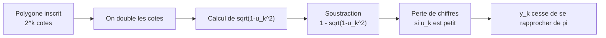
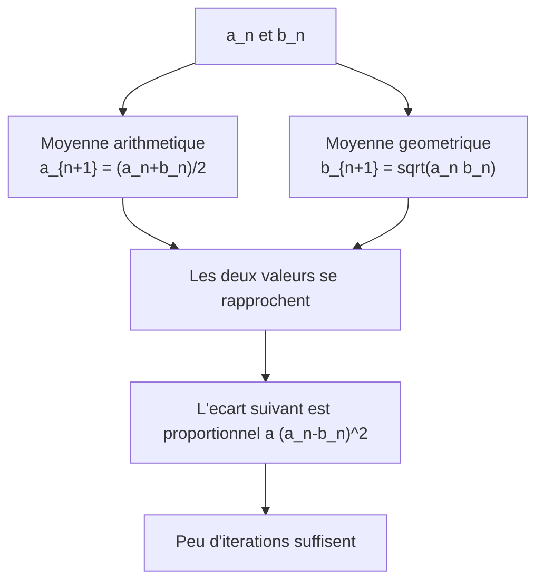
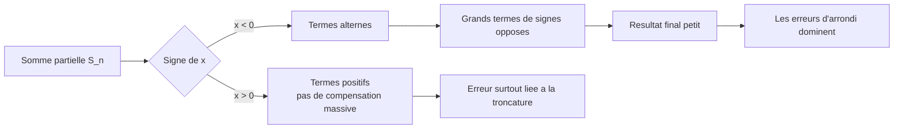
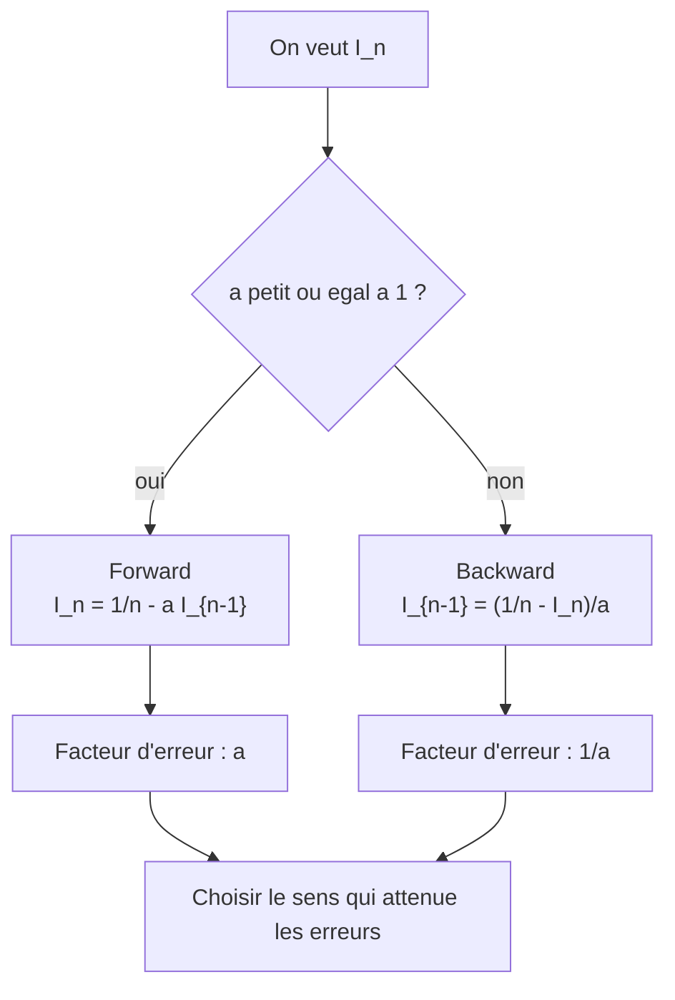
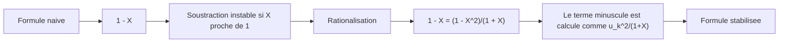
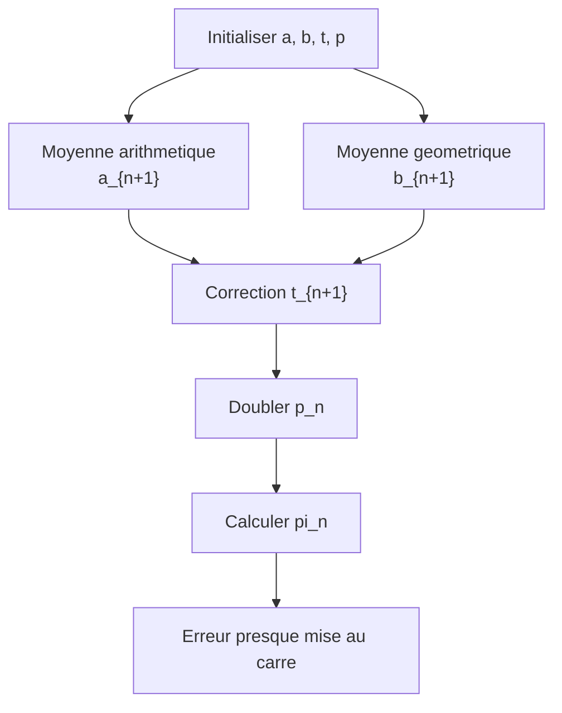
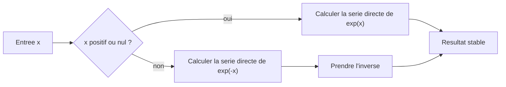
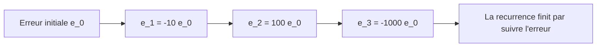

:::quicklinks
- [Preparation](#tp1-preparation)
- [Archimede](#tp1-archimede)
- [Exponentielle](#tp1-exponentielle)
- [Forward / backward](#tp1-forward-backward)
- [Synthese](#tp1-synthese)
:::

:::block type="neutral" title="Objectif du TP"
Ce TP illustre une idee centrale du calcul scientifique : deux formules mathematiquement equivalentes peuvent avoir des comportements numeriques tres differents en arithmetique flottante.

Les blocs **WebR** ci-dessous executent le code R directement dans le navigateur. Le premier lancement peut prendre quelques secondes car le runtime R en WebAssembly est charge a la demande.
:::

:::section id="tp1-preparation" eyebrow="Preparation" title="Resultats theoriques utiles" summary="Relations de recurrence, stabilite et ordres de grandeur a garder sous les yeux pendant les manipulations R."

:::exercise label="Preparation 1" title="Methode d'Archimede"
On approche $\pi$ par le demi-perimetre $y_k$ d'un polygone regulier inscrit dans le cercle unite, avec $n=2^k$ cotes.

:::block type="method" title="Relation de recurrence"
Si $\ell_k$ est la longueur d'un cote du polygone au rang $k$, alors :

\[
\ell_k = 2^{1-k}y_k
\]

En doublant le nombre de cotes, on obtient :

\[
y_{k+1}
=
2^k\sqrt{2\left(1-\sqrt{1-(2^{-k}y_k)^2}\right)}
\qquad y_1=2.
\]

La formule exacte associee est :

\[
y_k = 2^k \sin\left(\frac{\pi}{2^k}\right)
\quad\Longrightarrow\quad
y_k \to \pi.
\]
:::

:::block type="method" title="Demonstration de la recurrence"
Au rang $k$, le polygone inscrit a $2^k$ cotes. Son demi-perimetre vaut donc :

\[
y_k = \frac{2^k\ell_k}{2}
\qquad\Longrightarrow\qquad
\ell_k = 2^{1-k}y_k.
\]

La moitie d'un cote est la corde associee a l'angle $\pi/2^k$, donc :

\[
\frac{\ell_k}{2}=\sin\left(\frac{\pi}{2^k}\right).
\]

Pour passer au polygone suivant, on coupe cet angle en deux. La formule de demi-angle donne :

\[
\sin\left(\frac{\theta}{2}\right)
=
\sqrt{\frac{1-\cos\theta}{2}}
=
\sqrt{\frac{1-\sqrt{1-\sin^2\theta}}{2}}.
\]

Avec $\sin\theta=\ell_k/2=2^{-k}y_k$, le nouveau demi-perimetre devient :

\[
y_{k+1}
=
2^{k+1}\sin\left(\frac{\theta}{2}\right)
=
2^k\sqrt{2\left(1-\sqrt{1-(2^{-k}y_k)^2}\right)}.
\]

Cette demonstration sert a identifier le point fragile du calcul : la recurrence est vraie en mathematiques exactes, mais elle contient la soustraction $1-\sqrt{1-u_k^2}$, qui devient dangereuse en machine.
:::

:::block type="warning" title="Point numerique sensible"
La quantite

\[
1-\sqrt{1-u_k^2}
\qquad\text{avec}\qquad
u_k=2^{-k}y_k
\]

devient une soustraction entre deux nombres presque egaux lorsque $k$ augmente. C'est une situation typique d'annulation catastrophique.
:::



:::plotly id="tp1-archimede-annulation" label="Ordres de grandeur" title="La quantite instable devient minuscule" height="420" caption="Quand u devient petit, 1 - sqrt(1-u^2) est de l'ordre de u^2/2. La soustraction se fait alors entre deux nombres proches de 1, ce qui rend l'arrondi visible."
{
  "series": [
    {
      "generator": "function",
      "range": [1e-8, 0.5],
      "scale": "log",
      "points": 180,
      "y": "1 - sqrt(1 - x*x)",
      "name": "1 - sqrt(1-u^2)",
      "line": { "color": "#f59e0b", "width": 3 }
    },
    {
      "generator": "function",
      "range": [1e-8, 0.5],
      "scale": "log",
      "points": 180,
      "y": "(x*x) / 2",
      "name": "approximation u^2/2",
      "line": { "color": "#2563eb", "dash": "dash", "width": 2 }
    }
  ],
  "layout": {
    "xaxis": { "title": "u", "type": "log" },
    "yaxis": { "title": "valeur", "type": "log" }
  }
}
:::
:::

:::exercise label="Preparation 2" title="Moyenne arithmetico-geometrique"
Pour $a>b>0$, on definit :

\[
a_{n+1}=\frac{a_n+b_n}{2},
\qquad
b_{n+1}=\sqrt{a_nb_n}.
\]

:::block type="theorem" title="Suites adjacentes et convergence quadratique"
Les suites $(a_n)$ et $(b_n)$ restent positives, verifient $b_n\le a_n$, puis $a_n$ decroit et $b_n$ croit. Elles convergent vers une limite commune :

\[
\operatorname{agm}(a,b).
\]

De plus :

\[
a_{n+1}-b_{n+1}
=
\frac{(a_n-b_n)^2}{2(\sqrt{a_n}+\sqrt{b_n})^2}
\le
\frac{1}{8b}(a_n-b_n)^2.
\]

L'ecart est donc essentiellement mis au carre a chaque etape : c'est une convergence quadratique.
:::

:::block type="method" title="Demonstration des suites adjacentes"
On suppose $a_n\ge b_n>0$. Par l'inegalite arithmetico-geometrique :

\[
\sqrt{a_nb_n}\le \frac{a_n+b_n}{2},
\]

donc $b_{n+1}\le a_{n+1}$. Les suites restent positives.

Pour la monotonie de $(a_n)$ :

\[
a_{n+1}=\frac{a_n+b_n}{2}\le a_n.
\]

Pour la monotonie de $(b_n)$ :

\[
b_{n+1}=\sqrt{a_nb_n}\ge \sqrt{b_n^2}=b_n.
\]

Ainsi $(a_n)$ decroit, $(b_n)$ croit et $b_n\le a_n$. Elles sont bornees et convergent. Si leurs limites sont $\alpha$ et $\beta$, alors :

\[
\alpha=\frac{\alpha+\beta}{2},
\qquad
\beta=\sqrt{\alpha\beta}.
\]

La premiere egalite impose $\alpha=\beta$. Les deux suites ont donc une limite commune, notee $\operatorname{agm}(a,b)$.
:::

:::block type="method" title="Demonstration de la convergence quadratique"
On calcule directement l'ecart suivant :

\[
\begin{aligned}
a_{n+1}-b_{n+1}
&=\frac{a_n+b_n}{2}-\sqrt{a_nb_n}\\
&=\frac{a_n+b_n-2\sqrt{a_nb_n}}{2}\\
&=\frac{(\sqrt{a_n}-\sqrt{b_n})^2}{2}.
\end{aligned}
\]

Or :

\[
\sqrt{a_n}-\sqrt{b_n}
=
\frac{a_n-b_n}{\sqrt{a_n}+\sqrt{b_n}}.
\]

Donc :

\[
a_{n+1}-b_{n+1}
=
\frac{(a_n-b_n)^2}{2(\sqrt{a_n}+\sqrt{b_n})^2}.
\]

Comme $b_n\ge b$, on a $\sqrt{a_n}+\sqrt{b_n}\ge2\sqrt{b}$, puis :

\[
a_{n+1}-b_{n+1}
\le
\frac{(a_n-b_n)^2}{8b}.
\]

Cette demonstration sert a comprendre pourquoi l'AGM est tres efficace dans le TP : quand l'ecart est petit, l'iteration suivante le remplace par une quantite de l'ordre de son carre.
:::


:::

:::exercise label="Preparation 3" title="Serie de l'exponentielle"
On utilise :

\[
e^x = \sum_{k=0}^{+\infty}\frac{x^k}{k!}
=
\sum_{k=0}^{n}\frac{x^k}{k!}+R_n(x).
\]

:::block type="method" title="Borne de troncature"
Pour $n>2|x|$, la queue de serie verifie :

\[
|R_n(x)| \le \frac{|x|^n}{n!}.
\]

Cette borne mesure l'erreur de troncature en arithmetique exacte. Elle ne controle pas les pertes de precision dues aux annulations en machine.
:::

:::block type="method" title="Demonstration de la borne de troncature"
Le reste s'ecrit :

\[
R_n(x)=\sum_{k=n+1}^{+\infty}\frac{x^k}{k!}.
\]

On majore sa valeur absolue :

\[
|R_n(x)|\le
\sum_{k=n+1}^{+\infty}\frac{|x|^k}{k!}.
\]

Pour $k\ge n+1$, deux termes successifs de cette serie positive verifient :

\[
\frac{|x|^{k+1}/(k+1)!}{|x|^k/k!}
=
\frac{|x|}{k+1}
\le
\frac{|x|}{n+2}.
\]

Si $n>2|x|$, alors $|x|/(n+2)<1/2$. La queue est donc majoree par une serie geometrique de raison au plus $1/2$ :

\[
|R_n(x)|
\le
\frac{|x|^{n+1}}{(n+1)!}
\left(1+\frac12+\frac14+\cdots\right)
\le
2\frac{|x|^{n+1}}{(n+1)!}.
\]

Comme $n+1>2|x|$, on a $2|x|/(n+1)<1$, donc :

\[
2\frac{|x|^{n+1}}{(n+1)!}
=
\frac{|x|^n}{n!}\frac{2|x|}{n+1}
\le
\frac{|x|^n}{n!}.
\]

Cette demonstration sert a separer deux erreurs : la troncature de la serie, bien controlee par la borne, et l'erreur d'arrondi, qui peut devenir dominante pour $x<0$.
:::


:::

:::exercise label="Preparation 4" title="Recurrence forward / backward"
On considere :

\[
I_n=\int_0^1\frac{x^n}{a+x}\,dx
\qquad a>0.
\]

:::block type="method" title="Relations utiles"
On a :

\[
I_0=\ln\left(\frac{1+a}{a}\right),
\qquad
I_n=\frac{1}{n}-aI_{n-1}.
\]

Comme $0\le x^n/(a+x)\le x^n/a$, on obtient :

\[
0\le I_n\le \frac{1}{a(n+1)}
\qquad\Longrightarrow\qquad
I_n\to0.
\]

Le schema forward propage une erreur selon :

\[
e_n=-ae_{n-1}.
\]

Il est donc instable si $a>1$.
:::

:::block type="method" title="Demonstration des relations integrales"
Pour $n=0$ :

\[
I_0=\int_0^1\frac{1}{a+x}\,dx
=
\left[\ln(a+x)\right]_0^1
=
\ln\left(\frac{1+a}{a}\right).
\]

Pour $n\ge1$, on ecrit :

\[
\frac{x^n}{a+x}
=
\frac{x^{n-1}(a+x)-ax^{n-1}}{a+x}
=
x^{n-1}-a\frac{x^{n-1}}{a+x}.
\]

En integrant sur $[0,1]$ :

\[
I_n
=
\int_0^1 x^{n-1}\,dx
-aI_{n-1}
=
\frac1n-aI_{n-1}.
\]

Enfin, comme $a+x\ge a$ et $x^n\ge0$ sur $[0,1]$ :

\[
0\le \frac{x^n}{a+x}\le \frac{x^n}{a}.
\]

Donc :

\[
0\le I_n\le \frac1a\int_0^1x^n\,dx
=
\frac{1}{a(n+1)}
\longrightarrow 0.
\]

Cette demonstration sert a construire une reference qualitative : les valeurs exactes doivent rester positives et tendre vers $0$. Si le calcul forward produit autre chose, c'est un artefact numerique.
:::

:::block type="method" title="Demonstration de la propagation d'erreur"
Notons $\widehat I_n$ la valeur calculee et $I_n$ la valeur exacte. L'erreur vaut :

\[
e_n=\widehat I_n-I_n.
\]

Avec le schema forward :

\[
\widehat I_n=\frac1n-a\widehat I_{n-1},
\qquad
I_n=\frac1n-aI_{n-1}.
\]

En soustrayant les deux egalites :

\[
e_n
=
\widehat I_n-I_n
=
-a(\widehat I_{n-1}-I_{n-1})
=
-ae_{n-1}.
\]

Pour le backward, la meme idee donne :

\[
e_{n-1}=-\frac{1}{a}e_n.
\]

Cette demonstration sert a choisir le sens de calcul : pour $a=10$, avancer multiplie l'erreur par $10$, alors que remonter la divise par $10$.
:::

:::block type="remember" title="Schema backward"
La recurrence inverse est :

\[
I_{n-1}=\frac{1}{a}\left(\frac{1}{n}-I_n\right).
\]

Si on initialise $I_m^{(m)}=0$ pour $m$ assez grand, l'erreur est multipliee a chaque pas par $1/a$. Pour $a>1$, le backward attenue donc les erreurs.
:::



:::plotly id="tp1-forward-backward-erreur" label="Stabilite" title="Propagation theorique d'une erreur pour a = 10" height="420" caption="En forward, une petite erreur est multipliee par 10 a chaque pas. En backward, elle est divisee par 10 a chaque pas."
{
  "series": [
    {
      "generator": "sequence",
      "nStart": 0,
      "nEnd": 12,
      "y": "pow(10, n)",
      "name": "forward : 10^n",
      "line": { "color": "#dc2626", "width": 3 }
    },
    {
      "generator": "sequence",
      "nStart": 0,
      "nEnd": 12,
      "y": "pow(0.1, n)",
      "name": "backward : 10^{-n}",
      "line": { "color": "#16a34a", "width": 3 }
    }
  ],
  "layout": {
    "xaxis": { "title": "nombre de pas" },
    "yaxis": { "title": "facteur sur l'erreur", "type": "log" }
  }
}
:::
:::
:::

:::section id="tp1-archimede" eyebrow="Travail en seance" title="Calcul de pi" summary="Comparer une formule mathematiquement correcte mais instable avec une reecriture stable, puis tester une methode plus rapide fondee sur l'AGM."

:::exercise label="Manipulation 1" title="Archimede : formule naive"
Calculer $y_{20}$ et $y_{100}$ avec la recurrence directe.

:::rplayground id="tp1-r-archimede-naif" title="Archimede - formule naive" caption="Modifier K ou tracer l'erreur pour observer la degradation numerique."
```r
archimede_naif <- function(K) {
  # y_k est le demi-perimetre du polygone inscrit.
  # Au depart, k = 1 et le polygone a 2 cotes : y_1 = 2.
  y <- 2
  if (K == 1) return(y)

  # A chaque iteration, on double le nombre de cotes.
  # Cette formule est exacte mathematiquement, mais elle contient
  # la soustraction instable 1 - sqrt(1 - u^2).
  for (k in 1:(K - 1)) {
    u <- 2^(-k) * y
    y <- 2^k * sqrt(2 * (1 - sqrt(1 - u^2)))
  }

  y
}

# On calcule toutes les approximations de y_K pour observer
# a quel moment l'erreur commence a remonter.
K <- 1:60
valeurs <- sapply(K, archimede_naif)
approximation <- valeurs
erreurs_abs <- abs(approximation - pi)
erreurs_rel <- erreurs_abs / abs(pi)

# Affichage des valeurs demandees : approximation et erreur.
# K = 20 montre une bonne approximation ; K grand montre la degradation.
K_affiche <- c(20, 30, 40, 50, 60)
resultats <- data.frame(
  K = K_affiche,
  approximation = approximation[K_affiche],
  pi_reference = pi,
  erreur_absolue = erreurs_abs[K_affiche],
  erreur_relative = erreurs_rel[K_affiche]
)

print(resultats, digits = 17)

# On force deux graphiques dans la meme sortie :
# 1. l'erreur absolue ;
# 2. l'approximation y_K comparee a pi.
ancien_affichage <- par(no.readonly = TRUE)
par(mfrow = c(2, 1), mar = c(4, 4, 2.5, 1), oma = c(0, 0, 0, 0))

# Premier graphique : convergence au debut,
# puis perte de precision par annulation.
plot(K, erreurs_abs, type = "b", log = "y",
     xlab = "K", ylab = "|y_K - pi|",
     main = "Archimede naive : l'erreur finit par remonter")
abline(h = .Machine$double.eps, col = "red", lty = 2)
legend("bottomleft", legend = "precision machine",
       col = "red", lty = 2, bty = "n")

# Deuxieme graphique : valeur de l'approximation.
# La ligne rouge indique la valeur exacte de pi fournie par R.
plot(K, approximation, type = "b",
     xlab = "K", ylab = "y_K",
     main = "Archimede naive : approximation de pi")
abline(h = pi, col = "red", lty = 2)
legend("bottomright", legend = c("approximation y_K", "pi"),
       col = c("black", "red"), lty = c(1, 2), pch = c(1, NA),
       bty = "n")

# On restaure les reglages graphiques par defaut pour les essais suivants.
par(ancien_affichage)
```
:::

:::block type="warning" title="Observation attendue"
Le resultat s'ameliore d'abord, puis se degrade. Pour de grands $k$, le terme $\sqrt{1-u_k^2}$ est arrondi a une valeur trop proche de $1$, et la soustraction $1-\sqrt{1-u_k^2}$ perd ses chiffres significatifs.
:::
:::

:::exercise label="Manipulation 2" title="Archimede : formule stabilisee"
On evite la soustraction instable avec :

\[
1-X=\frac{1-X^2}{1+X},
\qquad
X=\sqrt{1-(2^{-k}y_k)^2}.
\]

On obtient :

\[
y_{k+1}
=
y_k
\sqrt{
\frac{2}
{1+\sqrt{1-(2^{-k}y_k)^2}}
}.
\]



:::rplayground id="tp1-r-archimede-stable" title="Archimede - formule stabilisee"
```r
archimede_naif <- function(K) {
  y <- 2
  if (K == 1) return(y)

  for (k in 1:(K - 1)) {
    y <- 2^k * sqrt(2 * (1 - sqrt(1 - (2^(-k) * y)^2)))
  }
  y
}

archimede_stable <- function(K) {
  y <- 2
  if (K == 1) return(y)

  for (k in 1:(K - 1)) {
    u <- 2^(-k) * y
    y <- y * sqrt(2 / (1 + sqrt(1 - u^2)))
  }
  y
}

K <- 1:100
stable <- sapply(K, archimede_stable)
naif <- sapply(K, archimede_naif)

print(data.frame(
  K = c(20, 50, 100),
  naive = sapply(c(20, 50, 100), archimede_naif),
  stable = sapply(c(20, 50, 100), archimede_stable),
  pi = pi
))

plot(K, abs(stable - pi), type = "l", log = "y",
     col = "darkgreen", lwd = 2,
     xlab = "K", ylab = "Erreur absolue",
     main = "Formule stabilisee")
lines(K, abs(naif - pi), col = "orange", lwd = 2)
legend("bottomleft", legend = c("stable", "naive"),
       col = c("darkgreen", "orange"), lwd = 2)
```
:::

:::block type="remember" title="Conclusion"
Les deux formules sont algebriquement equivalentes. La seconde est pourtant beaucoup plus fiable car elle supprime la soustraction entre deux nombres presque egaux.
:::
:::

:::exercise label="Manipulation 3" title="Calcul de pi par AGM"
On utilise l'algorithme de Brent-Salamin, fonde sur l'AGM. Il est beaucoup plus rapide que les methodes precedentes : la convergence est quadratique, donc le nombre de chiffres corrects double presque a chaque iteration.

\[
\begin{aligned}
a_0&=1,
&
b_0&=\frac{1}{\sqrt2},
&
t_0&=\frac14,
&
p_0&=1,\\
a_{n+1}&=\frac{a_n+b_n}{2},
&
b_{n+1}&=\sqrt{a_nb_n},\\
t_{n+1}&=t_n-p_n(a_n-a_{n+1})^2,
&
p_{n+1}&=2p_n.
\end{aligned}
\]

L'approximation de $\pi$ est ensuite :

\[
\pi_{n+1}
=
\frac{(a_{n+1}+b_{n+1})^2}{4t_{n+1}}.
\]



:::rplayground id="tp1-r-agm" title="AGM - convergence rapide vers pi"
```r
# Algorithme de Brent-Salamin.
# C'est une vraie methode rapide pour calculer pi avec l'AGM.
pi_agm <- function(iterations = 5) {
  a <- 1
  b <- 1 / sqrt(2)
  t <- 1 / 4
  p <- 1

  approximation <- numeric(iterations)

  for (n in 1:iterations) {
    # On garde l'ancien a_n pour corriger t_n.
    a_avant <- a

    # Etape AGM : moyenne arithmetique et moyenne geometrique.
    a <- (a + b) / 2
    b <- sqrt(a_avant * b)

    # Correction qui transforme l'AGM en approximation de pi.
    t <- t - p * (a_avant - a)^2
    p <- 2 * p

    approximation[n] <- (a + b)^2 / (4 * t)
  }

  approximation
}

iterations <- 1:6
approximation <- pi_agm(length(iterations))
erreur <- abs(approximation - pi)

res <- data.frame(
  iteration = iterations,
  approximation = approximation,
  erreur_absolue = erreur,
  chiffres_corrects = -log10(erreur)
)

print(res, digits = 17)

plot(iterations, erreur, type = "b", log = "y",
     xlab = "iteration", ylab = "|pi_n - pi|",
     main = "AGM Brent-Salamin : convergence tres rapide")
grid()
```
:::

:::block type="method" title="Lecture"
L'erreur chute beaucoup plus vite que dans la methode d'Archimede : quelques iterations suffisent pour atteindre la precision machine. C'est le comportement attendu d'une methode quadratique fondee sur l'AGM.
:::
:::
:::

:::section id="tp1-exponentielle" eyebrow="Travail en seance" title="Calcul de e^x par serie" summary="Comprendre pourquoi la serie directe est bonne pour x positif mais dangereuse pour x negatif."

:::exercise label="Manipulation 4" title="Serie directe pour x=20 et x=-20"
On calcule les termes de la serie par recurrence :

\[
t_0=1,
\qquad
t_k=t_{k-1}\frac{x}{k},
\qquad
S_n=\sum_{k=0}^{n}t_k.
\]

:::plotly id="tp1-exp-croissance" label="Intuition" title="Pourquoi x = -20 est plus fragile" height="420" caption="Le resultat exact exp(-20) est minuscule. La serie directe l'obtient par compensation de termes de grande amplitude, alors que exp(20) reste une somme de termes positifs."
{
  "series": [
    {
      "generator": "function",
      "range": [-20, 20],
      "points": 180,
      "y": "exp(x)",
      "name": "exp(x)",
      "line": { "color": "#2563eb", "width": 3 }
    },
    {
      "generator": "point",
      "x": -20,
      "y": "exp(-20)",
      "name": "exp(-20)",
      "marker": { "color": "#dc2626", "size": 9 }
    },
    {
      "generator": "point",
      "x": 20,
      "y": "exp(20)",
      "name": "exp(20)",
      "marker": { "color": "#16a34a", "size": 9 }
    }
  ],
  "layout": {
    "xaxis": { "title": "x" },
    "yaxis": { "title": "exp(x)", "type": "log" }
  }
}
:::

:::rplayground id="tp1-r-exp-serie" title="Exponentielle - serie directe"
```r
exp_serie <- function(x, n) {
  terme <- 1
  somme <- 1

  for (k in 1:n) {
    terme <- terme * x / k
    somme <- somme + terme
  }

  somme
}

n <- 60

comparaison <- data.frame(
  x = c(20, -20),
  serie = c(exp_serie(20, n), exp_serie(-20, n)),
  reference = c(exp(20), exp(-20))
)
comparaison$erreur_absolue <- abs(comparaison$serie - comparaison$reference)
comparaison$erreur_relative <- comparaison$erreur_absolue / abs(comparaison$reference)
print(comparaison)

k <- 0:n
termes_m20 <- (-20)^k / factorial(k)
plot(k, termes_m20, type = "h",
     xlab = "k", ylab = "Terme de la serie",
     main = "Termes alternes pour exp(-20)")
abline(h = 0, col = "gray40")
```
:::

:::block type="warning" title="Observation"
Pour $x=20$, les termes sont positifs et le calcul est coherent avec la borne de troncature. Pour $x=-20$, les termes alternent et de grands nombres se compensent pour produire un resultat final tres petit. Les arrondis restants deviennent dominants.
:::
:::

:::exercise label="Manipulation 5" title="Correction par changement de formule"
Pour $x<0$, on calcule :

\[
e^x=\frac{1}{e^{-x}}.
\]



:::rplayground id="tp1-r-exp-stable" title="Exponentielle - version stable"
```r
exp_serie <- function(x, n) {
  terme <- 1
  somme <- 1

  for (k in 1:n) {
    terme <- terme * x / k
    somme <- somme + terme
  }

  somme
}

exp_stable <- function(x, n = 60) {
  if (x >= 0) {
    exp_serie(x, n)
  } else {
    1 / exp_serie(-x, n)
  }
}

print(data.frame(
  x = c(-20, -10, 10, 20),
  serie_directe = sapply(c(-20, -10, 10, 20), exp_serie, n = 60),
  stable = sapply(c(-20, -10, 10, 20), exp_stable, n = 60),
  reference = exp(c(-20, -10, 10, 20))
))
```
:::

:::block type="remember" title="Conclusion"
La correction est simple mais fondamentale : on choisit l'expression qui evite les annulations. La stabilite numerique depend autant de la forme de l'algorithme que de la formule mathematique.
:::
:::
:::

:::section id="tp1-forward-backward" eyebrow="Travail en seance" title="Schemas forward et backward" summary="Observer l'amplification des erreurs dans une recurrence et choisir le sens stable."

:::exercise label="Manipulation 6" title="Forward instable pour a=10"


:::rplayground id="tp1-r-forward" title="Recurrence forward"
```r
forward <- function(a, N) {
  I <- numeric(N + 1)
  I[1] <- log((1 + a) / a)

  for (n in 1:N) {
    I[n + 1] <- 1 / n - a * I[n]
  }

  I
}

I_reference <- function(a, n) {
  integrate(function(x) x^n / (a + x), 0, 1,
            rel.tol = 1e-12)$value
}

a <- 10
N <- 25
Ifwd <- forward(a, N)
Iref <- sapply(0:N, function(n) I_reference(a, n))

print(data.frame(
  n = 0:N,
  I_forward = Ifwd,
  I_reference = Iref,
  erreur = abs(Ifwd - Iref)
))

plot(0:N, abs(Ifwd - Iref), type = "b", log = "y",
     xlab = "n", ylab = "Erreur absolue",
     main = "Forward : amplification des erreurs pour a=10")
grid()
```
:::

:::block type="warning" title="Observation"
Les valeurs devraient rester positives et tendre vers $0$. Le schema forward finit pourtant par produire des valeurs negatives puis tres grandes en valeur absolue, car les erreurs sont multipliees par $a=10$ a chaque pas.
:::
:::

:::exercise label="Manipulation 7" title="Backward stable pour a=10"


:::rplayground id="tp1-r-backward" title="Recurrence backward et strategie stable"
```r
forward <- function(a, N) {
  I <- numeric(N + 1)
  I[1] <- log((1 + a) / a)

  for (n in 1:N) {
    I[n + 1] <- 1 / n - a * I[n]
  }

  I
}

backward <- function(a, m) {
  I <- numeric(m + 1)
  I[m + 1] <- 0

  for (n in m:1) {
    I[n] <- (1 / n - I[n + 1]) / a
  }

  I
}

I_reference <- function(a, n) {
  integrate(function(x) x^n / (a + x), 0, 1,
            rel.tol = 1e-12)$value
}

In_stable <- function(a, N, marge = 30) {
  if (a <= 0) stop("a doit etre strictement positif")

  if (a <= 1) {
    forward(a, N)[N + 1]
  } else {
    m <- N + marge
    backward(a, m)[N + 1]
  }
}

In_stable_tol <- function(a, N, tol = 1e-12) {
  if (a <= 0) stop("a doit etre strictement positif")

  if (a <= 1) return(forward(a, N)[N + 1])

  m <- max(N + 1, 2)
  borne <- 1 / (a^(m - N + 1) * (m + 1))

  while (borne > tol) {
    m <- m + 1
    borne <- 1 / (a^(m - N + 1) * (m + 1))
  }

  backward(a, m)[N + 1]
}

a <- 10
m <- 30
Ibwd <- backward(a, m)

print(data.frame(
  n = 0:15,
  backward = Ibwd[1:16],
  reference = sapply(0:15, function(n) I_reference(a, n))
))

N <- 0:25
stable <- sapply(N, function(n) In_stable_tol(10, n))
ref <- sapply(N, function(n) I_reference(10, n))

plot(N, abs(stable - ref), type = "b", log = "y",
     xlab = "n", ylab = "Erreur absolue",
     main = "Backward : erreur attenuee")
grid()
```
:::

:::block type="method" title="Algorithme stable"
Le bon sens de recurrence depend de $a$ :

\[
\begin{cases}
0<a\le1 :& \text{forward},\\
a>1 :& \text{backward}.
\end{cases}
\]

On choisit le sens qui multiplie les erreurs par un facteur strictement inferieur a $1$.
:::
:::
:::

:::section id="tp1-synthese" eyebrow="Synthese" title="Ce qu'il faut retenir" summary="Les messages numeriques communs aux trois experiences."

:::block type="remember" title="Principes de stabilite numerique"
1. Une formule mathematiquement correcte peut etre mauvaise en machine.
2. Les soustractions entre nombres presque egaux sont dangereuses.
3. Un changement algebrique simple peut supprimer une annulation catastrophique.
4. Une recurrence doit etre utilisee dans le sens qui attenue les erreurs.
5. Une borne de troncature ne suffit pas : il faut aussi regarder les erreurs d'arrondi.
:::
:::
