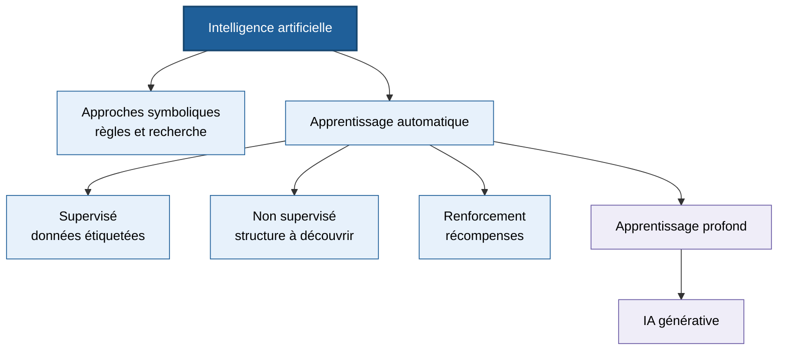
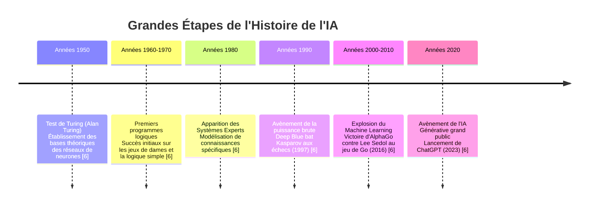
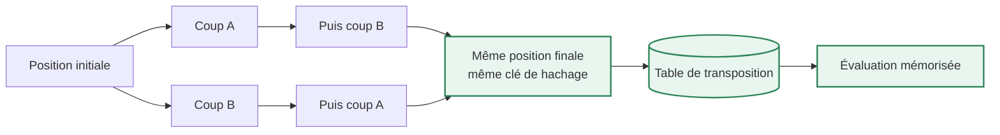
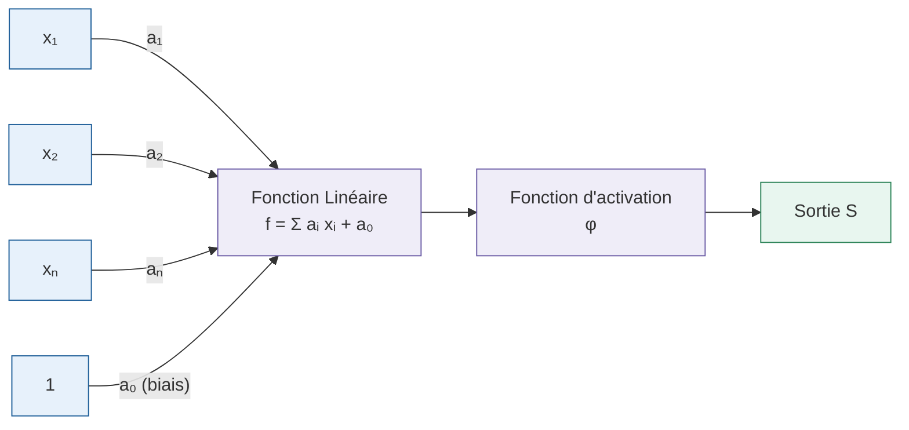
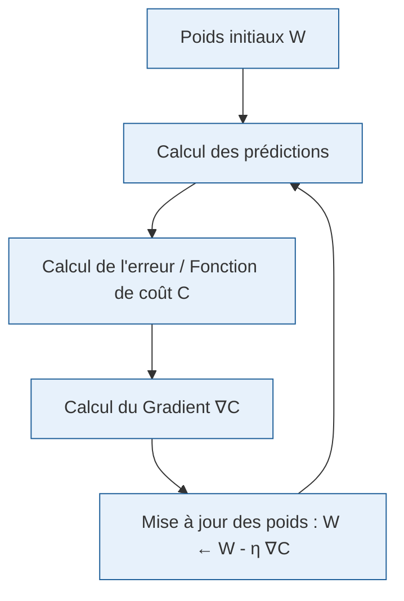
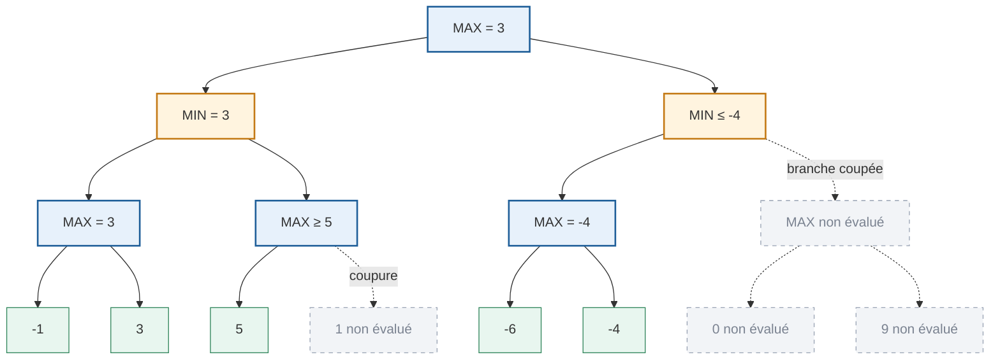

:::section id="ia-organisation" eyebrow="Semestre 7" title="Structure et Évaluation du Module" summary="Présentation de l'organisation pédagogique du cours d'IA à l'Esisar, incluant le volume horaire, le barème d'évaluation et les deux projets pratiques."

Ce cours de **4ème Année du Cycle Ingénieur de l'Esisar (Grenoble INP)**, dispensé par **Jean-Baptiste Caignaert**, aborde les bases scientifiques et méthodologiques de l'Intelligence Artificielle [3, 32]. Le cours met l'accent sur la pratique et la compréhension profonde des algorithmes, plutôt que sur la simple utilisation d'outils d'IA générative [3, 18].

#### Volume Horaire et Calendrier
Le module s'articule autour de [3, 32] :
- **6 sessions de Cours-TD (CM/TD)** [3, 32]
- **6 sessions de Travaux Dirigés (TD)** dédiées au projet Gomoku [3, 19, 32]
- **4 sessions de Travaux Pratiques (TP)** consacrées au projet ACS [3, 19, 32]

:::grid two-col
:::block type="remember" title="Formule de Note Globale"
La note finale du module ($N_1$) est calculée selon la formule de pondération suivante [32] :

\\[
N_1 = 0.4 \times CC_1 + 0.6 \times ET_1
\\]

Avec :
- **$CC_1$ (40%)** : Contrôle Continu basé sur l'évaluation des projets, comprenant une soutenance orale pour valider la compréhension individuelle de chaque membre du binôme [32].
- **$ET_1$ (60%)** : Examen Terminal écrit d'une durée de 2h00 [32].
:::

:::block type="method" title="Modalités Pratiques"
1. **Binôme** : Tous les projets de TD/TP se font en binôme [33].
2. **Matériel** : Il est obligatoire d'amener au moins un ordinateur portable par binôme à chaque session avec l'IDE **Eclipse** et **Java** installés pour coder les solutions d'IA [33].
:::
:::

#### Les Deux Projets Pratiques du Module
Le cours est jalonné de deux réalisations d'ingénierie concrètes [4, 19] :
- **Le Projet Gomoku (TD)** : Développement en Java d'une IA capable de jouer de manière optimale au jeu Gomoku (alignement de 5 pierres), se mesurant aux IA des autres étudiants lors d'un concours final [4, 19, 21].
- **Le Projet ACS (TP - Ant Colony System)** : Développement d'une chaîne de vision et de tri automatique d'objets (bonbons) sur tapis roulant, entraînée sur des photos réelles en créant son propre dataset de Machine Learning [4, 19, 42].

:::

:::section id="ia-definitions" eyebrow="Chapitre 1" title="Concepts Fondamentaux et Terminologie" summary="Introduction aux définitions formelles de l'IA, distinctions entre IA Micro/Macro, classification des types d'IA et terminologie du Machine Learning."

L'**Intelligence Artificielle (IA)** désigne l'ensemble des techniques et méthodes permettant à une machine (ordinateur, robot, système embarqué, etc.) de simuler certains aspects de l'intelligence humaine [19].

Ces aspects incluent notamment [19] :
- **Apprendre** à partir de données (ex. reconnaître un visage).
- **Raisonner** (ex. calcul de la meilleure stratégie de jeu).
- **Comprendre** le langage naturel (ex. traduction automatique).
- **Percevoir** l'environnement (ex. détection d'obstacles en conduite autonome).
- **Prendre des décisions** (ex. recommandations de produits).

#### IA Macro vs IA Micro
Le cours introduit une distinction importante dans l'usage industriel et applicatif de l'IA [19] :

:::grid two-col
:::block type="definition" title="L'IA Micro"
Représente un **composant d'IA spécifique** ou un outil isolé effectuant une tâche de traitement ciblée [19].
*Exemple :* L'agent conversationnel **ChatGPT** [19].
:::

:::block type="definition" title="L'IA Macro"
Représente une **solution globale enrichie** par l'intégration de multiples couches d'intelligence artificielle [19].
*Exemple :* Une plateforme de VOD qui intègre des recommandations personnalisées de contenu à l'utilisateur [19].
:::
:::

#### Typologie des Systèmes d'IA
Les systèmes d'IA sont classés selon leurs capacités cognitives [19] :

| Type d'IA | Description | Exemple |
| :--- | :--- | :--- |
| **IA Faible (ou Spécialisée)** | Algorithme dédié à la résolution d'une seule tâche spécifique [19]. | Reconnaissance vocale, filtres anti-spam, diagnostics médicaux [19]. |
| **IA Forte (ou Générale)** | Intelligence comparable à l'humain, capable de transférer ses compétences [19]. | Non réalisée à ce jour [19]. |
| **Superintelligence** | IA hypothétique dépassant de loin toutes les capacités cognitives humaines [19]. | Concept théorique [19]. |

#### Terminologie du Machine Learning et Deep Learning

:::grid two-col
:::block type="definition" title="Algorithme vs Programme"
- **Algorithme** : Description d'une suite d'étapes permettant d'obtenir un résultat à partir d'entrées (ex. une recette de cuisine) [19].
- **Programme informatique** : Ensemble d'instructions logiques destinées à être exécutées par un ordinateur [19]. Un programme est la traduction concrète d'un algorithme dans un langage informatique.
:::

:::block type="definition" title="Machine Learning vs Deep Learning"
- **Machine Learning (Apprentissage Automatique)** : Sous-domaine de l'IA qui consiste à réaliser un programme qui va « apprendre » à dérouler un algorithme en analysant des données, ce qui produira un modèle [23].
- **Deep Learning (Apprentissage Profond)** : Sous-domaine du Machine Learning dans lequel le modèle est un **réseau de neurones artificiels** s'inspirant du cerveau biologique [23].
:::
:::

:::grid two-col
:::block type="definition" title="Supervisé, Non-Supervisé et Renforcement"
- **Apprentissage Supervisé** : Les données fournies en entrée sont **étiquetées** (ex. paires entrée-sortie connues) [22].
- **Apprentissage Non-Supervisé** : Aucune étiquette n'est fournie ; le système regroupe les données par similarités intrinsèques (clustering, segmentation) [22].
- **Apprentissage par Renforcement** : L'agent apprend par essais-erreurs via des récompenses et pénalités [23].
:::

:::block type="remember" title="Notion de Variable Cachée"
Dans les réseaux de neurones profonds, une **variable cachée (hidden variable)** est une variable intermédiaire calculée au sein des couches internes du réseau [5, 14]. Elle permet de capturer des relations non-linéaires complexes et des abstractions de caractéristiques qui ne sont pas directement visibles dans les données brutes d'entrée [5, 14].
:::
:::

:::

:::section id="ia-historique" eyebrow="Chapitre 2" title="Perspective Historique de l'IA" summary="Chronologie des grandes avancées de l'intelligence artificielle, de sa fondation théorique aux réseaux profonds et à l'IA générative moderne."

L'histoire de l'IA est marquée par des cycles d'optimisme scientifique intense suivis de périodes de scepticisme (les hivers de l'IA), rythmés par l'évolution de la puissance de calcul et de la disponibilité des données [6].

#### Focus sur les Moments de Rupture Historiques

- **Le Test de Turing (1950)** : Alan Turing propose une expérience de pensée dans laquelle un humain doit distinguer, lors d'une conversation à l'aveugle, s'il échange avec un autre humain ou avec une machine [6]. Si le sujet ne peut faire la différence, la machine est qualifiée d'intelligente [6].
- **Deep Blue (1997)** : Le supercalculateur d'IBM bat le champion du monde d'échecs Garry Kasparov [6]. C'est le triomphe de la **puissance de calcul brute** appliquée à un arbre de recherche [6].
- **AlphaGo (2016)** : Le jeu de Go possède une complexité combinatoire trop importante pour être résolue par de la force brute [6]. L'IA AlphaGo de Google DeepMind bat le champion Lee Sedol (4-1) [6]. Le **Coup 37** du match 2 a démontré une capacité de créativité algorithmique inédite [6].

:::block type="warning" title="Pourquoi l'essor du Deep Learning fut-il si tardif ?"
La théorie fondamentale des réseaux de neurones multicouches a été écrite dès les années 50-70 [6]. Cependant, l'essor concret n'a eu lieu que dans les années 2010 pour quatre raisons majeures [6] :
1. **La taille des bases de données** : Dans les années 90, nos jeux de données étiquetés étaient beaucoup trop petits pour entraîner des modèles profonds [6].
2. **La vitesse de calcul** : Les processeurs d'ancienne génération étaient trop lents. L'utilisation des GPU a permis un gain de puissance phénoménal [6].
3. **L'initialisation des poids** : Les chercheurs ne savaient pas initialiser correctement les poids d'un réseau profond, ce qui bloquait la convergence lors de la rétropropagation [6].
4. **La fonction d'activation** : L'utilisation de mauvaises fonctions d'activation (telles que la fonction sigmoïde, provoquant la disparition du gradient) a été remplacée par des fonctions plus adaptées (comme ReLU) [6].
:::

:::

:::section id="ia-jeux-echecs" eyebrow="Chapitre 3" title="Théorie des Jeux : Algorithmes de Recherche" summary="Étude détaillée des techniques de prise de décision dans les jeux à deux joueurs : fonctions d'évaluation, algorithme Min-Max et élagage Alpha-Beta."

Dans les jeux de stratégie combinatoires abstraits (Échecs, Dames, Gomoku, Go), la machine doit explorer un arbre de possibilités pour sélectionner le coup optimal [20].

#### 1. La Fonction d'Évaluation
Il est impossible d'explorer l'arbre de jeu jusqu'à la fin de la partie (feuilles terminales) à cause de l'explosion combinatoire [20]. On limite donc la recherche à une certaine **profondeur $depth$** et on évalue l'état du plateau de jeu à l'aide d'une **fonction d'évaluation $f_{eval}$** [20].

Aux échecs, la fonction d'évaluation la plus fondamentale est de nature **matérielle** [20] :

\\[
V = \sum Poids(\text{Pièces Blancs}) - \sum Poids(\text{Pièces Noirs})
\\]

:::grid two-col
:::block type="definition" title="Poids Classiques des Pièces"
Pour évaluer un plateau, on utilise la grille de valeurs standard suivante [20] :
- **Pion ($\kappa$)** : $1$ point
- **Cavalier ($\lambda$)** : $3$ points
- **Fou ($\mu$)** : $3$ points
- **Tour ($\nu$)** : $5$ points
- **Dame ($\xi$)** : $9$ points
:::

:::block type="warning" title="Limites de l'Évaluation Statique"
L'évaluation matérielle brute est insuffisante car elle ne tient pas compte du contexte dynamique de la partie [21] :
- **Moment de la partie** : La valeur relative d'un échange (ex. Pion contre Cavalier, valant -1 + 3 = +2) dépend de la phase de jeu [21].
- **Positionnement** : Un Cavalier centralisé a beaucoup plus de valeur qu'un Cavalier bloqué sur le bord du plateau.
- **Sécurité** : Un avantage matériel peut être inutile si la position mène à un échec et mat inévitable.
:::
:::

#### 2. L'Algorithme Min-Max
L'algorithme Min-Max permet de déterminer le coup optimal pour un joueur en faisant l'hypothèse que l'adversaire joue également de manière parfaite [7, 20].

- **MAX** : Cherche à prendre la décision qui maximise la fonction d'évaluation [7, 20].
- **MIN** : Joueur adverse qui cherche à minimiser la valeur pour MAX, réduisant sa perte potentielle [7, 20].

L'algorithme effectue une recherche en profondeur dans l'arbre des coups possibles, puis fait « remonter » les évaluations [7, 20] :
1. À un nœud **MAX**, la valeur affectée est le **maximum** des valeurs de ses fils [7, 20].
2. À un nœud **MIN**, la valeur affectée est le **minimum** des valeurs de ses fils [7, 20].

:::block type="remember" title="Règle d'or du Min-Max"
On considère toujours que l'adversaire prendra la meilleure décision possible pour lui (celle qui minimise notre score), ce qui en réalité n'est pas toujours le cas [7]. Si l'adversaire fait une erreur, notre situation sera simplement encore meilleure que prévu.
:::

#### 3. L'Élagage Alpha-Beta
L'élagage Alpha-Beta est une optimisation du Min-Max qui permet d'éviter d'explorer des branches de l'arbre dont on sait qu'elles ne seront jamais choisies, allégeant ainsi grandement la recherche sans aucune perte d'exactitude [8, 21].

On définit deux variables qui sont propagées durant la recherche [8] :
- **$\alpha$** : La valeur du meilleur choix trouvé jusqu'à présent pour **MAX** (borne inférieure du score).
- **$\beta$** : La valeur du meilleur choix trouvé jusqu'à présent pour **MIN** (borne supérieure du score).

:::block type="method" title="Principe de Coupe"
Pendant le parcours de l'arbre, dès que l'on rencontre une situation où [9] :

\\[
\beta \le \alpha
\\]

On arrête d'explorer les fils restants de ce nœud (on effectue une **coupe**), car la décision finale à la racine ne pourra jamais emprunter cette branche [9].
:::

:::plotly id="ia-minmax-alpha-beta" label="Coût de recherche" title="Min-Max et alpha-bêta dans le meilleur cas" height="440" caption="Avec un facteur de branchement b = 10, un bon ordonnancement permet à alpha-bêta de rechercher approximativement deux fois plus profond pour un même ordre de coût."
{
  "series": [
    {
      "generator": "function",
      "range": [1, 10],
      "points": 10,
      "y": "pow(10, x)",
      "name": "Min-Max : b^d",
      "line": { "width": 3 }
    },
    {
      "generator": "function",
      "range": [1, 10],
      "points": 10,
      "y": "pow(10, x / 2)",
      "name": "Alpha-bêta idéal : b^(d/2)",
      "line": { "width": 3, "dash": "dash" }
    }
  ],
  "layout": {
    "xaxis": { "title": "Profondeur d" },
    "yaxis": { "title": "Nombre de nœuds évalués", "type": "log" },
    "legend": { "orientation": "h", "y": 1.14 },
    "margin": { "l": 75, "r": 25, "t": 60, "b": 60 }
  },
  "config": {
    "responsive": true,
    "displaylogo": false
  }
}
:::

:::block type="remember" title="Ce que suppose la courbe alpha-bêta"
Le gain maximal nécessite d'examiner d'abord les meilleurs coups [10]. Dans le pire cas, avec un mauvais ordre d'exploration, alpha-bêta visite autant de nœuds que Min-Max ; le résultat choisi reste cependant identique [10].
:::

:::

:::section id="ia-gomoku" eyebrow="Chapitre 4" title="Application Pratique : Projet Gomoku" summary="Étude du projet Gomoku (5 in a row) en Java sous Eclipse : modélisation du jeu, conception de l'évaluation dynamique et techniques de transposition."

Le projet Gomoku consiste à coder en Java une IA compétitive capable de jouer sur un plateau de $19 \times 19$ [11, 21]. Les joueurs posent chacun leur tour une pierre de leur couleur [11, 21]. Le premier qui aligne exactement $5$ pierres (horizontalement, verticalement ou diagonalement) l'emporte [11, 21].

#### Problématique de l'Explosion Combinatoire au Gomoku
Le facteur de branchement au Gomoku est immense au début de la partie (jusqu'à $361$ coups possibles pour le premier coup), ce qui rend indispensable une fonction d'évaluation très fine et des optimisations de recherche pour jouer dans la limite de **30 secondes par coup** [11, 21].

#### Optimisation 1 : Amélioration de la Fonction d'Évaluation par Auto-Apprentissage
La qualité de l'IA repose sur les coefficients (poids) attribués aux différentes configurations de plateau (ex. alignement de 3 pierres = 47 points) [12].

:::block type="method" title="Méthode de Réglage Automatique des Poids"
Plutôt que de régler manuellement les poids, on applique une démarche d'optimisation par simulation [12] :
1. **IA vs IA** : On fait s'affronter deux IA disposant de jeux de poids légèrement différents [12].
2. **Parties de masse** : On lance des milliers de parties automatisées en boucle [12].
3. **Mise à jour** : On enregistre les victoires et défaites en fonction des variations de ces poids pour faire converger les poids vers les valeurs optimales [12].
:::

#### Optimisation 2 : Gain de Profondeur via Tables de Transposition
Lors de la recherche Min-Max, le programme réévalue de nombreuses fois des configurations de plateau identiques mais atteintes via des séquences de coups différentes (transpositions) [13, 29]. Pour éviter ces calculs redondants :

:::block type="method" title="Mise en Œuvre des Tables de Transposition"
1. **Identifiant Unique (Hachage)** : On calcule une clé de hachage unique pour le plateau [13, 29].
2. **Mémorisation** : On sauvegarde l'évaluation associée à cette clé dans une table de transposition [13, 29].
3. **Rappel rapide** : Lorsque la recherche rencontre un plateau déjà évalué, on récupère sa valeur directement, ce qui évite de recalculer tout le sous-arbre [13, 29].
:::

:::

:::section id="ia-perceptrons-exemples" eyebrow="Chapitre 5" title="Deep Learning & Perceptrons : Théorie et Exemples" summary="Étude approfondie de la brique de base du Deep Learning : le perceptron, ses fonctions d'activation, ses applications aux portes logiques et la classification linéaire."

Le **Deep Learning** repose sur des réseaux de neurones artificiels dont la brique élémentaire est le **perceptron** [23, 24].

#### 1. Le Perceptron Affine
Pour $n$ variables d'entrée $(x_1, \dots, x_n)$, un perceptron affine comporte $n+1$ poids : les coefficients $a_1, \dots, a_n \in \mathbb{R}$ et le **biais** $a_0 \in \mathbb{R}$ [35, 36].

La fonction d'entrée est définie par [35, 36] :

\\[
f(x_1, \dots, x_n) = a_1 x_1 + a_2 x_2 + \dots + a_n x_n + a_0
\\]

Le résultat $f$ est ensuite passé à une **fonction d'activation** $\phi$ pour produire la sortie finale $S = \phi(f(x_1, \dots, x_n))$ [23, 36].

---

#### 2. Exemples d'Application aux Portes Logiques (Activation Heaviside)
Lorsque la fonction d'activation est la **fonction marche de Heaviside** ($H(z) = 1$ si $z \ge 0$, sinon $0$), le perceptron réalise une séparation binaire [25, 38, 39].

:::grid two-col
:::block type="exercise" label="Exemple 1" title="Porte Logique OU"
Réaliser un perceptron calculant la fonction $x \text{ OU } y$ pour $x, y \in \{0, 1\}$ [38].

**Configuration des Poids** [39] :
- Poids $a_1 = 1$, $a_2 = 1$, Biais $a_0 = -1$.
- Équation linéaire : $f(x, y) = 1 \cdot x + 1 \cdot y - 1$.

**Vérification des Calculs** [39] :
- Pour $(0, 1)$ : $f(0, 1) = 0 + 1 - 1 = 0 \ge 0 \implies H(0) = 1$ (**Vrai**) [39].
- Pour $(1, 0)$ : $f(1, 0) = 1 + 0 - 1 = 0 \ge 0 \implies H(0) = 1$ (**Vrai**) [39].
- Pour $(1, 1)$ : $f(1, 1) = 1 + 1 - 1 = 1 \ge 0 \implies H(1) = 1$ (**Vrai**) [39].
- Pour $(0, 0)$ : $f(0, 0) = 0 + 0 - 1 = -1 < 0 \implies H(-1) = 0$ (**Faux**) [39].
:::

:::block type="exercise" label="Exemple 2" title="Porte Logique ET"
Réaliser un perceptron calculant la fonction $x \text{ ET } y$ pour $x, y \in \{0, 1\}$ [39].

**Configuration des Poids** [39] :
- Poids $a_1 = 1$, $a_2 = 1$, Biais $a_0 = -2$.
- Équation linéaire : $f(x, y) = 1 \cdot x + 1 \cdot y - 2$.

**Vérification des Calculs** [39] :
- Pour $(1, 1)$ : $f(1, 1) = 1 + 1 - 2 = 0 \ge 0 \implies H(0) = 1$ (**Vrai**) [39].
- Pour $(1, 0)$ : $f(1, 0) = 1 + 0 - 2 = -1 < 0 \implies H(-1) = 0$ (**Faux**) [39].
- Pour $(0, 1)$ : $f(0, 1) = 0 + 1 - 2 = -1 < 0 \implies H(-1) = 0$ (**Faux**) [39].
- Pour $(0, 0)$ : $f(0, 0) = 0 + 0 - 2 = -2 < 0 \implies H(-2) = 0$ (**Faux**) [39].
:::
:::

:::block type="warning" title="La Limite du Perceptron Simple : Le Problème du XOR"
La fonction **OU Exclusif (XOR)** est vraie pour $(1,0)$ et $(0,1)$, mais fausse pour $(0,0)$ et $(1,1)$ [39, 40]. Il est **impossible** de séparer ces points par une seule droite dans le plan [39, 40]. 

Pour résoudre le XOR, il faut combiner plusieurs perceptrons au sein d'un **réseau multicouche** en introduisant une couche cachée de neurones (variables cachées) [5, 14, 25, 26].
:::

---

#### 3. Exemples de Classification Géométrique et Séparation Linéaire

:::grid two-col
:::block type="exercise" label="Exemple 3" title="Séparation Linéaire par une Droite"
On souhaite séparer des points bleus ($F=0$) et carrés rouges ($F=1$) dans un plan [34, 35].

**Solution Algorithmique** [35] :
- On choisit la droite d'équation $4x - y = 0$ [35].
- Poids : $a_1 = 4$, $a_2 = -1$, Biais $a_0 = 0$ [35].
- Fonction de décision : $F(x, y) = H(4x - y)$ [35].
- Pour tout point situé sous la droite ($4x - y \ge 0$), $F(x, y) = 1$ (carré rouge) [35].
:::

:::block type="method" title="Région Non-Linéaire à 2 Neurones Cachés"
Pour créer une région de décision en forme de coin (délimitée par deux droites $-x + 3y = 0$ et $2x + y = 0$), on utilise 2 neurones en première couche ($s_1, s_2$) [25, 26] :

\\[
s_1(x, y) = H(-x + 3y), \quad s_2(x, y) = H(2x + y)
\\]

Le neurone de sortie combine ces activations : $F(x, y) = H(s_1 + s_2 - 2)$ [25, 26]. La sortie vaut $1$ uniquement si $s_1 = 1$ **ET** $s_2 = 1$ [25, 26].
:::
:::

---

#### 4. Fonction d'Activation Sigmoïde & Détermination de Probabilités

Lorsque la sortie doit exprimer un niveau de certitude ou une probabilité (valeur continue entre $0$ et $1$), on remplace la marche de Heaviside par la **fonction Sigmoïde** [36] :

\\[
\sigma(z) = \frac{1}{1 + e^{-z}}
\\]

:::block type="exercise" label="Exemple Pratique" title="Classification de Félins / Genre par Taille et Poids"
On modélise un classificateur donnant la probabilité qu'un spécimen appartienne à une catégorie à partir de sa taille $t$ (en m) et son poids $p$ (en kg) [36, 37].

La droite de séparation est définie par $p = 85t - 77$, ce qui donne la fonction linéaire [37] :

\\[
z(t, p) = 85t - p - 77
\\]

Les poids du perceptron sont $a = 85$, $b = -1$ et le biais $c = -77$ avec activation sigmoïde $\sigma$ [37].

**Test sur deux spécimens** [37] :
1. **Spécimen A ($t = 1.77\text{ m}, p = 75\text{ kg}$)** [37] :
   \\[
   z = 85(1.77) - 75 - 77 = 150.45 - 152 = -1.55
   \\]
   \\[
   F(1.77, 75) = \sigma(-1.55) = \frac{1}{1 + e^{1.55}} \approx 0.175 \quad (17.5\% \text{ de probabilité})
   \\]
2. **Spécimen B ($t = 1.67\text{ m}, p = 64\text{ kg}$)** [37] :
   \\[
   z = 85(1.67) - 64 - 77 = 141.95 - 141 = +0.95
   \\]
   \\[
   F(1.67, 64) = \sigma(0.95) = \frac{1}{1 + e^{-0.95}} \approx 0.721 \quad (72.1\% \text{ de probabilité})
   \\]
:::

:::

:::section id="ia-apprentissage-llm" eyebrow="Chapitre 6" title="Optimisation, LLM et Apprentissage Moderne" summary="Explication de la descente de gradient, du surapprentissage, de l'utilisation d'outils (MCP) et des méthodes modernes d'entraînement par renforcement des LLM (RLVR, GRPO)."

#### 1. Fonction de Coût et Descente de Gradient
L'entraînement d'un réseau de neurones consiste à ajuster l'ensemble de ses poids $\vec{\mathbf{W}}$ pour minimiser une **fonction de coût** $C(\vec{\mathbf{W}})$ mesurant l'écart entre la prédiction et la réalité [26, 40].

:::block type="method" title="Espace à Forte Dimensionnalité"
Pour une tâche classique comme la reconnaissance de chiffres manuscrits (MNIST), un petit réseau comporte facilement **13 002 poids et biais** [26, 40]. L'optimisation s'effectue en déplaçant le vecteur des poids dans la direction opposée au gradient [26, 40] :

\\[
\vec{\mathbf{W}}_{nouveau} = \vec{\mathbf{W}}_{ancien} - \eta \nabla C(\vec{\mathbf{W}})
\\]
:::

:::plotly id="ia-surapprentissage" label="Généralisation" title="Apparition du surapprentissage (Overfitting)" height="440" caption="Après le minimum de l'erreur de validation, poursuivre l'entraînement améliore encore les données d'apprentissage mais dégrade les performances sur des données nouvelles."
{
  "series": [
    {
      "generator": "function",
      "range": [0, 80],
      "points": 161,
      "y": "0.12 + 0.9 * exp(-x / 18)",
      "name": "Erreur d'entraînement",
      "line": { "width": 3 }
    },
    {
      "generator": "function",
      "range": [0, 80],
      "points": 161,
      "y": "0.22 + 0.75 * exp(-x / 14) + 0.00012 * pow(x, 2)",
      "name": "Erreur de validation",
      "line": { "width": 3 }
    }
  ],
  "layout": {
    "xaxis": { "title": "Époque d'entraînement" },
    "yaxis": { "title": "Erreur", "range": [0, 1.1] },
    "legend": { "orientation": "h", "y": 1.16 },
    "margin": { "l": 65, "r": 25, "t": 65, "b": 60 }
  },
  "config": {
    "responsive": true,
    "displaylogo": false
  }
}
:::

---

#### 2. Intégration d'Outils et Protocoles MCP (Model Context Protocol)
Les modèles de langage (LLM) modernes ne se contentent plus de prédire du texte : ils interagissent avec des environnements externes grâce à des protocoles d'appel d'outils (**Tools / MCP Server**) [26, 40].

:::grid two-col
:::block type="definition" title="Le Protocole MCP"
Permet à un LLM de communiquer directement avec un serveur d'outils spécialisés (ex. exécution de code, interrogations de bases de données, classification via des réseaux spécialisés comme ResNet `rznet` ou détection d'objets `RF2T`) [26, 40].
:::

:::block type="remember" title="Verbalisation des Étapes de Raisonnement"
Comme le fonctionnement du LLM est entièrement probabiliste et statistique, il est nécessaire de lui faire verbaliser ses étapes de pensée (*Chain of Thought*) pour structurer la résolution de problèmes complexes [26, 41].
:::
:::

---

#### 3. Méthodes d'Entraînement Avancées : RLVR et GRPO

:::grid two-col
:::block type="method" title="RLVR (Reinforcement Learning with Verifiable Rewards)"
Consiste à entraîner le modèle sur des problèmes dont la réponse exacte peut être vérifiée automatiquement de manière déterministe (100% sûre), comme des preuves mathématiques ou du code informatique [26, 41].
:::

:::block type="method" title="GRPO (Group Relative Policy Optimisation)"
Pour une question donnée, le LLM génère un groupe complet de réponses (ex. Réponses A à H) [26, 41]. On évalue automatiquement la proportion de réponses correctes au sein du groupe pour ajuster la politique du modèle par rapport à la moyenne du groupe [26, 41].
:::
:::

:::

:::section id="ia-exercice" eyebrow="TD d'entraînement" title="Exercice Corrigé : Résolution d'un Arbre Min-Max" summary="Exercice d'entraînement pour comprendre pas à pas le déroulement de l'algorithme Min-Max et l'identification des coupes Alpha-Beta."

:::exercise label="Exercice 1" title="Élagage d'un arbre de décision"
Soit l'arbre de jeu représenté ci-dessous [16]. Le premier nœud à la racine est un nœud **MAX** [16]. Les valeurs des feuilles terminales (profondeur 3) sont données de gauche à droite [16].

Déterminez la valeur remontée à la racine par l'algorithme Min-Max, ainsi que les branches coupées par l'élagage Alpha-Beta [16].

:::block type="method" title="Correction Détaillée Étape par Étape"
**Étape 1 : Exploration du sous-arbre gauche (nœud A)** [17]
1. On descend sur $C1$ (MAX). Ses fils sont $-1$ et $3$. $C1$ choisit le maximum : **$C1 = 3$** [17].
   - En remontant cette valeur vers $A$ (MIN), sa meilleure borne supérieure devient $\beta_A = 3$ [17].
2. On passe à $C2$ (MAX). Le premier fils de $C2$ est $5$ [17].
   - La borne inférieure locale devient $\alpha_{C2} = 5$. Comme $\alpha_{C2} \ge \beta_A$, la condition de coupe alpha-bêta est satisfied [17].
   - Le parent de $C2$ est $A$ (nœud MIN) qui possède déjà une alternative de valeur $3$ [17].
   - $A$ ne choisira jamais $C2$ (donnant au moins $5$). On effectue donc une **coupe Alpha-Beta** : la feuille $1$ n'est pas évaluée [17].
   - La valeur du nœud MIN $A$ remonte à : **$A = 3$** [17].

**Étape 2 : Exploration du sous-arbre droit (nœud B)** [17]
1. On descend sur $C3$ (MAX). Ses fils sont $-6$ et $-4$. $C3$ prend le maximum : **$C3 = -4$** [17].
   - La valeur du nœud MIN $B$ est donc au maximum de $-4$ ($\le -4$) [17].
   - À la racine (MAX), nous avons déjà un score assuré de $3$ via le côté gauche ($A = 3$) [17].
   - Puisque $B$ donnera au mieux $-4$, le joueur MAX ne choisira jamais $B$ [17].
   - On réalise une **coupe Alpha-Beta de toute la branche sous B** (nœud $C4$ non exploré) [17].
   - La valeur finale à la racine remonte à : **$Root = 3$** [17].
:::

:::

:::

:::section id="ia-combinatoire" eyebrow="Visualisation" title="Explosion Combinatoire des Jeux" summary="Graphique interactif permettant d'appréhender visuellement l'explosion exponentielle de l'espace d'états des jeux selon leur facteur de branchement."

:::plotly id="ia-combinatoire-graph" label="Explosion combinatoire" title="Nombre d'états à évaluer (b^d)" height="420" caption="Ce graphique interactif illustre l'explosion combinatoire du nombre de positions théoriques à évaluer en fonction de la profondeur de l'arbre d et du facteur de branchement moyen b du jeu."
{
  "series": [
    {
      "generator": "function",
      "range": [1, 8],
      "points": 50,
      "scale": "log",
      "y": "pow(3, x)",
      "name": "Morpion / Tic-Tac-Toe (b=3)"
    },
    {
      "generator": "function",
      "range": [1, 8],
      "points": 50,
      "scale": "log",
      "y": "pow(10, x)",
      "name": "Échecs (modèle réduit b=10)"
    },
    {
      "generator": "function",
      "range": [1, 8],
      "points": 50,
      "scale": "log",
      "y": "pow(20, x)",
      "name": "Gomoku (modèle réduit b=20)"
    }
  ],
  "layout": {
    "xaxis": { "title": "Profondeur de l'arbre (d)" },
    "yaxis": { "title": "Nombre d'états possibles", "type": "log" }
  },
  "config": {
    "responsive": true
  }
}
:::

:::
