:::section id="sn421-intro" eyebrow="SN421-Dev-Micro" title="Programmation embarquée sur microcontrôleur" summary="Cours de révision pour le semestre 7 : architecture MCU, logiciel bare-metal, périphériques, bus de communication et conception de systèmes embarqués."
:::dashboard
:::card class="progress-card" kicker="Parcours" title="5 chapitres"
Des fondations matérielles jusqu'à la conception complète d'un système embarqué réactif.
:::

:::card class="priority-card" kicker="Fil rouge"
1. Un microcontrôleur est un compromis entre coût, énergie, mémoire, calcul et périphériques.
2. Le logiciel embarqué dépend fortement de la carte mémoire, du démarrage et des interruptions.
3. Les périphériques se pilotent par registres et imposent des contraintes temporelles concrètes.
4. Les bus série se choisissent selon débit, distance, robustesse, nombre de fils et arbitrage.
5. Wokwi sert de laboratoire virtuel pour tester les scénarios avant validation sur matériel réel.
:::
:::

:::quicklinks
- [Chapitre 1 : Les microcontrôleurs](#sn421-mcu)
- [Chapitre 2 : Spécificités logicielles](#sn421-software)
- [Chapitre 3 : Les périphériques](#sn421-periph)
- [Chapitre 4 : Bus et liaisons](#sn421-bus)
- [Chapitre 5 : Génie logiciel embarqué](#sn421-se)
- [Premier labo Wokwi](#sn421-wokwi-01)
- [Révision](#SN421-Dev-Micro-revision)
:::
:::

:::section id="sn421-mcu" eyebrow="Chapitre 1" title="Les microcontrôleurs" summary="Fondements matériels, architectures de calcul, modèles mémoire et critères de sélection d'une cible embarquée."

### 1. Introduction et Définitions

Un **système embarqué** est un ensemble matériel et logiciel réalisant une ou plusieurs fonctions dédiées sous des contraintes plus ou moins sévères : ressources limitées (mémoire, puissance de calcul, énergie), coût unitaire minimal pour la production de masse, autonomie énergétique, et contraintes environnementales (température, vibrations, chocs, humidité, CEM).

Un **microcontrôleur (MCU, µC)** est un circuit intégré autonome capable d'exécuter un programme et disposant d'interfaces avec le monde extérieur :
* **Programmable** : il embarque un microprocesseur (CPU / MPU) qui exécute les instructions machine.
* **Communiquant** : il reçoit des signaux de capteurs (analogiques ou numériques), pilote des actionneurs et communique avec d'autres puces ou réseaux.
* **Polyvalent** : employé dans l'automobile, le médical, l'aéronautique, l'électroménager, l'IoT.
* **Autonome** : outre l'alimentation électrique, il intègre sa propre mémoire (Flash, SRAM) et son circuit d'horloge.

:::grid two-col
:::block type="definition" title="Avantages des microcontrôleurs"
* **Faible coût** : typiquement de moins de 0.01 € à une dizaine d'euros.
* **Faible consommation** : de ~10 nW en mode veille profonde (sleep/standby) à quelques watts en pleine charge.
* **Intégration complète** : CPU, mémoires et périphériques sur une unique puce de silicium.
:::
:::block type="warning" title="Inconvénients et compromis"
* **Puissance de calcul modeste** : fréquences typiquement comprises entre quelques MHz et quelques centaines de MHz.
* **Mémoire restreinte** : Flash souvent de quelques Ko à quelques Mo ; SRAM de quelques Ko à quelques centaines de Ko.
* **Absence d'OS lourd** : exécution bare-metal ou sous RTOS léger.
:::
:::

### 2. Éléments d'histoire et grandes familles

L'histoire des microprocesseurs débute avec l'Intel 4004 (4 bits, architecture à cycles multiples : 3 cycles d'adresse sur 12 bits, 2 cycles pour l'instruction de 8 bits, 3 cycles d'exécution), puis l'Intel 8008, 8080, et le célèbre Zilog Z80.

Aujourd'hui, les principales familles industrielles regroupent :
* **ARM Cortex-M** (Cortex-M0, M0+, M1, M3, M4, M7) : cœur de référence pour l'industrie (implémenté par STMicroelectronics avec la gamme STM32, NXP, Microchip, etc.).
* **Atmel AVR** : popularisé par l'écosystème Arduino (ATmega328P, ATmega2560).
* **Espressif ESP32** : cœurs Xtensa et RISC-V avec connectivité Wi-Fi / BLE intégrée.
* **Microchip PIC** : gammes 8 bits (PIC16), 16 bits (PIC24) et 32 bits (PIC32).
* **Texas Instruments MSP430** : architectures 16 bits ultra-basse consommation.
* **RISC-V** : architecture de jeu d'instructions ouverte en plein essor.

### 3. Architectures matérielles et modèles mémoire

:::grid two-col
:::block type="definition" title="Architecture de von Neumann"
* **Espace mémoire unifié** : les instructions de programme et les données partagent le même bus et le même espace d'adressage.
* **Goulot d'étranglement** : impossibilité de lire simultanément une instruction et une donnée lors d'un même cycle d'horloge.
:::
:::block type="definition" title="Architecture de Harvard"
* **Espaces et bus séparés** : bus d'instructions et bus de données physiquement distincts.
* **Accès simultané** : chargement d'une instruction (fetch) en parallèle du transfert d'une donnée mémoire (load/store).
:::
:::


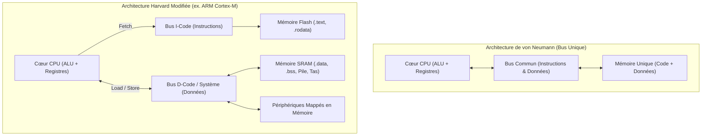
:::figure src="assets/micro/architectures-cpu.svg" alt="Comparaison von Neumann vs Harvard modifiée" caption="Schéma structurel comparant l'architecture à bus unifié de von Neumann et l'architecture Harvard modifiée à bus séparés et espace mémoire linéaire." :::

:::block type="neutral" title="Architecture Harvard modifiée"
La quasi-totalité des processeurs modernes (dont les ARM Cortex-M) adoptent une architecture **Harvard modifiée** :
* Les bus d'instructions (I-Code) et de données (D-Code / System) sont séparés au plus près du cœur CPU avec des mémoires caches dédiées (I-Cache, D-Cache).
* L'espace mémoire global reste unifié (adressage linéaire 32 bits de `0x00000000` à `0xFFFFFFFF`), permettant à la fois un débit d'exécution optimal et la possibilité de loger des données constantes en mémoire d'instructions (Flash).
:::

### 4. Jeu d'instructions (ISA) et pipeline

L'**ISA (Instruction Set Architecture)** définit l'interface matérielle/logicielle : les registres disponibles, les instructions machine, leurs modes d'adressage et leur encodage binaire. On distingue :
* **CISC (Complex Instruction Set Computer)** : grand nombre d'instructions de longueurs variables, instructions complexes réalisant des calculs et accès mémoire combinés.
* **RISC (Reduced Instruction Set Computer)** : jeu réduit d'instructions régulières, encodage fixe (ou semi-fixe), exécution majoritaire en 1 cycle, modèle strict *Load/Store* (seules les instructions dédiées accèdent à la mémoire).

:::block type="remember" title="Règles fondamentales sur l'ISA en microcontrôleur"
1. **Rétrocompatibilité ascendante** : un binaire compilé pour un processeur plus ancien tourne généralement sur une version plus récente du même ISA, mais l'inverse est faux.
2. **Arithmétique entière prédominante** : le matériel n'inclut une FPU (Floating Point Unit) que sur des cœurs ciblés (ex. Cortex-M4F, Cortex-M7). Les calculs flottants sont coûteux en surface de silicium et en énergie. Certaines divisions ou multiplications matérielles peuvent également faire défaut sur les très petits cœurs (Cortex-M0).
:::

#### Exemple de l'architecture ARM Cortex-M
* Registres 32 bits : 16 registres accessibles (`R0` à `R12` d'usage général, `R13` pointeur de pile SP avec déclinaisons MSP/PSP, `R14` Link Register LR, `R15` Program Counter PC).
* Registre de statut (`APSR` / `xPSR`) : contient les drapeaux de condition Arithmétique/Logique :
  * **N** (Négatif), **Z** (Zéro), **C** (Carry / retenue), **V** (oVerflow / débordement), **Q** (saturation).
  * Masques d'interruption (**PRIMASK**, **FAULTMASK**, bit **I**).

#### Fonctionnement du Pipeline d'instructions
Le pipeline décompose le traitement d'une instruction en étapes élémentaires (ex. 3 à 5 étages : Fetch IF, Decode ID, Execute EX, Memory MEM, Write-Back WB) :
* **Régime nominal** : à chaque coup d'horloge, une nouvelle instruction entre dans le pipeline et une instruction en sort (débit de 1 IPC théorique).
* **Aléas d'accès mémoire** : un accès mémoire non mis en cache insère des cycles d'attente (*stalls*).
* **Aléas de branchement** : lors d'un saut conditionnel ou d'un appel (`call` / `bne`), les instructions déjà engagées dans le pipeline doivent être annulées (*flush*), générant une pénalité de plusieurs cycles.


```mermaid
gantt
    title Pipeline RISC à 4 étages (Exécution Nominale sans Aléa)
    dateFormat X
    axisFormat %s
    section Instr 1 (ADD)
    Fetch (IF)     :0, 1
    Decode (ID)    :1, 2
    Execute (EX)   :2, 3
    WriteBack (WB) :3, 4
    section Instr 2 (SUB)
    Fetch (IF)     :1, 2
    Decode (ID)    :2, 3
    Execute (EX)   :3, 4
    WriteBack (WB) :4, 5
    section Instr 3 (LDR)
    Fetch (IF)     :2, 3
    Decode (ID)    :3, 4
    Execute (EX)   :4, 5
    WriteBack (WB) :5, 6
```

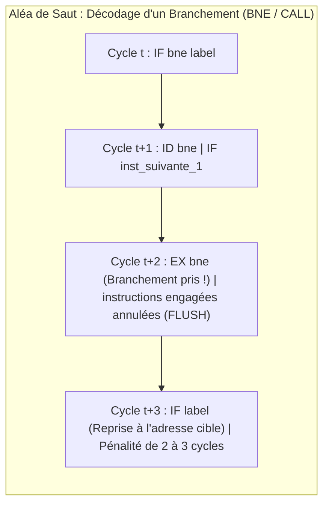

### 5. Méthodologie de choix d'une cible matérielle

Le dimensionnement d'un microcontrôleur s'appuie sur une analyse méthodique du cahier des charges :
1. **Recensement des entrées/sorties et interfaces** : nombre de broches (I/O pins), type de signaux (numériques, analogiques, PWM), bus requis (UART, I2C, SPI, CAN).
2. **Besoins en acquisition et action** : fréquences d'échantillonnage, débits crêtes et moyens, résolution des capteurs.
3. **Puissance de calcul nécessaire** : fréquence CPU requise, présence d'accélérateur matériel (FPU, DSP), criticité des contraintes temporelles temps réel.
4. **Estimation mémoire** : volume de mémoire Flash (taille du binaire, tables de calibration) et SRAM (variables globales, pile d'exécution, tas).
5. **Critères industriels** : consommation au repos/en activité, plage de température, packaging, coût unitaire et pérennité d'approvisionnement.

:::block type="remember" title="Synthèse de l'architecture d'un MCU"
Un microcontrôleur regroupe sur une puce : un **microprocesseur (CPU)**, des **mémoires (Flash + SRAM)**, des **arbres d'horloge (Clocks)**, des **périphériques d'acquisition** (GPIO, ADC), des **périphériques d'action** (DAC, Timers PWM) et des **contrôleurs de communication** (UART, I2C, SPI, CAN).
:::

:::

:::section id="sn421-software" eyebrow="Chapitre 2" title="Spécificités logicielles" summary="Chaîne de compilation croisée, organisation de la mémoire, script d'édition de liens, vecteur de démarrage, interruptions et calcul en virgule fixe."

### 1. Environnement et langages de programmation

La programmation embarquée bare-metal repose quasi-exclusivement sur le **C et le C++**, complétés par de l'**assembleur** pour les phases critiques d'initialisation et de commutation de contexte. Des alternatives émergent (Embedded Rust, MicroPython, Embedded Java), mais le C reste le standard industriel.

:::grid two-col
:::block type="neutral" title="Code hébergé (débarqué / PC)"
* Fonction `main(int argc, char** argv)` retournant un code d'erreur au système d'exploitation.
* Utilisation libre de la mémoire dynamique (`malloc`, `free`) orchestrée par l'OS.
* Entrées/sorties standard actives d'office (`printf` redirigé vers le terminal hôte).
:::
:::block type="neutral" title="Code embarqué (bare-metal)"
* Fonction `void main(void)` ne se terminant jamais : boucle infinie `while(1)`.
* Initialisation matérielle explicite (`SystemInit()`, configuration des horloges et périphériques).
* Mémoire dynamique déconseillée voire proscrite ; utilisation de tableaux et structures statiques.
* Bibliothèque standard partielle : `printf` n'affiche rien sans réimplémentation bas niveau de `_write`.
:::
:::

### 2. Chaîne de compilation croisée et Linker Script

La compilation croisée génère un binaire pour une architecture cible différente de la machine de développement hôte. Les options courantes de GCC pour ARM sont :
* `-mcpu=cortex-mX` / `-march=armv7e-m` : spécifie l'architecture cible.
* `-mthumb` : force le jeu d'instructions Thumb/Thumb-2.
* `-mfpu=fpv4-sp-d16` et `-mfloat-abi=hard` (ou `soft` / `softfp`) : configure la prise en charge de la FPU matérielle ou l'émulation logicielle.
* `-T file.ld` : fournit le script d'édition de liens (*linker script*).


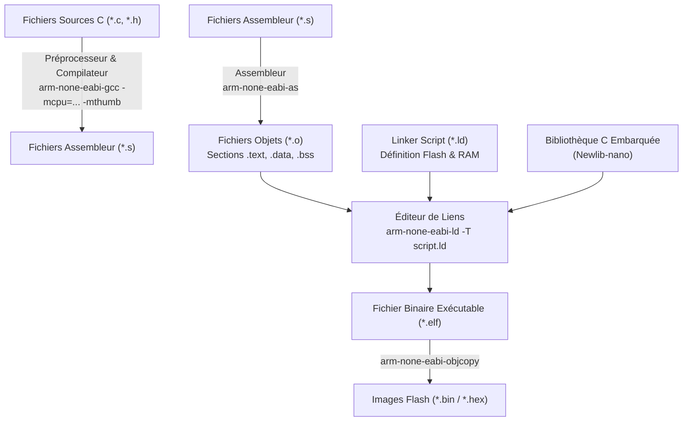

#### Organisation spatiale de la mémoire
Le compilateur et l'éditeur de liens structurent le binaire en plusieurs sections :

| Section | Nature | Emplacement au repos (ROM/Flash) | Emplacement à l'exécution (RAM) |
| :--- | :--- | :--- | :--- |
| **`.text`** | Instructions de code machine | Flash | Flash (exécution in situ) |
| **`.rodata`** | Données constantes (`const int tab[]`) | Flash | Flash |
| **`.data`** | Variables globales/statiques initialisées | Flash (valeurs initiales) | SRAM (recopiées au boot) |
| **`.bss`** | Variables globales/statiques non initialisées | Aucune empreinte | SRAM (mises à zéro au boot) |
| **Heap** | Tas pour allocations dynamiques (`malloc`) | Néant | SRAM (croissance vers les adresses hautes) |
| **Stack** | Pile d'exécution (variables locales, contextes) | Néant | SRAM (croissance vers les adresses basses) |


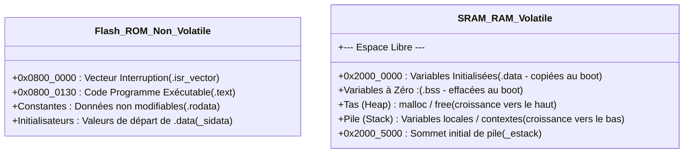

:::block type="method" title="Structure d'un Linker Script (file.ld)"
```ld
MEMORY
{
  FLASH (rx)  : ORIGIN = 0x08000000, LENGTH = 128K
  RAM   (rwx) : ORIGIN = 0x20000000, LENGTH = 20K
}
SECTIONS
{
  .isr_vector : { KEEP(*(.isr_vector)) } > FLASH
  .text       : { *(.text*) *(.rodata*) } > FLASH
  .data : {
    _sdata = .;
    *(.data*)
    _edata = .;
  } > RAM AT > FLASH
  _sidata = LOADADDR(.data);
  .bss : {
    _sbss = .;
    *(.bss*)
    _ebss = .;
  } > RAM
}
```
:::

### 3. Séquence de démarrage (Startup et Reset Handler)

À la mise sous tension ou au reset matériel :
1. Le processeur charge la valeur du pointeur de pile initial `_estack` située à l'adresse `0x00000000` (ou `0x08000000` remappée).
2. Il charge le vecteur de reset situé à l'adresse `0x00000004` et saute à la routine `Reset_Handler`.
3. Le code de démarrage recopie les données de la section `.data` depuis la Flash (`_sidata`) vers la SRAM (`_sdata` à `_edata`).
4. Il initialise à zéro la zone `.bss` (`_sbss` à `_ebss`).
5. Il appelle `SystemInit()` pour configurer les arbres d'horloges élémentaires.
6. Il invoque `__libc_init_array` (constructeurs statiques C++), puis saute enfin dans la fonction `main()`.

### 4. Gestion des interruptions et variable volatile

Une **interruption (ISR)** est une fonction spéciale déclenchée par un événement matériel asynchrone (front sur une broche, fin de conversion ADC, débordement de timer). Elle ne prend aucun argument et ne retourne rien.

:::block type="remember" title="Règles d'or pour la conception d'une ISR"
* Être la plus courte et rapide possible en temps d'exécution.
* Ne jamais exécuter de boucles d'attente bloquantes ni d'appels lourds.
* Mettre à jour un simple drapeau ou enregistrer les données dans un tampon partagé, puis acquitter le flag matériel d'interruption.
* Utiliser systématiquement le qualificateur `volatile` pour les variables partagées entre l'ISR et la boucle principale `main`.
:::


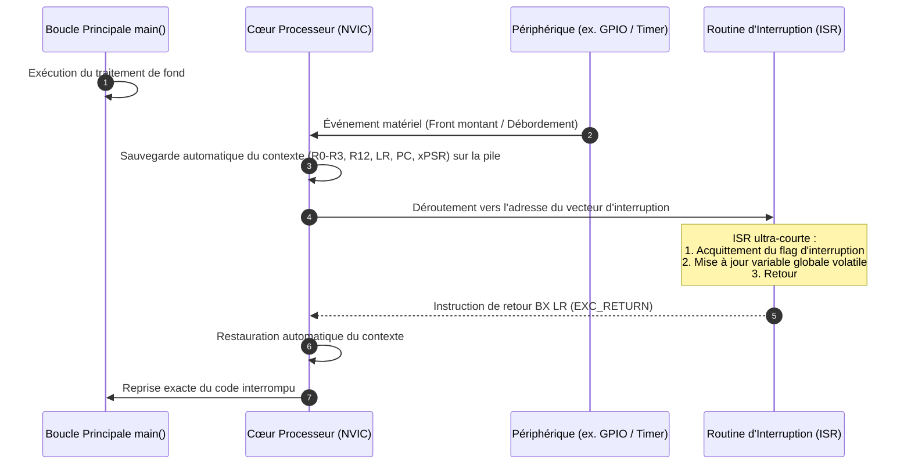

:::block type="definition" title="Rôle du mot-clé volatile"
Le mot-clé `volatile` signale au compilateur que la valeur d'une variable peut être modifiée en dehors du flot séquentiel normal (par une routine d'interruption ou un périphérique matériel). Le compilateur s'interdit alors d'optimiser l'accès en plaçant la variable dans un registre CPU : il force une lecture physique en mémoire à chaque accès et une écriture immédiate après chaque modification.
:::

<!-- ======================================================================= -->
<!-- [EMPLACEMENT INTERACTIF WOKWI 01]                                       -->
<!-- Chapitre 2 / Section 4 : Gestion des interruptions et variable volatile -->
<!-- Cible : Raspberry Pi Pico (RP2040 ARM Cortex-M0+) ou STM32C0             -->
<!-- Schéma : MCU + 1 Bouton poussoir (pull-up) + 1 LED témoin               -->
<!-- Objectif : Visualiser l'effet du mot-clé volatile sous optimisation -O2 -->
<!-- Code C : while (!button_pressed); dans main(), flag modifié par ISR     -->
<!-- diagram.json :                                                          -->
<!-- {                                                                       -->
<!--   "version": 1,                                                         -->
<!--   "author": "Cours SN421",                                              -->
<!--   "parts": [                                                            -->
<!--     { "type": "wokwi-pi-pico", "id": "pico", "top": 0, "left": 0 },     -->
<!--     { "type": "wokwi-pushbutton", "id": "btn", "top": 50, "left": -100 },-->
<!--     { "type": "wokwi-led", "id": "led", "top": -50, "left": 100 }       -->
<!--   ],                                                                    -->
<!--   "connections": [                                                      -->
<!--     [ "pico:GP14", "btn:1.r", "green", [ "v0" ] ],                      -->
<!--     [ "pico:GND.4", "btn:2.l", "black", [ "v0" ] ],                     -->
<!--     [ "pico:GP15", "led:A", "red", [ "v0" ] ],                          -->
<!--     [ "pico:GND.5", "led:K", "black", [ "v0" ] ]                        -->
<!--   ]                                                                     -->
<!-- }                                                                       -->
<!-- Iframe d'intégration Wokwi :                                            -->
<!-- <iframe src="https://wokwi.com/projects/YOUR_PROJECT_ID_01"             -->
<!--         width="100%" height="500px" frameborder="0"></iframe>           -->
<!-- ======================================================================= -->
:::block type="method" title="Laboratoire Virtuel Wokwi : Piège d'optimisation sans le mot-clé volatile"
**Objectif pédagogique :** Mettre en évidence l'omission du mot-clé `volatile` lors de la communication asynchrone entre une ISR matérielle et la boucle principale `main()`.
* **Cible et composants virtuels :** Cœur ARM Cortex-M (Raspberry Pi Pico RP2040 ou STM32), bouton-poussoir sur entrée d'interruption externe EXTI (GP14), LED de statut (GP15).
* **Protocole d'expérimentation pas-à-pas :**
  1. Déclarer la variable globale de synchronisation sans précaution : `int flag_evt = 0;`.
  2. Dans l'ISR du bouton, insérer `flag_evt = 1;`. Dans le `main()`, attendre via une boucle `while (!flag_evt);`.
  3. Lancer la compilation avec l'optimisation standard `-O2` : à l'exécution, appuyer sur le bouton. Constater que la LED ne s'allume jamais car le CPU teste un registre interne sans jamais relire la SRAM.
  4. Remplacer par `volatile int flag_evt = 0;` : relancer la simulation et vérifier la réaction immédiate du système dès l'appui sur le bouton.
:::

:::wokwi id="sn421-wokwi-01" label="Wokwi 01" title="Interruptions et volatile" src="https://wokwi.com/projects/473969280269263873"
Bouton en interruption, variable partagée avec `volatile`, LED témoin.
:::


### 5. Arithmétique en virgule fixe

En l'absence de FPU matérielle, l'utilisation de variables flottantes (`float`, `double`) entraîne l'inclusion de bibliothèques d'émulation logicielles très lentes et volumineuses. La **virgule fixe** permet de représenter des nombres réels en n'utilisant que l'ALU entière.

:::block type="definition" title="Format Qm.n (ou format E.F)"
Un nombre en virgule fixe comporte :
* $E$ (ou $m$) bits pour la partie entière signée (codée en complément à 2).
* $F$ (ou $n$) bits pour la partie fractionnaire (toujours positive).
* La résolution (le quantum) vaut $q = 2^{-F}$.
* La conversion d'un réel $x$ vers le format virgule fixe s'obtient par : $X = \text{round}(x \times 2^F)$.
:::

:::block type="method" title="Règles de calcul en virgule fixe"
* **Addition / Soustraction** : si les deux opérandes ont le même format $F$, l'addition s'effectue directement sur les entiers :
  $$A + B \quad (\text{résultat au format } F)$$
* **Multiplication** : la multiplication de deux nombres au format $F$ produit un résultat ayant $2F$ bits fractionnaires. Pour revenir au format $F$, il est indispensable de diviser par $2^F$ (décalage à droite de $F$ bits) :
  $$C = (A \times B) \gg F$$
* **Division** : pour conserver la précision de $F$ bits, il faut pré-multiplier le numérateur par $2^F$ avant d'effectuer la division entière :
  $$C = (A \ll F) / B$$
:::

:::

:::section id="sn421-periph" eyebrow="Chapitre 3" title="Les périphériques matériels" summary="Fonctionnement des GPIO, Timers, ADC/DAC, contrôleurs DMA, systèmes d'horloges et modes d'économie d'énergie."

### 1. Entrées/Sorties Générales (GPIO)

Les broches GPIO constituent l'interface élémentaire avec l'extérieur. L'adressage des registres périphériques s'effectue selon deux paradigmes :
* **Memory-Mapped I/O** (ARM, RISC-V) : les registres des périphériques sont projetés dans l'espace d'adressage mémoire unifié. La programmation s'effectue via des pointeurs volatils typés (ex. `GPIOA->ODR = 0x01;`).
* **Port-Mapped I/O** (Intel x86, AVR) : instructions machines dédiées (`in`, `out`) utilisant un bus d'adressage spécifique.

#### Modes de configuration des broches
* **Entrée flottante (Floating)** : haute impédance, sensible aux parasites extérieurs si aucune référence n'est appliquée.
* **Entrée avec Pull-up / Pull-down** : résistance interne de tirage au $V_{DD}$ ou à la masse $V_{SS}$.
* **Entrée analogique** : déconnexion de l'étage d'entrée logique à trigger de Schmitt pour orienter le signal vers le convertisseur ADC.
* **Sortie Push-Pull** : deux transistors complémentaires (P-MOS et N-MOS) commutent activement la broche au niveau haut ou bas (fort courant de source et d'évacuation).
* **Sortie Drain Ouvert (Open-Drain)** : seul le transistor N-MOS est actif. Pour atteindre l'état haut, une résistance de rappel (pull-up) externe ou interne est indispensable. Ce mode permet la constitution de bus partagés avec fonction ET câblé (ex. I2C).


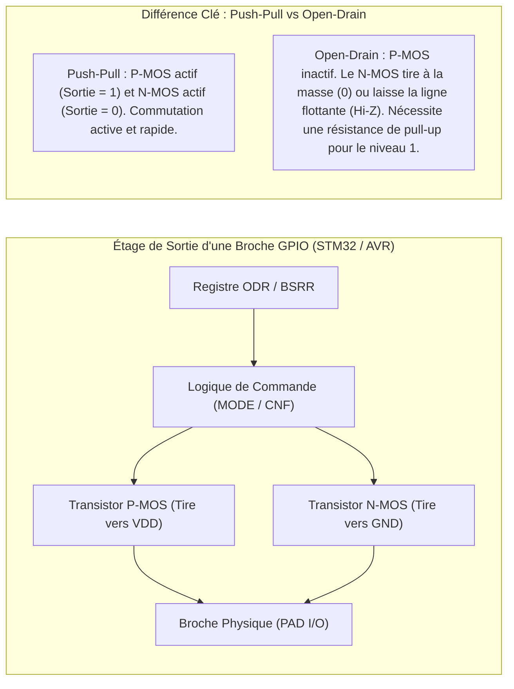

:::circuitgrid
:::circuitjs label="Simulation Anti-rebond" title="Filtre anti-rebond matériel sur entrée GPIO" iframeTitle="Simulation CircuitJS d'un retard RC utilisé pour filtrer une entrée logique" src="https://www.falstad.com/circuit/circuitjs.html?hideMenu=true&startCircuit=delayrc.txt"
Bouton poussoir avec rebonds mécaniques lissés par filtre passe-bas RC et comparateur trigger de Schmitt.
:::
:::

<!-- ======================================================================= -->
<!-- [EMPLACEMENT INTERACTIF WOKWI 02]                                       -->
<!-- Chapitre 3 / Section 1 : GPIO Push-Pull vs Open-Drain                   -->
<!-- Cible : STM32 ou ATmega328P                                             -->
<!-- Schéma : MCU + 2 LED + 1 Résistance de pull-up (4.7 kOhms)               -->
<!-- Objectif : Démontrer l'état haute impédance (Hi-Z) de l'Open-Drain      -->
<!-- Iframe d'intégration Wokwi :                                            -->
<!-- <iframe src="https://wokwi.com/projects/YOUR_PROJECT_ID_02"             -->
<!--         width="100%" height="500px" frameborder="0"></iframe>           -->
<!-- ======================================================================= -->
:::block type="method" title="Laboratoire Virtuel Wokwi : Étage de sortie GPIO Push-Pull vs Open-Drain"
**Objectif pédagogique :** Démontrer la différence physique entre un étage de sortie push-pull actif et un collecteur/drain ouvert nécessitant une résistance de polarisation externe.
* **Cible et composants virtuels :** Microcontrôleur embarqué, LED témoin sur broche Push-Pull, LED sur broche Open-Drain, résistance de rappel de $4.7\,\text{k}\Omega$ vers $V_{DD}$.
* **Protocole d'expérimentation pas-à-pas :**
  1. Piloter la broche Push-Pull à l'état haut ('1') et bas ('0') : constater que le courant est alternativement sourcé depuis $V_{DD}$ et drainé vers GND.
  2. Basculer la broche en mode Open-Drain sans résistance de pull-up : constater que le niveau bas '0' fonctionne parfaitement (la LED connectée à $V_{DD}$ s'allume), mais que le niveau haut '1' laisse la ligne flottante à haute impédance (Hi-Z).
  3. Activer la résistance de pull-up externe (ou le pull-up interne du microcontrôleur) : observer le retour du niveau logique haut stable à $3.3\,\text{V}$.
:::

:::wokwi id="sn421-wokwi-02" label="Wokwi 02" title="GPIO push-pull vs open-drain" src="https://wokwi.com/projects/473973120052809729"
Comparaison entre sortie active et ligne à drain ouvert avec résistance de rappel.
:::


### 2. Timers et temporisations

Un timer matériel est constitué au minimum d'un compteur interne ($CNT$ sur 16 ou 32 bits), d'un diviseur d'horloge et d'un pré-diviseur programmable (**Prescaler** $PSC$), ainsi que d'un registre de recharge automatique (**Auto-Reload** $ARR$).

$$\text{Fréquence d'interruption} \quad F_{INT} = \frac{F_{CLK}}{(PSC + 1) \times (ARR + 1)}$$

:::grid two-col
:::block type="method" title="Modes de fonctionnement des Timers"
1. **Base de temps** : comptage progressif (Up), dégressif (Down) ou centré-aligné (Center-aligned), générant une interruption lors du débordement (*overflow* / *update event*).
2. **Input Capture** : enregistre la valeur instantanée du compteur dans un registre de capture lors de la détection d'un front (montant ou descendant) sur une broche externe. Permet de mesurer précisément la fréquence ou la largeur d'impulsion d'un signal extérieur.
3. **Output Compare / PWM (MLI)** : compare en permanence la valeur de $CNT$ à un registre de consigne $CCR$. Lorsque $CNT = CCR$, l'état de la broche associée est basculé, permettant la génération de signaux PWM à rapport cyclique variable pour la commande de moteurs ou la gradation d'éclairage.
:::
:::block type="warning" title="Gestion du temps et débordement logiciel"
Lors de l'incrémentation d'une variable temporelle dans une ISR, il convient de dimensionner le type pour éviter les dépassements :
* `uint8_t` à 1 ms déborde en 256 ms.
* `uint16_t` à 1 ms déborde en 65,5 secondes.
* `uint32_t` à 1 ms offre une autonomie d'environ 49,7 jours avant rebouclage.
:::
:::


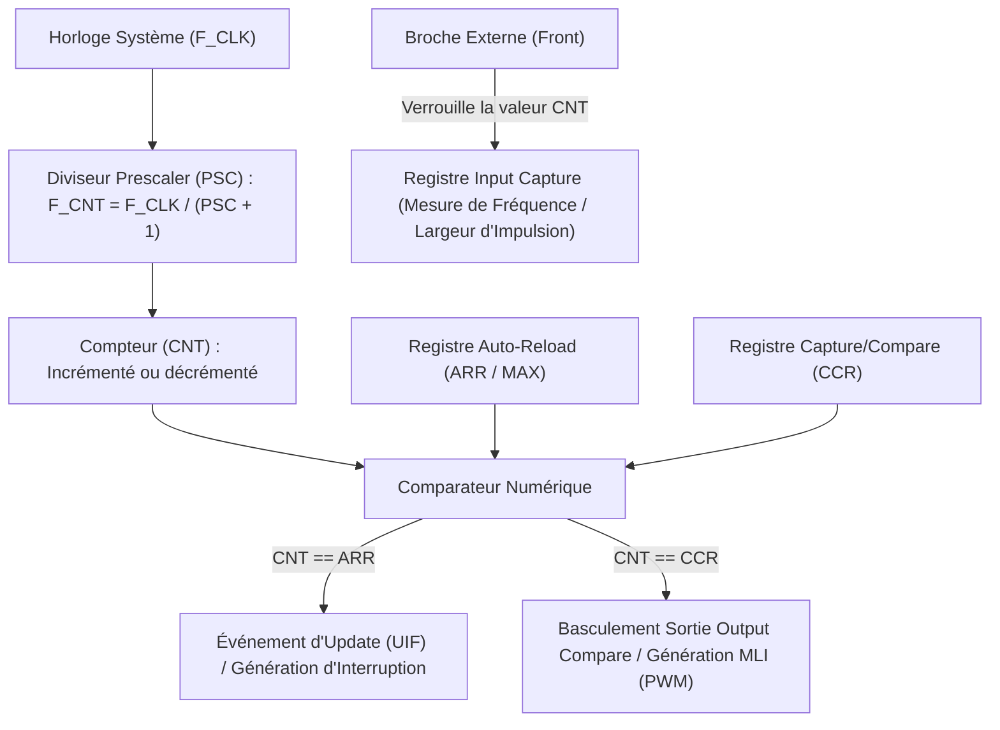

<!-- ======================================================================= -->
<!-- [EMPLACEMENT INTERACTIF WOKWI 03]                                       -->
<!-- Chapitre 3 / Section 2 : Timers et Génération PWM (Output Compare)      -->
<!-- Cible : ARM Cortex-M / Raspberry Pi Pico / STM32                        -->
<!-- Schéma : MCU + LED + Oscilloscope virtuel Wokwi                         -->
<!-- Objectif : Mesurer la fréquence et le rapport cyclique (Duty Cycle)     -->
<!-- Iframe d'intégration Wokwi :                                            -->
<!-- <iframe src="https://wokwi.com/projects/YOUR_PROJECT_ID_03"             -->
<!--         width="100%" height="500px" frameborder="0"></iframe>           -->
<!-- ======================================================================= -->
:::block type="method" title="Laboratoire Virtuel Wokwi : Modulation de Largeur d'Impulsion (PWM) & Oscilloscope"
**Objectif pédagogique :** Dimensionner les registres matériels d'un timer (Prescaler, Auto-Reload, Capture/Compare) et vérifier la forme d'onde générée sur un oscilloscope virtuel.
* **Cible et composants virtuels :** Périphérique Timer en mode Output Compare (PWM), sortie reliée à une LED et à la voie A de l'oscilloscope virtuel Wokwi.
* **Protocole d'expérimentation pas-à-pas :**
  1. Fixer l'horloge du timer à $1\,\text{MHz}$ via le registre `PSC` et la période à $1\,\text{ms}$ ($1\,\text{kHz}$) via le registre `ARR = 999`.
  2. Modifier dynamiquement la valeur du registre de comparaison `CCR` ($250$, $500$, $750$) pour générer des rapports cycliques de 25%, 50% et 75%.
  3. Mesurer les curseurs de temps sur l'oscilloscope virtuel pour vérifier la durée de l'état haut $t_{\text{on}}$ et observer la variation continue de luminosité sur la LED.
:::

:::wokwi id="sn421-wokwi-03" label="Wokwi 03" title="Timer PWM et oscilloscope" src="https://wokwi.com/projects/473973832048636929"
Mesure de fréquence, rapport cyclique et variation de luminosité.
:::


### 3. Convertisseurs Analogique-Numérique (CAN / ADC) et Numérique-Analogique (CNA / DAC)

#### Convertisseur Analogique-Numérique (ADC)
L'ADC convertit une tension analogique comprise entre $V_{REF-}$ et $V_{REF+}$ en un entier non signé sur $n$ bits (typiquement 10 ou 12 bits). La valeur convertie $N$ et le pas de quantification (quantum $q$) s'expriment par :

$$N = (2^n - 1) \times \frac{V_{in} - V_{min}}{V_{max} - V_{min}}, \qquad q = \frac{V_{max} - V_{min}}{2^n - 1}$$

* **SAR (Approximations Successives)** : architecture prédominante dans les microcontrôleurs généraux. Utilise une dichotomie interne avec comparateur et DAC de référence. Compromis optimal entre vitesse (< 10 MS/s), surface et consommation.
* **Delta-Sigma ($\Delta\Sigma$)** : suréchantillonnage et filtrage numérique (décimation). Très haute résolution (16 à 24 bits), idéal pour l'audio et l'instrumentation lente.
* **Flash** : banc de $2^n - 1$ comparateurs en parallèle. Conversion ultra-rapide (plusieurs GS/s) mais résolution modeste (6 à 8 bits) et consommation élevée.
* **Double rampe** : basé sur l'intégration d'un courant dans une capacité. Lent mais grande immunité aux bruits industriels (50 Hz).

#### Convertisseur Numérique-Analogique (DAC)
Convertit un code numérique $N$ en une tension analogique :
$$V_{out} = \frac{N}{2^n - 1} \times (V_{max} - V_{min}) + V_{min}$$
*Nécessite souvent un étage suiveur d'adaptation d'impédance et un filtre passe-bas de reconstruction.*

<!-- ======================================================================= -->
<!-- [EMPLACEMENT INTERACTIF WOKWI 04]                                       -->
<!-- Chapitre 3 / Section 3 : Conversion ADC et calcul en Virgule Fixe       -->
<!-- Cible : Raspberry Pi Pico ou STM32                                      -->
<!-- Schéma : MCU + Potentiomètre rotatif analogique + Sortie Serial Monitor  -->
<!-- Objectif : Mesurer une tension analogique sans utiliser la FPU (Q8.8)   -->
<!-- Iframe d'intégration Wokwi :                                            -->
<!-- <iframe src="https://wokwi.com/projects/YOUR_PROJECT_ID_04"             -->
<!--         width="100%" height="500px" frameborder="0"></iframe>           -->
<!-- ======================================================================= -->
:::block type="method" title="Laboratoire Virtuel Wokwi : Échantillonnage ADC & Arithmétique Virgule Fixe"
**Objectif pédagogique :** Convertir une tension analogique variable issue d'un potentiomètre et réaliser la mise à l'échelle physique en arithmétique virgule fixe (sans calcul flottant).
* **Cible et composants virtuels :** Entrée analogique ADC 12 bits ($V_{\text{ref}} = 3.3\,\text{V}$), potentiomètre linéaire virtuel, console série UART.
* **Protocole d'expérimentation pas-à-pas :**
  1. Configurer l'ADC pour échantillonner le canal analogique connecté au curseur du potentiomètre (valeur brute $N \in [0, 4095]$).
  2. Implémenter l'algorithme de conversion en virgule fixe au format $Q8.8$ : multiplier la valeur brute par le facteur d'échelle entier précalculé $\left(\frac{3300}{4095} \times 256\right)$ sans aucun appel à une bibliothèque logicielle flottante.
  3. Faire tourner le potentiomètre en cours de simulation et contrôler l'affichage en millivolts sur le moniteur série.
:::

:::wokwi id="sn421-wokwi-04" label="Wokwi 04" title="ADC et virgule fixe" src="https://wokwi.com/projects/YOUR_PROJECT_ID_04"
Lecture potentiomètre, conversion en millivolts et calcul sans FPU.
:::


### 4. Contrôleur DMA (Direct Memory Access)

Le contrôleur DMA permet le transfert direct de données en bloc entre périphériques et mémoires (ou entre mémoires) **sans aucune intervention du CPU**.
* **Arbitrage de bus** : en cas d'accès simultané au bus mémoire, le contrôleur alterne l'accès entre le CPU et les canaux DMA selon un mécanisme de type *round-robin* ou par priorités fixes.
* **Buffer Ping-Pong (Double Buffer)** : pendant que le DMA remplit le tampon "Ping", le processeur traite les données du tampon "Pong". À chaque demi-transfert ou fin de transfert, les rôles sont inversés, évitant tout blocage ou perte de données à haute fréquence.


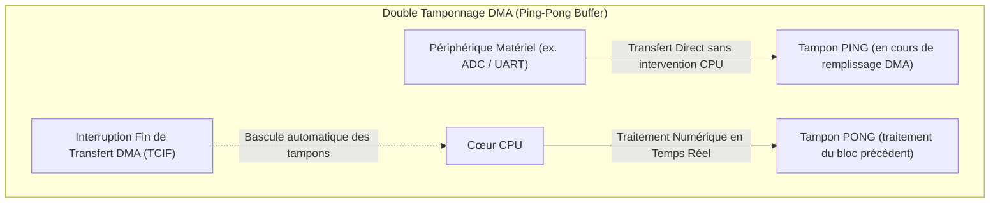
:::figure src="assets/micro/dma-ping-pong.svg" alt="Mécanisme Ping-Pong DMA" caption="Séparation temporelle entre le remplissage matériel par le DMA et le traitement logiciel par le CPU." :::

### 5. Gestion des horloges et modes basse consommation

L'arbre d'horloge propose différentes sources :
* Oscillateur RC interne rapide (HSI) ou lent (LSI).
* Oscillateur à quartz externe précis rapide (HSE) ou lent 32.768 kHz pour la RTC (LSE).
* Boucle à verrouillage de phase (**PLL**) pour multiplier la fréquence et atteindre la cadence maximale du cœur.

:::block type="remember" title="Hiérarchie des modes d'énergie (Exemple STM32)"
* **Run** : CPU actif, tous les périphériques activés fonctionnent à pleine vitesse.
* **Sleep** : horloge CPU coupée ; l'ensemble des périphériques continue de fonctionner. Le processeur se réveille instantanément sur n'importe quelle interruption.
* **Stop** : toutes les horloges principales sont arrêtées, le régulateur principal est en mode basse consommation. Le contenu de la SRAM et des registres est préservé. Réveil par interruption externe (EXTI) ou RTC.
* **Standby** : extinction quasi-totale du circuit. Les mémoires SRAM et les registres CPU sont perdus (sauf domaine de sauvegarde de secours Backup Domain). Réveil par broche de Reset, broche Wake-up dédiée ou alarme RTC.
:::

:::block type="definition" title="Périphériques de sécurité et d'intégrité"
* **Watchdog (Chien de garde)** : compteur dégressif autonome. Le logiciel doit rafraîchir périodiquement sa valeur. Si le programme se bloque dans une boucle infinie ou déraille, le compteur atteint zéro et déclenche un reset matériel du MCU.
* **Brown-Out Detector (BOD)** : surveille le niveau de tension d'alimentation et génère une interruption de sauvegarde d'urgence puis un reset avant que la baisse de tension ne corrompe les écritures Flash ou les calculs de l'ALU.
* **RTC (Real-Time Clock)** : horloge calendaire autonome alimentée par pile bouton (coin cell) préservant l'heure et la date en cas de coupure de l'alimentation principale.
:::

:::

:::section id="sn421-bus" eyebrow="Chapitre 4" title="Bus et liaisons de communication" summary="Modèle de transmission, protocoles UART, I2C, SPI, CAN, USB, Ethernet et caractérisation expérimentale des lignes."

### 1. Fondements et Modèle OSI appliqué à l'embarqué

Les communications filaires en systèmes embarqués s'appuient principalement sur les couches 1 (Physique) et 2 (Liaison de données) du modèle OSI :
* **Couche physique** : support de transmission (fils, paires torsadées différentielles), niveaux de tension, sens de transmission (simplex, half-duplex, full-duplex) et codage binaire du signal :
  * **NRZ (Non-Return-to-Zero)** : niveau haut pour 1, niveau bas pour 0 (standard UART, I2C, SPI).
  * **NRZI (Non-Return-to-Zero Inverted)** : transition au début du bit pour marquer un 0, absence de transition pour 1 (standard USB).
  * **Manchester** : transition systématique au milieu de chaque temps bit garantissant la synchronisation de l'horloge (standard Ethernet 10BASE-T).
* **Couche liaison** : cadrage en trames, signaux de start/stop, mécanismes d'arbitrage et détection d'erreurs (parité, checksum, CRC).

### 2. UART (Universal Asynchronous Receiver Transmitter)

Liaison série point à point asynchrone full-duplex sur deux fils dédiés ($TX$, $RX$) et une masse commune :
* **Niveau de repos** : état logique haut ('1').
* **Format de trame** :
  1. 1 bit de **Start** au niveau logique '0' assurant la resynchronisation du récepteur.
  2. 5 à 9 bits de **Données** (transmis du LSB au MSB).
  3. 1 bit optionnel de **Parité** (paire ou impaire).
  4. 1, 1.5 ou 2 bits de **Stop** au niveau logique '1'.
* **Efficacité du protocole** : $\eta = \frac{N_{\text{data}}}{N_{\text{total}}}$ (typiquement $\frac{8}{10} = 80\%$ en configuration 8N1).
* **Gestion logicielle** : par scrutation (bloquante), par interruption (caractère par caractère), ou via DMA pour des transferts de trames complètes à haut débit.

<!-- ======================================================================= -->
<!-- [EMPLACEMENT INTERACTIF WOKWI 05]                                       -->
<!-- Chapitre 4 / Section 2 : Liaison UART bidirectionnelle et interruptions  -->
<!-- Cible : ARM Cortex-M / ATmega328P                                       -->
<!-- Schéma : MCU relié au Serial Monitor virtuel                            -->
<!-- Objectif : Réception asynchrone non-bloquante avec Ring Buffer          -->
<!-- Iframe d'intégration Wokwi :                                            -->
<!-- <iframe src="https://wokwi.com/projects/YOUR_PROJECT_ID_05"             -->
<!--         width="100%" height="500px" frameborder="0"></iframe>           -->
<!-- ======================================================================= -->
:::block type="method" title="Laboratoire Virtuel Wokwi : UART asynchrone et Tampon Circulaire (Ring Buffer)"
**Objectif pédagogique :** Gérer un flux de caractères asynchrone à 115200 bauds sans bloquer le microcontrôleur grâce à une routine d'interruption de réception (RXNE).
* **Cible et composants virtuels :** Contrôleur UART matériel, terminal série interactif Wokwi (Serial Monitor).
* **Protocole d'expérimentation pas-à-pas :**
  1. Activer l'interruption `USART_IT_RXNE` déclenchée à l'arrivée de chaque octet sur la broche RX.
  2. Dans l'ISR, empiler l'octet reçu dans un tampon circulaire (`ring_buffer[64]`) en mettant à jour le pointeur d'écriture `head`.
  3. Dans la boucle `while(1)`, dépiler les caractères via le pointeur de lecture `tail` et calculer le ratio de débit utile ($80\%$ en configuration 8N1).
:::

:::wokwi id="sn421-wokwi-05" label="Wokwi 05" title="UART et ring buffer" src="https://wokwi.com/projects/YOUR_PROJECT_ID_05"
Réception asynchrone non bloquante via interruption et tampon circulaire.
:::


### 3. I2C (Inter-Integrated Circuit)

Bus série synchrone half-duplex conçu par Philips, utilisant seulement deux lignes bidirectionnelles à collecteur/drain ouvert polarisées par des résistances de rappel au $V_{DD}$ (**Pull-up**) :
* **Lignes** : **SDA** (Serial Data) et **SCL** (Serial Clock).
* **Topologie maître-esclave** : un ou plusieurs maîtres pilotent l'horloge SCL et adressent jusqu'à 127 esclaves uniques sur 7 bits (l'adresse `0x00` étant réservée au broadcast).
* **Gestion des collisions (Multi-Maître)** : assurée par le protocole **CSMA/CD** (Carrier Sense Multiple Access with Collision Detection). Grâce au drain ouvert, le niveau '0' est dominant sur le niveau '1' (ET câblé). Le maître qui émet un '1' mais relit un '0' sur la ligne perd l'arbitrage et se tait immédiatement.

:::block type="method" title="Chronogramme d'une transaction I2C"
1. **Condition de START** : transition descendante de SDA pendant que SCL est maintenu à l'état haut.
2. **Octet d'adresse** : émission des 7 bits d'adresse de l'esclave (MSB en tête) suivis du bit $R/\bar{W}$ (0 pour écriture, 1 pour lecture).
3. **Acquittement (ACK/NACK)** : l'esclave adressé tire SDA à '0' sur le 9ème coup d'horloge SCL pour valider la réception.
4. **Transfert de données** : suite d'octets de données acquittés à chaque transfert.
5. **Condition de STOP** : transition montante de SDA pendant que SCL est à l'état haut.
:::


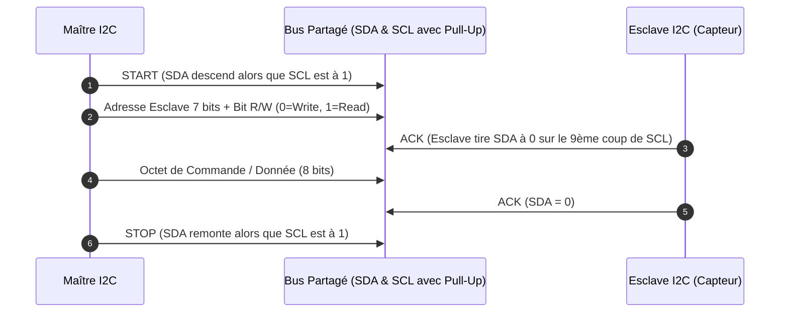

:::circuitgrid
:::circuitjs label="Bus I2C" title="Ligne I2C à collecteur ouvert avec résistances de pull-up et capacité de ligne" iframeTitle="Simulation CircuitJS d'une charge RC assimilable au temps de montée d'une ligne I2C" src="https://www.falstad.com/circuit/circuitjs.html?hideMenu=true&startCircuit=cap.txt"
Visualisation du temps de montée exponentiel (constante RC = R_pullup * C_bus) et de la déformation des créneaux en fonction de la fréquence.
:::
:::

<!-- ======================================================================= -->
<!-- [EMPLACEMENT INTERACTIF WOKWI 06]                                       -->
<!-- Chapitre 4 / Section 3 : Bus I2C et Analyseur Logique Virtuel (VCD)     -->
<!-- Cible : Raspberry Pi Pico ou STM32                                      -->
<!-- Schéma : MCU + Capteur I2C (TMP102 ou SSD1306) + Logic Analyzer 8 canaux -->
<!-- Objectif : Analyser le START, l'adresse 7 bits, l'ACK sur le 9e cycle   -->
<!-- Configuration diagram.json suggérée :                                   -->
<!-- {                                                                       -->
<!--   "parts": [                                                            -->
<!--     { "type": "wokwi-logic-analyzer", "id": "logic1", "top": 100, "left": 100 }, -->
<!--     { "type": "wokwi-tmp102", "id": "sensor", "top": 50, "left": 200 }  -->
<!--   ],                                                                    -->
<!--   "connections": [                                                      -->
<!--     [ "pico:GP4", "sensor:SDA", "green", [] ],                          -->
<!--     [ "pico:GP5", "sensor:SCL", "blue", [] ],                           -->
<!--     [ "pico:GP4", "logic1:D0", "green", [] ],                           -->
<!--     [ "pico:GP5", "logic1:D1", "blue", [] ]                             -->
<!--   ]                                                                     -->
<!-- }                                                                       -->
<!-- Iframe d'intégration Wokwi :                                            -->
<!-- <iframe src="https://wokwi.com/projects/YOUR_PROJECT_ID_06"             -->
<!--         width="100%" height="500px" frameborder="0"></iframe>           -->
<!-- ======================================================================= -->
:::block type="method" title="Laboratoire Virtuel Wokwi : Analyse de Trame I2C à l'Analyseur Logique (Export VCD)"
**Objectif pédagogique :** Capturer et décoder les signaux réels d'un bus I2C (START, adresse esclave, bit R/W, acquittement ACK, STOP) grâce à l'analyseur logique virtuel intégré de Wokwi.
* **Cible et composants virtuels :** Maître I2C communicant avec une sonde de température numérique (TMP102), broches SDA et SCL reliées aux canaux 0 et 1 de l'analyseur logique virtuel Wokwi.
* **Protocole d'expérimentation pas-à-pas :**
  1. Lancer la simulation : l'analyseur logique enregistre tous les changements d'état des lignes SDA et SCL.
  2. Arrêter la simulation pour télécharger le fichier d'ondes `.vcd` généré.
  3. Visualiser la capture dans l'outil d'analyse intégré (ou PulseView / Sigrok) :
     * Identifier la condition de **START** (front descendant de SDA pendant que SCL est au repos à l'état haut).
     * Décoder l'adresse 7 bits transmise du MSB au LSB (`0x48` pour le TMP102) et le bit $R/\bar{W}=0$.
     * Observer le 9ème coup d'horloge où la ligne SDA est maintenue à la masse par le capteur esclave (**bit ACK**).
     * Vérifier la condition de **STOP** finale (front montant de SDA alors que SCL est à l'état haut).
:::

:::wokwi id="sn421-wokwi-06" label="Wokwi 06" title="I2C et analyseur logique" src="https://wokwi.com/projects/YOUR_PROJECT_ID_06"
Capture VCD, START, adresse, ACK et STOP.
:::


### 4. SPI (Serial Peripheral Interface)

Liaison série synchrone full-duplex à quatre fils conçue par Motorola :
* **Lignes** : **SCLK** (horloge maître), **MOSI** (Master Out Slave In), **MISO** (Master In Slave Out), et **$\overline{\text{SS}}$ / CS** (Slave Select actif à l'état bas, un fil par composant esclave).
* **Fonctionnement** : registre à décalage circulaire synchrone. À chaque coup d'horloge émis par le maître, un bit sort sur MOSI pendant qu'un bit entre simultanément sur MISO.
* **Modes d'horloge (CPOL et CPHA)** :
  * **CPOL (Clock Polarity)** : niveau de repos de SCLK (`CPOL=0` repos bas, `CPOL=1` repos haut).
  * **CPHA (Clock Phase)** : instant d'échantillonnage des données (`CPHA=0` capture sur le premier front, `CPHA=1` capture sur le second front).
  * 4 modes possibles : Mode 0 (0,0), Mode 1 (0,1), Mode 2 (1,0), Mode 3 (1,1).

:::grid two-col
:::block type="definition" title="Comparatif architectural SPI vs I2C"
* **SPI** : très haut débit (facilement > 20 à 50 MHz), transmission full-duplex native, protocole matériellement très simple. Inconvénient : multiplication des broches de sélection $\overline{\text{SS}}$ quand le nombre d'esclaves augmente.
* **I2C** : seulement 2 broches pour tout le bus quel que soit le nombre de circuits (adressage intégré), acquittement matériel direct. Inconvénient : débit plus faible (standard 100 kHz, fast 400 kHz, fast+ 1 MHz), communication half-duplex.
:::
:::block type="warning" title="Observations expérimentales à l'oscilloscope (Mesures réelles)"
L'analyse comparative sous oscilloscope à différentes distances de câblage (50 cm, 1 m, 2 m) et fréquences (1 kHz, 100 kHz, 400 kHz, 500 kHz, 800 kHz) met en évidence l'impact de la capacité parasite de ligne :
* **Comportement I2C** : les fronts montants sur SDA et SCL sont ralentis par la constante de temps $RC$ formée par la résistance de pull-up et la capacité parasite du câble. À 400 kHz sur 1 m ou 2 m, les signaux prennent une forme triangulaire tronquée menant à la perte d'intégrité numérique, nécessitant l'usage de buffers de ligne ou l'abaissement des résistances de pull-up.
* **Comportement SPI** : grâce à l'étage push-pull actif des broches, les fronts restent raides même à des fréquences de 500 kHz sur 2 m, mais présentent des sur-oscillations (*ringing*) et des résonances haute fréquence aux transitions.
:::
:::


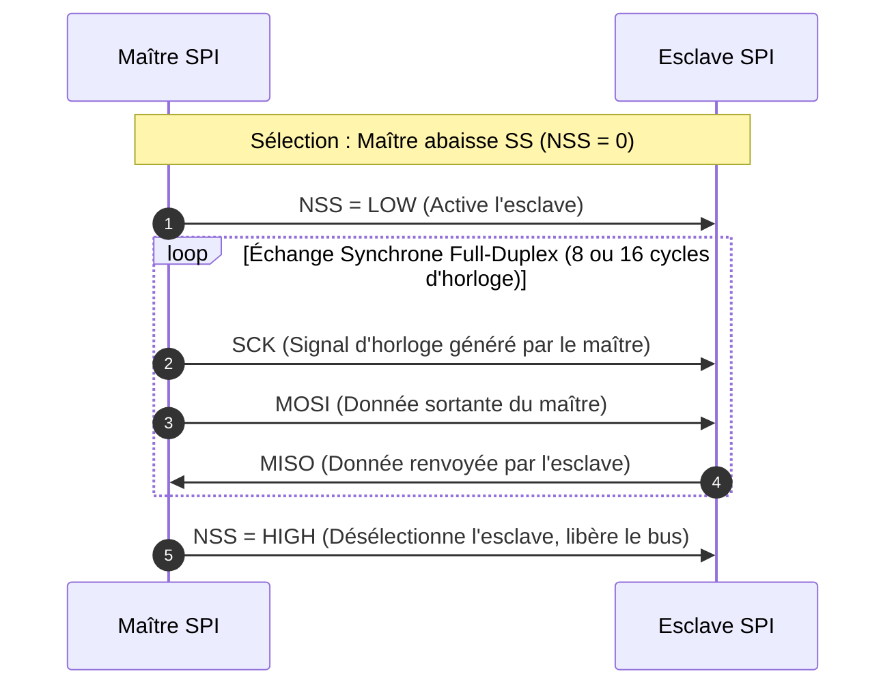

<!-- ======================================================================= -->
<!-- [EMPLACEMENT INTERACTIF WOKWI 07]                                       -->
<!-- Chapitre 4 / Section 4 : Bus SPI Full-Duplex et modes CPOL / CPHA       -->
<!-- Cible : Raspberry Pi Pico ou STM32                                      -->
<!-- Schéma : MCU + Registre 74HC595 (8 LED) + Logic Analyzer 4 canaux       -->
<!-- Objectif : Observer le transfert synchrone et l'impact de CPOL/CPHA     -->
<!-- Iframe d'intégration Wokwi :                                            -->
<!-- <iframe src="https://wokwi.com/projects/YOUR_PROJECT_ID_07"             -->
<!--         width="100%" height="500px" frameborder="0"></iframe>           -->
<!-- ======================================================================= -->
:::block type="method" title="Laboratoire Virtuel Wokwi : Communication SPI Synchrone & Modes d'Horloge"
**Objectif pédagogique :** Mesurer le transfert bidirectionnel simultané en liaison SPI et analyser l'impact du calage temporel des données selon la polarité (CPOL) et la phase (CPHA) de l'horloge.
* **Cible et composants virtuels :** Périphérique maître SPI connecté à un registre à décalage (74HC595) pilotant une rampe de LED, signaux SCK, MOSI, MISO et SS connectés à l'analyseur logique Wokwi.
* **Protocole d'expérimentation pas-à-pas :**
  1. Transmettre une séquence d'octets en **Mode 0** (`CPOL=0, CPHA=0`) : vérifier que la donnée est échantillonnée sur le front montant de SCK.
  2. Modifier le registre de configuration pour basculer en **Mode 3** (`CPOL=1, CPHA=1`) : observer sur l'analyseur logique que le niveau de repos de SCK passe à '1' et que l'échantillonnage s'effectue sur le front descendant.
  3. Valider la robustesse des fronts raides du bus push-pull face aux contraintes de vitesse élevée.
:::

:::wokwi id="sn421-wokwi-07" label="Wokwi 07" title="SPI et modes CPOL/CPHA" src="https://wokwi.com/projects/YOUR_PROJECT_ID_07"
Transfert synchrone, analyse SCK/MOSI/MISO/SS et modes d'horloge.
:::


### 5. Bus CAN (Controller Area Network)

Bus série différentiel robuste développé par Bosch pour l'automobile et l'industrie :
* **Support physique** : paire différentielle torsadée terminée par deux résistances de 120 $\Omega$ ($CAN_H$ et $CAN_L$).
* **Niveaux logiques** : bit **dominant** (niveau '0', $CAN_H - CAN_L \approx 2\text{ V}$) et bit **récessif** (niveau '1', tension différentielle quasi-nulle).
* **Arbitrage par CSMA/CR** (Carrier Sense Multiple Access with Collision Resolution) : chaque trame commence par un identifiant d'arbitrage (11 bits en standard, 29 bits en étendu). Si deux nœuds émettent simultanément, le nœud avec l'identifiant le plus faible (donc le plus grand nombre de '0' dominants) gagne l'accès au bus sans interruption ni corruption de la transmission.
* **Structure de trame** : Start of Frame (1 bit dominant), champ d'arbitrage (identifiant + bit RTR), champ de commande (code de longueur DLC sur 4 bits), données (0 à 8 octets), CRC (15 bits) avec délimiteur, ACK slot et fin de trame (EOF sur 7 bits récessifs).

### 6. USB et Ethernet

* **USB (Universal Serial Bus)** : liaison point à point différentielle half-duplex structurée en transactions de paquets (Token, Data, Handshake/ACK). Encodage NRZI avec bourrage de bits (*bit-stuffing*) pour garantir les transitions d'horloge.
* **Ethernet** : réseau étendu par paquets avec couche MAC et encapsulation TCP/IP, utilisant un codage Manchester ou MLT-3 selon le débit, avec isolation galvanique par transformateur.

:::


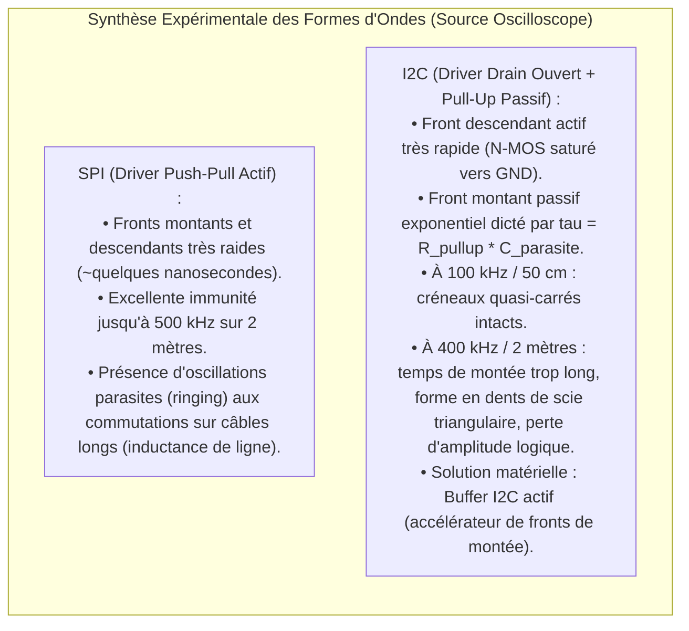
:::figure src="assets/micro/oscilloscope-spi-i2c.svg" alt="Comparaison des formes d'ondes SPI et I2C à l'oscilloscope" caption="Oscillogrammes comparatifs montrant l'effet de la constante de temps RC sur les fronts de montée I2C à 400 kHz sur 2 m versus l'étage push-pull symétrique du SPI." :::

:::

:::section id="sn421-se" eyebrow="Chapitre 5" title="Génie logiciel embarqué et conception de systèmes" summary="Démarche d'ingénierie en 11 étapes, conception sous contraintes, modélisation par machines à états et validation expérimentale."

### 1. Méthodologie générale de conception en 11 étapes

La réalisation d'un système embarqué exige une démarche rigoureuse évitant le développement empirique désordonné :

:::block type="method" title="Les 11 étapes du cycle de conception embarquée"
1. **Description du problème** : définir la finalité du système, spécifier les données d'entrée, les actions attendues et les données à échanger. Rédiger le cahier des charges fonctionnel et le diagramme des cas d'utilisation.
2. **Identification des conditions environnementales** : contraintes physiques (température, humidité, CEM, radiations), mécaniques (vibrations, chocs, accélération) et chimiques (corrosion, poussière, étanchéité).
3. **Spécification des contraintes temps réel** : déterminer les temps de réponse maximaux admissibles (échéances dures vs souples).
4. **Recherche des techniques d'acquisition** : identification des capteurs intégrés clé en main ou des grandeurs physiques secondaires à mesurer.
5. **Recherche des moyens d'action** : sélection des actionneurs adaptés et des circuits d'interface de puissance.
6. **Recherche des solutions de communication** : choix des protocoles (UART, SPI, I2C, CAN, liaisons sans fil) en fonction des débits, portées et mutualisations sur bus.
7. **Sélection du microcontrôleur** : dimensionnement du nombre de broches (I/O), de la puissance de calcul (MIPS / MHz) et des volumes mémoires (Flash, SRAM). Partitionnement multi-MCU si nécessaire.
8. **Schémas blocs du système** : agencement des sous-systèmes fonctionnels et caractérisation des liaisons d'interconnexion.
9. **Diagrammes d'activité et machines à états-transitions** : décomposition en tâches, analyse des dépendances, ordonnancement et résolution des conflits d'accès aux ressources partagées.
10. **Implémentation matérielle et logicielle** : routage des cartes électroniques, écriture du code embarqué structuré en modules, configuration des registres.
11. **Vérification et validation** : réalisation de tests unitaires, validation temporelle et débogage physique des interfaces sur banc de mesure (oscilloscope et analyseur logique).
:::


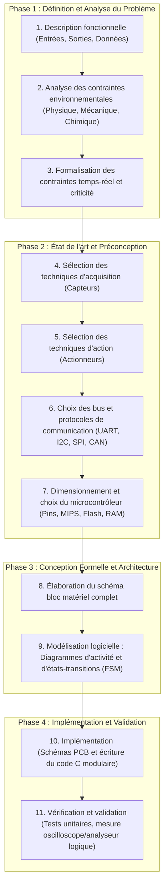

### 2. Modélisation comportementale par Machine à États Finis (FSM)

Pour garantir la prédictibilité temporelle et la robustesse du logiciel sans dépendre d'un système d'exploitation complexe, l'architecture logicielle s'organise classiquement autour d'une **machine à états finis** pilotée par événements :
* Les états modélisent les modes de fonctionnement du système (ex. `ETAT_VEILLE`, `ETAT_ACQUISITION`, `ETAT_TRAITEMENT`, `ETAT_ALARME`).
* Les transitions sont déclenchées par des événements matériels signalés par des variables volatiles mises à jour dans les routines d'interruption.
* La boucle principale `while(1)` évalue l'état courant et exécute les actions associées, assurant un comportement déterministe et facilitant la couverture de test.


<!-- ======================================================================= -->
<!-- [EMPLACEMENT INTERACTIF WOKWI 08]                                       -->
<!-- Chapitre 5 / Section 2 : Machine à États Finis (FSM) non-bloquante      -->
<!-- Cible : Raspberry Pi Pico ou STM32                                      -->
<!-- Schéma : MCU + 2 Boutons (Start / Reset) + LED RGB + Timer SysTick      -->
<!-- Objectif : Valider un automate événementiel sans aucun appel bloquant   -->
<!-- Iframe d'intégration Wokwi :                                            -->
<!-- <iframe src="https://wokwi.com/projects/YOUR_PROJECT_ID_08"             -->
<!--         width="100%" height="500px" frameborder="0"></iframe>           -->
<!-- ======================================================================= -->
:::block type="method" title="Laboratoire Virtuel Wokwi : Système Embarqué Réactif piloté par Automate (FSM)"
**Objectif pédagogique :** Implémenter et valider en temps réel une machine à états finis (FSM) gérant un cycle complet de fonctionnement sans aucune temporisation bloquante (`delay` rigoureusement proscrit).
* **Cible et composants virtuels :** Microcontrôleur, bouton de commande utilisateur, bouton d'urgence/acquittement, LED RVB d'affichage d'état, base de temps matérielle périodique.
* **Protocole d'expérimentation pas-à-pas :**
  1. Structurer l'application autour d'un `enum state_t { ETAT_VEILLE, ETAT_ACQUISITION, ETAT_TRAITEMENT, ETAT_ALERTE };`.
  2. Exécuter la boucle principale cadencée par un compteur de ticks non-bloquant : basculer la LED en bleu (Veille), vert (Acquisition), orange (Traitement), et rouge clignotant en cas d'alerte.
  3. Vérifier que l'appui sur le bouton d'urgence interrompt instantanément le traitement à tout moment, prouvant la réactivité du modèle événementiel face à une architecture séquentielle rigide.
:::

:::wokwi id="sn421-wokwi-08" label="Wokwi 08" title="FSM non bloquante" src="https://wokwi.com/projects/YOUR_PROJECT_ID_08"
Automate événementiel, boutons, LED RGB et tick périodique.
:::

:::block type="remember" title="Conclusion et bonnes pratiques d'ingénierie"
Un développement embarqué fiable repose sur une séparation stricte entre la couche matérielle (pilotes de périphériques bas niveau) et la couche logique métier, l'usage discipliné des interruptions, l'anticipation des limites de précision numérique (virgule fixe) et la validation systématique de l'intégrité des signaux sur le matériel physique.
:::

:::

:::section id="SN421-Dev-Micro-revision" eyebrow="Révision" title="Synthèse finale SN421" summary="Points à maîtriser avant de passer aux TD, aux TP ou à l'intégration Wokwi."
:::grid variant="two-col"
:::block type="remember" title="Questions réflexes"
1. Quel composant matériel réalise cette fonction : registre, interruption, timer, DMA, bus ou simple GPIO ?
2. Quelle mémoire contient la donnée à cet instant : Flash, SRAM, pile, tas, registre périphérique ?
3. Le code est-il bloquant ou réactif aux événements matériels ?
4. Le protocole choisi impose-t-il des pull-up, une horloge, une terminaison ou un arbitrage particulier ?
:::

:::block type="method" title="Méthode de travail"
Pour chaque chapitre, refaire le schéma fonctionnel, écrire le pseudo-code minimal, puis vérifier le comportement dans un laboratoire Wokwi ou avec un instrument de mesure quand le matériel est disponible.
:::
:::
:::
