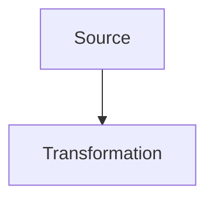

# Format Markdown enrichi

Les pages peuvent etre ecrites dans `content/<matiere>/*.md`.
Le build garde le rendu du site en transformant des blocs Markdown enrichis en HTML.

## Frontmatter

```md
---
title: Electronique EP361 - Revision ESISAR
subject: elec
type: course
---
```

## Sections

```md
:::section id="elec-filtres" eyebrow="Chapitre 2" title="Filtres analogiques" summary="Phrase de synthese."
Contenu de la section.
:::
```

## Grilles

```md
:::grid two-col
:::block type="definition" title="Variables"
- Entree : \(v_e\)
- Sortie : \(v_s\)
:::

:::block type="method" title="Methode"
1. Identifier le montage.
2. Ecrire la fonction de transfert.
:::
:::
```

## Types de blocs

`definition`, `method`, `theorem`, `warning`, `remember` et `neutral` reprennent les styles existants.

```md
:::block type="theorem" title="Critere de Barkhausen"
\[
|A(j\omega_0)B(j\omega_0)|=1
\]
:::
```

## Figures

```md
:::figure src="assets/elec/cellule-t.svg" alt="Cellule en T" caption="Legende optionnelle." :::
```

## Mermaid

Les diagrammes Mermaid peuvent etre ecrits dans un bloc de code classique :

````md

````

## Graphiques interactifs Plotly

Les graphiques interactifs utilisent `:::plotly`. Le corps du bloc est une
specification JSON Plotly : `series`, `data`, `layout` et `config`.

```md
:::plotly id="mt461-exemple" label="Graphique interactif" title="Erreur d'une methode" height="420" caption="Zoomer ou deplacer la courbe pour lire les ordres de grandeur."
{
  "series": [
    {
      "generator": "function",
      "range": [0, 4],
      "points": 120,
      "y": "exp(-x) * cos(4*x)",
      "name": "exp(-x) cos(4x)"
    },
    {
      "generator": "parametric",
      "range": [0, "2*PI"],
      "points": 160,
      "x": "cos(t)",
      "y": "sin(t)",
      "name": "Cercle unite"
    }
  ],
  "layout": {
    "xaxis": { "title": "x" },
    "yaxis": { "title": "y" }
  },
  "config": {
    "responsive": true
  }
}
:::
```

Le rendu ajoute automatiquement le zoom, le deplacement, la legende et
l'adaptation responsive. Pour un cours de maths, c'est le format conseille pour
remplacer une image de courbe statique.

`data` accepte le JSON Plotly standard si une courbe doit rester definie point
par point. Pour les courbes mathematiques, preferer `series` :

| Generateur | Usage |
| :--- | :--- |
| `function` | trace $y=f(x)$ sur `range: [xmin, xmax]` |
| `parametric` | trace $(x(t), y(t))$ sur `range: [tmin, tmax]` |
| `sequence` | trace une suite avec `nStart`, `nEnd`, `y` et, facultativement, une abscisse calculée `x` |
| `point` | ajoute un point isole |
| `fixed-point-staircase` | construit l'escalier d'une iteration `x_{n+1}=f(x_n)` |
| `floating-distribution` | illustre une repartition flottante pedagogique |
| `rk4-stability-boundary` | calcule la frontiere de stabilite absolue de RK4 |

Les formules sont ecrites en syntaxe JavaScript : `exp(-x)`, `sqrt(2)`,
`pow(0.7, n)`, `sin(t)`, `2*PI`.
Pour un axe logarithmique, ajouter `scale: "log"` dans une serie `function`
afin de repartir les points regulierement sur l'echelle log.

## Wokwi

Les simulations Wokwi utilisent `:::wokwi`. Tant que l'URL contient un
identifiant temporaire `YOUR_PROJECT_ID`, le site affiche un emplacement a
connecter au lieu d'une iframe.

```md
:::wokwi label="Wokwi 01" title="Interruptions et volatile" src="https://wokwi.com/projects/YOUR_PROJECT_ID_01" height="520"
Objectif court ou protocole de manipulation.
:::
```

## CircuitJS

```md
:::circuitgrid
:::circuitjs label="Filtre" title="Passe-bas" height="auto" src="https://www.falstad.com/circuit/circuitjs.html?hideMenu=true&startCircuit=tllopass.txt"
:::
:::
```

L'attribut `height="auto"` étire la simulation à la hauteur disponible dans sa
ligne de grille, avec une hauteur minimale adaptée aux petits écrans. Une hauteur
fixe peut aussi être indiquée en pixels, par exemple `height="700"` ou
`height="700px"`. Sans cet attribut, la hauteur standard reste inchangée.

## Cartes et liens rapides

```md
:::quicklinks
- [Quadripoles](#elec-quadripoles)
- [Filtres](#elec-filtres)
:::

:::dashboard
:::card class="chapter-card" pill="Cours" title="Synthese" href="#elec-synthese" link="Ouvrir"
Description courte ou lien vers une section du site.
:::
:::
```

Les formules LaTeX restent traitees par MathJax dans la page finale.

## TD et examens

Les TD et examens utilisent aussi Markdown :

```text
content/<matiere>/td/<page>.md
content/<matiere>/exam/<page>.md
```

Chaque page contient un frontmatter avec au minimum :

```md
---
title: TD 1 corrige
subject: math
type: td
target: math-td1.html
eyebrow: TD 1
heading: Denombrement et probabilites
summary: Correction guidee.
---
```

Une carte d'exercice s'ecrit avec `:::exercise` :

```md
:::exercise label="Exercice 1" title="Denombrement"
Enonce ou rappel.

:::block type="method" title="Correction et raisonnement"
1. Identifier l'univers.
2. Appliquer la formule.

\[
P(A)=\frac{|A|}{|\Omega|}
\]
:::
:::
```

Pour les pages d'electronique, les simulations peuvent etre integrees au
milieu d'un exercice avec `:::circuitjs`.

## Exercices C autonomes

Pour les petits exercices de programmation C sur GitHub Pages, utiliser
`:::cplayground`. Le bloc est entierement execute cote navigateur : il sert a
tester de courts fragments et a obtenir des diagnostics pedagogiques sans
serveur.

Il ne convient pas aux appels système tels que `fork`, `exec`, `wait`,
`sigaction` ou aux IPC. Pour ceux-ci, utiliser `:::linuxplayground` : le code
reste éditable à côté d'une machine Linux v86 chargée à la demande.

````md
:::linuxplayground id="os-fork" label="Linux v86" title="fork / wait"
```c
#include <unistd.h>
#include <sys/wait.h>

int main(void) {
    if (fork() == 0) _exit(0);
    wait(NULL);
    return 0;
}
```
:::
````

Le bouton de démarrage lance v86 directement dans la page et démarre une image
Arch Linux contenant Bash, GCC et Make. Le clavier est envoyé à Linux lorsque le
terminal a le focus. Le fichier `/root/main.c` est créé automatiquement depuis
l'éditeur ; le bouton **Envoyer vers main.c** permet de le mettre à jour.
La saisie suit la disposition AZERTY détectée par le navigateur. Les boutons
**Coller dans le terminal** et **Compiler et exécuter** permettent respectivement
d'injecter le presse-papiers et de lancer directement GCC puis le programme.

```bash
gcc -Wall -Wextra /root/main.c -o /root/main
/root/main
```

Cette variante fonctionne sur GitHub Pages sans serveur applicatif. Le build
prépare une image Arch figée depuis les archives de `src/linux/` et copie le
runtime npm dans `out/vendor/v86/<empreinte>/`. Le manifeste
`out/linux/manifest.json` indique les URL du noyau, des BIOS épinglés et des
ressources locales. Les fichiers Arch consultés sont téléchargés à la demande.
Le build ne nécessite pas de réseau. Aucun snapshot mémoire v86 n'est restauré.

L'initramfs évite le `fsck` d'une racine 9p, le répertoire attendu par OpenRC est
créé et le script syslog non configuré est retiré. Le `fstab` adapté et le code C
sont injectés avant le démarrage du processeur. Les boutons de compilation et de
collage ne sont activés qu'après un marqueur émis par le shell Linux ; l'événement
`emulator-ready` ne suffit pas à prouver que Linux est prêt. Un échec ou une
attente de démarrage dépassant trois minutes permet de réessayer.

Le Service Worker doit contrôler la page et annoncer la version attendue avant
le chargement de l'image. Il utilise deux caches limités au périmètre du site :

- ressources locales versionnées et BIOS épinglés ;
- fichiers Arch identifiés par leur nom de contenu, réutilisés entre builds.

Seules les réponses complètes HTTP 200 lisibles sont conservées. Les téléchargements
simultanés d'un même fichier sont regroupés, les erreurs réessayées et les
requêtes `Range` servies depuis les fichiers complets. Une erreur de stockage
n'empêche pas Linux de démarrer, mais l'interface signale que le cache est
indisponible. Le manifeste mutable et les pages ne sont pas servis en cache-first.
Le serveur local ne donne un cache HTTP immutable qu'aux URL contenant l'empreinte.

L'interface affiche le nombre de fichiers conservés et un bouton
**Réinitialiser le cache Linux**. Ce bouton supprime les téléchargements Linux,
pas les autres caches du site, ni les fichiers de la machine en mémoire. Le
cache n'est pas une sauvegarde du travail : redémarrer Linux remet la machine
à son état initial. Il ne garantit pas non plus un site entièrement hors connexion :
seuls les fichiers déjà téléchargés sont disponibles. Un redémarrage de la VM
depuis une page restée ouverte peut fonctionner hors connexion après utilisation.
Le navigateur peut évincer son stockage local.

Les sources, correctifs et instructions de mise à jour sont décrits dans
`src/linux/README.md`. Vérifications : `node scripts/check-linux-cache.js` et
`node scripts/check-linux-keyboard.js`, puis démarrage réel et compilation C.

En développement local, ne pas ouvrir directement `out/IN333-OS.html` avec une
URL `file://` : le navigateur bloquerait le fichier WebAssembly. Utiliser le
serveur de prévisualisation intégré :

```bash
npm run preview
```

Puis ouvrir `http://localhost:4173/IN333-OS.html`. Sur GitHub Pages, la page est
déjà distribuée en HTTPS et ne nécessite aucune action supplémentaire.

Les attributs `filesystem` et `basefs` permettent de fournir un miroir ou un
index compatible avec le noyau et l’initramfs Arch figés. Ils ne permettent pas
de démarrer arbitrairement une autre distribution. Le cache automatique des
fichiers distants est limité aux URL Arch et BIOS reconnues par le Service Worker.

Les blocs de code Markdown classiques reçoivent également automatiquement un
bouton **Copier** lors du chargement de la page.

````md
:::cplayground label="Exercice interactif" title="Premier programme C"
```c
#include <stdio.h>

int main() {
    printf("Bonjour\n");
    return 0;
}
```
:::
````

## Assembleur RISC-V interactif

Le bloc `:::riscvplayground` fournit un assembleur et un simulateur pédagogique
RV32I entièrement local. Il permet l'exécution complète ou pas à pas et affiche
le PC, la trace et les 32 registres.

````md
:::riscvplayground label="WebRISC-V" title="Somme avec une boucle"
```asm
li t0, 1
li t1, 6
li a0, 0
loop:
add a0, a0, t0
addi t0, t0, 1
blt t0, t1, loop
```
:::
````

Instructions prises en charge : `add`, `sub`, `and`, `or`, `xor`, `sll`,
`srl`, `sra`, `slt`, `sltu`, variantes immédiates, `lw`, `sw`, `beq`, `bne`,
`blt`, `bge`, `jal`, `jalr` et `ecall`. Les pseudo-instructions `li`, `mv`,
`j`, `ret` et `nop` sont également reconnues.

## Source des cours

Les cours principaux sont maintenant uniquement dans :

```text
content/<matiere>/cours.md
```

Le build echoue si le Markdown d'une matiere ou d'une page TD/examen manque.
Les anciens fichiers HTML ou LaTeX ne sont plus utilises comme sources.
