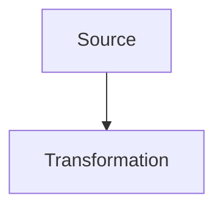

# Format Markdown enrichi

Les pages peuvent etre ecrites dans `content/<matiere>/*.md`.
Le build garde le rendu du site en transformant des blocs Markdown enrichis en HTML.

## Frontmatter

```md
---
title: Electronique EP361 - Revision ESISAR
subject: elec
type: course
---
```

## Sections

```md
:::section id="elec-filtres" eyebrow="Chapitre 2" title="Filtres analogiques" summary="Phrase de synthese."
Contenu de la section.
:::
```

## Grilles

```md
:::grid two-col
:::block type="definition" title="Variables"
- Entree : \(v_e\)
- Sortie : \(v_s\)
:::

:::block type="method" title="Methode"
1. Identifier le montage.
2. Ecrire la fonction de transfert.
:::
:::
```

## Types de blocs

`definition`, `method`, `theorem`, `warning`, `remember` et `neutral` reprennent les styles existants.

```md
:::block type="theorem" title="Critere de Barkhausen"
\[
|A(j\omega_0)B(j\omega_0)|=1
\]
:::
```

## Figures

```md
:::figure src="assets/elec/cellule-t.svg" alt="Cellule en T" caption="Legende optionnelle." :::
```

## Mermaid

Les diagrammes Mermaid peuvent etre ecrits dans un bloc de code classique :

````md

````

## Graphiques interactifs Plotly

Les graphiques interactifs utilisent `:::plotly`. Le corps du bloc est une
specification JSON Plotly : `series`, `data`, `layout` et `config`.

```md
:::plotly id="mt461-exemple" label="Graphique interactif" title="Erreur d'une methode" height="420" caption="Zoomer ou deplacer la courbe pour lire les ordres de grandeur."
{
  "series": [
    {
      "generator": "function",
      "range": [0, 4],
      "points": 120,
      "y": "exp(-x) * cos(4*x)",
      "name": "exp(-x) cos(4x)"
    },
    {
      "generator": "parametric",
      "range": [0, "2*PI"],
      "points": 160,
      "x": "cos(t)",
      "y": "sin(t)",
      "name": "Cercle unite"
    }
  ],
  "layout": {
    "xaxis": { "title": "x" },
    "yaxis": { "title": "y" }
  },
  "config": {
    "responsive": true
  }
}
:::
```

Le rendu ajoute automatiquement le zoom, le deplacement, la legende et
l'adaptation responsive. Pour un cours de maths, c'est le format conseille pour
remplacer une image de courbe statique.

`data` accepte le JSON Plotly standard si une courbe doit rester definie point
par point. Pour les courbes mathematiques, preferer `series` :

| Generateur | Usage |
| :--- | :--- |
| `function` | trace $y=f(x)$ sur `range: [xmin, xmax]` |
| `parametric` | trace $(x(t), y(t))$ sur `range: [tmin, tmax]` |
| `sequence` | trace une suite avec `nStart`, `nEnd` et `y` |
| `point` | ajoute un point isole |
| `fixed-point-staircase` | construit l'escalier d'une iteration `x_{n+1}=f(x_n)` |
| `floating-distribution` | illustre une repartition flottante pedagogique |
| `rk4-stability-boundary` | calcule la frontiere de stabilite absolue de RK4 |

Les formules sont ecrites en syntaxe JavaScript : `exp(-x)`, `sqrt(2)`,
`pow(0.7, n)`, `sin(t)`, `2*PI`.
Pour un axe logarithmique, ajouter `scale: "log"` dans une serie `function`
afin de repartir les points regulierement sur l'echelle log.

## Wokwi

Les simulations Wokwi utilisent `:::wokwi`. Tant que l'URL contient un
identifiant temporaire `YOUR_PROJECT_ID`, le site affiche un emplacement a
connecter au lieu d'une iframe.

```md
:::wokwi label="Wokwi 01" title="Interruptions et volatile" src="https://wokwi.com/projects/YOUR_PROJECT_ID_01" height="520"
Objectif court ou protocole de manipulation.
:::
```

## CircuitJS

```md
:::circuitgrid
:::circuitjs label="Filtre" title="Passe-bas" height="auto" src="https://www.falstad.com/circuit/circuitjs.html?hideMenu=true&startCircuit=tllopass.txt"
:::
:::
```

L'attribut `height="auto"` étire la simulation à la hauteur disponible dans sa
ligne de grille, avec une hauteur minimale adaptée aux petits écrans. Une hauteur
fixe peut aussi être indiquée en pixels, par exemple `height="700"` ou
`height="700px"`. Sans cet attribut, la hauteur standard reste inchangée.

## Cartes et liens rapides

```md
:::quicklinks
- [Quadripoles](#elec-quadripoles)
- [Filtres](#elec-filtres)
:::

:::dashboard
:::card class="chapter-card" pill="Cours" title="Synthese" href="#elec-synthese" link="Ouvrir"
Description courte ou lien vers une section du site.
:::
:::
```

Les formules LaTeX restent traitees par MathJax dans la page finale.

## TD et examens

Les TD et examens utilisent aussi Markdown :

```text
content/<matiere>/td/<page>.md
content/<matiere>/exam/<page>.md
```

Chaque page contient un frontmatter avec au minimum :

```md
---
title: TD 1 corrige
subject: math
type: td
target: math-td1.html
eyebrow: TD 1
heading: Denombrement et probabilites
summary: Correction guidee.
---
```

Une carte d'exercice s'ecrit avec `:::exercise` :

```md
:::exercise label="Exercice 1" title="Denombrement"
Enonce ou rappel.

:::block type="method" title="Correction et raisonnement"
1. Identifier l'univers.
2. Appliquer la formule.

\[
P(A)=\frac{|A|}{|\Omega|}
\]
:::
:::
```

Pour les pages d'electronique, les simulations peuvent etre integrees au
milieu d'un exercice avec `:::circuitjs`.

## Exercices C autonomes

Pour les petits exercices de programmation C sur GitHub Pages, utiliser
`:::cplayground`. Le bloc est entierement execute cote navigateur : il sert a
tester de courts fragments et a obtenir des diagnostics pedagogiques sans
serveur.

````md
:::cplayground label="Exercice interactif" title="Premier programme C"
```c
#include <stdio.h>

int main() {
    printf("Bonjour\n");
    return 0;
}
```
:::
````

## Source des cours

Les cours principaux sont maintenant uniquement dans :

```text
content/<matiere>/cours.md
```

Le build echoue si le Markdown d'une matiere ou d'une page TD/examen manque.
Les anciens fichiers HTML ou LaTeX ne sont plus utilises comme sources.
