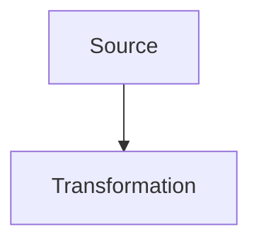

# Format Markdown enrichi

Les pages peuvent etre ecrites dans `content/<matiere>/*.md`.
Le build garde le rendu du site en transformant des blocs Markdown enrichis en HTML.

## Frontmatter

```md
---
title: Electronique EP361 - Revision ESISAR
subject: elec
type: course
---
```

## Sections

```md
:::section id="elec-filtres" eyebrow="Chapitre 2" title="Filtres analogiques" summary="Phrase de synthese."
Contenu de la section.
:::
```

## Grilles

```md
:::grid two-col
:::block type="definition" title="Variables"
- Entree : \(v_e\)
- Sortie : \(v_s\)
:::

:::block type="method" title="Methode"
1. Identifier le montage.
2. Ecrire la fonction de transfert.
:::
:::
```

## Types de blocs

`definition`, `method`, `theorem`, `warning`, `remember` et `neutral` reprennent les styles existants.

```md
:::block type="theorem" title="Critere de Barkhausen"
\[
|A(j\omega_0)B(j\omega_0)|=1
\]
:::
```

## Figures

```md
:::figure src="assets/elec/cellule-t.svg" alt="Cellule en T" caption="Legende optionnelle." :::
```

## Mermaid

Les diagrammes Mermaid peuvent etre ecrits dans un bloc de code classique :

````md

````

## Wokwi

Les simulations Wokwi utilisent `:::wokwi`. Tant que l'URL contient un
identifiant temporaire `YOUR_PROJECT_ID`, le site affiche un emplacement a
connecter au lieu d'une iframe.

```md
:::wokwi label="Wokwi 01" title="Interruptions et volatile" src="https://wokwi.com/projects/YOUR_PROJECT_ID_01" height="520"
Objectif court ou protocole de manipulation.
:::
```

## CircuitJS

```md
:::circuitgrid
:::circuitjs label="Filtre" title="Passe-bas" src="https://www.falstad.com/circuit/circuitjs.html?hideMenu=true&startCircuit=tllopass.txt"
:::
:::
```

## Cartes et liens rapides

```md
:::quicklinks
- [Quadripoles](#elec-quadripoles)
- [Filtres](#elec-filtres)
:::

:::dashboard
:::card class="chapter-card" pill="PDF" title="Support" href="pdf/elec/cours/support.pdf" link="Ouvrir le PDF"
Description courte.
:::
:::
```

Les formules LaTeX restent traitees par MathJax dans la page finale.

## TD et examens

Les TD et examens utilisent aussi Markdown :

```text
content/<matiere>/td/<page>.md
content/<matiere>/exam/<page>.md
```

Chaque page contient un frontmatter avec au minimum :

```md
---
title: TD 1 corrige
subject: math
type: td
target: math-td1.html
eyebrow: TD 1
heading: Denombrement et probabilites
summary: Correction guidee.
---
```

Une carte d'exercice s'ecrit avec `:::exercise` :

```md
:::exercise label="Exercice 1" title="Denombrement"
Enonce ou rappel.

:::block type="method" title="Correction et raisonnement"
1. Identifier l'univers.
2. Appliquer la formule.

\[
P(A)=\frac{|A|}{|\Omega|}
\]
:::
:::
```

Pour les pages d'electronique, les simulations peuvent etre integrees au
milieu d'un exercice avec `:::circuitjs`.

## Source des cours

Les cours principaux sont maintenant uniquement dans :

```text
content/<matiere>/cours.md
```

Le build echoue si le Markdown d'une matiere ou d'une page TD/examen manque.
Les anciens fichiers HTML ou LaTeX ne sont plus utilises comme sources.
